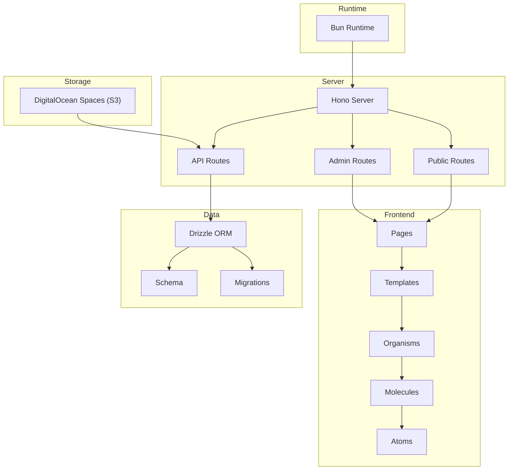
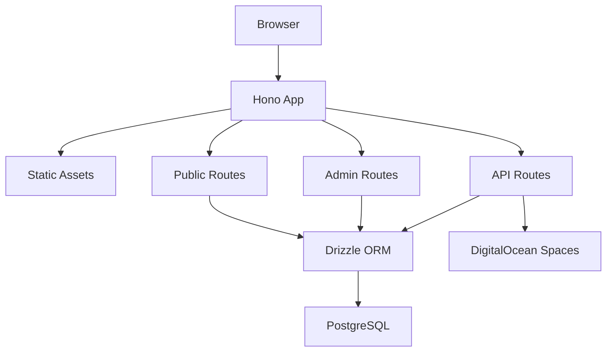
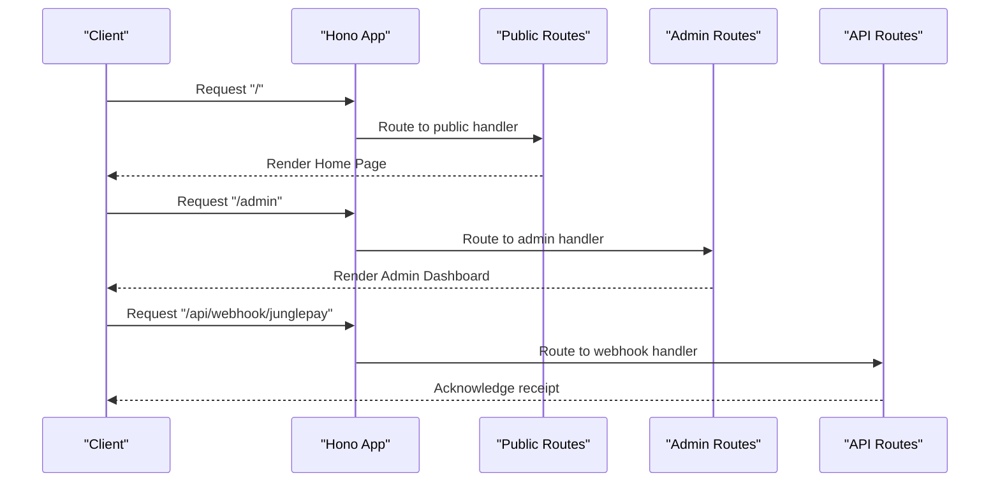
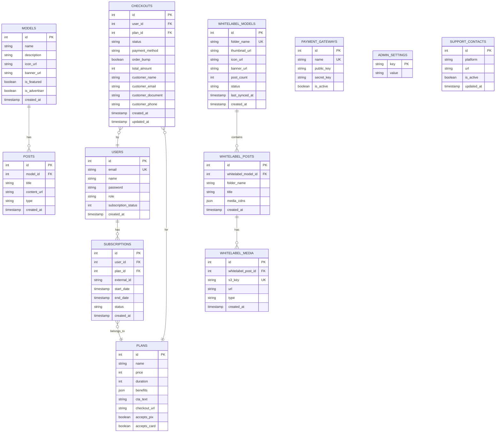
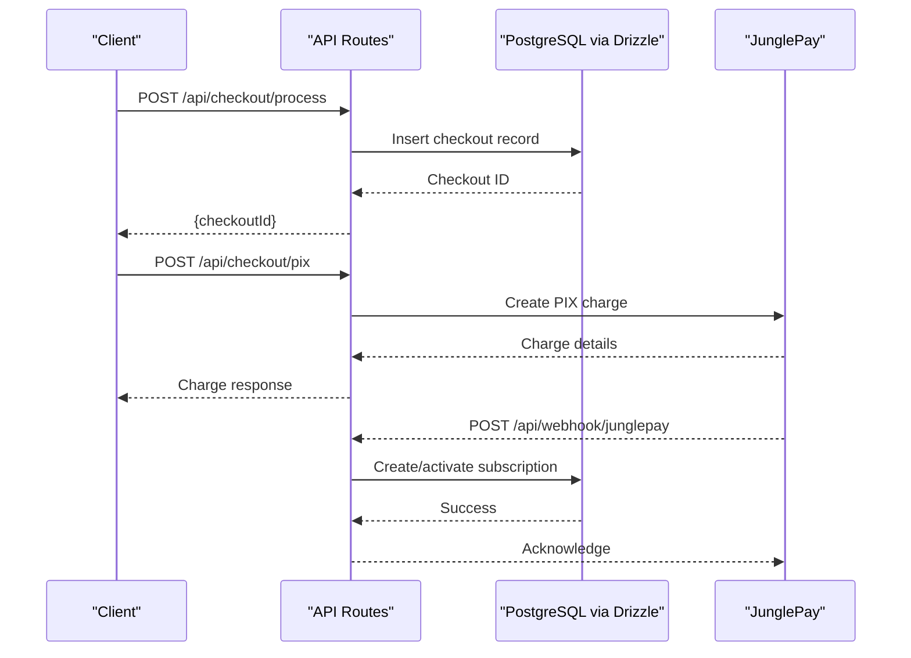
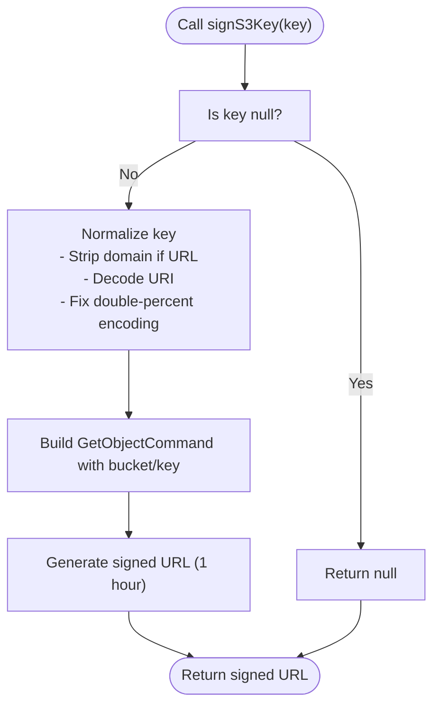
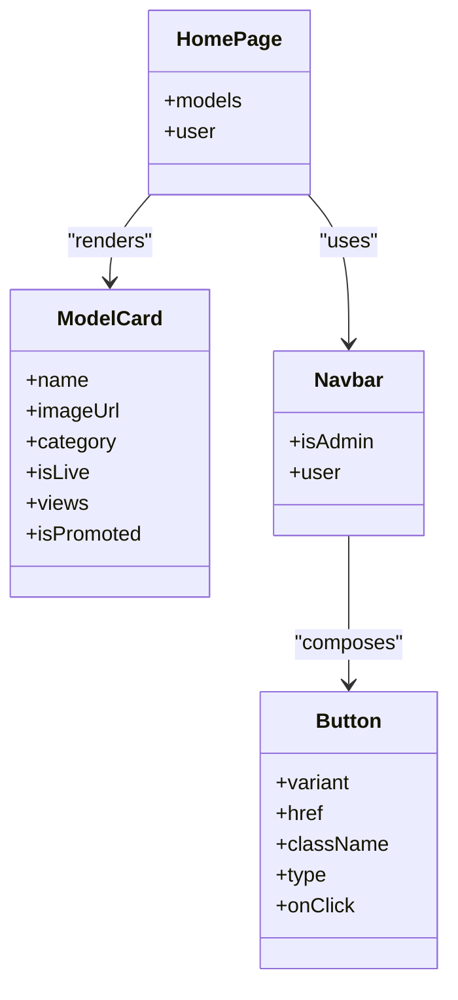
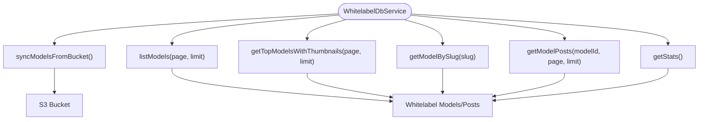
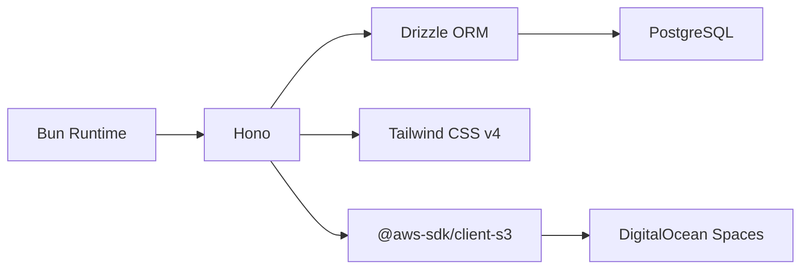

# Project Overview

<cite>
**Referenced Files in This Document**
- [README.md](file://README.md)
- [package.json](file://package.json)
- [drizzle.config.ts](file://drizzle.config.ts)
- [tailwind.config.js](file://tailwind.config.js)
- [src/index.tsx](file://src/index.tsx)
- [src/db/schema.ts](file://src/db/schema.ts)
- [src/routes/public.tsx](file://src/routes/public.tsx)
- [src/routes/admin.tsx](file://src/routes/admin.tsx)
- [src/routes/api.tsx](file://src/routes/api.tsx)
- [src/services/s3.ts](file://src/services/s3.ts)
- [src/services/whitelabel.ts](file://src/services/whitelabel.ts)
- [src/components/atoms/Button.tsx](file://src/components/atoms/Button.tsx)
- [src/components/molecules/ModelCard.tsx](file://src/components/molecules/ModelCard.tsx)
- [src/components/organisms/Navbar.tsx](file://src/components/organisms/Navbar.tsx)
- [src/pages/Home.tsx](file://src/pages/Home.tsx)
</cite>

## Table of Contents
1. [Introduction](#introduction)
2. [Project Structure](#project-structure)
3. [Core Components](#core-components)
4. [Architecture Overview](#architecture-overview)
5. [Detailed Component Analysis](#detailed-component-analysis)
6. [Dependency Analysis](#dependency-analysis)
7. [Performance Considerations](#performance-considerations)
8. [Troubleshooting Guide](#troubleshooting-guide)
9. [Conclusion](#conclusion)

## Introduction
CreatorFlix is a premium content streaming platform inspired by the best of Netflix and OnlyFans. It enables creators to showcase curated content while offering subscribers a premium, ad-free experience with exclusive access. Built with Atomic Design principles, the frontend is composed of reusable, layered components that scale from atomic elements to complex organisms and templates. The backend leverages Bun for fast startup and runtime, Hono as the web framework, PostgreSQL with Drizzle ORM for data modeling and migrations, Tailwind CSS v4 for styling, and DigitalOcean Spaces (S3-compatible) for media storage.

Target audience:
- Subscribers seeking a premium, curated creator content experience
- Creators and models who want a white-label profile and monetization pipeline
- Administrators managing plans, content, and integrations

Unique value propositions:
- Hybrid model: premium subscription plus creator-specific profiles
- Atomic Design ensures consistent UI and rapid iteration
- S3-compatible storage with signed URLs for secure, scalable media delivery
- Flexible payment integrations with webhook-driven subscription lifecycle

## Project Structure
The project follows a clear separation of concerns:
- Frontend: Atomic Design components (atoms → molecules → organisms → templates → pages)
- Routing: Public, Admin, and API routes mounted on a Hono server
- Data: Drizzle ORM schema and migrations
- Styling: Tailwind CSS v4 with custom theme tokens
- Storage: S3 client configured for DigitalOcean Spaces

**Diagram sources**
- [src/index.tsx](file://src/index.tsx#L1-L21)
- [src/routes/public.tsx](file://src/routes/public.tsx#L1-L170)
- [src/routes/admin.tsx](file://src/routes/admin.tsx#L1-L158)
- [src/routes/api.tsx](file://src/routes/api.tsx#L1-L519)
- [src/db/schema.ts](file://src/db/schema.ts#L1-L178)
- [drizzle.config.ts](file://drizzle.config.ts#L1-L11)
- [src/services/s3.ts](file://src/services/s3.ts#L1-L48)

**Section sources**
- [README.md](file://README.md#L1-L49)
- [src/index.tsx](file://src/index.tsx#L1-L21)
- [src/routes/public.tsx](file://src/routes/public.tsx#L1-L170)
- [src/routes/admin.tsx](file://src/routes/admin.tsx#L1-L158)
- [src/routes/api.tsx](file://src/routes/api.tsx#L1-L519)
- [src/db/schema.ts](file://src/db/schema.ts#L1-L178)
- [drizzle.config.ts](file://drizzle.config.ts#L1-L11)
- [tailwind.config.js](file://tailwind.config.js#L1-L39)

## Core Components
- Atomic Design components:
  - Atoms: foundational elements such as Button, Input, Spinner
  - Molecules: combinations like ModelCard, PostCard, PlanCard
  - Organisms: complex sections such as Navbar, HeroCarousel, ProfileHero
  - Templates: page layouts (Layout, AdminLayout)
  - Pages: route-mounted pages (Home, Models, Plans, Checkout, Admin dashboards)
- Routing:
  - Public routes for home, models, posts, plans, auth
  - Admin routes for dashboard, models, ads, plans, settings, finance, whitelabel
  - API routes for checkout, payment webhooks, auth, admin operations
- Data:
  - Drizzle schema defines users, plans, subscriptions, models, posts, whitelabel models/posts/media, checkouts, payment gateways, admin settings, support contacts
- Styling:
  - Tailwind CSS v4 with custom color palette, fonts, gradients, shadows, and animations
- Storage:
  - S3 client configured for DigitalOcean Spaces with signed URL generation for secure media access

Practical examples:
- Rendering a model card with promotion and live badges
- Building a navbar with subscription-aware actions and dropdown menus
- Generating signed URLs for S3 media assets

**Section sources**
- [src/components/atoms/Button.tsx](file://src/components/atoms/Button.tsx#L1-L42)
- [src/components/molecules/ModelCard.tsx](file://src/components/molecules/ModelCard.tsx#L1-L69)
- [src/components/organisms/Navbar.tsx](file://src/components/organisms/Navbar.tsx#L1-L117)
- [src/pages/Home.tsx](file://src/pages/Home.tsx#L1-L97)
- [src/routes/public.tsx](file://src/routes/public.tsx#L1-L170)
- [src/routes/admin.tsx](file://src/routes/admin.tsx#L1-L158)
- [src/routes/api.tsx](file://src/routes/api.tsx#L1-L519)
- [src/db/schema.ts](file://src/db/schema.ts#L1-L178)
- [tailwind.config.js](file://tailwind.config.js#L1-L39)
- [src/services/s3.ts](file://src/services/s3.ts#L1-L48)

## Architecture Overview
CreatorFlix uses a modular, layered architecture:
- Server entry initializes Hono, mounts static assets, and routes
- Public routes render pages with user context and whitelabel data
- Admin routes manage platform configuration and content
- API routes handle authentication, checkout, payment webhooks, and admin operations
- Data access through Drizzle ORM with explicit relations
- Styling via Tailwind CSS v4
- Media delivery via S3 signed URLs

**Diagram sources**
- [src/index.tsx](file://src/index.tsx#L1-L21)
- [src/routes/public.tsx](file://src/routes/public.tsx#L1-L170)
- [src/routes/admin.tsx](file://src/routes/admin.tsx#L1-L158)
- [src/routes/api.tsx](file://src/routes/api.tsx#L1-L519)
- [src/db/schema.ts](file://src/db/schema.ts#L1-L178)
- [src/services/s3.ts](file://src/services/s3.ts#L1-L48)

## Detailed Component Analysis

### Technology Stack and Setup
- Runtime: Bun for fast startup and development
- Framework: Hono for minimal, high-performance routing
- Database: PostgreSQL with Drizzle ORM and migration config
- Styling: Tailwind CSS v4 with custom theme tokens
- Storage: DigitalOcean Spaces S3-compatible storage with signed URL generation

Setup highlights:
- Install dependencies with Bun
- Configure DATABASE_URL and run migrations
- Build Tailwind CSS output
- Run dev server on localhost

**Section sources**
- [README.md](file://README.md#L5-L42)
- [package.json](file://package.json#L1-L23)
- [drizzle.config.ts](file://drizzle.config.ts#L1-L11)
- [tailwind.config.js](file://tailwind.config.js#L1-L39)

### Routing and Control Flow
The server mounts three route groups:
- Public routes: home, models, posts, plans, auth, checkout
- Admin routes: dashboard, models, ads, plans, settings, finance, whitelabel
- API routes: auth, checkout, payment webhooks, admin operations

**Diagram sources**
- [src/index.tsx](file://src/index.tsx#L1-L21)
- [src/routes/public.tsx](file://src/routes/public.tsx#L1-L170)
- [src/routes/admin.tsx](file://src/routes/admin.tsx#L1-L158)
- [src/routes/api.tsx](file://src/routes/api.tsx#L1-L519)

**Section sources**
- [src/index.tsx](file://src/index.tsx#L1-L21)
- [src/routes/public.tsx](file://src/routes/public.tsx#L1-L170)
- [src/routes/admin.tsx](file://src/routes/admin.tsx#L1-L158)
- [src/routes/api.tsx](file://src/routes/api.tsx#L1-L519)

### Data Modeling and Relations
The schema defines core entities and relationships:
- Users, Plans, Subscriptions, Models, Posts, Whitelabel Models/Posts/Media, Checkouts, Payment Gateways, Admin Settings, Support Contacts
- Relations connect users to subscriptions and checkouts, subscriptions to plans, whitelabel models to posts, and posts to media

**Diagram sources**
- [src/db/schema.ts](file://src/db/schema.ts#L1-L178)

**Section sources**
- [src/db/schema.ts](file://src/db/schema.ts#L1-L178)

### Payment and Subscription Lifecycle
The API handles checkout creation and payment processing via two gateways:
- Internal checkout records
- JunglePay integration with webhook for payment events
- Dias Marketplace webhook for payment success and activation

**Diagram sources**
- [src/routes/api.tsx](file://src/routes/api.tsx#L15-L86)
- [src/routes/api.tsx](file://src/routes/api.tsx#L88-L170)

**Section sources**
- [src/routes/api.tsx](file://src/routes/api.tsx#L15-L86)
- [src/routes/api.tsx](file://src/routes/api.tsx#L88-L170)

### Media Delivery with S3 Signed URLs
The S3 service signs keys to produce time-limited, secure URLs for media stored in DigitalOcean Spaces. It normalizes inputs (full URLs, encoded paths) and applies a 1-hour expiration.

**Diagram sources**
- [src/services/s3.ts](file://src/services/s3.ts#L25-L47)

**Section sources**
- [src/services/s3.ts](file://src/services/s3.ts#L1-L48)

### Atomic Design Implementation
Atomic Design organizes UI into reusable layers:
- Atoms: Button, Input, Spinner, IconButton
- Molecules: ModelCard, PostCard, PlanCard, Pagination, TabSelector
- Organisms: Navbar, HeroCarousel, ProfileHero, PostFeed
- Templates: Layout, AdminLayout
- Pages: Home, Models, Plans, Checkout, Admin dashboards

**Diagram sources**
- [src/components/atoms/Button.tsx](file://src/components/atoms/Button.tsx#L1-L42)
- [src/components/molecules/ModelCard.tsx](file://src/components/molecules/ModelCard.tsx#L1-L69)
- [src/components/organisms/Navbar.tsx](file://src/components/organisms/Navbar.tsx#L1-L117)
- [src/pages/Home.tsx](file://src/pages/Home.tsx#L1-L97)

**Section sources**
- [src/components/atoms/Button.tsx](file://src/components/atoms/Button.tsx#L1-L42)
- [src/components/molecules/ModelCard.tsx](file://src/components/molecules/ModelCard.tsx#L1-L69)
- [src/components/organisms/Navbar.tsx](file://src/components/organisms/Navbar.tsx#L1-L117)
- [src/pages/Home.tsx](file://src/pages/Home.tsx#L1-L97)

### Whitelabel Data Access
The whitelabel service exposes methods to synchronize models from the bucket and query models and posts with pagination and statistics.

**Diagram sources**
- [src/services/whitelabel.ts](file://src/services/whitelabel.ts#L1-L24)

**Section sources**
- [src/services/whitelabel.ts](file://src/services/whitelabel.ts#L1-L24)

## Dependency Analysis
- Bun runtime powers the entire application
- Hono provides routing and middleware
- Drizzle ORM connects to PostgreSQL and manages migrations
- Tailwind CSS v4 generates utility classes for styling
- AWS SDK for S3 integrates with DigitalOcean Spaces
- PostgreSQL stores all application data

**Diagram sources**
- [package.json](file://package.json#L1-L23)
- [src/index.tsx](file://src/index.tsx#L1-L21)
- [drizzle.config.ts](file://drizzle.config.ts#L1-L11)
- [src/services/s3.ts](file://src/services/s3.ts#L1-L48)

**Section sources**
- [package.json](file://package.json#L1-L23)
- [src/index.tsx](file://src/index.tsx#L1-L21)
- [drizzle.config.ts](file://drizzle.config.ts#L1-L11)
- [src/services/s3.ts](file://src/services/s3.ts#L1-L48)

## Performance Considerations
- Use Bun’s hot reload and optimized runtime for faster iteration
- Prefer paginated queries for models and posts to reduce payload sizes
- Cache frequently accessed whitelabel metadata and thumbnails
- Minimize DOM updates by leveraging Tailwind utilities efficiently
- Keep signed URL lifetimes reasonable to balance security and performance

## Troubleshooting Guide
Common issues and resolutions:
- Database connectivity: verify DATABASE_URL and ensure PostgreSQL is reachable
- Migrations: regenerate and apply migrations using Drizzle Kit
- Tailwind build: run the CSS build/watch scripts to generate styles
- Authentication cookies: confirm cookie settings and JWT secret
- Payment webhooks: validate webhook signatures and retry failed deliveries
- S3 access: confirm credentials, endpoint, and bucket permissions

**Section sources**
- [README.md](file://README.md#L13-L42)
- [drizzle.config.ts](file://drizzle.config.ts#L1-L11)
- [package.json](file://package.json#L3-L7)
- [src/routes/api.tsx](file://src/routes/api.tsx#L88-L170)
- [src/services/s3.ts](file://src/services/s3.ts#L4-L12)

## Conclusion
CreatorFlix combines modern tooling (Bun, Hono), robust data modeling (PostgreSQL + Drizzle), and a scalable frontend architecture (Atomic Design) to deliver a premium creator streaming experience. Its S3-integrated media pipeline, flexible payment webhooks, and admin controls position it to serve both subscribers and creators effectively. The modular structure supports rapid feature development and maintenance across teams.