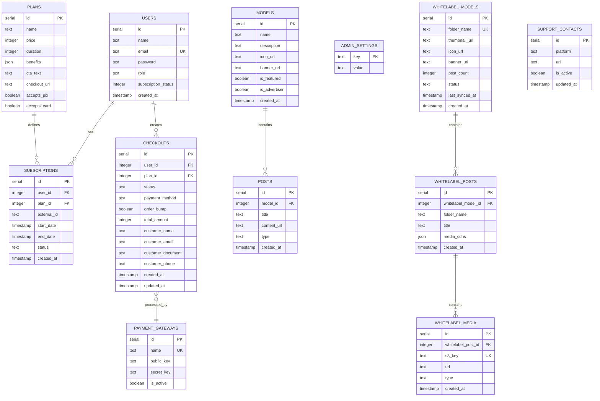

# Technology Stack

<cite>
**Referenced Files in This Document**
- [package.json](file://package.json)
- [README.md](file://README.md)
- [tsconfig.json](file://tsconfig.json)
- [tailwind.config.js](file://tailwind.config.js)
- [drizzle.config.ts](file://drizzle.config.ts)
- [bun.lock](file://bun.lock)
- [src/index.tsx](file://src/index.tsx)
- [src/db/index.ts](file://src/db/index.ts)
- [src/db/schema.ts](file://src/db/schema.ts)
- [src/routes/public.tsx](file://src/routes/public.tsx)
- [src/routes/admin.tsx](file://src/routes/admin.tsx)
- [src/routes/api.tsx](file://src/routes/api.tsx)
- [src/services/s3.ts](file://src/services/s3.ts)
- [src/utils/storage.ts](file://src/utils/storage.ts)
</cite>

## Table of Contents
1. [Introduction](#introduction)
2. [Project Structure](#project-structure)
3. [Core Components](#core-components)
4. [Architecture Overview](#architecture-overview)
5. [Detailed Component Analysis](#detailed-component-analysis)
6. [Dependency Analysis](#dependency-analysis)
7. [Performance Considerations](#performance-considerations)
8. [Troubleshooting Guide](#troubleshooting-guide)
9. [Conclusion](#conclusion)

## Introduction
CreatorFlix is a premium content streaming platform built with modern web technologies. The platform leverages a cohesive stack designed for rapid development, strong typing, efficient rendering, and scalable infrastructure. This document explains the complete technology stack, including the Bun runtime, Hono framework, PostgreSQL with Drizzle ORM, Tailwind CSS v4, and DigitalOcean Spaces S3-compatible storage. It also covers rationale, roles, version requirements, dependencies, build configuration, and development setup.

## Project Structure
The project follows a clear separation of concerns:
- Runtime and server: Bun with Hono
- Frontend: React JSX with Hono JSX renderer
- Styling: Tailwind CSS v4
- Database: PostgreSQL with Drizzle ORM
- Storage: DigitalOcean Spaces (S3-compatible)
- Build and scripts: Bun scripts and Tailwind CLI

**Diagram sources**
- [src/index.tsx](file://src/index.tsx#L1-L21)
- [src/routes/public.tsx](file://src/routes/public.tsx#L1-L170)
- [src/routes/admin.tsx](file://src/routes/admin.tsx#L1-L158)
- [src/routes/api.tsx](file://src/routes/api.tsx#L1-L519)
- [src/db/index.ts](file://src/db/index.ts#L1-L8)
- [src/db/schema.ts](file://src/db/schema.ts#L1-L178)
- [src/services/s3.ts](file://src/services/s3.ts#L1-L48)
- [src/utils/storage.ts](file://src/utils/storage.ts#L1-L39)

**Section sources**
- [README.md](file://README.md#L1-L49)
- [package.json](file://package.json#L1-L23)
- [tsconfig.json](file://tsconfig.json#L1-L13)

## Core Components
- Bun runtime: Provides fast startup, hot reload, and native TypeScript support. Used for development and production serving.
- Hono framework: Minimalist web framework for Bun with excellent performance and JSX support.
- PostgreSQL + Drizzle ORM: Modern SQL toolkit with type-safe queries and migrations.
- Tailwind CSS v4: Utility-first CSS framework for rapid UI development.
- DigitalOcean Spaces (S3): Object storage for media assets with S3-compatible APIs.

**Section sources**
- [README.md](file://README.md#L5-L11)
- [package.json](file://package.json#L8-L16)
- [src/index.tsx](file://src/index.tsx#L1-L21)

## Architecture Overview
The system is structured around three layers:
- Presentation layer: Hono routes render React components via Hono JSX and Tailwind CSS v4.
- Application layer: Route handlers orchestrate business logic, authentication, and integrations.
- Data and storage layers: Drizzle ORM manages PostgreSQL schemas and migrations; AWS SDK integrates with DigitalOcean Spaces.

**Diagram sources**
- [src/index.tsx](file://src/index.tsx#L1-L21)
- [src/routes/public.tsx](file://src/routes/public.tsx#L1-L170)
- [src/routes/admin.tsx](file://src/routes/admin.tsx#L1-L158)
- [src/routes/api.tsx](file://src/routes/api.tsx#L1-L519)
- [src/db/index.ts](file://src/db/index.ts#L1-L8)
- [src/services/s3.ts](file://src/services/s3.ts#L1-L48)

## Detailed Component Analysis

### Bun Runtime and Hono Framework
- Bun runtime powers the development server with hot module replacement and fast iteration cycles.
- Hono provides routing, middleware, cookies, JWT, and JSX rendering capabilities.
- The server exports a Bun-compatible handler with a static asset route and mounted route groups.

**Diagram sources**
- [src/index.tsx](file://src/index.tsx#L1-L21)
- [src/routes/public.tsx](file://src/routes/public.tsx#L1-L170)
- [src/routes/admin.tsx](file://src/routes/admin.tsx#L1-L158)
- [src/routes/api.tsx](file://src/routes/api.tsx#L1-L519)

**Section sources**
- [src/index.tsx](file://src/index.tsx#L1-L21)
- [package.json](file://package.json#L3-L7)

### Database Layer: PostgreSQL with Drizzle ORM
- Drizzle ORM connects to PostgreSQL using a typed schema and supports migrations.
- The configuration defines the schema path, migration output, dialect, and connection URL.
- The schema models users, plans, subscriptions, payment gateways, whitelabel entities, and support contacts.

**Diagram sources**
- [src/db/schema.ts](file://src/db/schema.ts#L1-L178)

**Section sources**
- [drizzle.config.ts](file://drizzle.config.ts#L1-L11)
- [src/db/index.ts](file://src/db/index.ts#L1-L8)
- [src/db/schema.ts](file://src/db/schema.ts#L1-L178)

### Styling: Tailwind CSS v4
- Tailwind CSS v4 is configured with custom color palette, typography, gradients, box-shadows, animations, and plugins.
- Content paths include all TS/TSX files under src for purging unused styles.
- Build scripts compile Tailwind CSS into static styles.

**Diagram sources**
- [package.json](file://package.json#L5-L6)
- [tailwind.config.js](file://tailwind.config.js#L1-L39)

**Section sources**
- [tailwind.config.js](file://tailwind.config.js#L1-L39)
- [package.json](file://package.json#L5-L6)

### Storage: DigitalOcean Spaces S3 Integration
- The platform uses the AWS SDK for S3-compatible storage via DigitalOcean Spaces.
- Two modules handle storage operations:
  - Signing S3 keys for temporary access to private content.
  - Uploading files to Spaces and returning public URLs.

**Diagram sources**
- [src/routes/api.tsx](file://src/routes/api.tsx#L295-L313)
- [src/services/s3.ts](file://src/services/s3.ts#L25-L47)

**Section sources**
- [src/services/s3.ts](file://src/services/s3.ts#L1-L48)
- [src/utils/storage.ts](file://src/utils/storage.ts#L1-L39)

### Authentication and Authorization Flow
- JWT tokens are used for session management with cookies.
- Login and registration endpoints create and set auth tokens.
- Protected routes verify JWT and load user data from the database.

**Diagram sources**
- [src/routes/api.tsx](file://src/routes/api.tsx#L316-L379)
- [src/routes/public.tsx](file://src/routes/public.tsx#L20-L51)
- [src/db/index.ts](file://src/db/index.ts#L1-L8)

**Section sources**
- [src/routes/api.tsx](file://src/routes/api.tsx#L13-L399)
- [src/routes/public.tsx](file://src/routes/public.tsx#L18-L51)

## Dependency Analysis
The project relies on a focused set of dependencies:
- Bun runtime and Hono for server-side rendering and routing
- Drizzle ORM and PostgreSQL for data persistence
- Tailwind CSS v4 for styling
- AWS SDK for S3-compatible storage
- Additional build-time tools for CSS processing

**Diagram sources**
- [package.json](file://package.json#L8-L16)
- [bun.lock](file://bun.lock#L1-L23)

**Section sources**
- [package.json](file://package.json#L8-L22)
- [bun.lock](file://bun.lock#L1-L23)

## Performance Considerations
- Bun’s native TypeScript support and hot reload reduce iteration time during development.
- Hono’s minimal footprint and efficient routing keep latency low for API and SSR endpoints.
- Drizzle ORM’s type-safe queries and migrations help prevent runtime errors and optimize database operations.
- Tailwind CSS v4 compiles efficiently with preconfigured content paths to minimize bundle size.
- S3 integration uses signed URLs for secure, time-limited access to media assets.

[No sources needed since this section provides general guidance]

## Troubleshooting Guide
Common setup and runtime issues:
- Database connectivity: Ensure DATABASE_URL is configured and reachable. Confirm Drizzle connection and schema initialization.
- JWT secrets: Set JWT_SECRET for token signing and verification.
- Tailwind build: Run the CSS build script to generate static styles.
- S3 credentials: Verify DigitalOcean Spaces endpoint, region, and credentials for uploads and signed URLs.

**Section sources**
- [README.md](file://README.md#L13-L42)
- [src/db/index.ts](file://src/db/index.ts#L5-L7)
- [src/routes/api.tsx](file://src/routes/api.tsx#L13-L399)
- [src/utils/storage.ts](file://src/utils/storage.ts#L3-L16)

## Conclusion
CreatorFlix’s technology stack combines Bun, Hono, PostgreSQL with Drizzle ORM, Tailwind CSS v4, and DigitalOcean Spaces to deliver a fast, maintainable, and scalable platform. The choices emphasize developer productivity, type safety, and modern web practices while leveraging proven tools for performance and reliability.