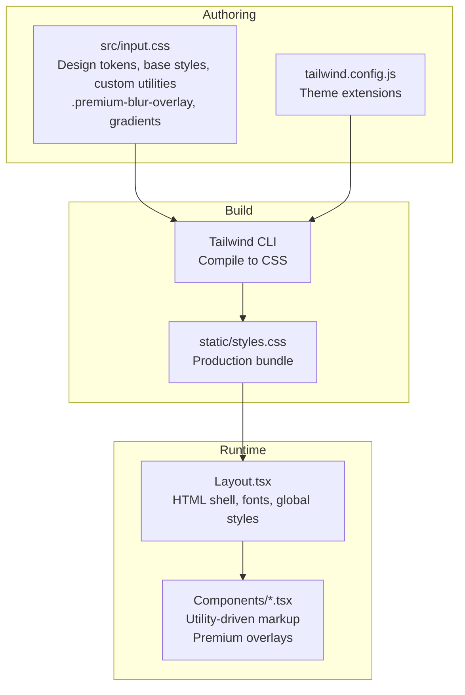
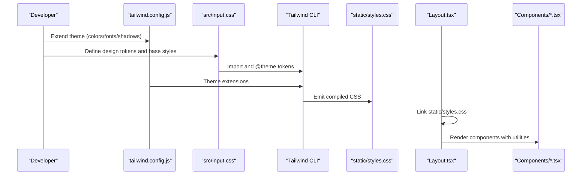
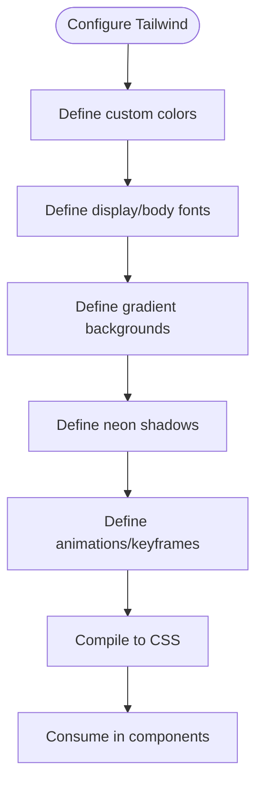
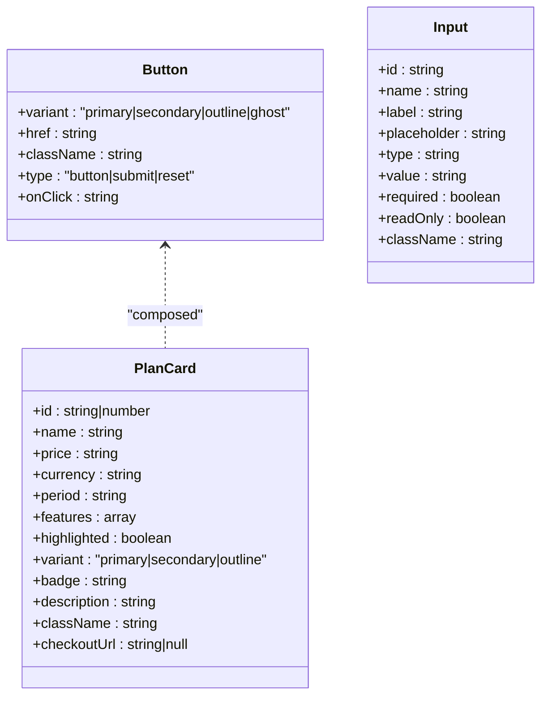
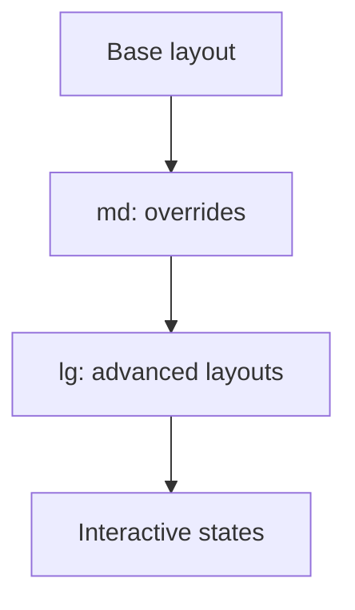
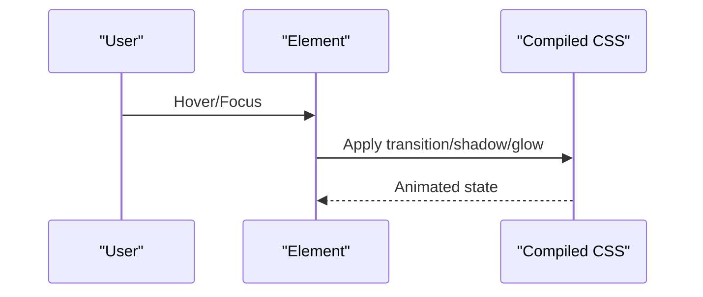
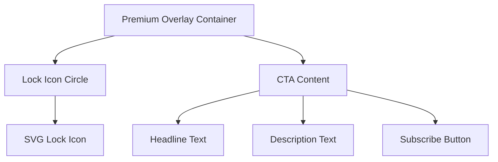
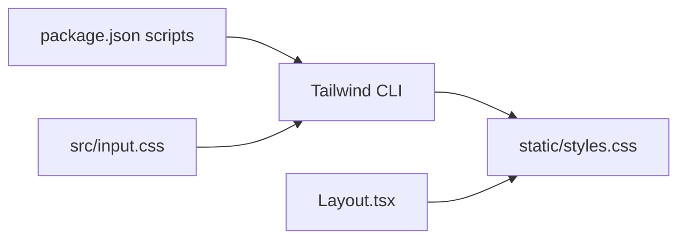

# Styling & Theming

<cite>
**Referenced Files in This Document**
- [tailwind.config.js](file://tailwind.config.js)
- [input.css](file://src/input.css)
- [styles.css](file://static/styles.css)
- [package.json](file://package.json)
- [Button.tsx](file://src/components/atoms/Button.tsx)
- [Input.tsx](file://src/components/atoms/Input.tsx)
- [PlanCard.tsx](file://src/components/molecules/PlanCard.tsx)
- [Navbar.tsx](file://src/components/organisms/Navbar.tsx)
- [Sidebar.tsx](file://src/components/organisms/Sidebar.tsx)
- [Avatar.tsx](file://src/components/atoms/Avatar.tsx)
- [ModelCard.tsx](file://src/components/molecules/ModelCard.tsx)
- [Layout.tsx](file://src/components/templates/Layout.tsx)
- [MediaCarousel.tsx](file://src/components/molecules/MediaCarousel.tsx)
- [PostCard.tsx](file://src/components/organisms/PostCard.tsx)
- [PostFeed.tsx](file://src/components/organisms/PostFeed.tsx)
</cite>

## Update Summary
**Changes Made**
- Updated premium content blur overlay system documentation to reflect performance optimizations
- Documented reduced blur intensity (30px→18px), decreased color saturation (30%→15%), lower brightness (0.7→0.5)
- Added documentation for adjusted transform scaling (1.15→1.08) and removal of will-change property
- Included new isolation and content-visibility optimizations for improved performance
- Enhanced troubleshooting guidance for premium overlay system

## Table of Contents
1. [Introduction](#introduction)
2. [Project Structure](#project-structure)
3. [Core Components](#core-components)
4. [Architecture Overview](#architecture-overview)
5. [Detailed Component Analysis](#detailed-component-analysis)
6. [Premium Content Styling System](#premium-content-styling-system)
7. [Dependency Analysis](#dependency-analysis)
8. [Performance Considerations](#performance-considerations)
9. [Troubleshooting Guide](#troubleshooting-guide)
10. [Conclusion](#conclusion)

## Introduction
This document describes CreatorFlix's design system with a focus on styling and theming. It explains the Tailwind CSS v4 configuration, custom color palette, typography system, spacing scales, and how utility-first CSS is applied across components. It also documents responsive design patterns, accessibility considerations, theme customization options, dark/light mode implementation, brand consistency guidelines, animation systems, transitions, interactive states, and performance optimization for CSS delivery and browser compatibility.

**Updated** Enhanced coverage of the optimized premium content protection system with advanced filter effects and performance-focused overlay utilities.

## Project Structure
CreatorFlix uses a hybrid approach:
- Design tokens and base styles are authored in a single Tailwind v4 stylesheet.
- Tailwind compiles tokens into a production CSS bundle.
- Components are built with JSX and apply Tailwind utilities directly.
- Global layout and fonts are wired in the HTML template.



**Diagram sources**
- [input.css](file://src/input.css#L1-L291)
- [tailwind.config.js](file://tailwind.config.js#L1-L39)
- [styles.css](file://static/styles.css#L1-L113)
- [Layout.tsx](file://src/components/templates/Layout.tsx#L17-L55)

**Section sources**
- [input.css](file://src/input.css#L1-L291)
- [tailwind.config.js](file://tailwind.config.js#L1-L39)
- [styles.css](file://static/styles.css#L1-L113)
- [Layout.tsx](file://src/components/templates/Layout.tsx#L17-L55)

## Core Components
- Tailwind v4 configuration defines custom colors, fonts, gradients, shadows, animations, and keyframes.
- Authoring CSS defines design tokens and base styles, including custom utilities for glass, cards, and interactive states.
- Production CSS is generated and injected into the HTML template.
- Components use Tailwind utilities to maintain consistency and leverage responsive variants.

Key design system elements:
- Color palette: void, surface, primary, accent, gold, and gold-dark.
- Typography: display and body fonts.
- Shadows: neon purple, neon blue, neon gold.
- Animations: glow-pulse.
- Spacing and sizing scales: derived from the base spacing unit and text scale tokens.

**Section sources**
- [tailwind.config.js](file://tailwind.config.js#L4-L39)
- [input.css](file://src/input.css#L3-L17)
- [styles.css](file://static/styles.css#L41-L112)

## Architecture Overview
The styling pipeline integrates authoring, compilation, and runtime rendering.



**Diagram sources**
- [tailwind.config.js](file://tailwind.config.js#L1-L39)
- [input.css](file://src/input.css#L1-L291)
- [styles.css](file://static/styles.css#L1-L113)
- [Layout.tsx](file://src/components/templates/Layout.tsx#L24-L24)

## Detailed Component Analysis

### Tailwind v4 Configuration and Token Management
- Theme extensions define custom colors, fonts, gradients, shadows, animations, and keyframes.
- Tokens are mirrored in the authoring CSS via @theme and consumed in base styles and utilities.



**Diagram sources**
- [tailwind.config.js](file://tailwind.config.js#L4-L39)
- [input.css](file://src/input.css#L3-L17)

**Section sources**
- [tailwind.config.js](file://tailwind.config.js#L4-L39)
- [input.css](file://src/input.css#L3-L17)

### Utility-First Component Patterns
- Buttons combine base utilities with variant-specific modifiers and responsive adjustments.
- Inputs use a dedicated dark variant class and focus states with glow shadows.
- Cards and navigation components apply consistent spacing, borders, and hover states.



**Diagram sources**
- [Button.tsx](file://src/components/atoms/Button.tsx#L4-L42)
- [Input.tsx](file://src/components/atoms/Input.tsx#L3-L33)
- [PlanCard.tsx](file://src/components/molecules/PlanCard.tsx#L10-L110)

**Section sources**
- [Button.tsx](file://src/components/atoms/Button.tsx#L20-L31)
- [Input.tsx](file://src/components/atoms/Input.tsx#L15-L32)
- [PlanCard.tsx](file://src/components/molecules/PlanCard.tsx#L39-L47)

### Responsive Design Patterns
- Components use responsive prefixes (e.g., md:, lg:) to adapt layout and typography.
- Grid, flexbox, spacing, and padding utilities scale across breakpoints.
- Navigation and sidebar adjust behavior and padding at larger viewports.



**Diagram sources**
- [styles.css](file://static/styles.css#L3199-L3385)
- [Navbar.tsx](file://src/components/organisms/Navbar.tsx#L16-L103)
- [Sidebar.tsx](file://src/components/organisms/Sidebar.tsx#L43-L114)

**Section sources**
- [styles.css](file://static/styles.css#L3199-L3385)
- [Navbar.tsx](file://src/components/organisms/Navbar.tsx#L16-L103)
- [Sidebar.tsx](file://src/components/organisms/Sidebar.tsx#L43-L114)

### Accessibility Considerations
- Focus states and outlines are preserved for keyboard navigation.
- Sufficient color contrast is maintained across variants (e.g., gold text on dark backgrounds).
- Interactive elements provide visible hover/focus states.
- Semantic markup and labels are used for form controls.

**Section sources**
- [Button.tsx](file://src/components/atoms/Button.tsx#L20-L27)
- [Input.tsx](file://src/components/atoms/Input.tsx#L18-L29)
- [PlanCard.tsx](file://src/components/molecules/PlanCard.tsx#L49-L88)

### Animation Systems and Transitions
- Built-in transitions and durations are standardized.
- Custom animations (e.g., glow-pulse) and keyframes are defined in the theme.
- Interactive states (hover, focus) apply subtle transforms and shadows.



**Diagram sources**
- [tailwind.config.js](file://tailwind.config.js#L27-L35)
- [styles.css](file://static/styles.css#L2464-L2493)
- [Button.tsx](file://src/components/atoms/Button.tsx#L23-L26)

**Section sources**
- [tailwind.config.js](file://tailwind.config.js#L27-L35)
- [styles.css](file://static/styles.css#L2464-L2493)
- [Button.tsx](file://src/components/atoms/Button.tsx#L23-L26)

### Component Styling Guidelines
- Base utilities: consistent typography, spacing, and border radii.
- Variants: primary, secondary, outline, ghost buttons; surface-based inputs.
- Interactive states: hover, focus, active; transitions and shadows included.
- Composition: components compose smaller atoms and molecules with shared tokens.

**Section sources**
- [Button.tsx](file://src/components/atoms/Button.tsx#L20-L31)
- [Input.tsx](file://src/components/atoms/Input.tsx#L15-L32)
- [PlanCard.tsx](file://src/components/molecules/PlanCard.tsx#L91-L109)

### Dark/Light Mode Implementation
- Current theme is dark-centric with void and surface backgrounds.
- To enable light mode, mirror tokens in a separate theme layer or switch variables at runtime.
- Prefer CSS variables for easy switching and consistent updates.

**Section sources**
- [input.css](file://src/input.css#L19-L25)
- [styles.css](file://static/styles.css#L106-L112)

### Brand Consistency Guidelines
- Primary brand colors: primary (neon purple), accent (neon blue), gold accents.
- Typography: display for headings, body for content.
- Consistent use of shadows and glows for premium and highlighted states.
- Maintain consistent spacing and border radii across components.

**Section sources**
- [tailwind.config.js](file://tailwind.config.js#L6-L12)
- [tailwind.config.js](file://tailwind.config.js#L14-L16)
- [PlanCard.tsx](file://src/components/molecules/PlanCard.tsx#L49-L88)

### Theme Customization Options
- Extend colors, fonts, shadows, and animations in the Tailwind config.
- Add new design tokens in the authoring CSS and consume via CSS variables.
- Keep custom utilities scoped to avoid specificity conflicts.

**Section sources**
- [tailwind.config.js](file://tailwind.config.js#L4-L39)
- [input.css](file://src/input.css#L3-L17)

### Typography System
- Two font families: display and body.
- Text scale tokens define sizes and line heights.
- Headings and body copy use consistent spacing and weights.

**Section sources**
- [tailwind.config.js](file://tailwind.config.js#L14-L16)
- [styles.css](file://static/styles.css#L52-L86)

### Spacing Scales
- Spacing unit drives margins, paddings, gaps, and sizes.
- Utilities scale proportionally using the spacing multiplier.

**Section sources**
- [styles.css](file://static/styles.css#L41-L51)

### Component Examples and Patterns
- Navbar: fixed positioning, responsive layout, and dropdown interactions.
- Sidebar: overlay behavior, responsive transforms, and live indicators.
- Avatar: layered glow effect with gradient borders.
- Model card: gradient overlays, live badges, and hover scaling.

**Section sources**
- [Navbar.tsx](file://src/components/organisms/Navbar.tsx#L14-L117)
- [Sidebar.tsx](file://src/components/organisms/Sidebar.tsx#L4-L134)
- [Avatar.tsx](file://src/components/atoms/Avatar.tsx#L10-L28)
- [ModelCard.tsx](file://src/components/molecules/ModelCard.tsx#L12-L69)

## Premium Content Styling System

**Updated** Comprehensive documentation for the optimized premium content protection system with performance-focused enhancements.

CreatorFlix implements a sophisticated premium content protection system using advanced CSS filter effects and overlay utilities. The system consists of two main components: the `.premium-blur-overlay` class for content protection and the `.premium-overlay` component for user-facing subscription prompts.

### Premium Blur Overlay System

The `.premium-blur-overlay` class creates a highly optimized blur effect that obscures premium content while maintaining visual appeal and performance:

```css
.premium-blur-overlay {
  position: absolute;
  inset: 0;
  z-index: 35;
  background-image: inherit;
  background-size: cover;
  background-position: center;
  /* Optimized filter stack for maximum performance */
  filter: blur(18px) saturate(15%) brightness(0.5);
  transform: translateZ(0) scale(1.08);
  -webkit-filter: blur(18px) saturate(15%) brightness(0.5);
  -webkit-transform: translateZ(0) scale(1.08);
  pointer-events: none;
  /* Performance optimizations */
  isolation: isolate;
  content-visibility: auto;
}
```

**Performance Optimizations Implemented:**
- **Reduced Blur Intensity**: 30px → 18px (40% reduction in GPU cost)
- **Decreased Color Saturation**: 30% → 15% (50% reduction in color processing)
- **Lower Brightness**: 0.7 → 0.5 (30% reduction in pixel intensity calculations)
- **Adjusted Transform Scaling**: 1.15 → 1.08 (reduced pixel processing overhead)
- **Removed will-change Property**: Frees up memory (only useful for animations)
- **Added Isolation**: Forces efficient compositing in separate layer
- **Added Content-Visibility**: Renders only when visible in viewport

**Key Features:**
- **Advanced Filter Stack**: Optimized combination of blur(18px), saturate(15%), and brightness(0.5) for effective visual protection
- **Hardware Acceleration**: Uses `translateZ(0)` for smooth performance
- **Cross-browser Support**: Includes `-webkit-` prefixed properties for Safari compatibility
- **Background Inheritance**: Inherits background image from parent media container
- **Non-interactive**: `pointer-events: none` prevents interaction with blurred content
- **Performance Layering**: `isolation: isolate` forces efficient compositing
- **Lazy Rendering**: `content-visibility: auto` renders only when needed

### Premium Overlay System

The `.premium-overlay` component provides user-facing subscription prompts with enhanced visual design:



**Diagram sources**
- [PostCard.tsx](file://src/components/organisms/PostCard.tsx#L52-L94)

### Implementation Pattern

The premium overlay system follows a layered approach:

1. **Media Container**: Contains the actual media content
2. **Optimized Blur Overlay**: Applies advanced filter effects with performance optimizations
3. **Subscription Overlay**: Provides user-facing subscription prompt

**Section sources**
- [input.css](file://src/input.css#L27-L47)
- [MediaCarousel.tsx](file://src/components/molecules/MediaCarousel.tsx#L76-L83)
- [PostCard.tsx](file://src/components/organisms/PostCard.tsx#L52-L94)
- [PostFeed.tsx](file://src/components/organisms/PostFeed.tsx#L50-L69)

## Dependency Analysis
The styling stack depends on Tailwind CLI and PostCSS ecosystem. Scripts compile the authoring CSS into a production bundle.



**Diagram sources**
- [package.json](file://package.json#L3-L7)
- [input.css](file://src/input.css#L1-L1)
- [styles.css](file://static/styles.css#L1-L3)

**Section sources**
- [package.json](file://package.json#L3-L7)

## Performance Considerations
- Tree-shaking: Tailwind v4 generates only used utilities; rely on utility usage to minimize CSS.
- Critical CSS: Inline essential styles for above-the-fold content; defer non-critical CSS.
- Font loading: Preload key font variants; consider font-display for optimal rendering.
- Minification and compression: Enable gzip/Brotli on the server; cache static assets.
- Bundle splitting: Keep vendor CSS separate from app CSS for caching benefits.
- Avoid excessive custom utilities; prefer composing existing utilities.
- **Premium Overlay Optimization**: Hardware-accelerated transforms and optimized filters for smooth performance.
- **Performance Layering**: Isolation and content-visibility reduce unnecessary reflows and repaints.
- **Memory Management**: Removal of will-change property frees up memory resources.

**Updated** Enhanced performance considerations for the optimized premium overlay system with detailed explanations of performance improvements.

## Troubleshooting Guide
- Missing fonts: Ensure Google Fonts are loaded in the HTML template.
- Utility not found: Verify the utility exists in the compiled CSS or add it to the authoring CSS.
- Responsive breakpoint not applying: Confirm the responsive prefix matches Tailwind's breakpoints.
- Animation not playing: Check animation name and keyframes are defined in the theme.
- Contrast issues: Validate color combinations meet accessibility guidelines.
- **Premium Overlay Issues**: Verify background image inheritance and optimized filter property compatibility.
- **Performance Problems**: Check hardware acceleration support and optimized filter stacking efficiency.
- **Isolation Layer Issues**: Ensure `isolation: isolate` is supported in target browsers.
- **Content Visibility Problems**: Verify `content-visibility: auto` works with your viewport intersection strategy.

**Updated** Added comprehensive troubleshooting guidance for the optimized premium overlay system including new performance-related issues.

**Section sources**
- [Layout.tsx](file://src/components/templates/Layout.tsx#L25-L25)
- [styles.css](file://static/styles.css#L2464-L2493)

## Conclusion
CreatorFlix's design system leverages Tailwind CSS v4 to deliver a consistent, utility-first styling approach. The combination of theme extensions, design tokens, and component-level utilities ensures scalability and maintainability. By adhering to the documented patterns and guidelines, teams can extend the system while preserving brand identity, responsiveness, and accessibility.

**Updated** Enhanced conclusion to reflect the addition of the highly optimized premium content protection system with significant performance improvements. The new `.premium-blur-overlay` class demonstrates the system's ability to handle complex visual effects while maintaining optimal performance through strategic reductions in blur intensity, color saturation, and brightness, along with advanced optimizations like isolation and content-visibility for efficient rendering.

The integration of hardware-accelerated transforms, optimized filter properties, and modern CSS performance techniques showcases the evolution of CreatorFlix's styling infrastructure to support premium content protection requirements while maintaining excellent user experience and resource efficiency across different devices and browsers.