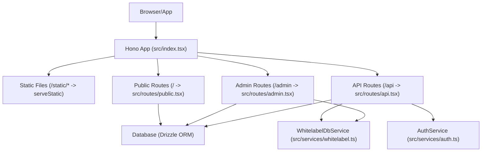
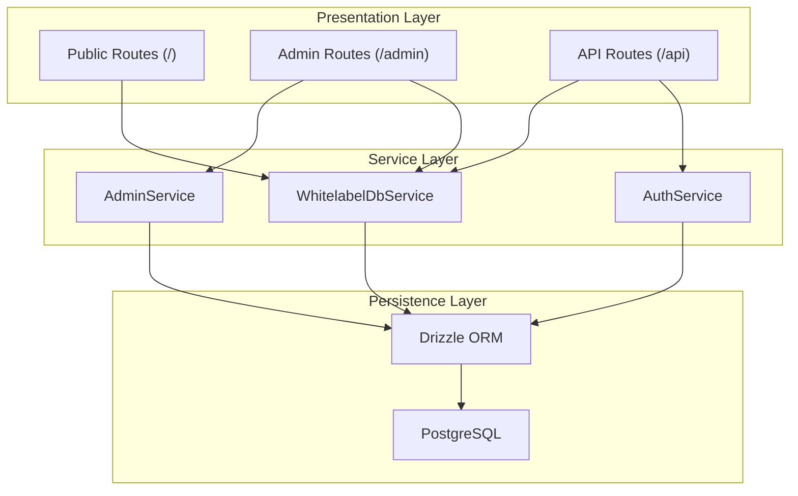
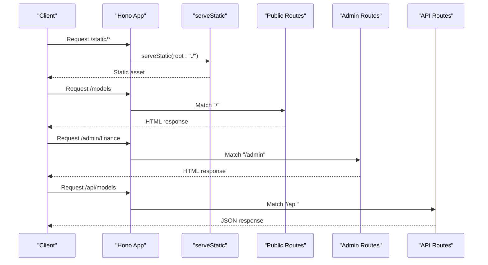
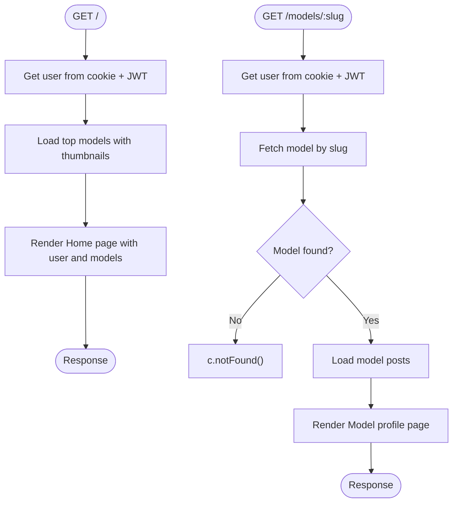
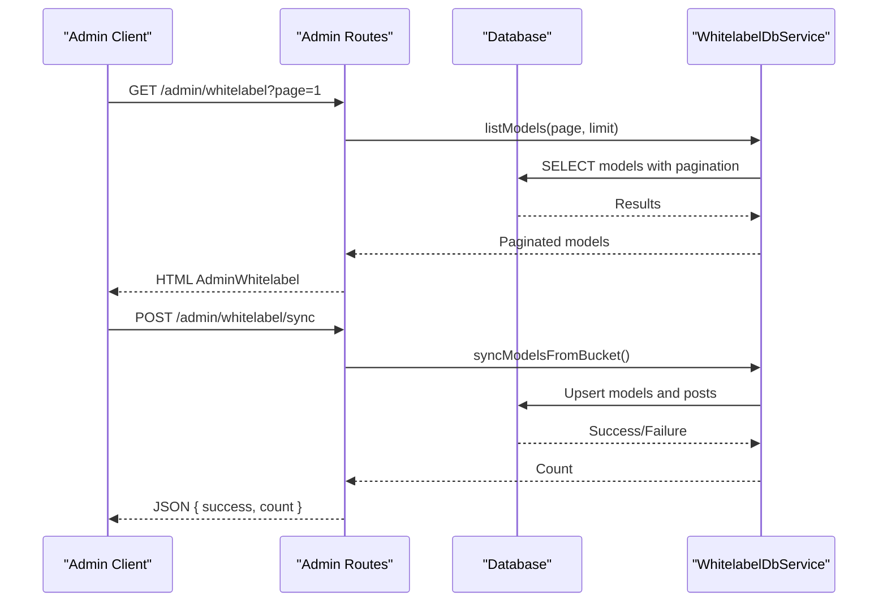
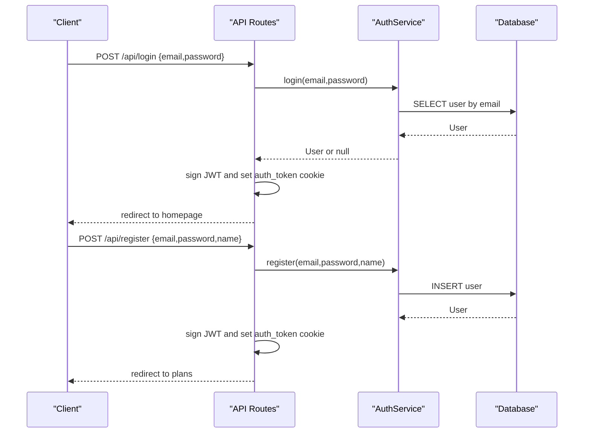
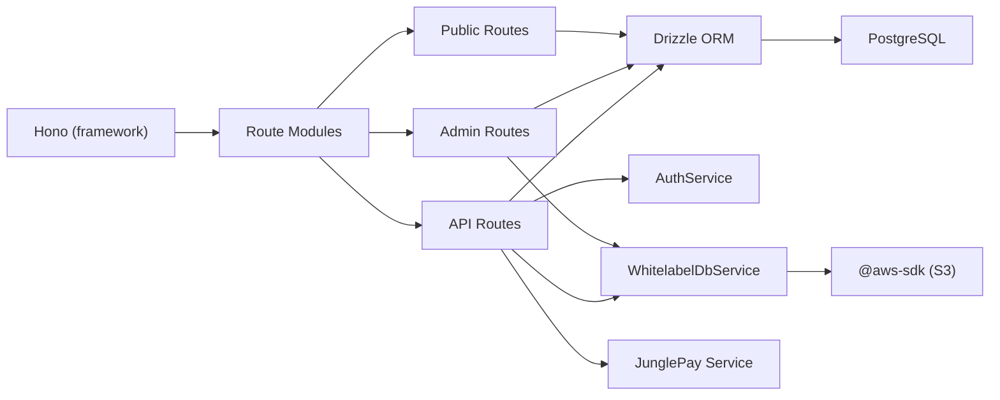

# Backend Routing & API Design

<cite>
**Referenced Files in This Document**
- [index.tsx](file://src/index.tsx)
- [public.tsx](file://src/routes/public.tsx)
- [admin.tsx](file://src/routes/admin.tsx)
- [api.tsx](file://src/routes/api.tsx)
- [db/index.ts](file://src/db/index.ts)
- [auth.ts](file://src/services/auth.ts)
- [admin.ts](file://src/services/admin.ts)
- [whitelabel.ts](file://src/services/whitelabel.ts)
- [activation.ts](file://src/services/admin/activation.ts)
- [README.md](file://README.md)
- [package.json](file://package.json)
</cite>

## Table of Contents
1. [Introduction](#introduction)
2. [Project Structure](#project-structure)
3. [Core Components](#core-components)
4. [Architecture Overview](#architecture-overview)
5. [Detailed Component Analysis](#detailed-component-analysis)
6. [Dependency Analysis](#dependency-analysis)
7. [Performance Considerations](#performance-considerations)
8. [Troubleshooting Guide](#troubleshooting-guide)
9. [Conclusion](#conclusion)

## Introduction
This document describes the backend routing architecture of CreatorFlix, built with the Hono framework. It explains how routes are organized into public, admin, and API namespaces, how middleware and static file serving are integrated, and how request/response patterns are handled. It also covers authentication, error handling, CORS configuration, parameter and query processing, body parsing, security considerations, rate limiting, and performance optimization strategies for API endpoints.

## Project Structure
CreatorFlix uses a modular routing strategy with three distinct route groups mounted under separate prefixes:
- Public routes under "/"
- Admin routes under "/admin"
- API routes under "/api"

Static assets are served from the "/static" path. The server is implemented using Hono and runs on Bun.

**Diagram sources**
- [index.tsx](file://src/index.tsx#L1-L21)
- [public.tsx](file://src/routes/public.tsx#L1-L170)
- [admin.tsx](file://src/routes/admin.tsx#L1-L158)
- [api.tsx](file://src/routes/api.tsx#L1-L519)
- [db/index.ts](file://src/db/index.ts#L1-L8)
- [auth.ts](file://src/services/auth.ts#L1-L91)
- [whitelabel.ts](file://src/services/whitelabel.ts#L1-L24)

**Section sources**
- [index.tsx](file://src/index.tsx#L1-L21)
- [README.md](file://README.md#L1-L49)

## Core Components
- Hono server instance and route mounting:
  - Static file serving for "/static/*" using serveStatic.
  - Route mounting for public, admin, and API namespaces.
- Modular routing:
  - Separate Hono instances per namespace for clarity and isolation.
- Authentication and session management:
  - JWT-based cookie authentication for public and admin contexts.
- Database integration:
  - Drizzle ORM with PostgreSQL for all data operations.
- Services:
  - AuthService for user registration, login, and subscription management.
  - WhitelabelDbService for model and post data operations.
  - AdminService for administrative activation workflows.

**Section sources**
- [index.tsx](file://src/index.tsx#L1-L21)
- [public.tsx](file://src/routes/public.tsx#L1-L170)
- [admin.tsx](file://src/routes/admin.tsx#L1-L158)
- [api.tsx](file://src/routes/api.tsx#L1-L519)
- [db/index.ts](file://src/db/index.ts#L1-L8)
- [auth.ts](file://src/services/auth.ts#L1-L91)
- [whitelabel.ts](file://src/services/whitelabel.ts#L1-L24)

## Architecture Overview
The backend follows a layered architecture:
- Presentation layer: Hono routes define endpoints and render HTML or JSON responses.
- Service layer: Business logic encapsulated in services (AuthService, WhitelabelDbService, AdminService).
- Persistence layer: Drizzle ORM connects to PostgreSQL.

**Diagram sources**
- [public.tsx](file://src/routes/public.tsx#L1-L170)
- [admin.tsx](file://src/routes/admin.tsx#L1-L158)
- [api.tsx](file://src/routes/api.tsx#L1-L519)
- [auth.ts](file://src/services/auth.ts#L1-L91)
- [whitelabel.ts](file://src/services/whitelabel.ts#L1-L24)
- [db/index.ts](file://src/db/index.ts#L1-L8)

## Detailed Component Analysis

### Hono Server and Route Mounting
- Static file serving:
  - Serves files under "/static/*" from the repository root using serveStatic.
- Route mounting:
  - Public routes mounted at "/".
  - Admin routes mounted at "/admin".
  - API routes mounted at "/api".

**Diagram sources**
- [index.tsx](file://src/index.tsx#L1-L21)
- [public.tsx](file://src/routes/public.tsx#L1-L170)
- [admin.tsx](file://src/routes/admin.tsx#L1-L158)
- [api.tsx](file://src/routes/api.tsx#L1-L519)

**Section sources**
- [index.tsx](file://src/index.tsx#L1-L21)

### Public Routes (/)
Purpose:
- Serve frontend pages for home, models, plans, checkout, authentication, and post detail.
- Integrate with JWT-based user detection via cookies.

Key behaviors:
- Cookie-based authentication:
  - Extracts "auth_token" cookie and verifies JWT to hydrate user context.
- Parameter and query handling:
  - Route parameters: model slug, post id.
  - Query parameters: pagination for models listing.
- Response patterns:
  - Renders React pages to HTML using c.html.

**Diagram sources**
- [public.tsx](file://src/routes/public.tsx#L1-L170)

**Section sources**
- [public.tsx](file://src/routes/public.tsx#L1-L170)

### Admin Routes (/admin)
Purpose:
- Administrative dashboard and management endpoints.
- CRUD-like operations for plans, ads, whitelabel models, and support contacts.
- Webhook handlers for payment systems.

Key behaviors:
- Query and form parsing:
  - Uses c.req.query for pagination and filters.
  - Uses c.req.parseBody for form submissions.
- Response patterns:
  - Renders admin pages to HTML.
  - Returns JSON for asynchronous operations (e.g., sync endpoint).
- Database initialization:
  - Ensures default plans and payment gateways exist on demand.

**Diagram sources**
- [admin.tsx](file://src/routes/admin.tsx#L1-L158)
- [whitelabel.ts](file://src/services/whitelabel.ts#L1-L24)
- [db/index.ts](file://src/db/index.ts#L1-L8)

**Section sources**
- [admin.tsx](file://src/routes/admin.tsx#L1-L158)
- [whitelabel.ts](file://src/services/whitelabel.ts#L1-L24)

### API Routes (/api)
Purpose:
- Provide programmatic endpoints for checkout, authentication, subscriptions, and webhook integrations.
- Serve paginated data for models and posts.

Key behaviors:
- Body parsing:
  - c.req.json() for JSON payloads.
  - c.req.parseBody() for form-encoded requests.
- Query and parameter handling:
  - c.req.query for pagination and filters.
  - c.req.param for dynamic segments.
- Authentication:
  - JWT verification via cookies for protected actions.
  - Cookie-based session management for login/register.
- Webhooks:
  - JunglePay and Dias marketplace webhooks update subscriptions and user statuses.
- Response patterns:
  - JSON for API endpoints.
  - Redirects for auth flows.

**Diagram sources**
- [api.tsx](file://src/routes/api.tsx#L1-L519)
- [auth.ts](file://src/services/auth.ts#L1-L91)
- [db/index.ts](file://src/db/index.ts#L1-L8)

**Section sources**
- [api.tsx](file://src/routes/api.tsx#L1-L519)
- [auth.ts](file://src/services/auth.ts#L1-L91)

### Middleware Integration
- Static file serving:
  - Middleware applied to "/static/*" to serve compiled assets.
- Authentication middleware placement:
  - JWT verification occurs inside public routes to hydrate user context.
  - Protected actions in API routes verify JWT tokens before processing.
- CORS configuration:
  - No explicit CORS middleware is configured in the provided code. Cross-origin requests should be handled by adding a CORS middleware if needed.

**Section sources**
- [index.tsx](file://src/index.tsx#L1-L21)
- [public.tsx](file://src/routes/public.tsx#L1-L170)
- [api.tsx](file://src/routes/api.tsx#L1-L519)

### Request/Response Handling Patterns
- Public routes:
  - c.html renders React pages to HTML.
- Admin routes:
  - c.html renders admin pages.
  - c.redirect handles navigation after form submissions.
- API routes:
  - c.json returns structured JSON responses.
  - c.redirect used for auth flows.
- Body parsing:
  - c.req.json() for JSON bodies.
  - c.req.parseBody() for form-encoded data.
- Query and parameter extraction:
  - c.req.query for query strings.
  - c.req.param for path parameters.

**Section sources**
- [public.tsx](file://src/routes/public.tsx#L1-L170)
- [admin.tsx](file://src/routes/admin.tsx#L1-L158)
- [api.tsx](file://src/routes/api.tsx#L1-L519)

### Security Considerations
- Authentication:
  - JWT signing and verification using HS256.
  - Secure cookie flags: httpOnly, sameSite=Lax, secure in production.
- Password hashing:
  - Bun.password.hash and Bun.password.verify used for secure credential storage.
- Token scope:
  - Tokens carry minimal user data; sensitive operations require re-verification.
- Rate limiting:
  - No explicit rate limiting is implemented in the provided code. Consider adding rate limiting middleware for endpoints like login/register and checkout.

**Section sources**
- [public.tsx](file://src/routes/public.tsx#L1-L170)
- [api.tsx](file://src/routes/api.tsx#L1-L519)
- [auth.ts](file://src/services/auth.ts#L1-L91)

### Error Handling Strategies
- Centralized error logging:
  - Console errors for failures in routes and services.
- Graceful fallbacks:
  - Public routes render empty lists when data loading fails.
  - API routes return structured JSON errors with appropriate status codes.
- Redirect-based flows:
  - Auth routes redirect with error query parameters on failure.

**Section sources**
- [public.tsx](file://src/routes/public.tsx#L1-L170)
- [api.tsx](file://src/routes/api.tsx#L1-L519)

## Dependency Analysis
- Runtime and framework:
  - Bun runtime, Hono framework, Drizzle ORM, PostgreSQL driver.
- External services:
  - JunglePay integration for PIX charges and webhooks.
  - AWS SDK for S3 operations (used by whitelabel sync).
- Internal dependencies:
  - Services depend on Drizzle ORM for database operations.
  - Admin routes depend on WhitelabelDbService for data synchronization.

**Diagram sources**
- [package.json](file://package.json#L1-L23)
- [index.tsx](file://src/index.tsx#L1-L21)
- [public.tsx](file://src/routes/public.tsx#L1-L170)
- [admin.tsx](file://src/routes/admin.tsx#L1-L158)
- [api.tsx](file://src/routes/api.tsx#L1-L519)
- [db/index.ts](file://src/db/index.ts#L1-L8)
- [auth.ts](file://src/services/auth.ts#L1-L91)
- [whitelabel.ts](file://src/services/whitelabel.ts#L1-L24)

**Section sources**
- [package.json](file://package.json#L1-L23)
- [db/index.ts](file://src/db/index.ts#L1-L8)

## Performance Considerations
- Database operations:
  - Use pagination for listing endpoints to limit payload sizes.
  - Batch operations where possible (e.g., upserting posts).
- Asynchronous processing:
  - Parallelize independent operations (e.g., fetching models and stats concurrently).
- Caching:
  - Consider caching frequently accessed data (e.g., plans, top models) to reduce DB load.
- Static assets:
  - Serve compressed assets and leverage browser caching via cache headers.
- Rate limiting:
  - Implement rate limiting for high-risk endpoints (login/register, checkout).
- Monitoring:
  - Add metrics and logging for slow endpoints and error rates.

[No sources needed since this section provides general guidance]

## Troubleshooting Guide
- Static assets not loading:
  - Verify "/static/*" middleware is configured and the asset path exists.
- Authentication issues:
  - Ensure JWT_SECRET is set and cookies are sent with correct SameSite and Secure flags.
- Database connectivity:
  - Confirm DATABASE_URL is correct and reachable.
- Webhook failures:
  - Check webhook endpoints for proper JSON parsing and error responses.
- CORS problems:
  - Add CORS middleware if cross-origin requests fail.

**Section sources**
- [index.tsx](file://src/index.tsx#L1-L21)
- [public.tsx](file://src/routes/public.tsx#L1-L170)
- [api.tsx](file://src/routes/api.tsx#L1-L519)
- [db/index.ts](file://src/db/index.ts#L1-L8)

## Conclusion
CreatorFlix employs a clean, modular routing architecture using Hono, separating concerns across public, admin, and API namespaces. The design emphasizes clear request/response patterns, robust authentication with JWT cookies, and service-layer abstraction for database operations. While the current implementation focuses on functionality, adding CORS middleware, rate limiting, and caching would further improve security and performance for production deployments.