# Data Flow & Service Architecture

<cite>
**Referenced Files in This Document**
- [README.md](file://README.md)
- [index.tsx](file://src/index.tsx)
- [public.tsx](file://src/routes/public.tsx)
- [admin.tsx](file://src/routes/admin.tsx)
- [api.tsx](file://src/routes/api.tsx)
- [db/index.ts](file://src/db/index.ts)
- [db/schema.ts](file://src/db/schema.ts)
- [auth.ts](file://src/services/auth.ts)
- [admin.ts](file://src/services/admin.ts)
- [admin/activation.ts](file://src/services/admin/activation.ts)
- [whitelabel.ts](file://src/services/whitelabel.ts)
- [whitelabel/sync.ts](file://src/services/whitelabel/sync.ts)
- [whitelabel/sync/parser.ts](file://src/services/whitelabel/sync/parser.ts)
- [whitelabel/sync/persistence.ts](file://src/services/whitelabel/sync/persistence.ts)
- [whitelabel/queries/models.ts](file://src/services/whitelabel/queries/models.ts)
- [whitelabel/queries/posts.ts](file://src/services/whitelabel/queries/posts.ts)
- [junglepay.ts](file://src/services/junglepay.ts)
- [s3.ts](file://src/services/s3.ts)
- [mock.ts](file://src/services/mock.ts)
</cite>

## Table of Contents
1. [Introduction](#introduction)
2. [Project Structure](#project-structure)
3. [Core Components](#core-components)
4. [Architecture Overview](#architecture-overview)
5. [Detailed Component Analysis](#detailed-component-analysis)
6. [Dependency Analysis](#dependency-analysis)
7. [Performance Considerations](#performance-considerations)
8. [Troubleshooting Guide](#troubleshooting-guide)
9. [Conclusion](#conclusion)

## Introduction
This document describes the data flow architecture of CreatorFlix, focusing on the service layer pattern, routing to service-to-database flows, and component-to-service communication. It explains authentication, whitelabel content synchronization, payment processing, and administrative operations. It also documents repository-style service patterns, database connection management, transactions, error propagation, retry/fallback strategies, inter-service communication, and service lifecycle management.

## Project Structure
CreatorFlix is organized around a Hono server that mounts three route groups:
- Public routes for home, models, posts, plans, and authentication pages
- Admin routes for dashboards, finance, settings, support, and whitelabel management
- API routes for backend operations, checkout, webhooks, and admin APIs

The database layer uses Drizzle ORM with a PostgreSQL client. Services encapsulate business logic and coordinate with the database and external systems.

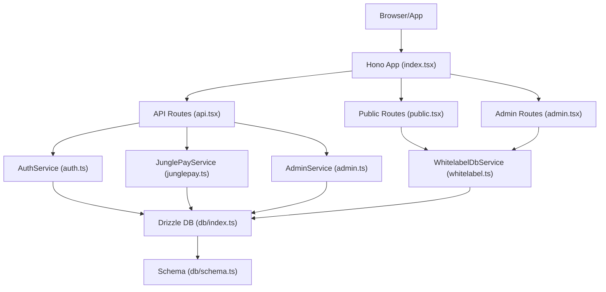

**Diagram sources**
- [index.tsx](file://src/index.tsx#L1-L21)
- [public.tsx](file://src/routes/public.tsx#L1-L170)
- [admin.tsx](file://src/routes/admin.tsx#L1-L158)
- [api.tsx](file://src/routes/api.tsx#L1-L519)
- [db/index.ts](file://src/db/index.ts#L1-L8)
- [db/schema.ts](file://src/db/schema.ts#L1-L178)
- [auth.ts](file://src/services/auth.ts#L1-L91)
- [junglepay.ts](file://src/services/junglepay.ts#L1-L270)
- [admin.ts](file://src/services/admin.ts#L1-L5)
- [whitelabel.ts](file://src/services/whitelabel.ts#L1-L24)

**Section sources**
- [README.md](file://README.md#L1-L49)
- [index.tsx](file://src/index.tsx#L1-L21)

## Core Components
- Hono server and route mounting
- Service layer abstractions:
  - Authentication service
  - Whitelabel service (sync/query)
  - Admin service (activation)
  - Payment service (JunglePay)
  - Storage service (S3)
- Database layer with Drizzle ORM and schema definitions
- Component-to-service communication via route handlers

**Section sources**
- [index.tsx](file://src/index.tsx#L1-L21)
- [auth.ts](file://src/services/auth.ts#L1-L91)
- [whitelabel.ts](file://src/services/whitelabel.ts#L1-L24)
- [admin.ts](file://src/services/admin.ts#L1-L5)
- [junglepay.ts](file://src/services/junglepay.ts#L1-L270)
- [s3.ts](file://src/services/s3.ts#L1-L48)
- [db/index.ts](file://src/db/index.ts#L1-L8)
- [db/schema.ts](file://src/db/schema.ts#L1-L178)

## Architecture Overview
The system follows a layered architecture:
- Presentation layer: Hono routes render HTML or JSON
- Service layer: Business logic orchestration
- Persistence layer: Drizzle ORM with PostgreSQL
- External integrations: JunglePay and S3

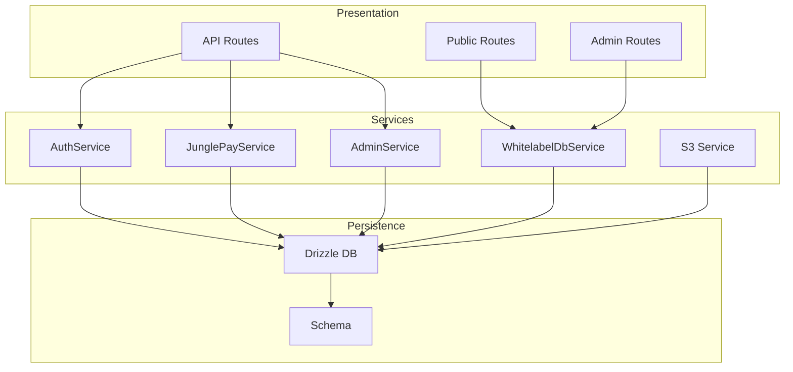

**Diagram sources**
- [public.tsx](file://src/routes/public.tsx#L1-L170)
- [admin.tsx](file://src/routes/admin.tsx#L1-L158)
- [api.tsx](file://src/routes/api.tsx#L1-L519)
- [auth.ts](file://src/services/auth.ts#L1-L91)
- [whitelabel.ts](file://src/services/whitelabel.ts#L1-L24)
- [admin.ts](file://src/services/admin.ts#L1-L5)
- [junglepay.ts](file://src/services/junglepay.ts#L1-L270)
- [s3.ts](file://src/services/s3.ts#L1-L48)
- [db/index.ts](file://src/db/index.ts#L1-L8)
- [db/schema.ts](file://src/db/schema.ts#L1-L178)

## Detailed Component Analysis

### Service Layer Pattern and Data Flow
- Route handlers delegate to service functions, which encapsulate business logic and database operations.
- Services are stateless and expose static methods or a single exported object with named functions.
- Database access is centralized via a single Drizzle client configured with environment variables.

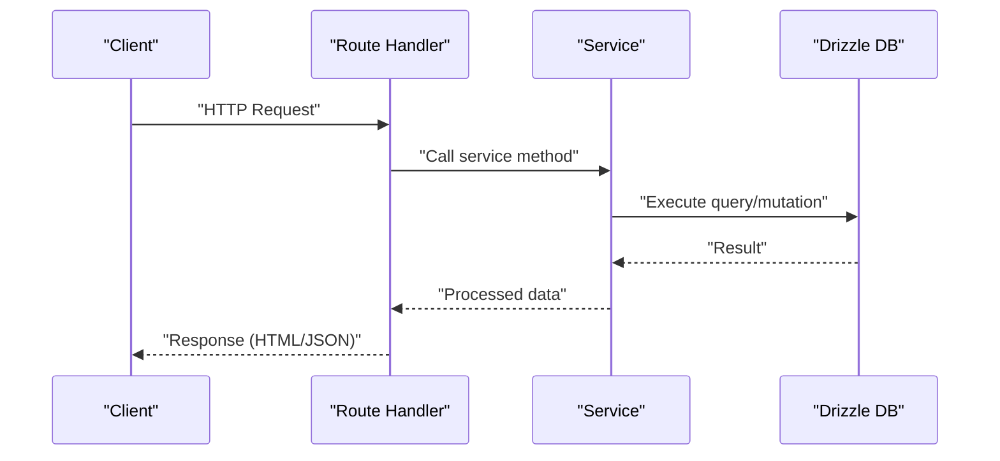

**Diagram sources**
- [api.tsx](file://src/routes/api.tsx#L1-L519)
- [auth.ts](file://src/services/auth.ts#L1-L91)
- [db/index.ts](file://src/db/index.ts#L1-L8)

**Section sources**
- [api.tsx](file://src/routes/api.tsx#L1-L519)
- [auth.ts](file://src/services/auth.ts#L1-L91)
- [db/index.ts](file://src/db/index.ts#L1-L8)

### Authentication Service Flow
- Registration hashes passwords using Bun’s password hashing, inserts a user record, and returns the created user.
- Login verifies credentials against stored hash and returns the user if valid.
- Subscription creation calculates start/end dates based on plan duration and updates user subscription status.
- Subscription status checker finds the most recent active subscription and updates user status accordingly.

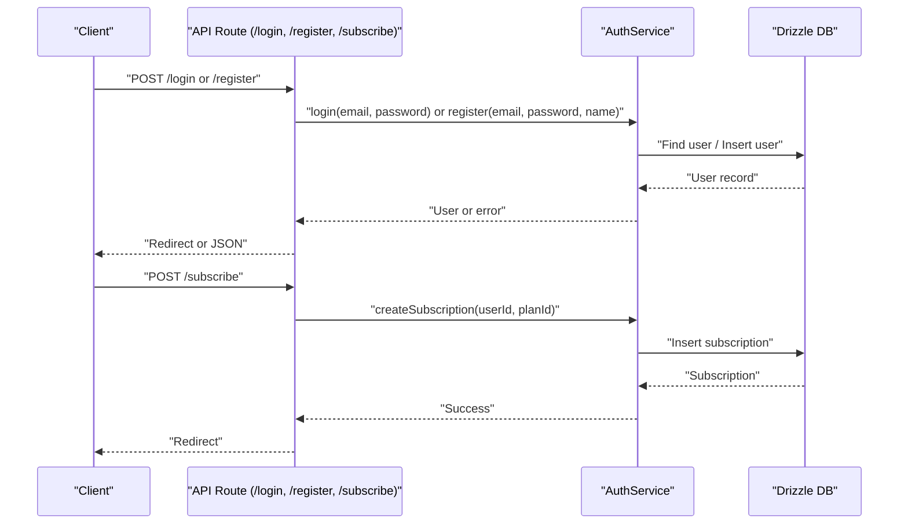

**Diagram sources**
- [api.tsx](file://src/routes/api.tsx#L316-L400)
- [auth.ts](file://src/services/auth.ts#L1-L91)
- [db/index.ts](file://src/db/index.ts#L1-L8)

**Section sources**
- [api.tsx](file://src/routes/api.tsx#L316-L400)
- [auth.ts](file://src/services/auth.ts#L1-L91)

### Whitelabel Content Synchronization Pipeline
- The WhitelabelDbService exposes sync and query functions. Admin routes trigger synchronization from the bucket, while public routes query models and posts.
- The sync pipeline orchestrates parsing and persistence of whitelabel content, and the admin activation pipeline upserts production models and posts.

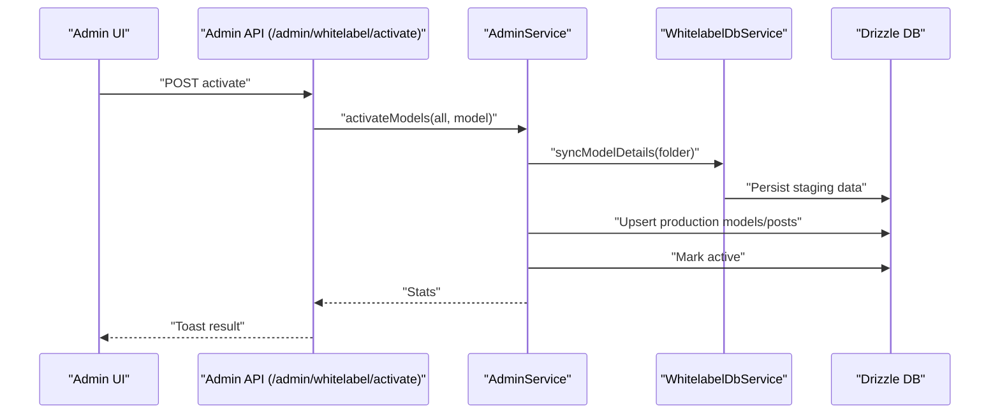

**Diagram sources**
- [admin.tsx](file://src/routes/admin.tsx#L251-L273)
- [admin.ts](file://src/services/admin.ts#L1-L5)
- [admin/activation.ts](file://src/services/admin/activation.ts#L1-L86)
- [whitelabel.ts](file://src/services/whitelabel.ts#L1-L24)
- [db/index.ts](file://src/db/index.ts#L1-L8)

**Section sources**
- [admin.tsx](file://src/routes/admin.tsx#L115-L155)
- [admin.ts](file://src/services/admin.ts#L1-L5)
- [admin/activation.ts](file://src/services/admin/activation.ts#L1-L86)
- [whitelabel.ts](file://src/services/whitelabel.ts#L1-L24)

### Payment Processing Workflow (JunglePay)
- The checkout process creates a pending checkout record and optionally initiates a PIX charge via JunglePay.
- The service validates gateway configuration, plan existence, and customer data, then calls the JunglePay API.
- Webhooks update subscriptions and user status upon payment events.

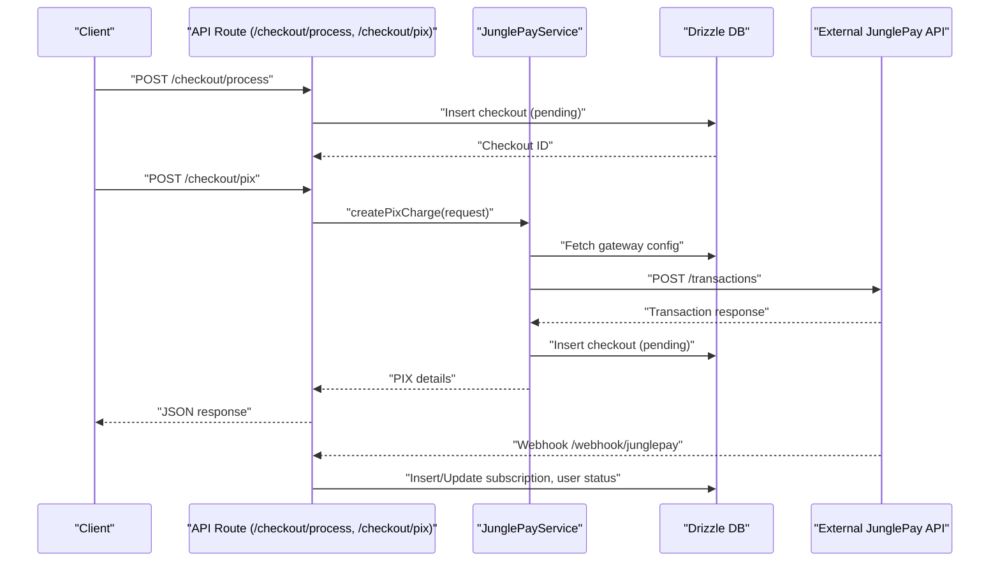

**Diagram sources**
- [api.tsx](file://src/routes/api.tsx#L15-L170)
- [junglepay.ts](file://src/services/junglepay.ts#L1-L270)
- [db/index.ts](file://src/db/index.ts#L1-L8)

**Section sources**
- [api.tsx](file://src/routes/api.tsx#L15-L170)
- [junglepay.ts](file://src/services/junglepay.ts#L1-L270)

### Administrative Operations
- Admin routes initialize default plans and gateways, manage support contacts, and expose finance controls.
- Admin APIs handle activation of whitelabel models and updating plan configurations.

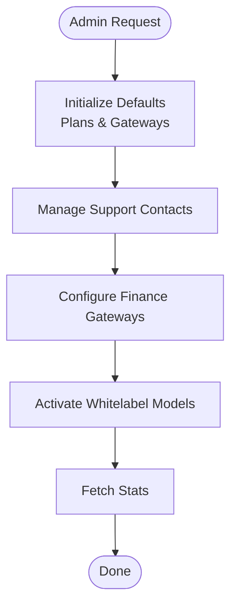

**Diagram sources**
- [admin.tsx](file://src/routes/admin.tsx#L22-L83)
- [admin.tsx](file://src/routes/admin.tsx#L173-L248)
- [admin.tsx](file://src/routes/admin.tsx#L251-L273)

**Section sources**
- [admin.tsx](file://src/routes/admin.tsx#L22-L83)
- [admin.tsx](file://src/routes/admin.tsx#L173-L248)
- [admin.tsx](file://src/routes/admin.tsx#L251-L273)

### Repository Pattern Implementation
- Services act as repositories for domain logic, exposing higher-level operations:
  - AuthService: user registration/login, subscription lifecycle
  - WhitelabelDbService: sync and query operations
  - AdminService: activation workflow
  - JunglePayService: payment orchestration
- Database access is centralized in db/index.ts with schema definitions in db/schema.ts.

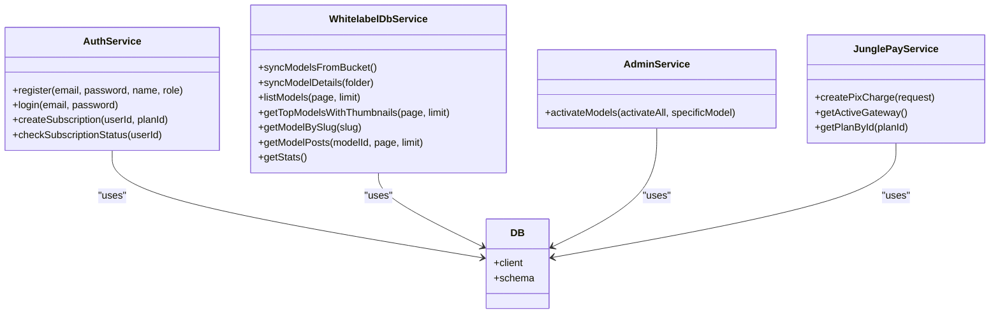

**Diagram sources**
- [auth.ts](file://src/services/auth.ts#L1-L91)
- [whitelabel.ts](file://src/services/whitelabel.ts#L1-L24)
- [admin.ts](file://src/services/admin.ts#L1-L5)
- [junglepay.ts](file://src/services/junglepay.ts#L1-L270)
- [db/index.ts](file://src/db/index.ts#L1-L8)
- [db/schema.ts](file://src/db/schema.ts#L1-L178)

**Section sources**
- [auth.ts](file://src/services/auth.ts#L1-L91)
- [whitelabel.ts](file://src/services/whitelabel.ts#L1-L24)
- [admin.ts](file://src/services/admin.ts#L1-L5)
- [junglepay.ts](file://src/services/junglepay.ts#L1-L270)
- [db/index.ts](file://src/db/index.ts#L1-L8)
- [db/schema.ts](file://src/db/schema.ts#L1-L178)

### Database Connection Management and Transactions
- A single PostgreSQL client is created from DATABASE_URL and wrapped by Drizzle. All services use the shared db instance.
- Transactions are implicit per operation; there is no explicit transaction block shown in the code. For multi-step operations (e.g., webhook updates), the code performs multiple writes sequentially.

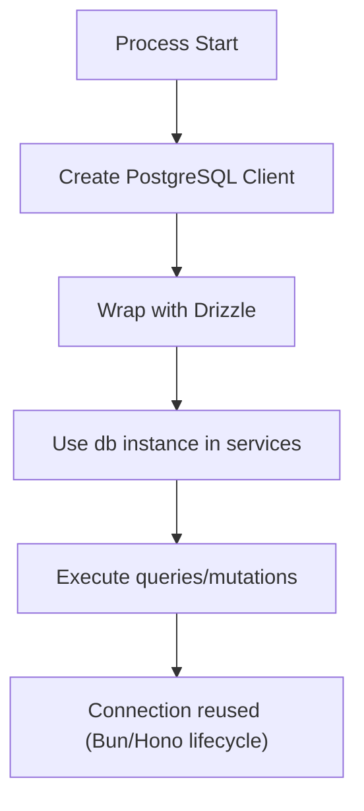

**Diagram sources**
- [db/index.ts](file://src/db/index.ts#L1-L8)

**Section sources**
- [db/index.ts](file://src/db/index.ts#L1-L8)
- [api.tsx](file://src/routes/api.tsx#L89-L170)

### Error Propagation, Retry, and Fallback Handling
- Route handlers catch errors and return structured JSON or redirects with error messages.
- Payment service returns typed error results with codes for invalid data, gateway misconfiguration, and API errors.
- Webhooks handle unknown statuses by ignoring them and logging appropriately.
- No explicit retry mechanism is present in the code; failures are logged and surfaced to clients.

Recommendations:
- Introduce exponential backoff for external API calls.
- Add idempotency keys for payment requests.
- Implement dead-letter queues for webhook processing.

**Section sources**
- [api.tsx](file://src/routes/api.tsx#L35-L86)
- [api.tsx](file://src/routes/api.tsx#L166-L170)
- [junglepay.ts](file://src/services/junglepay.ts#L135-L150)
- [junglepay.ts](file://src/services/junglepay.ts#L260-L268)

### Inter-Service Communication Patterns
- Route handlers import and call service functions directly.
- AdminService delegates to AdminActivationService.
- WhitelabelDbService composes sync and query modules internally.
- External integrations (JunglePay) are called from within the service layer.

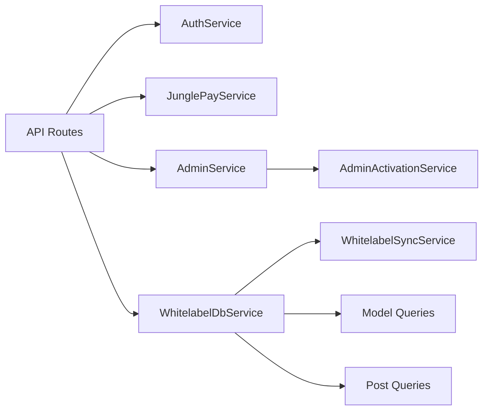

**Diagram sources**
- [api.tsx](file://src/routes/api.tsx#L1-L519)
- [admin.ts](file://src/services/admin.ts#L1-L5)
- [admin/activation.ts](file://src/services/admin/activation.ts#L1-L86)
- [whitelabel.ts](file://src/services/whitelabel.ts#L1-L24)

**Section sources**
- [api.tsx](file://src/routes/api.tsx#L1-L519)
- [admin.ts](file://src/services/admin.ts#L1-L5)
- [admin/activation.ts](file://src/services/admin/activation.ts#L1-L86)
- [whitelabel.ts](file://src/services/whitelabel.ts#L1-L24)

### Dependency Injection and Service Lifecycle
- Services are imported and used directly in route handlers; there is no DI container.
- Service instances are effectively singletons via module caching in Bun.
- Lifecycle is managed by Hono’s server lifecycle; services do not implement explicit init/shutdown hooks.

**Section sources**
- [api.tsx](file://src/routes/api.tsx#L1-L519)
- [index.tsx](file://src/index.tsx#L1-L21)

## Dependency Analysis
- Routes depend on services for business logic.
- Services depend on the shared Drizzle DB instance.
- External dependencies include the JunglePay API and S3-compatible storage.

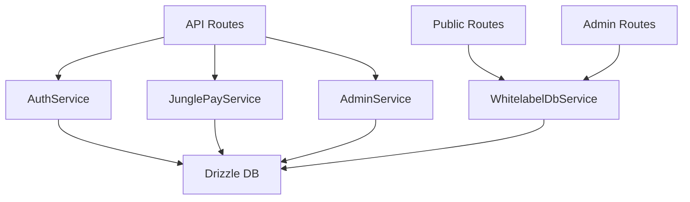

**Diagram sources**
- [public.tsx](file://src/routes/public.tsx#L1-L170)
- [admin.tsx](file://src/routes/admin.tsx#L1-L158)
- [api.tsx](file://src/routes/api.tsx#L1-L519)
- [auth.ts](file://src/services/auth.ts#L1-L91)
- [junglepay.ts](file://src/services/junglepay.ts#L1-L270)
- [admin.ts](file://src/services/admin.ts#L1-L5)
- [whitelabel.ts](file://src/services/whitelabel.ts#L1-L24)
- [db/index.ts](file://src/db/index.ts#L1-L8)

**Section sources**
- [public.tsx](file://src/routes/public.tsx#L1-L170)
- [admin.tsx](file://src/routes/admin.tsx#L1-L158)
- [api.tsx](file://src/routes/api.tsx#L1-L519)
- [auth.ts](file://src/services/auth.ts#L1-L91)
- [junglepay.ts](file://src/services/junglepay.ts#L1-L270)
- [admin.ts](file://src/services/admin.ts#L1-L5)
- [whitelabel.ts](file://src/services/whitelabel.ts#L1-L24)
- [db/index.ts](file://src/db/index.ts#L1-L8)

## Performance Considerations
- Use pagination for listing models and posts to reduce payload sizes.
- Minimize N+1 queries by leveraging joins and preloading related records where appropriate.
- Cache frequently accessed whitelabel metadata and thumbnails.
- Offload heavy operations (e.g., bucket sync) to background jobs or batch processes.

## Troubleshooting Guide
- Authentication failures: Verify JWT secret, cookie configuration, and password hashing/verification.
- Payment issues: Confirm gateway configuration, secret/public keys, and webhook URL correctness.
- Webhook mismatches: Ensure external transaction IDs align with local records and statuses are handled per event type.
- Database connectivity: Validate DATABASE_URL and network access to PostgreSQL.

**Section sources**
- [api.tsx](file://src/routes/api.tsx#L316-L400)
- [api.tsx](file://src/routes/api.tsx#L402-L506)
- [junglepay.ts](file://src/services/junglepay.ts#L107-L150)
- [db/index.ts](file://src/db/index.ts#L5-L7)

## Conclusion
CreatorFlix employs a clean service layer pattern with clear separation between routes, services, and persistence. The architecture supports whitelabel synchronization, robust authentication, and payment processing via external gateways. While the current implementation is straightforward and functional, introducing retries, idempotency, and background job processing would further improve reliability and scalability.