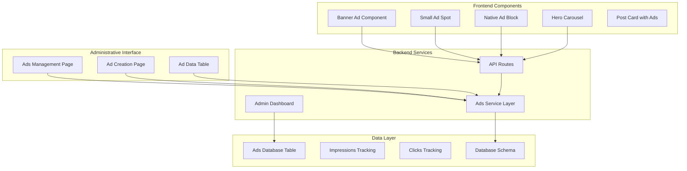
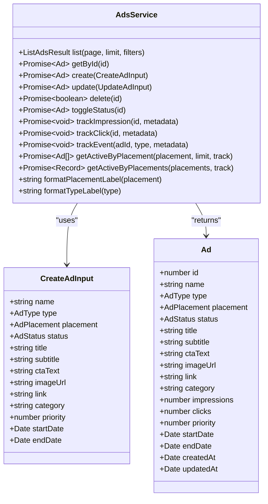
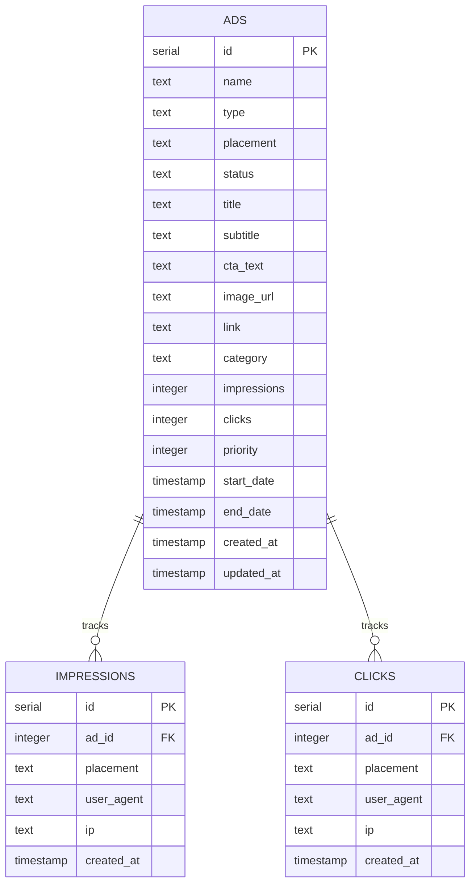
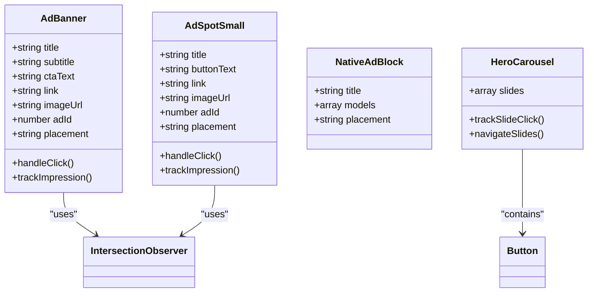
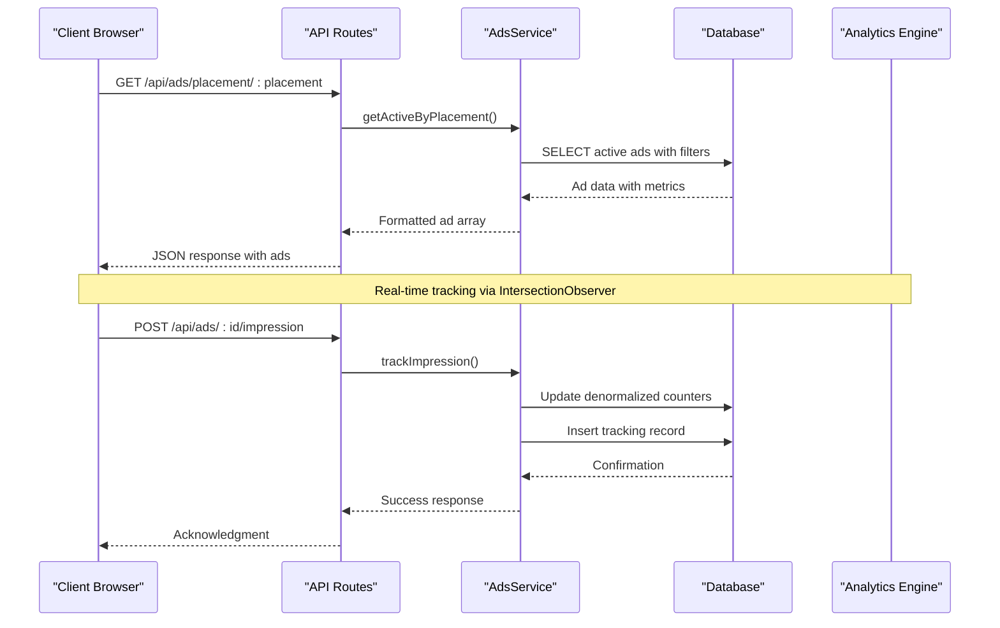
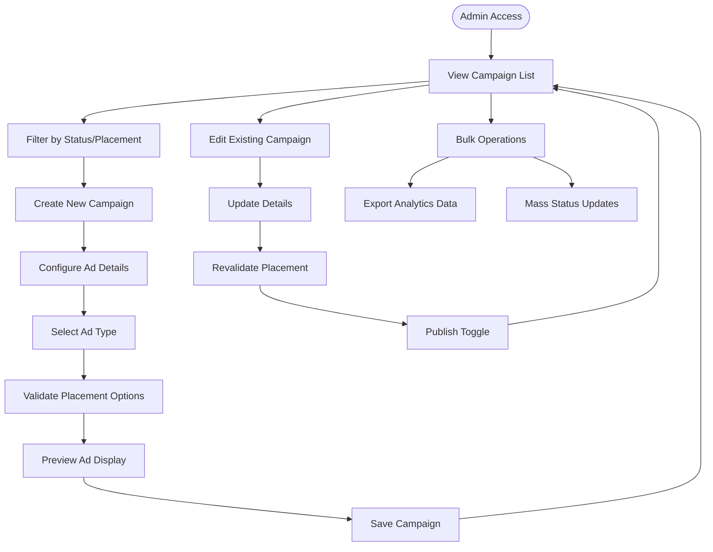
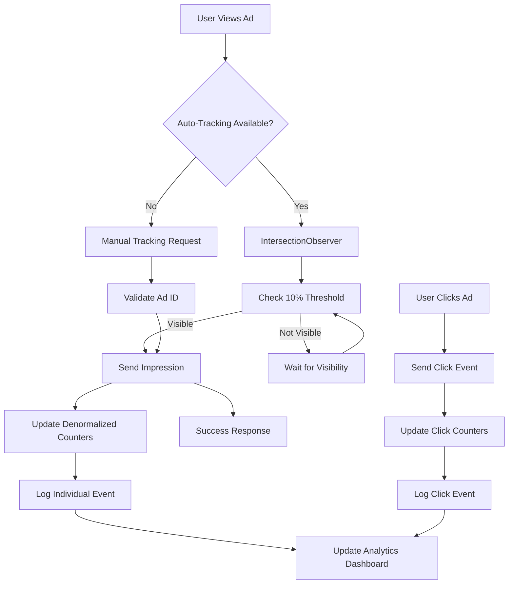
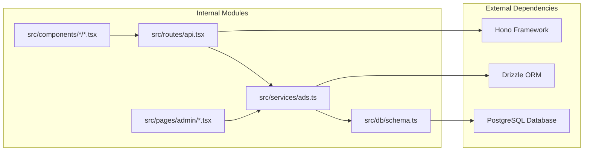

# Advertising Service Enhancement

<cite>
**Referenced Files in This Document**
- [ads.ts](file://src/services/ads.ts)
- [schema.ts](file://src/db/schema.ts)
- [0010_ads_table.sql](file://drizzle/0010_ads_table.sql)
- [0011_ads_tracking.sql](file://drizzle/0011_ads_tracking.sql)
- [Ads.tsx](file://src/pages/admin/Ads.tsx)
- [AdsCreate.tsx](file://src/pages/admin/AdsCreate.tsx)
- [AdTable.tsx](file://src/components/organisms/AdTable.tsx)
- [AdBanner.tsx](file://src/components/molecules/AdBanner.tsx)
- [AdSpotSmall.tsx](file://src/components/molecules/AdSpotSmall.tsx)
- [NativeAdBlock.tsx](file://src/components/molecules/NativeAdBlock.tsx)
- [HeroCarousel.tsx](file://src/components/organisms/HeroCarousel.tsx)
- [api.tsx](file://src/routes/api.tsx)
- [dashboard.ts](file://src/services/admin/dashboard.ts)
- [index.ts](file://src/db/index.ts)
</cite>

## Update Summary
**Changes Made**
- Enhanced tracking system documentation with comprehensive IntersectionObserver implementation details
- Added detailed coverage of automatic impression tracking across multiple frontend components
- Expanded click tracking mechanisms and placement validation documentation
- Updated component analysis to reflect new tracking capabilities
- Enhanced performance considerations section with tracking optimization details

## Table of Contents
1. [Introduction](#introduction)
2. [Project Structure](#project-structure)
3. [Core Components](#core-components)
4. [Architecture Overview](#architecture-overview)
5. [Detailed Component Analysis](#detailed-component-analysis)
6. [Dependency Analysis](#dependency-analysis)
7. [Performance Considerations](#performance-considerations)
8. [Troubleshooting Guide](#troubleshooting-guide)
9. [Conclusion](#conclusion)

## Introduction

The Advertising Service Enhancement project represents a comprehensive overhaul of the platform's advertising infrastructure, transforming it from a basic banner system to a sophisticated, multi-format advertising platform. This enhancement introduces advanced targeting capabilities, real-time analytics, and automated campaign management while maintaining backward compatibility and extending the system's scalability.

The project encompasses three primary domains: administrative management, frontend presentation, and backend processing. The administrative interface enables precise campaign creation and management, while the frontend components deliver rich, interactive advertisements across multiple formats and placements. The backend services handle complex business logic, data persistence, and real-time tracking mechanisms.

**Updated** The implementation now features comprehensive advertising tracking system with IntersectionObserver-based automatic impression tracking, sophisticated click tracking, and robust placement validation across multiple frontend components.

## Project Structure

The advertising service follows a modular architecture organized around clear separation of concerns:

**Diagram sources**
- [Ads.tsx](file://src/pages/admin/Ads.tsx#L1-L131)
- [AdsCreate.tsx](file://src/pages/admin/AdsCreate.tsx#L1-L569)
- [ads.ts](file://src/services/ads.ts#L1-L380)
- [schema.ts](file://src/db/schema.ts#L194-L253)

**Section sources**
- [Ads.tsx](file://src/pages/admin/Ads.tsx#L1-L131)
- [AdsCreate.tsx](file://src/pages/admin/AdsCreate.tsx#L1-L569)
- [ads.ts](file://src/services/ads.ts#L1-L380)

## Core Components

### Advertising Service Layer

The AdsService provides comprehensive functionality for managing advertising campaigns with sophisticated validation and tracking capabilities:

**Diagram sources**
- [ads.ts](file://src/services/ads.ts#L38-L380)

The service implements robust validation through placement type mapping, ensuring advertisements appear only in appropriate contexts. It supports five distinct ad formats: Diamond Selection, Diamond Block, Banner, Ad Spot Small, and Hero Carousel, each with specific placement restrictions and display characteristics.

**Section sources**
- [ads.ts](file://src/services/ads.ts#L1-L380)

### Database Schema and Data Models

The advertising system utilizes a normalized database design with separate tracking tables for impressions and clicks:

**Diagram sources**
- [schema.ts](file://src/db/schema.ts#L194-L253)
- [0010_ads_table.sql](file://drizzle/0010_ads_table.sql#L1-L21)
- [0011_ads_tracking.sql](file://drizzle/0011_ads_tracking.sql#L1-L21)

**Section sources**
- [schema.ts](file://src/db/schema.ts#L194-L253)
- [0010_ads_table.sql](file://drizzle/0010_ads_table.sql#L1-L21)
- [0011_ads_tracking.sql](file://drizzle/0011_ads_tracking.sql#L1-L21)

### Frontend Advertisement Components

The frontend presents advertisements through specialized React components designed for different formats and placements:

**Diagram sources**
- [AdBanner.tsx](file://src/components/molecules/AdBanner.tsx#L1-L54)
- [AdSpotSmall.tsx](file://src/components/molecules/AdSpotSmall.tsx#L1-L55)
- [NativeAdBlock.tsx](file://src/components/molecules/NativeAdBlock.tsx#L1-L30)
- [HeroCarousel.tsx](file://src/components/organisms/HeroCarousel.tsx#L1-L72)

**Section sources**
- [AdBanner.tsx](file://src/components/molecules/AdBanner.tsx#L1-L54)
- [AdSpotSmall.tsx](file://src/components/molecules/AdSpotSmall.tsx#L1-L55)
- [NativeAdBlock.tsx](file://src/components/molecules/NativeAdBlock.tsx#L1-L30)
- [HeroCarousel.tsx](file://src/components/organisms/HeroCarousel.tsx#L1-L72)

## Architecture Overview

The advertising service employs a layered architecture with clear separation between presentation, business logic, and data persistence:

**Diagram sources**
- [api.tsx](file://src/routes/api.tsx#L864-L940)
- [ads.ts](file://src/services/ads.ts#L307-L331)

The architecture supports both automatic and manual tracking mechanisms, with automatic tracking triggered by viewport intersection and manual tracking available for specific scenarios. The service maintains data integrity through database transactions and provides comprehensive filtering and sorting capabilities.

**Section sources**
- [api.tsx](file://src/routes/api.tsx#L864-L973)
- [ads.ts](file://src/services/ads.ts#L246-L301)

## Detailed Component Analysis

### Administrative Management Interface

The administrative interface provides comprehensive tools for campaign management with real-time analytics and bulk operations:

**Diagram sources**
- [Ads.tsx](file://src/pages/admin/Ads.tsx#L29-L131)
- [AdsCreate.tsx](file://src/pages/admin/AdsCreate.tsx#L40-L569)

The interface implements dynamic form validation, real-time preview updates, and comprehensive filtering capabilities. Users can manage campaigns through intuitive forms with type-specific field visibility and placement validation.

**Section sources**
- [Ads.tsx](file://src/pages/admin/Ads.tsx#L1-L131)
- [AdsCreate.tsx](file://src/pages/admin/AdsCreate.tsx#L1-L569)

### Real-Time Tracking and Analytics

The tracking system implements sophisticated event capture with automatic and manual tracking mechanisms:

**Diagram sources**
- [AdBanner.tsx](file://src/components/molecules/AdBanner.tsx#L36-L50)
- [AdSpotSmall.tsx](file://src/components/molecules/AdSpotSmall.tsx#L37-L51)
- [ads.ts](file://src/services/ads.ts#L246-L290)

The tracking system captures user agent, IP address, and placement information for comprehensive analytics. Automatic tracking uses browser IntersectionObserver API to detect when ads become visible, while manual tracking provides fallback mechanisms for various scenarios.

**Updated** The implementation now features comprehensive IntersectionObserver-based tracking across multiple components with 10% visibility threshold for accurate impression counting.

**Section sources**
- [AdBanner.tsx](file://src/components/molecules/AdBanner.tsx#L1-L54)
- [AdSpotSmall.tsx](file://src/components/molecules/AdSpotSmall.tsx#L1-L55)
- [ads.ts](file://src/services/ads.ts#L246-L301)

### Multi-Format Advertisement Delivery

The system supports five distinct advertisement formats, each optimized for specific placements and user experiences:

| Ad Type | Placement Restrictions | Primary Use Case | Display Characteristics |
|---------|----------------------|------------------|------------------------|
| Diamond Selection | feed_model | Post-style native ads | Embedded within content feeds |
| Diamond Block | home_top, home_middle, models_grid | Featured content blocks | Grid-based editorial blocks |
| Banner | home_top, home_bottom, login, register | Horizontal native ads | Full-width promotional banners |
| Ad Spot Small | sidebar, model_profile, model_sidebar | Compact sidebar ads | Square or rectangular formats |
| Hero Carousel | home_top | Primary promotional content | Full-width rotating hero content |

**Section sources**
- [ads.ts](file://src/services/ads.ts#L11-L36)
- [AdsCreate.tsx](file://src/pages/admin/AdsCreate.tsx#L16-L38)

## Dependency Analysis

The advertising service demonstrates excellent modularity with clear dependency relationships:

**Diagram sources**
- [ads.ts](file://src/services/ads.ts#L1-L3)
- [api.tsx](file://src/routes/api.tsx#L1-L15)
- [schema.ts](file://src/db/schema.ts#L1-L3)

The dependency graph reveals a clean separation of concerns with AdsService acting as the central coordinator for all advertising-related operations. The modular design facilitates testing, maintenance, and future enhancements.

**Section sources**
- [ads.ts](file://src/services/ads.ts#L1-L3)
- [api.tsx](file://src/routes/api.tsx#L1-L15)
- [schema.ts](file://src/db/schema.ts#L1-L3)

## Performance Considerations

The advertising service incorporates several performance optimization strategies:

### Database Optimization
- **Denormalized Counters**: Maintains separate impression and click counters in the main ads table to avoid expensive JOIN operations during rendering
- **Index-Friendly Queries**: Uses selective WHERE clauses with equality checks for optimal index utilization
- **Transaction Batching**: Groups related operations within single database transactions to minimize round trips

### Frontend Performance
- **IntersectionObserver**: Implements efficient viewport detection to trigger impressions only when ads are actually visible
- **Component Caching**: React components leverage memoization and efficient re-rendering strategies
- **Lazy Loading**: Advertisement components load resources progressively to minimize initial page load time

### Scalability Features
- **Pagination Support**: Built-in pagination prevents excessive data transfer for large ad catalogs
- **Filtering Capabilities**: Selective filtering reduces server load by limiting result sets
- **Asynchronous Processing**: Tracking events use asynchronous requests to avoid blocking user interactions

**Updated** The tracking system now implements optimized IntersectionObserver configurations with 10% visibility thresholds to ensure accurate impression counting while minimizing unnecessary tracking requests. Automatic tracking is designed to unobserve elements after first successful impression to prevent redundant tracking calls.

## Troubleshooting Guide

### Common Issues and Solutions

**Ad Not Appearing**
- Verify ad status is set to "active"
- Check placement restrictions match the target page
- Confirm date range validity (startDate/endDate)
- Ensure priority settings don't conflict with other ads

**Tracking Not Working**
- Verify IntersectionObserver support in the browser
- Check network connectivity for tracking endpoints
- Review browser console for JavaScript errors
- Confirm adId parameter is properly passed to tracking components
- Validate placement parameter is included in tracking requests

**Performance Issues**
- Monitor database query execution times
- Check for excessive concurrent tracking requests
- Review component rendering frequency
- Validate CDN delivery for advertisement assets

**Data Consistency Problems**
- Verify database transaction completion
- Check for race conditions in ad updates
- Review foreign key constraint violations
- Monitor analytics data synchronization

**Section sources**
- [ads.ts](file://src/services/ads.ts#L246-L301)
- [AdBanner.tsx](file://src/components/molecules/AdBanner.tsx#L36-L50)
- [AdSpotSmall.tsx](file://src/components/molecules/AdSpotSmall.tsx#L37-L51)

## Conclusion

The Advertising Service Enhancement project successfully transforms the platform's advertising capabilities from a simple banner system to a comprehensive, scalable advertising infrastructure. The implementation demonstrates excellent architectural principles with clear separation of concerns, robust validation mechanisms, and comprehensive tracking capabilities.

Key achievements include the introduction of five distinct advertisement formats, sophisticated placement validation, real-time analytics integration, and automated campaign management. The modular design ensures maintainability and extensibility while the performance optimizations support high-volume operations.

**Updated** The comprehensive advertising tracking system implementation featuring IntersectionObserver-based automatic impression tracking, sophisticated click tracking, and robust placement validation across multiple frontend components represents a significant advancement in advertising technology. The system's success lies in its balanced approach to functionality and simplicity, providing powerful advertising capabilities without overwhelming complexity.

The system's success lies in its balanced approach to functionality and simplicity, providing powerful advertising capabilities without overwhelming complexity. The comprehensive administrative interface, combined with flexible frontend components and robust backend services, creates a cohesive advertising ecosystem ready for enterprise-scale deployment.

Future enhancements could include advanced targeting capabilities, A/B testing frameworks, and enhanced analytics dashboards, building upon the solid foundation established by this comprehensive advertising service enhancement.