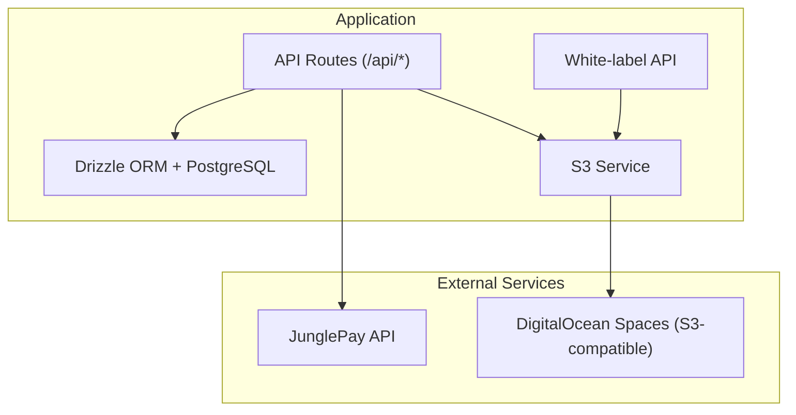
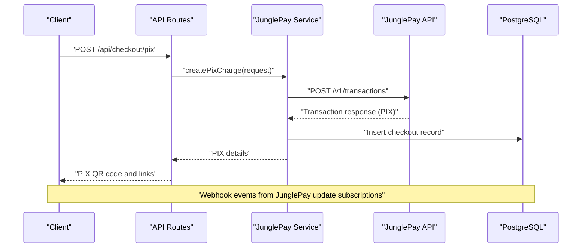
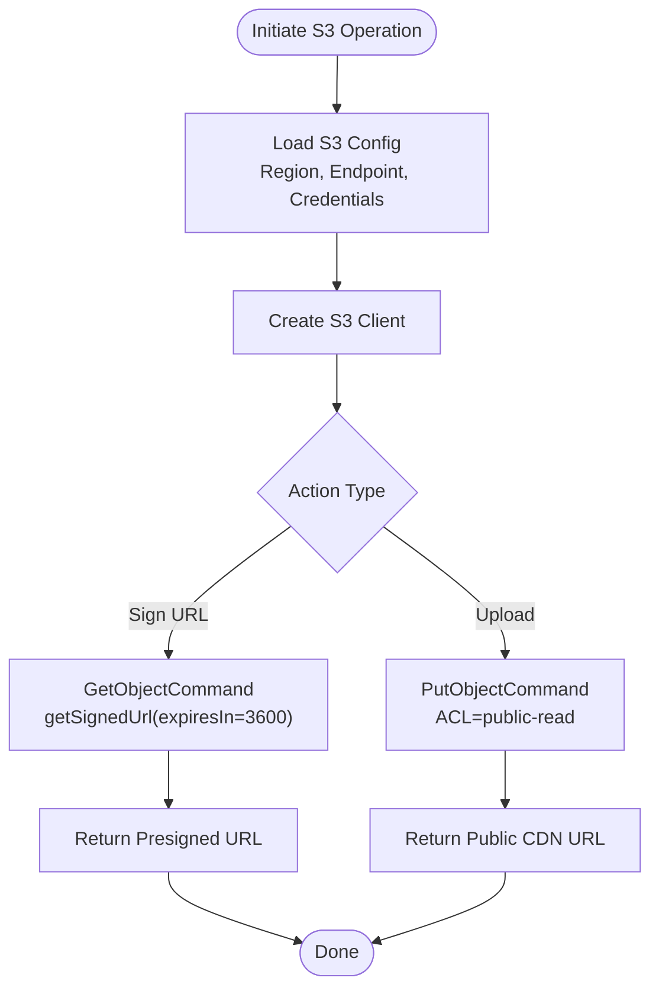
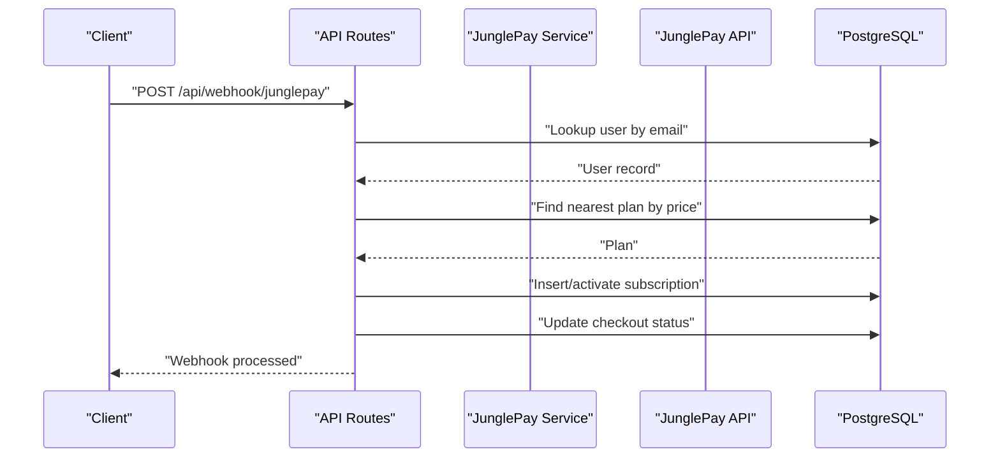
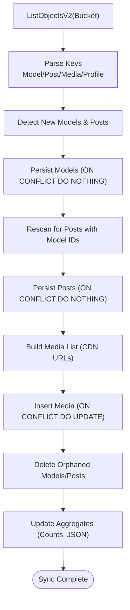
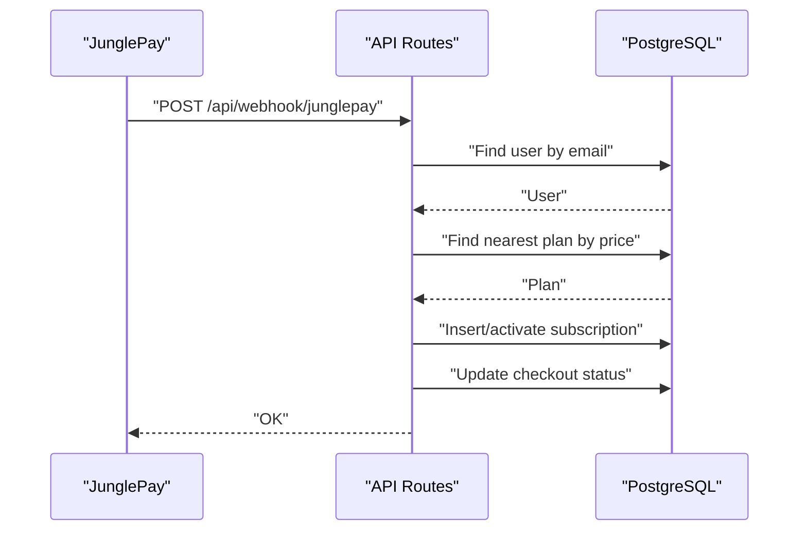
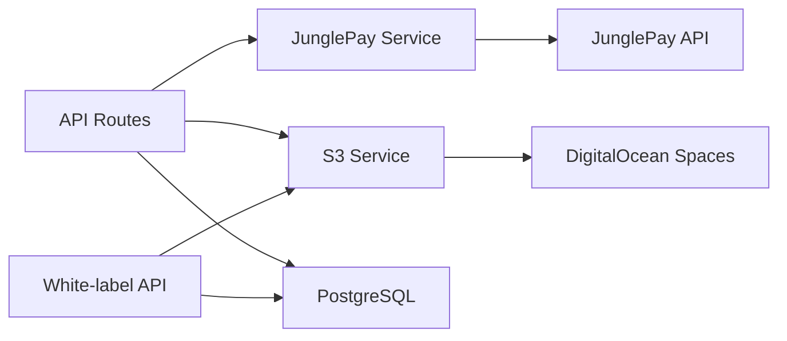
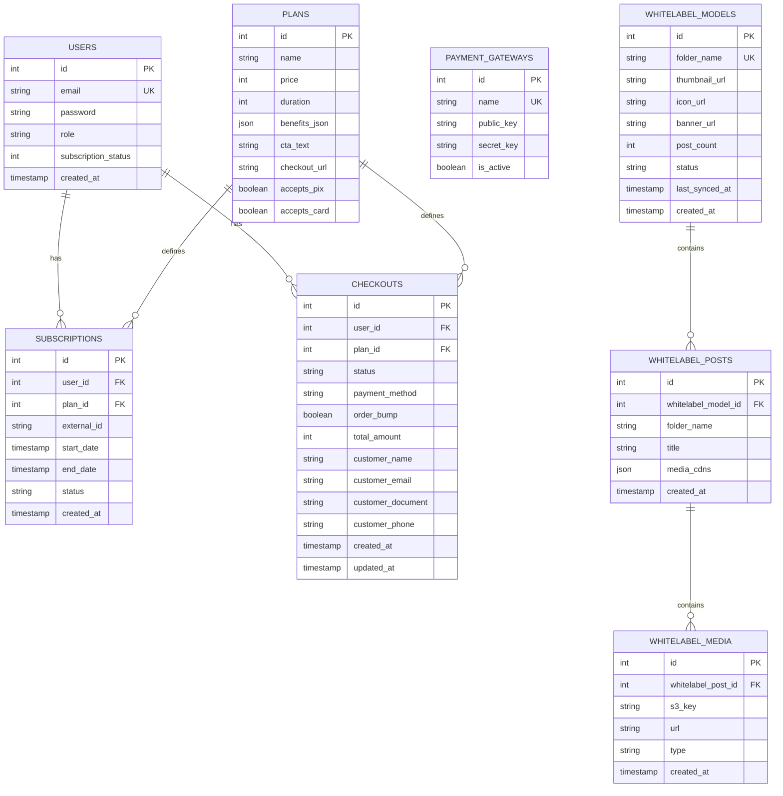

# External Integrations & Third-party Services

<cite>
**Referenced Files in This Document**
- [README.md](file://README.md)
- [junglepay-documentation.md](file://junglepay-documentation.md)
- [src/db/index.ts](file://src/db/index.ts)
- [src/db/schema.ts](file://src/db/schema.ts)
- [src/routes/api.tsx](file://src/routes/api.tsx)
- [src/services/s3.ts](file://src/services/s3.ts)
- [src/services/storage.ts](file://src/services/storage.ts)
- [src/services/junglepay.ts](file://src/services/junglepay.ts)
- [src/services/whitelabel.ts](file://src/services/whitelabel.ts)
- [src/services/whitelabel/sync.ts](file://src/services/whitelabel/sync.ts)
- [src/services/whitelabel/sync/parser.ts](file://src/services/whitelabel/sync/parser.ts)
- [src/services/whitelabel/sync/persistence.ts](file://src/services/whitelabel/sync/persistence.ts)
</cite>

## Table of Contents
1. [Introduction](#introduction)
2. [Project Structure](#project-structure)
3. [Core Components](#core-components)
4. [Architecture Overview](#architecture-overview)
5. [Detailed Component Analysis](#detailed-component-analysis)
6. [Dependency Analysis](#dependency-analysis)
7. [Performance Considerations](#performance-considerations)
8. [Troubleshooting Guide](#troubleshooting-guide)
9. [Conclusion](#conclusion)
10. [Appendices](#appendices)

## Introduction
This document explains CreatorFlix’s integration architecture with external services, focusing on:
- AWS S3/DigitalOcean Spaces content delivery and signed URL generation
- JunglePay payment gateway integration (PIX and broader checkout)
- White-label content synchronization from S3 buckets to the application database
- Authentication mechanisms, rate limiting, error handling, and security considerations
- Webhook handling for payment notifications and real-time updates
- Media processing workflows and content delivery optimization

The goal is to provide a clear understanding of how external systems are integrated, how data flows through the system, and how to operate and troubleshoot these integrations effectively.

## Project Structure
CreatorFlix uses Hono for routing, Drizzle ORM for PostgreSQL, and AWS SDK for S3. External integrations are encapsulated in dedicated service modules:
- Payment: JunglePay service and API routes
- Storage: S3 client configuration and signed URL generation
- White-label sync: S3 listing, parsing, persistence, and aggregation
- Database: Schema and connections

**Diagram sources**
- [src/routes/api.tsx](file://src/routes/api.tsx#L1-L519)
- [src/services/s3.ts](file://src/services/s3.ts#L1-L48)
- [src/services/junglepay.ts](file://src/services/junglepay.ts#L1-L270)
- [src/services/whitelabel/sync.ts](file://src/services/whitelabel/sync.ts#L1-L334)
- [src/db/schema.ts](file://src/db/schema.ts#L1-L178)

**Section sources**
- [README.md](file://README.md#L1-L49)
- [src/routes/api.tsx](file://src/routes/api.tsx#L1-L519)
- [src/db/schema.ts](file://src/db/schema.ts#L1-L178)

## Core Components
- S3 Service: Provides a configured S3 client, signed URL generation, and utilities for content access.
- JunglePay Service: Manages PIX charge creation, authentication, payload construction, and webhook-driven subscription lifecycle.
- White-label Sync: Orchestrates S3 bucket scanning, parsing, persistence, and content aggregation.
- API Routes: Expose endpoints for checkout, PIX initiation, webhooks, and white-label content retrieval.
- Database: Stores plans, gateways, subscriptions, checkouts, and white-label entities.

**Section sources**
- [src/services/s3.ts](file://src/services/s3.ts#L1-L48)
- [src/services/junglepay.ts](file://src/services/junglepay.ts#L1-L270)
- [src/services/whitelabel/sync.ts](file://src/services/whitelabel/sync.ts#L1-L334)
- [src/routes/api.tsx](file://src/routes/api.tsx#L1-L519)
- [src/db/schema.ts](file://src/db/schema.ts#L1-L178)

## Architecture Overview
The system integrates three primary external services:
- DigitalOcean Spaces (S3-compatible) for media storage and CDN delivery
- JunglePay for payment processing (PIX and broader checkout)
- Internal APIs for white-label content ingestion and delivery

**Diagram sources**
- [src/routes/api.tsx](file://src/routes/api.tsx#L41-L86)
- [src/services/junglepay.ts](file://src/services/junglepay.ts#L107-L268)
- [src/db/schema.ts](file://src/db/schema.ts#L113-L127)

## Detailed Component Analysis

### AWS S3 Integration Patterns
- Client configuration: Uses a DigitalOcean Spaces endpoint and fixed credentials for S3-compatible access.
- Signed URL generation: Creates short-lived, presigned URLs for secure access to private objects.
- Upload utility: Public upload helper for ingesting content into Spaces.

Key behaviors:
- Region and endpoint are configured for DigitalOcean Spaces.
- Credentials are embedded in code for demonstration; in production, environment variables should be used.
- Signed URLs expire after one hour.
- Uploads are public-read and return a CDN-accessible URL.

**Diagram sources**
- [src/services/s3.ts](file://src/services/s3.ts#L4-L47)
- [src/services/storage.ts](file://src/services/storage.ts#L18-L38)

**Section sources**
- [src/services/s3.ts](file://src/services/s3.ts#L1-L48)
- [src/services/storage.ts](file://src/services/storage.ts#L1-L39)

### JunglePay Payment Gateway Integration
- Authentication: Basic Access Authentication using a secret key.
- Charge creation: Builds a payload with customer, items, and optional order bump; posts to JunglePay API.
- Webhooks: Two webhook endpoints:
  - JunglePay webhook: Updates subscriptions and user status upon payment.
  - Dias Marketplace webhook: Handles pending and paid statuses for subscriptions.

**Diagram sources**
- [src/routes/api.tsx](file://src/routes/api.tsx#L88-L170)
- [src/services/junglepay.ts](file://src/services/junglepay.ts#L107-L268)
- [src/db/schema.ts](file://src/db/schema.ts#L37-L46)

**Section sources**
- [src/services/junglepay.ts](file://src/services/junglepay.ts#L1-L270)
- [src/routes/api.tsx](file://src/routes/api.tsx#L88-L170)
- [junglepay-documentation.md](file://junglepay-documentation.md#L1-L800)

### White-label Content Synchronization Workflows
The white-label sync pipeline scans S3 buckets, parses keys into models, posts, and media, persists them, and updates aggregates.

**Diagram sources**
- [src/services/whitelabel/sync.ts](file://src/services/whitelabel/sync.ts#L6-L197)
- [src/services/whitelabel/sync/parser.ts](file://src/services/whitelabel/sync/parser.ts#L10-L58)
- [src/services/whitelabel/sync/persistence.ts](file://src/services/whitelabel/sync/persistence.ts#L5-L93)

**Section sources**
- [src/services/whitelabel/sync.ts](file://src/services/whitelabel/sync.ts#L1-L334)
- [src/services/whitelabel/sync/parser.ts](file://src/services/whitelabel/sync/parser.ts#L1-L59)
- [src/services/whitelabel/sync/persistence.ts](file://src/services/whitelabel/sync/persistence.ts#L1-L94)
- [src/services/whitelabel.ts](file://src/services/whitelabel.ts#L1-L24)

### API Rate Limiting and Error Handling
- S3 SDK retries: The AWS SDK includes retry strategies; failures should be handled upstream with exponential backoff and idempotency checks.
- JunglePay API: Errors are captured with status codes and mapped to structured results; webhook handlers include robust logging and early returns for unsupported events.
- Database operations: Upserts and updates use conflict resolution to avoid duplication and maintain consistency.

Recommendations:
- Apply circuit breakers around external calls.
- Implement idempotency tokens for checkout creation and webhook processing.
- Add exponential backoff for transient failures.

**Section sources**
- [src/services/junglepay.ts](file://src/services/junglepay.ts#L204-L268)
- [src/routes/api.tsx](file://src/routes/api.tsx#L88-L170)
- [src/services/whitelabel/sync/persistence.ts](file://src/services/whitelabel/sync/persistence.ts#L17-L54)

### Authentication Mechanisms
- Payment gateway authentication: Basic Access Authentication using a secret key for JunglePay.
- Webhook verification: No cryptographic signature verification is implemented in code; consider validating webhook authenticity using shared secrets or signatures if required.
- JWT cookies: Login sets a signed JWT cookie for session management.

Security notes:
- Store secret keys in environment variables, not hardcoded.
- Enforce HTTPS in production and secure cookie attributes.

**Section sources**
- [src/services/junglepay.ts](file://src/services/junglepay.ts#L67-L75)
- [src/routes/api.tsx](file://src/routes/api.tsx#L316-L349)

### Content Delivery Optimization
- Signed URLs: Short-lived presigned URLs enable secure, time-limited access to private content.
- CDN URLs: Media entries store CDN URLs derived from bucket and key.
- Aggregation: Post-level JSON aggregates images and videos for efficient client rendering.

**Section sources**
- [src/services/s3.ts](file://src/services/s3.ts#L25-L47)
- [src/services/whitelabel/sync/persistence.ts](file://src/services/whitelabel/sync/persistence.ts#L63-L92)

### Webhook Handling for Payment Notifications
Two webhook endpoints are implemented:
- JunglePay: Processes paid and waiting_payment statuses, creates/activates subscriptions, and updates checkout records.
- Dias Marketplace: Handles pending and paid statuses similarly.

**Diagram sources**
- [src/routes/api.tsx](file://src/routes/api.tsx#L88-L170)

**Section sources**
- [src/routes/api.tsx](file://src/routes/api.tsx#L88-L170)

### Real-time Update Mechanisms
- Webhooks: Immediate updates to subscription and checkout states.
- Polling: White-label sync runs periodically to reconcile S3 content with the database.

**Section sources**
- [src/routes/api.tsx](file://src/routes/api.tsx#L88-L170)
- [src/services/whitelabel/sync.ts](file://src/services/whitelabel/sync.ts#L6-L197)

### Security Considerations
- API keys: Secret keys are currently embedded in code; move to environment variables and secret managers.
- Encryption: No encryption-at-rest or in-transit logic is present in the reviewed files; rely on HTTPS/TLS and secure storage.
- Compliance: Payment processing involves sensitive data; ensure PCI DSS alignment and consider tokenization for card payments.

**Section sources**
- [src/services/s3.ts](file://src/services/s3.ts#L4-L12)
- [src/services/junglepay.ts](file://src/services/junglepay.ts#L67-L75)
- [junglepay-documentation.md](file://junglepay-documentation.md#L1-L800)

## Dependency Analysis
External dependencies and their roles:
- AWS SDK for S3: Signed URL generation and object listing
- Hono: Routing and middleware
- Drizzle ORM + PostgreSQL: Data persistence
- JunglePay API: Payment processing and webhooks

**Diagram sources**
- [src/routes/api.tsx](file://src/routes/api.tsx#L1-L519)
- [src/services/s3.ts](file://src/services/s3.ts#L1-L48)
- [src/services/junglepay.ts](file://src/services/junglepay.ts#L1-L270)
- [src/services/whitelabel/sync.ts](file://src/services/whitelabel/sync.ts#L1-L334)
- [src/db/schema.ts](file://src/db/schema.ts#L1-L178)

**Section sources**
- [src/db/index.ts](file://src/db/index.ts#L1-L8)
- [src/db/schema.ts](file://src/db/schema.ts#L1-L178)

## Performance Considerations
- S3 pagination: The sync loops use continuation tokens and capped page sizes to manage large buckets efficiently.
- Conflict resolution: Upserts and updates minimize duplicate writes.
- CDN URLs: Storing CDN URLs avoids repeated signing operations.
- Webhooks: Asynchronous processing reduces latency for payment confirmations.

[No sources needed since this section provides general guidance]

## Troubleshooting Guide
Common issues and resolutions:
- S3 signed URL failures: Verify key normalization and percent-encoding; ensure bucket and endpoint match configuration.
- JunglePay authentication errors: Confirm secret key presence and Basic header format.
- Webhook mismatches: Validate payload types and statuses; ensure user lookup and plan matching logic align with stored data.
- Sync inconsistencies: Re-run white-label sync; verify parser logic for key formats and media detection.

**Section sources**
- [src/services/s3.ts](file://src/services/s3.ts#L25-L47)
- [src/services/junglepay.ts](file://src/services/junglepay.ts#L107-L268)
- [src/routes/api.tsx](file://src/routes/api.tsx#L88-L170)
- [src/services/whitelabel/sync.ts](file://src/services/whitelabel/sync.ts#L6-L197)

## Conclusion
CreatorFlix integrates external services through focused service modules:
- S3 signed URLs and uploads enable secure content delivery
- JunglePay provides a streamlined PIX checkout with webhook-driven subscription updates
- White-label sync maintains a consistent catalog of models, posts, and media

Operational improvements include moving secrets to environment variables, adding webhook signature verification, and implementing idempotency and retries for resilience.

[No sources needed since this section summarizes without analyzing specific files]

## Appendices

### API Definitions
- Checkout initiation: POST /api/checkout/process
- PIX charge: POST /api/checkout/pix
- JunglePay webhook: POST /api/webhook/junglepay
- Dias Marketplace webhook: POST /api/webhook/dias/payment-sucess
- White-label models: GET /api/models
- White-label posts: GET /api/models/:modelName/posts

**Section sources**
- [src/routes/api.tsx](file://src/routes/api.tsx#L15-L313)

### Data Models Overview

**Diagram sources**
- [src/db/schema.ts](file://src/db/schema.ts#L6-L178)