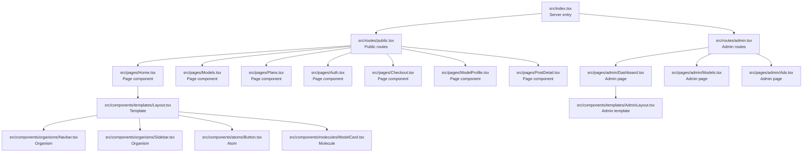
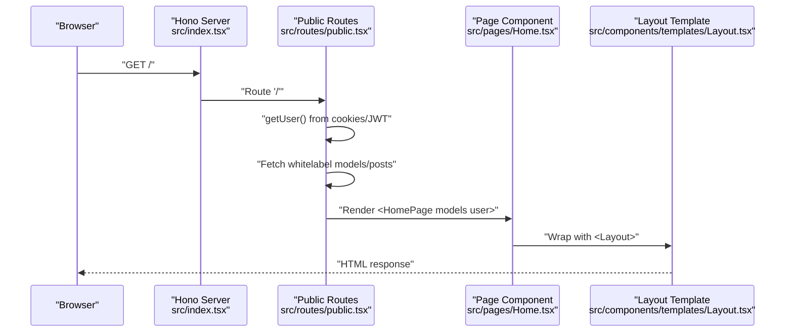
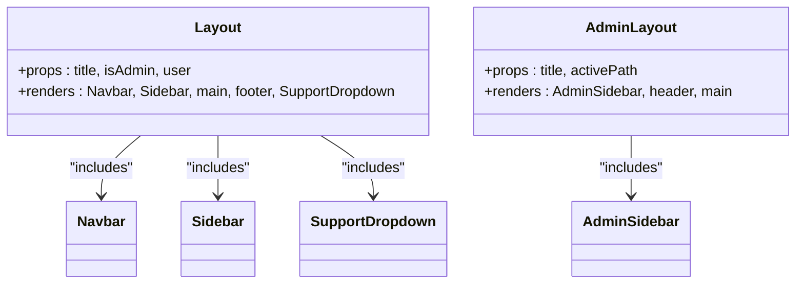
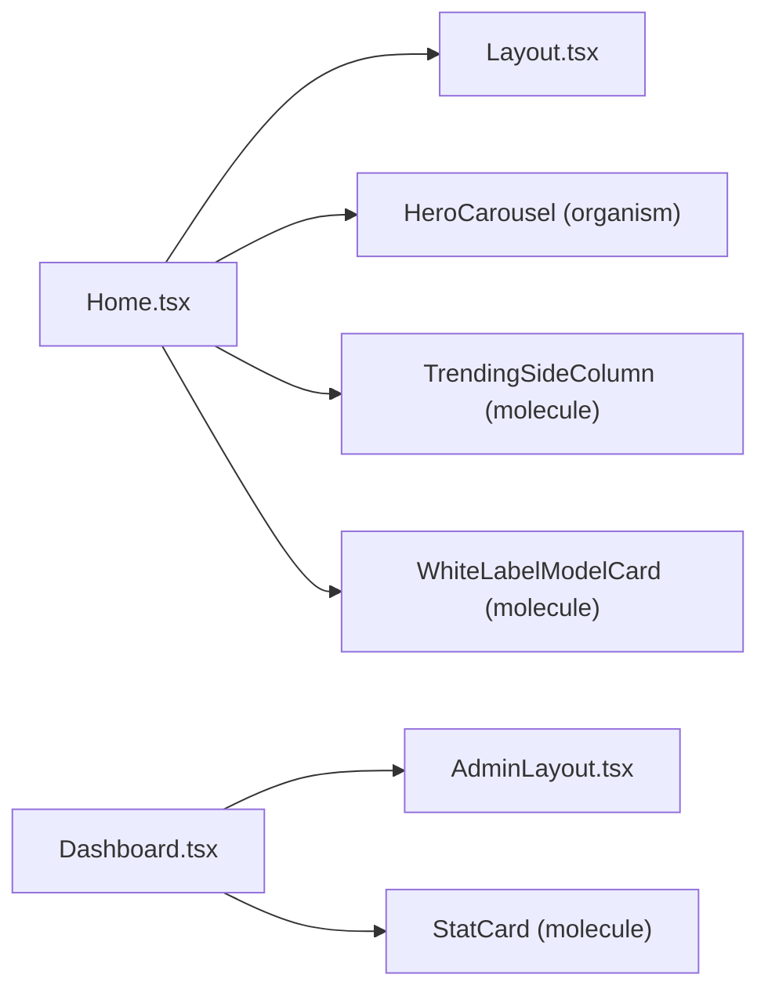
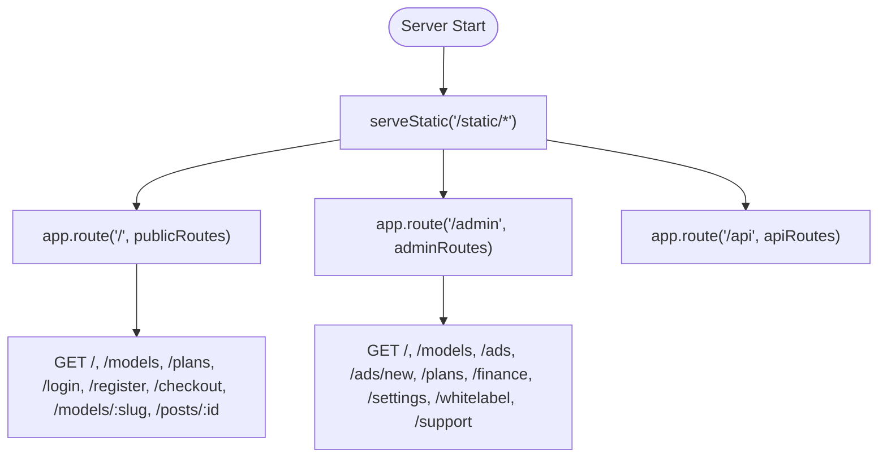
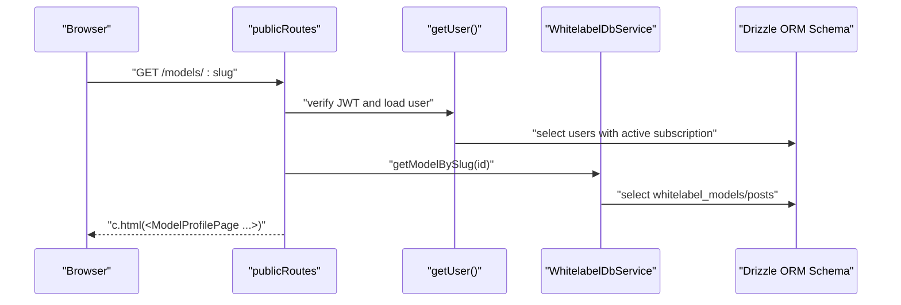
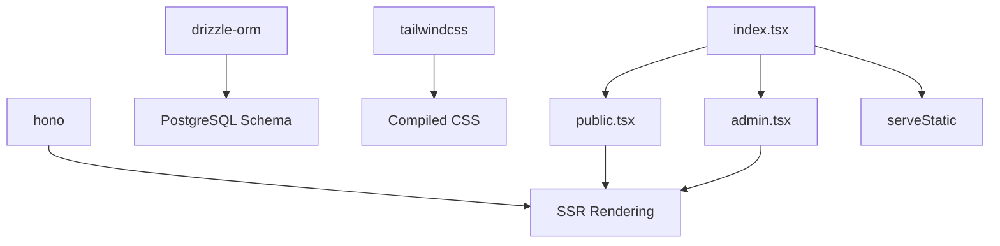

# Frontend Architecture

<cite>
**Referenced Files in This Document**
- [index.tsx](file://src/index.tsx)
- [public.tsx](file://src/routes/public.tsx)
- [admin.tsx](file://src/routes/admin.tsx)
- [Layout.tsx](file://src/components/templates/Layout.tsx)
- [AdminLayout.tsx](file://src/components/templates/AdminLayout.tsx)
- [Home.tsx](file://src/pages/Home.tsx)
- [Dashboard.tsx](file://src/pages/admin/Dashboard.tsx)
- [Button.tsx](file://src/components/atoms/Button.tsx)
- [ModelCard.tsx](file://src/components/molecules/ModelCard.tsx)
- [Navbar.tsx](file://src/components/organisms/Navbar.tsx)
- [whitelabel.ts](file://src/services/whitelabel.ts)
- [schema.ts](file://src/db/schema.ts)
- [package.json](file://package.json)
</cite>

## Table of Contents
1. [Introduction](#introduction)
2. [Project Structure](#project-structure)
3. [Core Components](#core-components)
4. [Architecture Overview](#architecture-overview)
5. [Detailed Component Analysis](#detailed-component-analysis)
6. [Dependency Analysis](#dependency-analysis)
7. [Performance Considerations](#performance-considerations)
8. [Troubleshooting Guide](#troubleshooting-guide)
9. [Conclusion](#conclusion)
10. [Appendices](#appendices)

## Introduction
This document describes the CreatorFlix frontend architecture built with Hono JSX. It covers the Hono server-side rendering (SSR) pipeline, the Atomic Design–inspired component system (atoms, molecules, organisms), page-level components, layout templates, routing integration, static asset serving, responsive design with Tailwind CSS, component composition patterns, state management strategies, performance optimizations, code splitting opportunities, and accessibility considerations.

## Project Structure
The frontend is organized around a server-first Hono application that renders JSX pages and serves static assets. The structure emphasizes:
- Server entry and routing mounted under a single Hono app
- Page components that compose templates and domain-specific organisms/molecules/atoms
- Atomic Design–inspired component folders (atoms, molecules, organisms, templates)
- Static asset pipeline driven by Tailwind CSS



**Diagram sources**
- [index.tsx](file://src/index.tsx#L1-L21)
- [public.tsx](file://src/routes/public.tsx#L1-L170)
- [admin.tsx](file://src/routes/admin.tsx#L1-L158)
- [Home.tsx](file://src/pages/Home.tsx#L1-L97)
- [Dashboard.tsx](file://src/pages/admin/Dashboard.tsx#L1-L85)
- [Layout.tsx](file://src/components/templates/Layout.tsx#L1-L56)
- [AdminLayout.tsx](file://src/components/templates/AdminLayout.tsx#L1-L64)
- [Navbar.tsx](file://src/components/organisms/Navbar.tsx#L1-L117)
- [Button.tsx](file://src/components/atoms/Button.tsx#L1-L42)
- [ModelCard.tsx](file://src/components/molecules/ModelCard.tsx#L1-L69)

**Section sources**
- [index.tsx](file://src/index.tsx#L1-L21)
- [public.tsx](file://src/routes/public.tsx#L1-L170)
- [admin.tsx](file://src/routes/admin.tsx#L1-L158)

## Core Components
- Hono SSR server: mounts static middleware and routes; exports a Bun-compatible server config
- Templates: Layout.tsx and AdminLayout.tsx wrap page content with shared HTML, fonts, styles, and global UI scaffolding
- Page components: Home, Models, Plans, Auth, Checkout, ModelProfile, PostDetail, and admin pages render domain-specific content
- Atomic Design components:
  - Atoms: Button, Input, Spinner, IconButton, Badge, SupportDropdown
  - Molecules: ModelCard, BioSection, FilterBar, MediaCarousel, OrderBump, Pagination, PlanCard, ProfileHeaderActions, ProfileStats, RadioCard, StatCard, TabSelector, TrendingSideColumn, WhiteLabelModelCard, AdBanner, AdSpotSmall, NativeAdBlock
  - Organisms: Navbar, Sidebar, HeroCarousel, ModelTable, PostCard, PostFeed, ProfileHero, ProfileSummary, StepIdentification, StepPayment, StepSuccess, WhitelabelStatus, WhitelabelTable, AdminSidebar, AgeVerificationModal, CheckoutHeader, OrderSummary, AdTable
- Services and data: WhitelabelDbService orchestrates whitelabel model/post queries and sync operations; database schema defines entities and relations

**Section sources**
- [Layout.tsx](file://src/components/templates/Layout.tsx#L1-L56)
- [AdminLayout.tsx](file://src/components/templates/AdminLayout.tsx#L1-L64)
- [Home.tsx](file://src/pages/Home.tsx#L1-L97)
- [Dashboard.tsx](file://src/pages/admin/Dashboard.tsx#L1-L85)
- [Button.tsx](file://src/components/atoms/Button.tsx#L1-L42)
- [ModelCard.tsx](file://src/components/molecules/ModelCard.tsx#L1-L69)
- [Navbar.tsx](file://src/components/organisms/Navbar.tsx#L1-L117)
- [whitelabel.ts](file://src/services/whitelabel.ts#L1-L24)
- [schema.ts](file://src/db/schema.ts#L1-L178)

## Architecture Overview
The SSR flow begins at the server entry, which serves static assets and routes requests to page components rendered with Hono JSX. Public and admin routes encapsulate user session retrieval, data fetching, and page rendering. Templates provide consistent layouts and global UI scaffolding.



**Diagram sources**
- [index.tsx](file://src/index.tsx#L1-L21)
- [public.tsx](file://src/routes/public.tsx#L54-L64)
- [Home.tsx](file://src/pages/Home.tsx#L22-L96)
- [Layout.tsx](file://src/components/templates/Layout.tsx#L17-L55)

## Detailed Component Analysis

### Template System: Layout.tsx and AdminLayout.tsx
- Layout.tsx
  - Provides shared head metadata, fonts, global styles, and scripts
  - Renders Navbar, Sidebar, main content area, footer, and SupportDropdown
  - Accepts user context and admin flag to conditionally render UI
- AdminLayout.tsx
  - Admin-focused scaffold with AdminSidebar, header, and content area
  - Includes subtle background gradients and status indicators
  - Accepts activePath for navigation highlighting



**Diagram sources**
- [Layout.tsx](file://src/components/templates/Layout.tsx#L1-L56)
- [AdminLayout.tsx](file://src/components/templates/AdminLayout.tsx#L1-L64)
- [Navbar.tsx](file://src/components/organisms/Navbar.tsx#L1-L117)

**Section sources**
- [Layout.tsx](file://src/components/templates/Layout.tsx#L1-L56)
- [AdminLayout.tsx](file://src/components/templates/AdminLayout.tsx#L1-L64)

### Page-Level Component Organization
- Home page composes:
  - Layout wrapper
  - HeroCarousel (organism)
  - TrendingSideColumn (molecule)
  - AdBanner and NativeAdBlock (molecules)
  - WhiteLabelModelCard (molecule) for model feeds
- Admin dashboard composes:
  - AdminLayout wrapper
  - StatCard (molecule) for metrics
  - Charts and recent activity UI built with Tailwind utilities



**Diagram sources**
- [Home.tsx](file://src/pages/Home.tsx#L22-L96)
- [Dashboard.tsx](file://src/pages/admin/Dashboard.tsx#L5-L84)
- [Layout.tsx](file://src/components/templates/Layout.tsx#L17-L55)
- [AdminLayout.tsx](file://src/components/templates/AdminLayout.tsx#L9-L63)

**Section sources**
- [Home.tsx](file://src/pages/Home.tsx#L1-L97)
- [Dashboard.tsx](file://src/pages/admin/Dashboard.tsx#L1-L85)

### Routing Integration
- Public routes:
  - Home, Models, Plans, Auth, ModelProfile, PostDetail, Checkout
  - JWT-based user retrieval and subscription-aware UI
- Admin routes:
  - Dashboard, Models, Ads, Plans, Settings, Whitelabel, Support, Finance
  - Initializes defaults for plans, gateways, and support contacts
- Route mounting:
  - Static assets served under /static/*
  - Routes mounted under /, /admin, and /api



**Diagram sources**
- [index.tsx](file://src/index.tsx#L9-L14)
- [public.tsx](file://src/routes/public.tsx#L54-L168)
- [admin.tsx](file://src/routes/admin.tsx#L18-L157)

**Section sources**
- [public.tsx](file://src/routes/public.tsx#L1-L170)
- [admin.tsx](file://src/routes/admin.tsx#L1-L158)
- [index.tsx](file://src/index.tsx#L1-L21)

### SSR Implementation and Data Fetching
- SSR rendering:
  - Pages render JSX via Hono’s c.html
  - Data is fetched server-side and passed as props to page components
- Authentication:
  - getUser() extracts JWT from cookie, verifies signature, loads user and active subscription
- Whitelabel data:
  - WhitelabelDbService centralizes model/post queries and stats aggregation
- Database schema:
  - Defines entities and relations for users, plans, subscriptions, models, posts, whitelabel models/posts/media, support contacts, and checkouts



**Diagram sources**
- [public.tsx](file://src/routes/public.tsx#L20-L78)
- [whitelabel.ts](file://src/services/whitelabel.ts#L5-L24)
- [schema.ts](file://src/db/schema.ts#L48-L127)

**Section sources**
- [public.tsx](file://src/routes/public.tsx#L20-L78)
- [whitelabel.ts](file://src/services/whitelabel.ts#L1-L24)
- [schema.ts](file://src/db/schema.ts#L1-L178)

### Atomic Design Component Hierarchy
- Atoms: reusable primitives (Button, Input, Spinner, IconButton, Badge, SupportDropdown)
- Molecules: small compositions (ModelCard, BioSection, FilterBar, MediaCarousel, OrderBump, Pagination, PlanCard, ProfileHeaderActions, ProfileStats, RadioCard, StatCard, TabSelector, TrendingSideColumn, WhiteLabelModelCard, AdBanner, AdSpotSmall, NativeAdBlock)
- Organisms: larger, feature-complete UI blocks (Navbar, Sidebar, HeroCarousel, ModelTable, PostCard, PostFeed, ProfileHero, ProfileSummary, StepIdentification, StepPayment, StepSuccess, WhitelabelStatus, WhitelabelTable, AdminSidebar, AgeVerificationModal, CheckoutHeader, OrderSummary, AdTable)

```mermaid
classDiagram
class Atom_Button["Button (atom)"]
class Molecule_ModelCard["ModelCard (molecule)"]
class Molecule_WhiteLabelModelCard["WhiteLabelModelCard (molecule)"]
class Organism_Navbar["Navbar (organism)"]
class Organism_Sidebar["Sidebar (organism)"]
Atom_Button <.. Molecule_ModelCard : "used by"
Atom_Button <.. Molecule_WhiteLabelModelCard : "used by"
Organism_Navbar <.. Page_Home["used by"]
Organism_Sidebar <.. Page_Home["used by"]
```

**Diagram sources**
- [Button.tsx](file://src/components/atoms/Button.tsx#L1-L42)
- [ModelCard.tsx](file://src/components/molecules/ModelCard.tsx#L1-L69)
- [Navbar.tsx](file://src/components/organisms/Navbar.tsx#L1-L117)

**Section sources**
- [Button.tsx](file://src/components/atoms/Button.tsx#L1-L42)
- [ModelCard.tsx](file://src/components/molecules/ModelCard.tsx#L1-L69)
- [Navbar.tsx](file://src/components/organisms/Navbar.tsx#L1-L117)

### Component Composition Patterns and Prop Drilling Prevention
- Composition pattern:
  - Pages wrap content with templates (Layout/AdminLayout)
  - Templates orchestrate shared organisms (Navbar, Sidebar) and pass user context
- Prop drilling prevention:
  - User context is resolved once per request in route handlers and passed down as props
  - Organisms receive only the props they need (e.g., Navbar receives user and admin flags)
  - No centralized state library is present; state remains local to components and page props

**Section sources**
- [public.tsx](file://src/routes/public.tsx#L54-L78)
- [Layout.tsx](file://src/components/templates/Layout.tsx#L17-L55)
- [AdminLayout.tsx](file://src/components/templates/AdminLayout.tsx#L9-L63)
- [Navbar.tsx](file://src/components/organisms/Navbar.tsx#L14-L117)

### State Management Strategies
- Current approach:
  - Server-side hydration via Hono JSX
  - Minimal client-side interactivity (HTMX included in templates)
  - No client-side state management framework detected
- Recommendations:
  - Introduce lightweight state containers or context providers for cross-page state (e.g., cart, filters)
  - Use component-local state for UI toggles (e.g., modals, menus)
  - Keep server-rendered props minimal and typed to avoid unnecessary serialization

[No sources needed since this section provides general guidance]

### Responsive Design with Tailwind CSS
- Tailwind v4 configured via CLI build/watch scripts
- Utility-first classes applied in templates and components for responsive grids, spacing, typography, and dark theme
- Scripts include fonts and a custom scrollbar style within the template head

**Section sources**
- [package.json](file://package.json#L3-L7)
- [Layout.tsx](file://src/components/templates/Layout.tsx#L24-L32)
- [AdminLayout.tsx](file://src/components/templates/AdminLayout.tsx#L16-L18)

### Accessibility Considerations
- Semantic markup and proper heading hierarchy in templates and pages
- Focus management and keyboard navigation in interactive elements (e.g., dropdowns)
- Sufficient color contrast and readable typography using Tailwind utilities
- ARIA-friendly attributes where applicable (e.g., role, aria-* attributes) in interactive components

[No sources needed since this section provides general guidance]

## Dependency Analysis
The frontend depends on Hono for SSR, Drizzle ORM for database access, and Tailwind CSS for styling. The routing module orchestrates data fetching and page rendering.



**Diagram sources**
- [index.tsx](file://src/index.tsx#L1-L21)
- [public.tsx](file://src/routes/public.tsx#L1-L170)
- [admin.tsx](file://src/routes/admin.tsx#L1-L158)
- [package.json](file://package.json#L8-L16)

**Section sources**
- [index.tsx](file://src/index.tsx#L1-L21)
- [public.tsx](file://src/routes/public.tsx#L1-L170)
- [admin.tsx](file://src/routes/admin.tsx#L1-L158)
- [package.json](file://package.json#L1-L23)

## Performance Considerations
- Server-side rendering reduces initial load time and improves SEO
- Static asset serving via serveStatic minimizes server overhead
- Tailwind CSS build/watch scripts enable efficient CSS generation
- Component-level lazy loading and code splitting opportunities:
  - Split large page components into smaller molecules/organisms
  - Defer heavy computations to background tasks (e.g., whitelabel sync)
  - Use dynamic imports for optional features or admin-only sections
- Data fetching:
  - Batch queries where possible (e.g., stats aggregation)
  - Cache frequently accessed whitelabel data at the edge or in-memory

[No sources needed since this section provides general guidance]

## Troubleshooting Guide
- Authentication issues:
  - Verify JWT secret and cookie presence; ensure getUser() resolves user and active subscription
- Route errors:
  - Confirm route mounting and parameter extraction (e.g., slug, id)
- Static assets:
  - Ensure Tailwind build completes and styles.css is generated
- Admin defaults:
  - Confirm initialization of plans, gateways, and support contacts

**Section sources**
- [public.tsx](file://src/routes/public.tsx#L20-L51)
- [admin.tsx](file://src/routes/admin.tsx#L22-L47)
- [index.tsx](file://src/index.tsx#L9-L14)
- [package.json](file://package.json#L5-L6)

## Conclusion
CreatorFlix employs a clean, server-first architecture using Hono JSX for SSR, a well-defined Atomic Design component system, and robust routing. Templates provide consistent scaffolding, while page components compose organisms and molecules to deliver feature-rich experiences. With Tailwind CSS for responsive design and minimal client-side interactivity, the system balances simplicity, performance, and maintainability. Future enhancements can introduce client-side state management and code splitting for improved scalability.

## Appendices
- Build and watch scripts for Tailwind CSS are defined in package.json
- Database schema outlines entities and relations for core business domains

**Section sources**
- [package.json](file://package.json#L3-L7)
- [schema.ts](file://src/db/schema.ts#L1-L178)