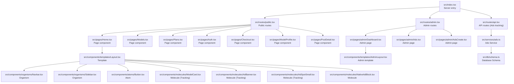
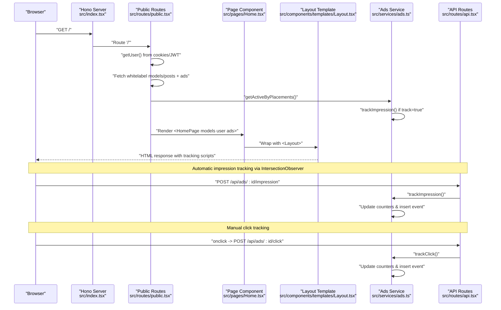
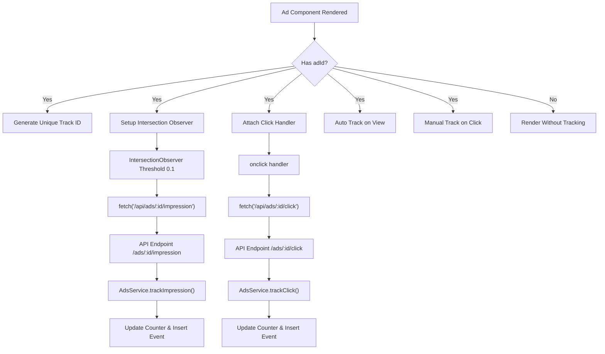
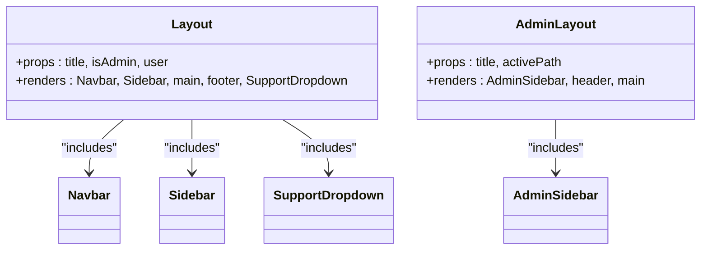
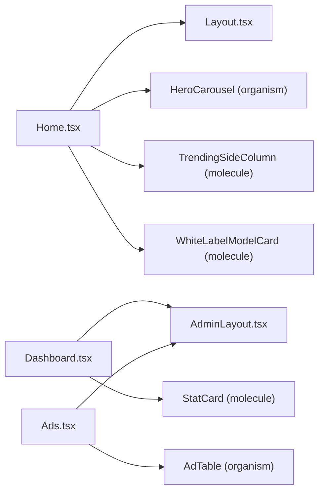
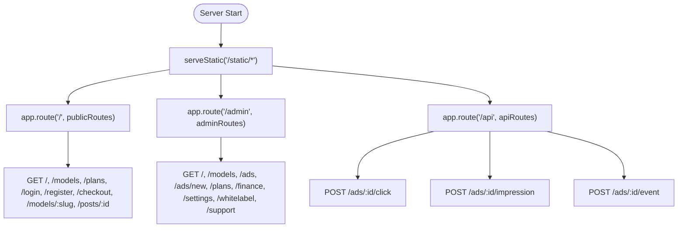
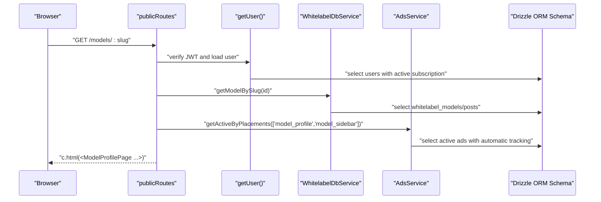
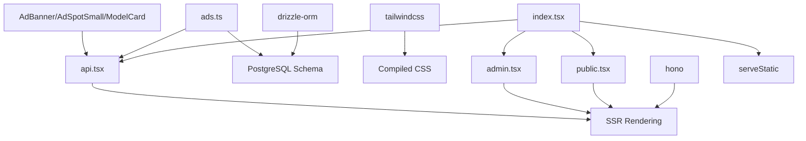

# Frontend Architecture

<cite>
**Referenced Files in This Document**
- [index.tsx](file://src/index.tsx)
- [public.tsx](file://src/routes/public.tsx)
- [admin.tsx](file://src/routes/admin.tsx)
- [api.tsx](file://src/routes/api.tsx)
- [Layout.tsx](file://src/components/templates/Layout.tsx)
- [AdminLayout.tsx](file://src/components/templates/AdminLayout.tsx)
- [Home.tsx](file://src/pages/Home.tsx)
- [Dashboard.tsx](file://src/pages/admin/Dashboard.tsx)
- [Ads.tsx](file://src/pages/admin/Ads.tsx)
- [AdsCreate.tsx](file://src/pages/admin/AdsCreate.tsx)
- [Button.tsx](file://src/components/atoms/Button.tsx)
- [ModelCard.tsx](file://src/components/molecules/ModelCard.tsx)
- [AdBanner.tsx](file://src/components/molecules/AdBanner.tsx)
- [AdSpotSmall.tsx](file://src/components/molecules/AdSpotSmall.tsx)
- [NativeAdBlock.tsx](file://src/components/molecules/NativeAdBlock.tsx)
- [AdTable.tsx](file://src/components/organisms/AdTable.tsx)
- [Navbar.tsx](file://src/components/organisms/Navbar.tsx)
- [whitelabel.ts](file://src/services/whitelabel.ts)
- [ads.ts](file://src/services/ads.ts)
- [schema.ts](file://src/db/schema.ts)
- [package.json](file://package.json)
- [0011_ads_tracking.sql](file://drizzle/0011_ads_tracking.sql)
</cite>

## Update Summary
**Changes Made**
- Added comprehensive advertising tracking system documentation with IntersectionObserver implementation
- Integrated automatic tracking mechanisms for impressions and clicks with detailed analytics collection
- Documented component integration patterns with automatic tracking flow
- Enhanced database schema documentation with tracking tables (impressions, clicks)
- Updated API routes documentation for advertising analytics endpoints
- Added detailed component analysis for tracking-enabled advertising components

## Table of Contents
1. [Introduction](#introduction)
2. [Project Structure](#project-structure)
3. [Core Components](#core-components)
4. [Architecture Overview](#architecture-overview)
5. [Advertising Tracking System](#advertising-tracking-system)
6. [Detailed Component Analysis](#detailed-component-analysis)
7. [Dependency Analysis](#dependency-analysis)
8. [Performance Considerations](#performance-considerations)
9. [Troubleshooting Guide](#troubleshooting-guide)
10. [Conclusion](#conclusion)
11. [Appendices](#appendices)

## Introduction
This document describes the CreatorFlix frontend architecture built with Hono JSX. It covers the Hono server-side rendering (SSR) pipeline, the Atomic Design–inspired component system (atoms, molecules, organisms), page-level components, layout templates, routing integration, static asset serving, responsive design with Tailwind CSS, component composition patterns, state management strategies, performance optimizations, code splitting opportunities, and accessibility considerations.

**Updated** Added comprehensive advertising tracking system integration throughout the frontend architecture, including automatic tracking mechanisms using IntersectionObserver, detailed analytics collection infrastructure, and seamless component integration patterns.

## Project Structure
The frontend is organized around a server-first Hono application that renders JSX pages and serves static assets. The structure emphasizes:
- Server entry and routing mounted under a single Hono app
- Page components that compose templates and domain-specific organisms/molecules/atoms
- Atomic Design–inspired component folders (atoms, molecules, organisms, templates)
- Static asset pipeline driven by Tailwind CSS
- Advertising tracking system with automatic impression and click tracking using IntersectionObserver



**Diagram sources**
- [index.tsx](file://src/index.tsx#L1-L21)
- [public.tsx](file://src/routes/public.tsx#L1-L253)
- [admin.tsx](file://src/routes/admin.tsx#L1-L158)
- [api.tsx](file://src/routes/api.tsx#L890-L973)
- [Home.tsx](file://src/pages/Home.tsx#L1-L253)
- [Ads.tsx](file://src/pages/admin/Ads.tsx#L1-L131)
- [AdsCreate.tsx](file://src/pages/admin/AdsCreate.tsx#L1-L569)
- [Layout.tsx](file://src/components/templates/Layout.tsx#L1-L56)
- [AdminLayout.tsx](file://src/components/templates/AdminLayout.tsx#L1-L64)
- [Navbar.tsx](file://src/components/organisms/Navbar.tsx#L1-L117)
- [Button.tsx](file://src/components/atoms/Button.tsx#L1-L42)
- [ModelCard.tsx](file://src/components/molecules/ModelCard.tsx#L1-L94)
- [AdBanner.tsx](file://src/components/molecules/AdBanner.tsx#L1-L54)
- [AdSpotSmall.tsx](file://src/components/molecules/AdSpotSmall.tsx#L1-L55)
- [NativeAdBlock.tsx](file://src/components/molecules/NativeAdBlock.tsx#L1-L30)
- [ads.ts](file://src/services/ads.ts#L1-L380)
- [schema.ts](file://src/db/schema.ts#L194-L253)

**Section sources**
- [index.tsx](file://src/index.tsx#L1-L21)
- [public.tsx](file://src/routes/public.tsx#L1-L253)
- [admin.tsx](file://src/routes/admin.tsx#L1-L158)
- [api.tsx](file://src/routes/api.tsx#L890-L973)

## Core Components
- Hono SSR server: mounts static middleware and routes; exports a Bun-compatible server config
- Templates: Layout.tsx and AdminLayout.tsx wrap page content with shared HTML, fonts, styles, and global UI scaffolding
- Page components: Home, Models, Plans, Auth, Checkout, ModelProfile, PostDetail, and admin pages render domain-specific content
- Atomic Design components:
  - Atoms: Button, Input, Spinner, IconButton, Badge, SupportDropdown
  - Molecules: ModelCard, BioSection, FilterBar, MediaCarousel, OrderBump, Pagination, PlanCard, ProfileHeaderActions, ProfileStats, RadioCard, StatCard, TabSelector, TrendingSideColumn, WhiteLabelModelCard, AdBanner, AdSpotSmall, NativeAdBlock
  - Organisms: Navbar, Sidebar, HeroCarousel, ModelTable, PostCard, PostFeed, ProfileHero, ProfileSummary, StepIdentification, StepPayment, StepSuccess, WhitelabelStatus, WhitelabelTable, AdminSidebar, AgeVerificationModal, CheckoutHeader, OrderSummary, AdTable
- Services and data: WhitelabelDbService orchestrates whitelabel model/post queries and sync operations; AdsService manages advertising campaigns, tracking, and analytics; database schema defines entities and relations including tracking tables for impressions and clicks
- Advertising tracking system: Automatic impression and click tracking with detailed analytics collection using IntersectionObserver

**Section sources**
- [Layout.tsx](file://src/components/templates/Layout.tsx#L1-L56)
- [AdminLayout.tsx](file://src/components/templates/AdminLayout.tsx#L1-L64)
- [Home.tsx](file://src/pages/Home.tsx#L1-L253)
- [Dashboard.tsx](file://src/pages/admin/Dashboard.tsx#L1-L85)
- [Button.tsx](file://src/components/atoms/Button.tsx#L1-L42)
- [ModelCard.tsx](file://src/components/molecules/ModelCard.tsx#L1-L94)
- [AdBanner.tsx](file://src/components/molecules/AdBanner.tsx#L1-L54)
- [AdSpotSmall.tsx](file://src/components/molecules/AdSpotSmall.tsx#L1-L55)
- [NativeAdBlock.tsx](file://src/components/molecules/NativeAdBlock.tsx#L1-L30)
- [AdTable.tsx](file://src/components/organisms/AdTable.tsx#L1-L119)
- [Navbar.tsx](file://src/components/organisms/Navbar.tsx#L1-L117)
- [whitelabel.ts](file://src/services/whitelabel.ts#L1-L24)
- [ads.ts](file://src/services/ads.ts#L1-L380)
- [schema.ts](file://src/db/schema.ts#L194-L253)

## Architecture Overview
The SSR flow begins at the server entry, which serves static assets and routes requests to page components rendered with Hono JSX. Public and admin routes encapsulate user session retrieval, data fetching, and page rendering. Templates provide consistent layouts and global UI scaffolding. The advertising tracking system integrates seamlessly through automatic impression tracking using IntersectionObserver and manual click tracking endpoints.



**Diagram sources**
- [index.tsx](file://src/index.tsx#L1-L21)
- [public.tsx](file://src/routes/public.tsx#L55-L124)
- [Home.tsx](file://src/pages/Home.tsx#L37-L120)
- [Layout.tsx](file://src/components/templates/Layout.tsx#L17-L55)
- [ads.ts](file://src/services/ads.ts#L307-L331)
- [api.tsx](file://src/routes/api.tsx#L900-L940)

## Advertising Tracking System

### Tracking Infrastructure
The advertising tracking system provides comprehensive analytics collection with automatic and manual tracking mechanisms:

- **Automatic Tracking**: AdsService.getActiveByPlacements() supports automatic impression tracking when track=true parameter is used
- **Manual Tracking**: Dedicated API endpoints for explicit click and impression tracking
- **Generic Event Tracking**: Unified endpoint supporting multiple event types
- **Detailed Analytics**: Separate tables for impressions and clicks with user agent and IP tracking
- **IntersectionObserver Integration**: Efficient client-side tracking using modern browser APIs

### Tracking Components
- **AdBanner Component**: Implements automatic intersection observer for impression tracking and click tracking with unique element IDs
- **AdSpotSmall Component**: Similar tracking capabilities for smaller ad formats with automatic IntersectionObserver setup
- **ModelCard Component**: Comprehensive tracking for promoted models with both impression and click handling
- **API Endpoints**: RESTful endpoints for click, impression, and generic event tracking
- **Database Tables**: Separate tracking tables with foreign key relationships to ads

### Tracking Flow


**Diagram sources**
- [AdBanner.tsx](file://src/components/molecules/AdBanner.tsx#L14-L53)
- [AdSpotSmall.tsx](file://src/components/molecules/AdSpotSmall.tsx#L12-L54)
- [ModelCard.tsx](file://src/components/molecules/ModelCard.tsx#L28-L90)
- [api.tsx](file://src/routes/api.tsx#L900-L940)
- [ads.ts](file://src/services/ads.ts#L246-L301)

**Section sources**
- [AdBanner.tsx](file://src/components/molecules/AdBanner.tsx#L1-L54)
- [AdSpotSmall.tsx](file://src/components/molecules/AdSpotSmall.tsx#L1-L55)
- [ModelCard.tsx](file://src/components/molecules/ModelCard.tsx#L1-L94)
- [api.tsx](file://src/routes/api.tsx#L900-L973)
- [ads.ts](file://src/services/ads.ts#L246-L301)
- [schema.ts](file://src/db/schema.ts#L237-L253)
- [0011_ads_tracking.sql](file://drizzle/0011_ads_tracking.sql#L1-L21)

## Detailed Component Analysis

### Template System: Layout.tsx and AdminLayout.tsx
- Layout.tsx
  - Provides shared head metadata, fonts, global styles, and scripts
  - Renders Navbar, Sidebar, main content area, footer, and SupportDropdown
  - Accepts user context and admin flag to conditionally render UI
- AdminLayout.tsx
  - Admin-focused scaffold with AdminSidebar, header, and content area
  - Includes subtle background gradients and status indicators
  - Accepts activePath for navigation highlighting



**Diagram sources**
- [Layout.tsx](file://src/components/templates/Layout.tsx#L1-L56)
- [AdminLayout.tsx](file://src/components/templates/AdminLayout.tsx#L1-L64)
- [Navbar.tsx](file://src/components/organisms/Navbar.tsx#L1-L117)

**Section sources**
- [Layout.tsx](file://src/components/templates/Layout.tsx#L1-L56)
- [AdminLayout.tsx](file://src/components/templates/AdminLayout.tsx#L1-L64)

### Page-Level Component Organization
- Home page composes:
  - Layout wrapper
  - HeroCarousel (organism)
  - TrendingSideColumn (molecule)
  - AdBanner and NativeAdBlock (molecules) with automatic tracking
  - WhiteLabelModelCard (molecule) for model feeds
- Admin dashboard composes:
  - AdminLayout wrapper
  - StatCard (molecule) for metrics
  - Charts and recent activity UI built with Tailwind utilities
  - AdTable (organism) for advertising campaign management



**Diagram sources**
- [Home.tsx](file://src/pages/Home.tsx#L37-L252)
- [Dashboard.tsx](file://src/pages/admin/Dashboard.tsx#L5-L84)
- [Ads.tsx](file://src/pages/admin/Ads.tsx#L29-L130)
- [Layout.tsx](file://src/components/templates/Layout.tsx#L17-L55)
- [AdminLayout.tsx](file://src/components/templates/AdminLayout.tsx#L9-L63)
- [AdTable.tsx](file://src/components/organisms/AdTable.tsx#L17-L118)

**Section sources**
- [Home.tsx](file://src/pages/Home.tsx#L1-L253)
- [Dashboard.tsx](file://src/pages/admin/Dashboard.tsx#L1-L85)
- [Ads.tsx](file://src/pages/admin/Ads.tsx#L1-L131)
- [AdTable.tsx](file://src/components/organisms/AdTable.tsx#L1-L119)

### Routing Integration
- Public routes:
  - Home, Models, Plans, Auth, ModelProfile, PostDetail, Checkout
  - JWT-based user retrieval and subscription-aware UI
  - Parallel data fetching for models and advertising campaigns
- Admin routes:
  - Dashboard, Models, Ads, Plans, Settings, Whitelabel, Support, Finance
  - Initializes defaults for plans, gateways, and support contacts
  - Comprehensive advertising campaign management
- API routes:
  - Dedicated endpoints for advertising tracking
  - Click, impression, and generic event tracking
  - Campaign management endpoints



**Diagram sources**
- [index.tsx](file://src/index.tsx#L9-L14)
- [public.tsx](file://src/routes/public.tsx#L55-L200)
- [admin.tsx](file://src/routes/admin.tsx#L18-L157)
- [api.tsx](file://src/routes/api.tsx#L890-L973)

**Section sources**
- [public.tsx](file://src/routes/public.tsx#L1-L253)
- [admin.tsx](file://src/routes/admin.tsx#L1-L158)
- [api.tsx](file://src/routes/api.tsx#L890-L973)
- [index.tsx](file://src/index.tsx#L1-L21)

### SSR Implementation and Data Fetching
- SSR rendering:
  - Pages render JSX via Hono's c.html
  - Data is fetched server-side and passed as props to page components
- Authentication:
  - getUser() extracts JWT from cookie, verifies signature, loads user and active subscription
- Whitelabel data:
  - WhitelabelDbService centralizes model/post queries and stats aggregation
- Advertising data:
  - AdsService.getActiveByPlacements() fetches active advertisements for specific placements
  - Supports automatic tracking during data retrieval
- Database schema:
  - Defines entities and relations for users, plans, subscriptions, models, posts, whitelabel models/posts/media, support contacts, checkouts, and advertising tracking



**Diagram sources**
- [public.tsx](file://src/routes/public.tsx#L126-L141)
- [whitelabel.ts](file://src/services/whitelabel.ts#L5-L24)
- [ads.ts](file://src/services/ads.ts#L307-L331)
- [schema.ts](file://src/db/schema.ts#L48-L127)

**Section sources**
- [public.tsx](file://src/routes/public.tsx#L55-L141)
- [whitelabel.ts](file://src/services/whitelabel.ts#L1-L24)
- [ads.ts](file://src/services/ads.ts#L307-L331)
- [schema.ts](file://src/db/schema.ts#L194-L253)

### Atomic Design Component Hierarchy
- Atoms: reusable primitives (Button, Input, Spinner, IconButton, Badge, SupportDropdown)
- Molecules: small compositions (ModelCard, BioSection, FilterBar, MediaCarousel, OrderBump, Pagination, PlanCard, ProfileHeaderActions, ProfileStats, RadioCard, StatCard, TabSelector, TrendingSideColumn, WhiteLabelModelCard, AdBanner, AdSpotSmall, NativeAdBlock)
- Organisms: larger, feature-complete UI blocks (Navbar, Sidebar, HeroCarousel, ModelTable, PostCard, PostFeed, ProfileHero, ProfileSummary, StepIdentification, StepPayment, StepSuccess, WhitelabelStatus, WhitelabelTable, AdminSidebar, AgeVerificationModal, CheckoutHeader, OrderSummary, AdTable)

**Updated** Advertising components now include comprehensive tracking capabilities with automatic impression and click tracking using IntersectionObserver, providing efficient client-side analytics collection.

```mermaid
classDiagram
class Atom_Button["Button (atom)"]
class Molecule_ModelCard["ModelCard (molecule)<br/>+Automatic Tracking"]
class Molecule_WhiteLabelModelCard["WhiteLabelModelCard (molecule)"]
class Molecule_AdBanner["AdBanner (molecule)<br/>+Automatic Tracking"]
class Molecule_AdSpotSmall["AdSpotSmall (molecule)<br/>+Automatic Tracking"]
class Molecule_NativeAdBlock["NativeAdBlock (molecule)"]
class Organism_Navbar["Navbar (organism)"]
class Organism_Sidebar["Sidebar (organism)"]
class Organism_AdTable["AdTable (organism)<br/>+Analytics Dashboard"]
Atom_Button <.. Molecule_ModelCard : "used by"
Atom_Button <.. Molecule_WhiteLabelModelCard : "used by"
Atom_Button <.. Molecule_AdBanner : "used by"
Atom_Button <.. Molecule_AdSpotSmall : "used by"
Organism_Navbar <.. Page_Home["used by"]
Organism_Sidebar <.. Page_Home["used by"]
Organism_AdTable <.. Page_Admin_Ads["used by"]
```

**Diagram sources**
- [Button.tsx](file://src/components/atoms/Button.tsx#L1-L42)
- [ModelCard.tsx](file://src/components/molecules/ModelCard.tsx#L1-L94)
- [AdBanner.tsx](file://src/components/molecules/AdBanner.tsx#L1-L54)
- [AdSpotSmall.tsx](file://src/components/molecules/AdSpotSmall.tsx#L1-L55)
- [NativeAdBlock.tsx](file://src/components/molecules/NativeAdBlock.tsx#L1-L30)
- [AdTable.tsx](file://src/components/organisms/AdTable.tsx#L1-L119)
- [Navbar.tsx](file://src/components/organisms/Navbar.tsx#L1-L117)

**Section sources**
- [Button.tsx](file://src/components/atoms/Button.tsx#L1-L42)
- [ModelCard.tsx](file://src/components/molecules/ModelCard.tsx#L1-L94)
- [AdBanner.tsx](file://src/components/molecules/AdBanner.tsx#L1-L54)
- [AdSpotSmall.tsx](file://src/components/molecules/AdSpotSmall.tsx#L1-L55)
- [NativeAdBlock.tsx](file://src/components/molecules/NativeAdBlock.tsx#L1-L30)
- [AdTable.tsx](file://src/components/organisms/AdTable.tsx#L1-L119)
- [Navbar.tsx](file://src/components/organisms/Navbar.tsx#L1-L117)

### Component Composition Patterns and Prop Drilling Prevention
- Composition pattern:
  - Pages wrap content with templates (Layout/AdminLayout)
  - Templates orchestrate shared organisms (Navbar, Sidebar) and pass user context
  - Advertising components receive adId and placement props for tracking
- Prop drilling prevention:
  - User context is resolved once per request in route handlers and passed down as props
  - Organisms receive only the props they need (e.g., Navbar receives user and admin flags)
  - No centralized state library is present; state remains local to components and page props
- Tracking integration:
  - Ad components automatically handle their own tracking without parent component intervention
  - Placement information flows naturally through the component hierarchy
  - IntersectionObserver provides efficient client-side tracking with minimal DOM manipulation

**Section sources**
- [public.tsx](file://src/routes/public.tsx#L55-L124)
- [Layout.tsx](file://src/components/templates/Layout.tsx#L17-L55)
- [AdminLayout.tsx](file://src/components/templates/AdminLayout.tsx#L9-L63)
- [AdBanner.tsx](file://src/components/molecules/AdBanner.tsx#L14-L53)
- [AdSpotSmall.tsx](file://src/components/molecules/AdSpotSmall.tsx#L12-L54)
- [ModelCard.tsx](file://src/components/molecules/ModelCard.tsx#L28-L90)
- [Navbar.tsx](file://src/components/organisms/Navbar.tsx#L14-L117)

### State Management Strategies
- Current approach:
  - Server-side hydration via Hono JSX
  - Minimal client-side interactivity (HTMX included in templates)
  - No client-side state management framework detected
  - Advertising tracking uses lightweight client-side scripts for automatic tracking
- Recommendations:
  - Introduce lightweight state containers or context providers for cross-page state (e.g., cart, filters)
  - Use component-local state for UI toggles (e.g., modals, menus)
  - Keep server-rendered props minimal and typed to avoid unnecessary serialization
  - Consider centralized analytics state for tracking events across the application

### Responsive Design with Tailwind CSS
- Tailwind v4 configured via CLI build/watch scripts
- Utility-first classes applied in templates and components for responsive grids, spacing, typography, and dark theme
- Scripts include fonts and a custom scrollbar style within the template head
- Advertising components utilize responsive design patterns for different screen sizes

**Section sources**
- [package.json](file://package.json#L3-L7)
- [Layout.tsx](file://src/components/templates/Layout.tsx#L24-L32)
- [AdminLayout.tsx](file://src/components/templates/AdminLayout.tsx#L16-L18)
- [AdBanner.tsx](file://src/components/molecules/AdBanner.tsx#L18-L34)
- [AdSpotSmall.tsx](file://src/components/molecules/AdSpotSmall.tsx#L23-L35)
- [ModelCard.tsx](file://src/components/molecules/ModelCard.tsx#L32-L74)

### Accessibility Considerations
- Semantic markup and proper heading hierarchy in templates and pages
- Focus management and keyboard navigation in interactive elements (e.g., dropdowns)
- Sufficient color contrast and readable typography using Tailwind utilities
- ARIA-friendly attributes where applicable (e.g., role, aria-* attributes) in interactive components
- **Updated** Advertising components maintain accessibility standards while implementing tracking scripts with proper semantic markup

## Dependency Analysis
The frontend depends on Hono for SSR, Drizzle ORM for database access, Tailwind CSS for styling, and includes comprehensive advertising tracking dependencies.



**Diagram sources**
- [index.tsx](file://src/index.tsx#L1-L21)
- [public.tsx](file://src/routes/public.tsx#L1-L253)
- [admin.tsx](file://src/routes/admin.tsx#L1-L158)
- [api.tsx](file://src/routes/api.tsx#L890-L973)
- [ads.ts](file://src/services/ads.ts#L1-L380)
- [AdBanner.tsx](file://src/components/molecules/AdBanner.tsx#L1-L54)
- [AdSpotSmall.tsx](file://src/components/molecules/AdSpotSmall.tsx#L1-L55)
- [ModelCard.tsx](file://src/components/molecules/ModelCard.tsx#L1-L94)
- [package.json](file://package.json#L8-L16)

**Section sources**
- [index.tsx](file://src/index.tsx#L1-L21)
- [public.tsx](file://src/routes/public.tsx#L1-L253)
- [admin.tsx](file://src/routes/admin.tsx#L1-L158)
- [api.tsx](file://src/routes/api.tsx#L890-L973)
- [ads.ts](file://src/services/ads.ts#L1-L380)
- [package.json](file://package.json#L1-L23)

## Performance Considerations
- Server-side rendering reduces initial load time and improves SEO
- Static asset serving via serveStatic minimizes server overhead
- Tailwind CSS build/watch scripts enable efficient CSS generation
- Component-level lazy loading and code splitting opportunities:
  - Split large page components into smaller molecules/organisms
  - Defer heavy computations to background tasks (e.g., whitelabel sync)
  - Use dynamic imports for optional features or admin-only sections
  - **Updated** Advertising tracking uses IntersectionObserver for efficient automatic tracking with minimal performance impact
- Data fetching:
  - Batch queries where possible (e.g., stats aggregation)
  - Cache frequently accessed whitelabel data at the edge or in-memory
  - **Updated** Parallel data fetching for models and advertising campaigns
- **Updated** Advertising tracking performance:
  - Efficient client-side tracking with minimal DOM manipulation using IntersectionObserver
  - IntersectionObserver threshold optimized for 0.1 visibility ratio to balance accuracy and performance
  - Automatic tracking only when adId is present to avoid unnecessary processing
  - Unique element IDs prevent tracking conflicts and improve reliability

## Troubleshooting Guide
- Authentication issues:
  - Verify JWT secret and cookie presence; ensure getUser() resolves user and active subscription
- Route errors:
  - Confirm route mounting and parameter extraction (e.g., slug, id)
- Static assets:
  - Ensure Tailwind build completes and styles.css is generated
- Admin defaults:
  - Confirm initialization of plans, gateways, and support contacts
- **Updated** Advertising tracking issues:
  - Verify adId prop is passed to tracking-enabled components
  - Check browser console for IntersectionObserver errors
  - Ensure API endpoints are accessible at /api/ads/:id/(click|impression|event)
  - Validate database connectivity for tracking table writes
  - Monitor for unique element ID conflicts in tracking scripts
  - Verify placement parameter is correctly passed to tracking endpoints

**Section sources**
- [public.tsx](file://src/routes/public.tsx#L24-L53)
- [admin.tsx](file://src/routes/admin.tsx#L22-L47)
- [index.tsx](file://src/index.tsx#L9-L14)
- [AdBanner.tsx](file://src/components/molecules/AdBanner.tsx#L36-L50)
- [AdSpotSmall.tsx](file://src/components/molecules/AdSpotSmall.tsx#L37-L51)
- [ModelCard.tsx](file://src/components/molecules/ModelCard.tsx#L75-L90)
- [api.tsx](file://src/routes/api.tsx#L900-L973)
- [package.json](file://package.json#L5-L6)

## Conclusion
CreatorFlix employs a clean, server-first architecture using Hono JSX for SSR, a well-defined Atomic Design component system, and robust routing. Templates provide consistent scaffolding, while page components compose organisms and molecules to deliver feature-rich experiences. With Tailwind CSS for responsive design and minimal client-side interactivity, the system balances simplicity, performance, and maintainability.

**Updated** The architecture now includes a comprehensive advertising tracking system with automatic impression and click tracking, detailed analytics collection, and seamless integration throughout the component hierarchy. The system leverages IntersectionObserver for efficient client-side tracking while maintaining server-side control through dedicated API endpoints. The tracking infrastructure provides robust analytics capabilities with minimal performance impact, supporting both automatic and manual tracking scenarios.

Future enhancements can introduce client-side state management and code splitting for improved scalability, while the existing advertising tracking infrastructure provides a solid foundation for monetization and analytics.

## Appendices
- Build and watch scripts for Tailwind CSS are defined in package.json
- Database schema outlines entities and relations for core business domains
- **Updated** Advertising tracking tables (ads, impressions, clicks) provide comprehensive analytics infrastructure with foreign key relationships and detailed metadata collection

**Section sources**
- [package.json](file://package.json#L3-L7)
- [schema.ts](file://src/db/schema.ts#L194-L253)
- [ads.ts](file://src/services/ads.ts#L1-L380)
- [api.tsx](file://src/routes/api.tsx#L900-L973)
- [0011_ads_tracking.sql](file://drizzle/0011_ads_tracking.sql#L1-L21)