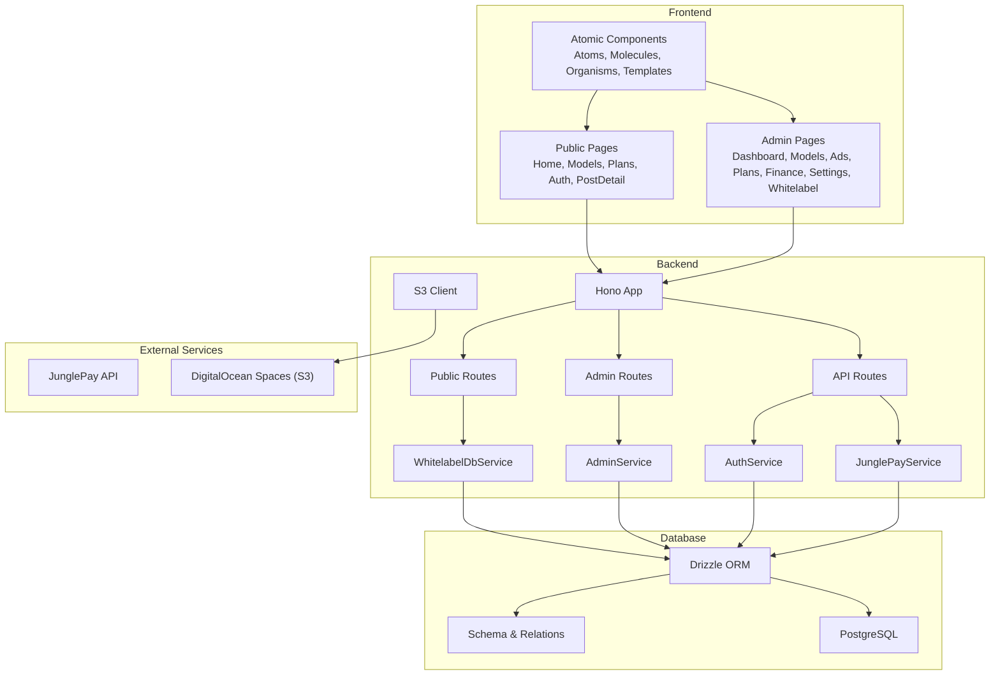
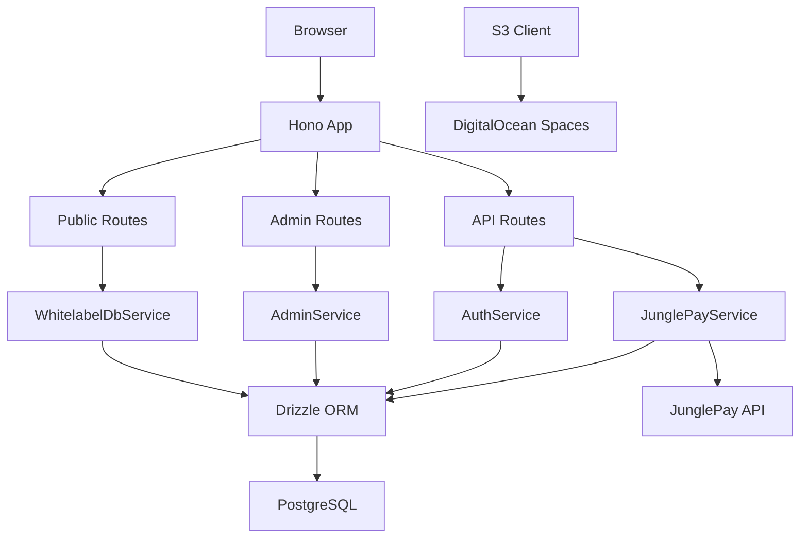
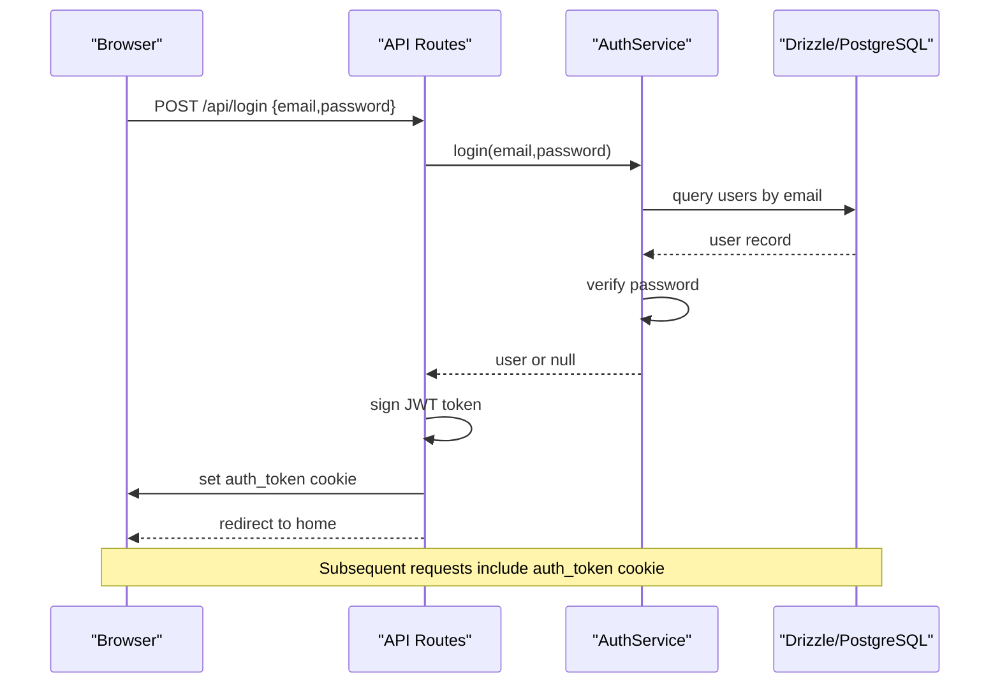
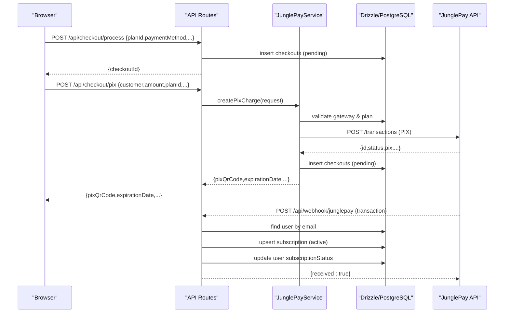
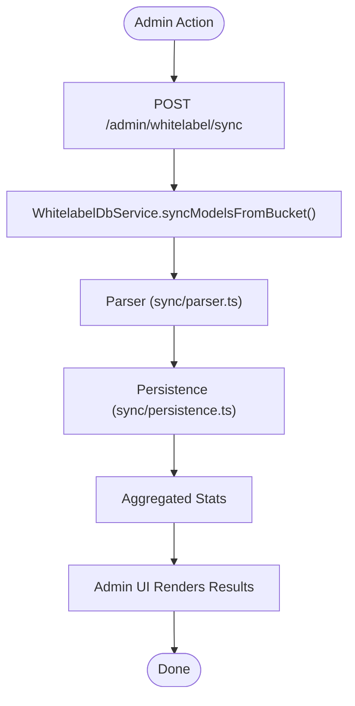
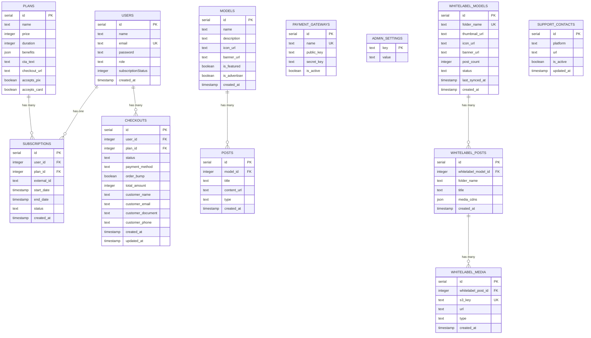
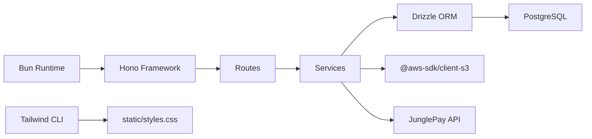

# System Architecture

<cite>
**Referenced Files in This Document**
- [README.md](file://README.md)
- [package.json](file://package.json)
- [drizzle.config.ts](file://drizzle.config.ts)
- [src/db/index.ts](file://src/db/index.ts)
- [src/db/schema.ts](file://src/db/schema.ts)
- [src/index.tsx](file://src/index.tsx)
- [src/routes/public.tsx](file://src/routes/public.tsx)
- [src/routes/admin.tsx](file://src/routes/admin.tsx)
- [src/routes/api.tsx](file://src/routes/api.tsx)
- [src/services/auth.ts](file://src/services/auth.ts)
- [src/services/junglepay.ts](file://src/services/junglepay.ts)
- [src/services/s3.ts](file://src/services/s3.ts)
- [src/services/whitelabel.ts](file://src/services/whitelabel.ts)
- [src/services/admin.ts](file://src/services/admin.ts)
- [junglepay-documentation.md](file://junglepay-documentation.md)
</cite>

## Table of Contents
1. [Introduction](#introduction)
2. [Project Structure](#project-structure)
3. [Core Components](#core-components)
4. [Architecture Overview](#architecture-overview)
5. [Detailed Component Analysis](#detailed-component-analysis)
6. [Dependency Analysis](#dependency-analysis)
7. [Performance Considerations](#performance-considerations)
8. [Troubleshooting Guide](#troubleshooting-guide)
9. [Conclusion](#conclusion)
10. [Appendices](#appendices)

## Introduction
CreatorFlix is a premium content streaming platform inspired by Netflix and OnlyFans. It follows a modern, component-driven architecture with a frontend built using Atomic Design principles and a backend powered by Hono and Bun. The system integrates a PostgreSQL database with Drizzle ORM, supports subscription-based monetization, and connects to external services for payments (JunglePay) and media storage (DigitalOcean Spaces S3-compatible). Cross-cutting concerns include authentication via JWT cookies, authorization checks, payment webhooks, and content management for white-labeled models and posts.

## Project Structure
The repository is organized into clear layers:
- Frontend (Atomic Design components and pages)
- Backend (Hono routes and services)
- Database (Drizzle ORM schema and migrations)
- Infrastructure (S3 client and configuration)
- External integrations (JunglePay payment provider)

**Diagram sources**
- [src/index.tsx](file://src/index.tsx#L1-L21)
- [src/routes/public.tsx](file://src/routes/public.tsx#L1-L170)
- [src/routes/admin.tsx](file://src/routes/admin.tsx#L1-L158)
- [src/routes/api.tsx](file://src/routes/api.tsx#L1-L519)
- [src/services/auth.ts](file://src/services/auth.ts#L1-L91)
- [src/services/junglepay.ts](file://src/services/junglepay.ts#L1-L270)
- [src/services/whitelabel.ts](file://src/services/whitelabel.ts#L1-L24)
- [src/services/admin.ts](file://src/services/admin.ts#L1-L5)
- [src/services/s3.ts](file://src/services/s3.ts#L1-L48)
- [src/db/index.ts](file://src/db/index.ts#L1-L8)
- [src/db/schema.ts](file://src/db/schema.ts#L1-L178)

**Section sources**
- [README.md](file://README.md#L1-L49)
- [package.json](file://package.json#L1-L23)
- [src/index.tsx](file://src/index.tsx#L1-L21)

## Core Components
- Hono server and route mounting
- Public routes for home, models, plans, authentication, and checkout
- Admin routes for dashboard, models, ads, finance, settings, and whitelabel management
- API routes for authentication, checkout processing, payment webhooks, and admin operations
- Services for authentication, payment processing (JunglePay), whitelabel content synchronization, admin operations, and S3 signed URL generation
- Database layer with Drizzle ORM and PostgreSQL schema

Key implementation references:
- Server bootstrap and route mounting: [src/index.tsx](file://src/index.tsx#L1-L21)
- Public routes and JWT cookie verification: [src/routes/public.tsx](file://src/routes/public.tsx#L1-L170)
- Admin routes and whitelabel sync: [src/routes/admin.tsx](file://src/routes/admin.tsx#L1-L158)
- API routes for auth, checkout, and webhooks: [src/routes/api.tsx](file://src/routes/api.tsx#L1-L519)
- Authentication service: [src/services/auth.ts](file://src/services/auth.ts#L1-L91)
- JunglePay service and webhook handlers: [src/services/junglepay.ts](file://src/services/junglepay.ts#L1-L270), [src/routes/api.tsx](file://src/routes/api.tsx#L88-L170), [src/routes/api.tsx](file://src/routes/api.tsx#L401-L506)
- Whitelabel service facade: [src/services/whitelabel.ts](file://src/services/whitelabel.ts#L1-L24)
- Admin service facade: [src/services/admin.ts](file://src/services/admin.ts#L1-L5)
- S3 client and signed URL generation: [src/services/s3.ts](file://src/services/s3.ts#L1-L48)
- Database connection and schema: [src/db/index.ts](file://src/db/index.ts#L1-L8), [src/db/schema.ts](file://src/db/schema.ts#L1-L178)

**Section sources**
- [src/index.tsx](file://src/index.tsx#L1-L21)
- [src/routes/public.tsx](file://src/routes/public.tsx#L1-L170)
- [src/routes/admin.tsx](file://src/routes/admin.tsx#L1-L158)
- [src/routes/api.tsx](file://src/routes/api.tsx#L1-L519)
- [src/services/auth.ts](file://src/services/auth.ts#L1-L91)
- [src/services/junglepay.ts](file://src/services/junglepay.ts#L1-L270)
- [src/services/whitelabel.ts](file://src/services/whitelabel.ts#L1-L24)
- [src/services/admin.ts](file://src/services/admin.ts#L1-L5)
- [src/services/s3.ts](file://src/services/s3.ts#L1-L48)
- [src/db/index.ts](file://src/db/index.ts#L1-L8)
- [src/db/schema.ts](file://src/db/schema.ts#L1-L178)

## Architecture Overview
CreatorFlix employs a layered architecture:
- Presentation Layer: Atomic Design components and pages rendered server-side via Hono
- Application Layer: Route handlers orchestrating requests, invoking services, and rendering responses
- Domain Services: Business logic for auth, payment, whitelabel sync, and admin operations
- Data Access Layer: Drizzle ORM connecting to PostgreSQL
- External Integrations: JunglePay for payments and DigitalOcean Spaces for media

**Diagram sources**
- [src/index.tsx](file://src/index.tsx#L1-L21)
- [src/routes/public.tsx](file://src/routes/public.tsx#L1-L170)
- [src/routes/admin.tsx](file://src/routes/admin.tsx#L1-L158)
- [src/routes/api.tsx](file://src/routes/api.tsx#L1-L519)
- [src/services/auth.ts](file://src/services/auth.ts#L1-L91)
- [src/services/junglepay.ts](file://src/services/junglepay.ts#L1-L270)
- [src/services/whitelabel.ts](file://src/services/whitelabel.ts#L1-L24)
- [src/services/admin.ts](file://src/services/admin.ts#L1-L5)
- [src/services/s3.ts](file://src/services/s3.ts#L1-L48)
- [src/db/index.ts](file://src/db/index.ts#L1-L8)
- [src/db/schema.ts](file://src/db/schema.ts#L1-L178)

## Detailed Component Analysis

### Authentication and Authorization
- JWT-based session management using cookies for authenticated routes
- Login and registration endpoints with password hashing
- Subscription status verification and enforcement
- Role-based access control (admin/user) with route-level checks

**Diagram sources**
- [src/routes/api.tsx](file://src/routes/api.tsx#L315-L379)
- [src/services/auth.ts](file://src/services/auth.ts#L28-L39)
- [src/routes/public.tsx](file://src/routes/public.tsx#L20-L51)

**Section sources**
- [src/routes/api.tsx](file://src/routes/api.tsx#L315-L379)
- [src/services/auth.ts](file://src/services/auth.ts#L1-L91)
- [src/routes/public.tsx](file://src/routes/public.tsx#L18-L51)

### Payment Processing and Webhooks
- Internal checkout creation and pending state management
- JunglePay PIX charge creation with validation and webhook postback handling
- Dias Marketplace webhook for payment success and subscription lifecycle
- Automatic subscription activation and user status updates

**Diagram sources**
- [src/routes/api.tsx](file://src/routes/api.tsx#L15-L86)
- [src/routes/api.tsx](file://src/routes/api.tsx#L88-L170)
- [src/routes/api.tsx](file://src/routes/api.tsx#L401-L506)
- [src/services/junglepay.ts](file://src/services/junglepay.ts#L107-L268)
- [src/db/schema.ts](file://src/db/schema.ts#L113-L127)

**Section sources**
- [src/routes/api.tsx](file://src/routes/api.tsx#L15-L86)
- [src/routes/api.tsx](file://src/routes/api.tsx#L88-L170)
- [src/routes/api.tsx](file://src/routes/api.tsx#L401-L506)
- [src/services/junglepay.ts](file://src/services/junglepay.ts#L1-L270)
- [junglepay-documentation.md](file://junglepay-documentation.md#L1-L3198)

### Whitelabel Content Management
- Synchronization of models and posts from DigitalOcean Spaces
- Thumbnail and signed URL generation for media delivery
- Paginated listing and statistics aggregation

**Diagram sources**
- [src/routes/admin.tsx](file://src/routes/admin.tsx#L147-L155)
- [src/services/whitelabel.ts](file://src/services/whitelabel.ts#L1-L24)
- [src/services/s3.ts](file://src/services/s3.ts#L1-L48)

**Section sources**
- [src/routes/admin.tsx](file://src/routes/admin.tsx#L115-L155)
- [src/services/whitelabel.ts](file://src/services/whitelabel.ts#L1-L24)
- [src/services/s3.ts](file://src/services/s3.ts#L1-L48)

### Database Schema and Relations
The schema defines core entities for users, plans, subscriptions, models, posts, whitelabel entities, and payment records, with explicit relations for referential integrity.

**Diagram sources**
- [src/db/schema.ts](file://src/db/schema.ts#L1-L178)

**Section sources**
- [src/db/schema.ts](file://src/db/schema.ts#L1-L178)

## Dependency Analysis
- Runtime and framework: Bun + Hono
- Database: PostgreSQL with Drizzle ORM
- Styling: Tailwind CSS v4
- Storage: DigitalOcean Spaces (S3-compatible)
- Payment: JunglePay (external API)
- Build and tooling: drizzle-kit, tailwindcss CLI

**Diagram sources**
- [package.json](file://package.json#L1-L23)
- [src/index.tsx](file://src/index.tsx#L1-L21)
- [src/db/index.ts](file://src/db/index.ts#L1-L8)

**Section sources**
- [package.json](file://package.json#L1-L23)
- [drizzle.config.ts](file://drizzle.config.ts#L1-L11)

## Performance Considerations
- Use of Bun runtime for fast startup and execution
- Drizzle ORM for efficient SQL generation and minimal overhead
- JWT cookie-based auth avoids frequent server-side sessions
- S3 signed URLs reduce origin load and improve media delivery latency
- Pagination in whitelabel APIs prevents large payloads
- Parallel operations in admin routes (e.g., stats and listing) improve responsiveness

## Troubleshooting Guide
Common areas to inspect:
- Authentication failures: verify JWT secret, cookie settings, and password hashing
- Payment webhook errors: confirm JunglePay postback URL configuration and gateway activation
- S3 signed URL issues: validate bucket name, credentials, and key normalization
- Database connectivity: check DATABASE_URL and Drizzle client initialization
- Whitelabel sync failures: review Spaces endpoint and bucket permissions

**Section sources**
- [src/routes/api.tsx](file://src/routes/api.tsx#L88-L170)
- [src/routes/api.tsx](file://src/routes/api.tsx#L401-L506)
- [src/services/s3.ts](file://src/services/s3.ts#L25-L47)
- [src/db/index.ts](file://src/db/index.ts#L5-L8)
- [src/routes/admin.tsx](file://src/routes/admin.tsx#L147-L155)

## Conclusion
CreatorFlix demonstrates a cohesive, layered architecture combining Atomic Design for the frontend, Hono for the backend, Drizzle ORM for data access, and external services for payments and storage. The system’s design emphasizes modularity, clear separation of concerns, and robust integration patterns for authentication, payment processing, and content management.

## Appendices

### Technology Stack Integration
- Runtime and framework: Bun + Hono
- Database: PostgreSQL + Drizzle ORM
- Styling: Tailwind CSS v4
- Storage: DigitalOcean Spaces (S3-compatible)
- Payment: JunglePay (external API)
- Tooling: drizzle-kit, tailwindcss CLI

**Section sources**
- [README.md](file://README.md#L5-L11)
- [package.json](file://package.json#L8-L16)

### Deployment Topology
- Single-instance deployment using Bun runtime
- Static assets served via Hono static middleware
- Environment variables for database connection and secrets
- Optional scaling via containerization and reverse proxy

**Section sources**
- [src/index.tsx](file://src/index.tsx#L16-L20)
- [src/db/index.ts](file://src/db/index.ts#L5-L8)
- [README.md](file://README.md#L13-L42)