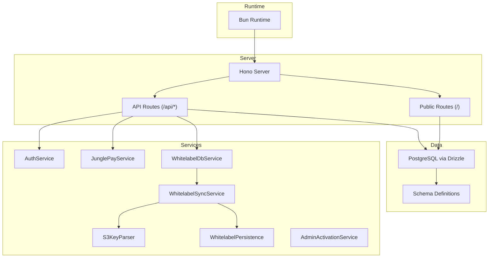
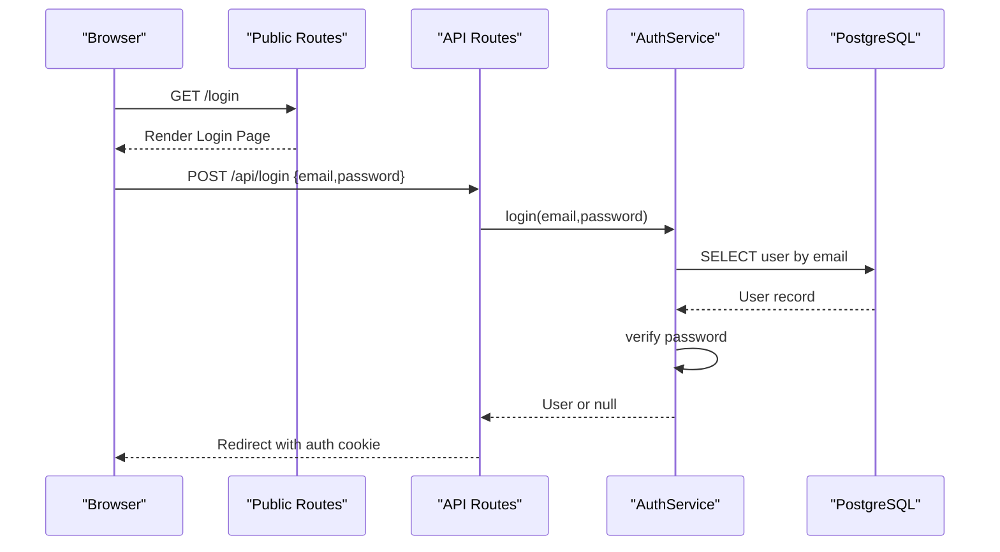
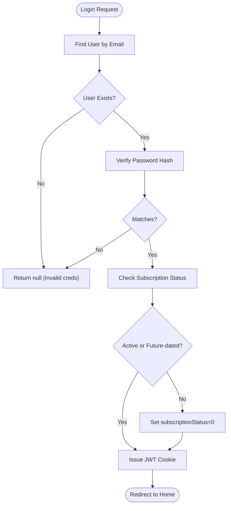
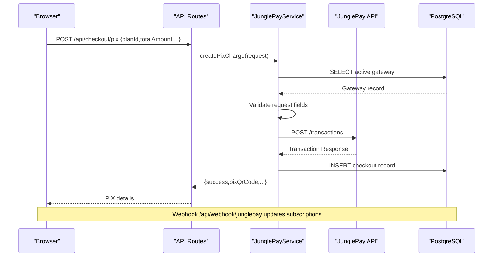
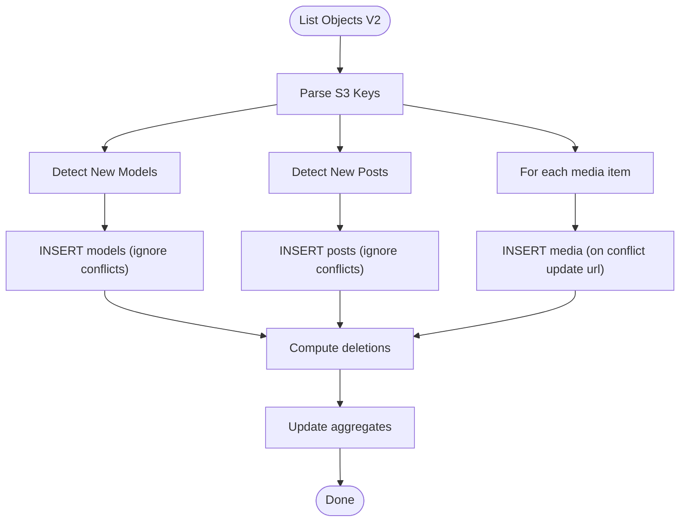
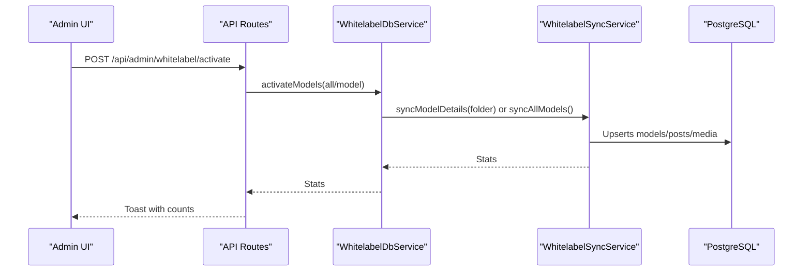
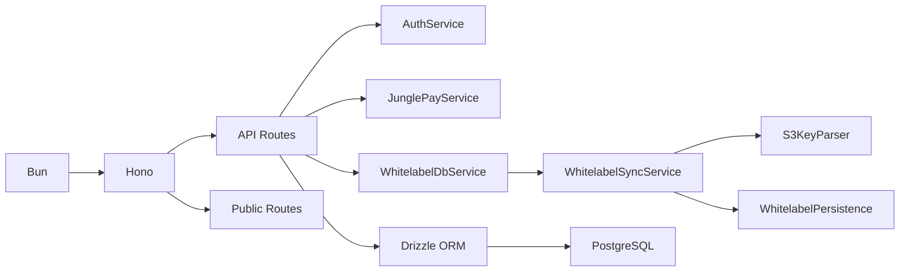

# Troubleshooting & FAQ

<cite>
**Referenced Files in This Document**
- [README.md](file://README.md)
- [package.json](file://package.json)
- [drizzle.config.ts](file://drizzle.config.ts)
- [src/db/index.ts](file://src/db/index.ts)
- [src/db/schema.ts](file://src/db/schema.ts)
- [src/services/auth.ts](file://src/services/auth.ts)
- [src/services/junglepay.ts](file://src/services/junglepay.ts)
- [src/services/whitelabel.ts](file://src/services/whitelabel.ts)
- [src/services/whitelabel/sync.ts](file://src/services/whitelabel/sync.ts)
- [src/services/whitelabel/sync/parser.ts](file://src/services/whitelabel/sync/parser.ts)
- [src/services/whitelabel/sync/persistence.ts](file://src/services/whitelabel/sync/persistence.ts)
- [src/services/admin/activation.ts](file://src/services/admin/activation.ts)
- [src/routes/api.tsx](file://src/routes/api.tsx)
- [src/routes/public.tsx](file://src/routes/public.tsx)
</cite>

## Table of Contents
1. [Introduction](#introduction)
2. [Project Structure](#project-structure)
3. [Core Components](#core-components)
4. [Architecture Overview](#architecture-overview)
5. [Detailed Component Analysis](#detailed-component-analysis)
6. [Dependency Analysis](#dependency-analysis)
7. [Performance Considerations](#performance-considerations)
8. [Troubleshooting Guide](#troubleshooting-guide)
9. [Conclusion](#conclusion)
10. [Appendices](#appendices)

## Introduction
This document provides a comprehensive troubleshooting and FAQ guide for CreatorFlix. It focuses on diagnosing and resolving common setup issues, configuration problems, and runtime errors across database connectivity, authentication, payment processing, and content synchronization. It also includes debugging strategies, log analysis techniques, performance optimization approaches, environment-specific fixes, and escalation procedures.

## Project Structure
CreatorFlix is a streaming platform built with Bun, Hono, PostgreSQL (via Drizzle ORM), Tailwind CSS, and DigitalOcean Spaces (S3-compatible). The backend exposes REST endpoints for authentication, checkout, webhooks, and admin operations. The frontend renders pages and integrates with backend APIs.

**Diagram sources**
- [src/routes/api.tsx](file://src/routes/api.tsx#L1-L519)
- [src/routes/public.tsx](file://src/routes/public.tsx#L1-L170)
- [src/services/auth.ts](file://src/services/auth.ts#L1-L91)
- [src/services/junglepay.ts](file://src/services/junglepay.ts#L1-L270)
- [src/services/whitelabel.ts](file://src/services/whitelabel.ts#L1-L24)
- [src/services/whitelabel/sync.ts](file://src/services/whitelabel/sync.ts#L1-L334)
- [src/services/whitelabel/sync/parser.ts](file://src/services/whitelabel/sync/parser.ts#L1-L59)
- [src/services/whitelabel/sync/persistence.ts](file://src/services/whitelabel/sync/persistence.ts#L1-L94)
- [src/services/admin/activation.ts](file://src/services/admin/activation.ts#L1-L86)
- [src/db/index.ts](file://src/db/index.ts#L1-L8)
- [src/db/schema.ts](file://src/db/schema.ts#L1-L178)

**Section sources**
- [README.md](file://README.md#L1-L49)
- [package.json](file://package.json#L1-L23)

## Core Components
- Authentication and Subscriptions: Handles registration, login, password hashing/verification, and subscription lifecycle.
- Payment Processing: Integrates with JunglePay for PIX transactions and webhooks for payment events.
- Whitelabel Content Sync: Synchronizes models, posts, and media from S3-compatible storage into the database.
- Admin Activation: Promotes staged whitelabel content into production models and posts.
- API Layer: Exposes endpoints for checkout, webhooks, admin operations, and public pages.

**Section sources**
- [src/services/auth.ts](file://src/services/auth.ts#L1-L91)
- [src/services/junglepay.ts](file://src/services/junglepay.ts#L1-L270)
- [src/services/whitelabel.ts](file://src/services/whitelabel.ts#L1-L24)
- [src/services/admin/activation.ts](file://src/services/admin/activation.ts#L1-L86)
- [src/routes/api.tsx](file://src/routes/api.tsx#L1-L519)

## Architecture Overview
The system follows a layered architecture:
- Presentation: Public routes render pages and interact with API routes.
- Application: Services encapsulate business logic for auth, payments, and content sync.
- Persistence: Drizzle ORM connects to PostgreSQL and manages schema relations.

**Diagram sources**
- [src/routes/public.tsx](file://src/routes/public.tsx#L167-L170)
- [src/routes/api.tsx](file://src/routes/api.tsx#L316-L349)
- [src/services/auth.ts](file://src/services/auth.ts#L28-L39)
- [src/db/schema.ts](file://src/db/schema.ts#L6-L14)

## Detailed Component Analysis

### Authentication and Subscription Flow
Common issues include invalid credentials, duplicate registration, and subscription status inconsistencies.

**Diagram sources**
- [src/services/auth.ts](file://src/services/auth.ts#L28-L89)
- [src/routes/api.tsx](file://src/routes/api.tsx#L316-L349)
- [src/db/schema.ts](file://src/db/schema.ts#L6-L14)

**Section sources**
- [src/services/auth.ts](file://src/services/auth.ts#L1-L91)
- [src/routes/api.tsx](file://src/routes/api.tsx#L316-L399)

### Payment Processing with JunglePay
Issues commonly involve gateway configuration, invalid data, network/API errors, and webhook mismatches.

**Diagram sources**
- [src/routes/api.tsx](file://src/routes/api.tsx#L41-L86)
- [src/services/junglepay.ts](file://src/services/junglepay.ts#L107-L268)
- [src/db/schema.ts](file://src/db/schema.ts#L29-L35)
- [src/db/schema.ts](file://src/db/schema.ts#L113-L127)

**Section sources**
- [src/services/junglepay.ts](file://src/services/junglepay.ts#L1-L270)
- [src/routes/api.tsx](file://src/routes/api.tsx#L88-L170)

### Whitelabel Content Synchronization
Issues include S3 connectivity, key parsing errors, and database conflicts during inserts.

**Diagram sources**
- [src/services/whitelabel/sync.ts](file://src/services/whitelabel/sync.ts#L7-L197)
- [src/services/whitelabel/sync/parser.ts](file://src/services/whitelabel/sync/parser.ts#L10-L59)
- [src/services/whitelabel/sync/persistence.ts](file://src/services/whitelabel/sync/persistence.ts#L17-L92)

**Section sources**
- [src/services/whitelabel/sync.ts](file://src/services/whitelabel/sync.ts#L1-L334)
- [src/services/whitelabel/sync/parser.ts](file://src/services/whitelabel/sync/parser.ts#L1-L59)
- [src/services/whitelabel/sync/persistence.ts](file://src/services/whitelabel/sync/persistence.ts#L1-L94)

### Admin Activation Pipeline
Activation moves staged whitelabel content into production models and posts.

**Diagram sources**
- [src/routes/api.tsx](file://src/routes/api.tsx#L250-L273)
- [src/services/whitelabel.ts](file://src/services/whitelabel.ts#L5-L24)
- [src/services/admin/activation.ts](file://src/services/admin/activation.ts#L7-L55)
- [src/services/whitelabel/sync.ts](file://src/services/whitelabel/sync.ts#L199-L333)

**Section sources**
- [src/services/admin/activation.ts](file://src/services/admin/activation.ts#L1-L86)
- [src/routes/api.tsx](file://src/routes/api.tsx#L250-L273)

## Dependency Analysis
- Runtime and Framework: Bun and Hono form the server runtime.
- Database: PostgreSQL with Drizzle ORM and typed schema.
- Storage: S3-compatible provider for media assets.
- Payment: JunglePay SDK integration with basic auth and webhook handling.

**Diagram sources**
- [package.json](file://package.json#L8-L16)
- [src/db/index.ts](file://src/db/index.ts#L1-L8)
- [src/routes/api.tsx](file://src/routes/api.tsx#L1-L12)
- [src/routes/public.tsx](file://src/routes/public.tsx#L1-L17)

**Section sources**
- [package.json](file://package.json#L1-L23)
- [src/db/index.ts](file://src/db/index.ts#L1-L8)

## Performance Considerations
- Database batching and upserts: Use on-conflict strategies to minimize duplicate writes.
- Aggregation updates: Prefer targeted updates and avoid full-table scans.
- S3 listing: Paginate with continuation tokens and process in passes to reduce memory pressure.
- JWT verification: Keep secret size appropriate and avoid unnecessary re-hashing.
- CSS build: Use Tailwind CLI scripts to pre-bundle styles for faster delivery.

[No sources needed since this section provides general guidance]

## Troubleshooting Guide

### Environment Setup and Dependencies
- Bun installation and hot reload:
  - Ensure Bun is installed and the dev script runs without errors.
  - Confirm hot reload is enabled via the dev script.
- Tailwind CSS build:
  - Run the CSS build script to generate styles.
  - Watch mode can be used during development.
- Database URL and migrations:
  - Set DATABASE_URL in environment or configure connection in code.
  - Generate and apply migrations using Drizzle Kit commands.
- Access URLs:
  - Frontend: http://localhost:3000
  - Admin: http://localhost:3000/admin

**Section sources**
- [README.md](file://README.md#L13-L42)
- [package.json](file://package.json#L3-L7)
- [drizzle.config.ts](file://drizzle.config.ts#L1-L11)
- [src/db/index.ts](file://src/db/index.ts#L5-L6)

### Database Connectivity Issues
Symptoms:
- Application fails to connect to PostgreSQL.
- Drizzle ORM throws connection errors.
- Migrations fail or schema mismatch occurs.

Diagnostic steps:
- Verify DATABASE_URL format and credentials.
- Test connectivity using a PostgreSQL client.
- Confirm migration tool configuration and credentials.
- Check schema definitions and relations for consistency.

Resolution:
- Correct DATABASE_URL in environment or code.
- Apply migrations using Drizzle Kit.
- Align schema definitions with runtime expectations.

**Section sources**
- [src/db/index.ts](file://src/db/index.ts#L5-L7)
- [drizzle.config.ts](file://drizzle.config.ts#L7-L10)
- [src/db/schema.ts](file://src/db/schema.ts#L1-L178)

### Authentication Failures
Symptoms:
- Login redirects with invalid credentials.
- Registration fails due to duplicate email.
- JWT verification errors.

Diagnostic steps:
- Confirm user exists and password hash matches.
- Check subscription status refresh logic.
- Validate JWT secret and cookie settings.

Resolution:
- Ensure unique email constraint is respected.
- Re-hash passwords using the runtime’s password hashing.
- Verify JWT secret and cookie attributes (secure, httpOnly, sameSite).

**Section sources**
- [src/services/auth.ts](file://src/services/auth.ts#L6-L39)
- [src/routes/api.tsx](file://src/routes/api.tsx#L316-L349)
- [src/routes/public.tsx](file://src/routes/public.tsx#L20-L51)

### Payment Processing Problems
Symptoms:
- Gateway not configured or inactive.
- Invalid request data (missing fields).
- API errors from payment provider.
- Webhook not updating subscriptions.

Diagnostic steps:
- Check active gateway and secret/public keys.
- Validate required fields in checkout requests.
- Inspect webhook payload parsing and transaction status handling.
- Review logs for API error responses and unexpected responses.

Resolution:
- Enable the correct gateway and set keys via admin endpoints.
- Fix malformed requests and ensure cents conversion.
- Add retry logic and idempotency for webhook processing.

**Section sources**
- [src/services/junglepay.ts](file://src/services/junglepay.ts#L107-L268)
- [src/routes/api.tsx](file://src/routes/api.tsx#L41-L86)
- [src/routes/api.tsx](file://src/routes/api.tsx#L88-L170)

### Content Synchronization Errors
Symptoms:
- Missing models or posts after sync.
- Duplicate entries or conflicts.
- Media URLs not updating.

Diagnostic steps:
- Inspect S3 key parsing logic for supported file types.
- Verify database upserts and conflict resolution.
- Check deletion logic for removed models/posts.

Resolution:
- Ensure S3 keys match expected patterns.
- Use on-conflict strategies to prevent duplicates.
- Re-run sync for affected prefixes or entire bucket.

**Section sources**
- [src/services/whitelabel/sync.ts](file://src/services/whitelabel/sync.ts#L7-L197)
- [src/services/whitelabel/sync/parser.ts](file://src/services/whitelabel/sync/parser.ts#L10-L59)
- [src/services/whitelabel/sync/persistence.ts](file://src/services/whitelabel/sync/persistence.ts#L17-L92)

### Admin Activation Failures
Symptoms:
- Activation does not create production models/posts.
- Errors during upsert or status updates.

Diagnostic steps:
- Confirm staged models exist and are synced.
- Check mapper outputs and production table constraints.
- Validate status transitions and cascade deletes.

Resolution:
- Re-run sync for specific model or all models.
- Adjust mapper logic if content shape differs.
- Ensure foreign keys and unique constraints are satisfied.

**Section sources**
- [src/services/admin/activation.ts](file://src/services/admin/activation.ts#L31-L55)
- [src/services/whitelabel.ts](file://src/services/whitelabel.ts#L5-L24)

### Logging and Debugging Strategies
- Enable verbose logging in endpoints and services.
- Capture raw webhook bodies and parsed payloads.
- Log database upserts and deletions for audit trails.
- Use structured logs with timestamps and correlation IDs.

Log analysis techniques:
- Filter by endpoint paths (/api/checkout, /api/webhook).
- Correlate webhook events with checkout records.
- Trace user actions from login to subscription creation.

**Section sources**
- [src/routes/api.tsx](file://src/routes/api.tsx#L88-L170)
- [src/routes/api.tsx](file://src/routes/api.tsx#L402-L506)
- [src/services/whitelabel/sync.ts](file://src/services/whitelabel/sync.ts#L199-L333)

### Error Codes and Meanings
- GATEWAY_NOT_CONFIGURED: Payment gateway missing or keys not set.
- GATEWAY_INACTIVE: Gateway exists but is not enabled.
- INVALID_DATA: Missing required fields or invalid amounts.
- API_ERROR: Network or provider-side failure.
- UNEXPECTED_RESPONSE: Provider response lacks expected fields.

Resolution:
- Configure gateway and enable it.
- Validate input data and amounts.
- Retry failed requests and inspect provider responses.

**Section sources**
- [src/services/junglepay.ts](file://src/services/junglepay.ts#L26-L32)
- [src/services/junglepay.ts](file://src/services/junglepay.ts#L107-L268)

### Performance Optimization Approaches
- Batch database writes and use on-conflict strategies.
- Limit S3 listing page sizes and paginate efficiently.
- Cache frequently accessed plans and user sessions.
- Minimize redundant computations in webhook handlers.

[No sources needed since this section provides general guidance]

### Environment-Specific Issues and Fixes
- Production cookies: Ensure secure flag and HTTPS are configured.
- CORS and cookies: Align SameSite and domain policies.
- Database SSL: Configure sslmode appropriately for hosted providers.
- CDN URLs: Verify S3 bucket region and CDN endpoints.

**Section sources**
- [src/routes/api.tsx](file://src/routes/api.tsx#L336-L343)
- [src/services/whitelabel/sync.ts](file://src/services/whitelabel/sync.ts#L117-L123)

### Community Resources, Support Channels, and Escalation Procedures
- Community: Engage with Bun and Hono communities for runtime and framework support.
- Database: Consult PostgreSQL documentation and community forums.
- Storage: Refer to S3-compatible provider documentation for bucket policies and permissions.
- Payments: Use JunglePay’s official documentation and support channels.
- Escalation: For persistent issues, gather logs, reproduce steps, and open issues with environment details and error codes.

[No sources needed since this section provides general guidance]

## Conclusion
This guide consolidates actionable diagnostics and resolutions for CreatorFlix across setup, configuration, runtime, and operational concerns. By following the outlined strategies—logging, validation, and incremental fixes—you can quickly isolate and resolve issues in database connectivity, authentication, payment processing, and content synchronization.

## Appendices

### Quick Reference: Common Commands and Paths
- Install dependencies: bun install
- Build CSS: bun run css:build
- Run dev server: bun run dev
- Generate migrations: bunx drizzle-kit generate
- Apply migrations: bunx drizzle-kit migrate
- Access: Home http://localhost:3000, Admin http://localhost:3000/admin

**Section sources**
- [README.md](file://README.md#L15-L42)
- [package.json](file://package.json#L3-L7)