# Atomic Design System

<cite>
**Referenced Files in This Document**
- [README.md](file://README.md)
- [tailwind.config.js](file://tailwind.config.js)
- [src/components/atoms/Button.tsx](file://src/components/atoms/Button.tsx)
- [src/components/atoms/Input.tsx](file://src/components/atoms/Input.tsx)
- [src/components/atoms/Avatar.tsx](file://src/components/atoms/Avatar.tsx)
- [src/components/atoms/Badge.tsx](file://src/components/atoms/Badge.tsx)
- [src/components/atoms/IconButton.tsx](file://src/components/atoms/IconButton.tsx)
- [src/components/atoms/Spinner.tsx](file://src/components/atoms/Spinner.tsx)
- [src/components/atoms/SupportDropdown.tsx](file://src/components/atoms/SupportDropdown.tsx)
- [src/components/atoms/SearchIcon.tsx](file://src/components/atoms/SearchIcon.tsx)
- [src/components/molecules/ModelCard.tsx](file://src/components/molecules/ModelCard.tsx)
- [src/components/molecules/TabSelector.tsx](file://src/components/molecules/TabSelector.tsx)
- [src/components/molecules/ClientSearchForm.tsx](file://src/components/molecules/ClientSearchForm.tsx)
- [src/components/organisms/Navbar.tsx](file://src/components/organisms/Navbar.tsx)
- [src/db/schema.ts](file://src/db/schema.ts)
- [src/db/index.ts](file://src/db/index.ts)
</cite>

## Update Summary
**Changes Made**
- Added new SearchIcon atomic component for search functionality
- Enhanced Badge component with new variants (success, warning, danger, secondary)
- Updated component architecture to include SearchIcon integration in ClientSearchForm
- Expanded atomic design system with comprehensive iconography support

## Table of Contents
1. [Introduction](#introduction)
2. [Project Structure](#project-structure)
3. [Core Components](#core-components)
4. [Architecture Overview](#architecture-overview)
5. [Detailed Component Analysis](#detailed-component-analysis)
6. [Dependency Analysis](#dependency-analysis)
7. [Performance Considerations](#performance-considerations)
8. [Troubleshooting Guide](#troubleshooting-guide)
9. [Conclusion](#conclusion)

## Introduction
CreatorFlix is a premium content streaming platform built with Atomic Design. The atomic design system organizes UI into reusable, foundational components that compose into molecules and organisms. This document focuses on the atom layer, detailing each component's purpose, props, styling approach, usage patterns, accessibility, responsiveness, and performance characteristics. It also demonstrates how atoms integrate with molecules and organisms and highlights customization and composition strategies.

## Project Structure
The atomic design system is organized under src/components with four layers:
- Atoms: smallest, indivisible UI elements (e.g., Button, Input, Avatar, SearchIcon).
- Molecules: small groups combining atoms (e.g., ModelCard, TabSelector, ClientSearchForm).
- Organisms: complex UI sections (e.g., Navbar).
- Templates and Pages: page layouts and route mounting.

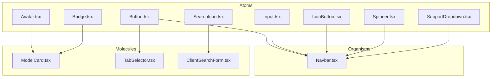

**Diagram sources**
- [src/components/atoms/Button.tsx](file://src/components/atoms/Button.tsx#L1-L42)
- [src/components/atoms/Input.tsx](file://src/components/atoms/Input.tsx#L1-L35)
- [src/components/atoms/Avatar.tsx](file://src/components/atoms/Avatar.tsx#L1-L28)
- [src/components/atoms/Badge.tsx](file://src/components/atoms/Badge.tsx#L1-L25)
- [src/components/atoms/IconButton.tsx](file://src/components/atoms/IconButton.tsx#L1-L18)
- [src/components/atoms/Spinner.tsx](file://src/components/atoms/Spinner.tsx#L1-L5)
- [src/components/atoms/SupportDropdown.tsx](file://src/components/atoms/SupportDropdown.tsx#L1-L78)
- [src/components/atoms/SearchIcon.tsx](file://src/components/atoms/SearchIcon.tsx#L1-L9)
- [src/components/molecules/ModelCard.tsx](file://src/components/molecules/ModelCard.tsx#L1-L69)
- [src/components/molecules/TabSelector.tsx](file://src/components/molecules/TabSelector.tsx#L1-L11)
- [src/components/molecules/ClientSearchForm.tsx](file://src/components/molecules/ClientSearchForm.tsx#L1-L24)
- [src/components/organisms/Navbar.tsx](file://src/components/organisms/Navbar.tsx#L1-L117)

**Section sources**
- [README.md](file://README.md#L43-L49)

## Core Components
This section documents each atom component, including purpose, props, styling approach, and usage patterns. Accessibility and responsive behavior are addressed per component.

### Button
- Purpose: Primary action element with multiple visual variants and optional link behavior.
- Props:
  - variant: 'primary' | 'secondary' | 'outline' | 'ghost'
  - href: optional external URL (renders anchor)
  - className: additional Tailwind classes
  - type: 'button' | 'submit' | 'reset'
  - onClick: inline JS handler (HTMX-friendly)
- Styling approach:
  - Base: consistent typography, transitions, focus ring, disabled states.
  - Variants: distinct backgrounds, borders, hover effects, and shadows (e.g., neon glow).
  - Sizes: compact padding and uppercase typography.
- Usage patterns:
  - As a submit button inside forms.
  - As a navigational link via href prop.
  - With onClick for client-side actions.
- Accessibility:
  - Uses focus-visible outlines and disabled state feedback.
  - Prefer labels and aria attributes when wrapping complex actions.
- Responsive behavior:
  - Inline-flex layout remains consistent across breakpoints.
- Performance:
  - Minimal re-renders; variant selection is constant-time.
- Integration:
  - Used in Navbar for registration and in molecules for CTAs.

**Section sources**
- [src/components/atoms/Button.tsx](file://src/components/atoms/Button.tsx#L1-L42)
- [src/components/organisms/Navbar.tsx](file://src/components/organisms/Navbar.tsx#L97-L99)

### Input
- Purpose: Styled form input with label and optional read-only state.
- Props:
  - id, name, label: semantic labeling.
  - placeholder, type, value, required, readOnly, maxLength, className.
- Styling approach:
  - Dark-themed input with focus ring, glow on focus, and hover transitions.
  - Read-only mode visually de-emphasizes the field.
- Usage patterns:
  - Wrapped in forms; paired with labels for accessibility.
  - Supports various input types (text, password, email).
- Accessibility:
  - Proper label association via htmlFor.
  - Focus management and keyboard navigation supported by browser defaults.
- Responsive behavior:
  - Full-width container with consistent padding and typography.
- Performance:
  - Stateless functional component; renders quickly.
- Integration:
  - Can be composed into larger molecules and organisms.

**Section sources**
- [src/components/atoms/Input.tsx](file://src/components/atoms/Input.tsx#L1-L35)

### Avatar
- Purpose: Circular profile image with optional glow and size scaling.
- Props:
  - src, alt: image source and semantics.
  - size: 'sm' | 'md' | 'lg' | 'xl'; responsive sizing for lg breakpoint.
  - className: additional Tailwind classes.
- Styling approach:
  - Gradient border glow on hover via pseudo-element.
  - Rounded-full crop with overlay ring and dark background.
- Usage patterns:
  - Display user/model avatars in cards, headers, and lists.
  - Combine with badges or overlays for status indicators.
- Accessibility:
  - Alt text is mandatory for meaningful images.
- Responsive behavior:
  - Size scales across breakpoints (e.g., lg expands at md).
- Performance:
  - Uses lazy loading via img element; minimal DOM overhead.
- Integration:
  - Frequently used within molecules like ModelCard.

**Section sources**
- [src/components/atoms/Avatar.tsx](file://src/components/atoms/Avatar.tsx#L1-L28)
- [src/components/molecules/ModelCard.tsx](file://src/components/molecules/ModelCard.tsx#L29-L34)

### Badge
- Purpose: Status or indicator labels with compact or prominent variants.
- Props:
  - variant: 'live' | 'primary' | 'default' | 'success' | 'warning' | 'danger' | 'secondary'
  - className: additional Tailwind classes.
- Styling approach:
  - Live: animated pulse, bold color, raised shadow.
  - Primary: small circular indicator with glow.
  - Default: subtle pill-shaped badge with uppercase typography.
  - Success: green-themed badge for positive states.
  - Warning: yellow-themed badge for caution states.
  - Danger: red-themed badge for error states.
  - Secondary: gray-themed badge for neutral states.
- Usage patterns:
  - Live indicators on thumbnails.
  - Notification dots or counts.
  - Category or status badges.
  - State indicators for user interface elements.
- Accessibility:
  - Non-decorative; ensure text is meaningful or supplement with aria-label.
- Responsive behavior:
  - Compact sizes scale consistently.
- Performance:
  - Stateless component; very lightweight.
- Integration:
  - Used in ModelCard for live status and promotional badges.

**Updated** Enhanced with new variants (success, warning, danger, secondary) for comprehensive state representation.

**Section sources**
- [src/components/atoms/Badge.tsx](file://src/components/atoms/Badge.tsx#L1-L25)
- [src/components/molecules/ModelCard.tsx](file://src/components/molecules/ModelCard.tsx#L44-L50)

### IconButton
- Purpose: Small, circular action button with backdrop blur and hover effects.
- Props:
  - onClick: inline JS handler.
  - className: additional Tailwind classes.
- Styling approach:
  - Circular shape, backdrop blur, border, and smooth transitions.
- Usage patterns:
  - Action triggers in media players, overlays, and toolbars.
- Accessibility:
  - Provide aria-label for icon-only buttons.
- Responsive behavior:
  - Fixed size with consistent spacing.
- Performance:
  - Minimal rendering cost.
- Integration:
  - Used in organisms and molecules for quick actions.

**Section sources**
- [src/components/atoms/IconButton.tsx](file://src/components/atoms/IconButton.tsx#L1-L18)

### Spinner
- Purpose: Loading indicator with a rotating ring animation.
- Props: none.
- Styling approach:
  - CSS animation-driven spinner with gradient-colored top stroke.
- Usage patterns:
  - Show during async operations and data fetching.
- Accessibility:
  - Pair with aria-live regions or skip-link patterns for screen readers.
- Responsive behavior:
  - Fixed size suitable for inline contexts.
- Performance:
  - Pure CSS animation; GPU-accelerated.
- Integration:
  - Used in organisms and molecules to indicate loading states.

**Section sources**
- [src/components/atoms/Spinner.tsx](file://src/components/atoms/Spinner.tsx#L1-L5)

### SupportDropdown
- Purpose: Floating support widget that opens a menu with platform links.
- Props: none (async-rendered).
- Styling approach:
  - Fixed positioning, gradient button, dropdown panel with backdrop blur.
  - Hover and focus states for interactive elements.
- Data integration:
  - Fetches active support contacts from the database (Drizzle ORM).
- Usage patterns:
  - Place on every page; toggles visibility on click.
  - Opens upward with platform-specific icons and labels.
- Accessibility:
  - aria-label on trigger; target links open in new tabs with safe attributes.
- Responsive behavior:
  - Positioned at fixed bottom/right; visually anchored to viewport.
- Performance:
  - Renders once per page load; dropdown toggle is client-side.
- Integration:
  - Used in organisms and templates to provide global support access.

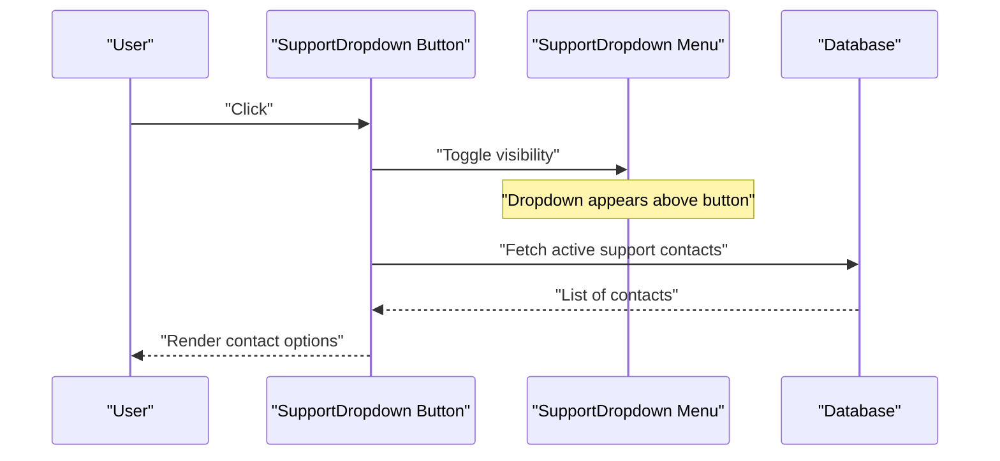

**Diagram sources**
- [src/components/atoms/SupportDropdown.tsx](file://src/components/atoms/SupportDropdown.tsx#L6-L7)
- [src/db/schema.ts](file://src/db/schema.ts#L105-L111)
- [src/db/index.ts](file://src/db/index.ts#L1-L8)

**Section sources**
- [src/components/atoms/SupportDropdown.tsx](file://src/components/atoms/SupportDropdown.tsx#L1-L78)
- [src/db/schema.ts](file://src/db/schema.ts#L105-L111)
- [src/db/index.ts](file://src/db/index.ts#L1-L8)

### SearchIcon
- Purpose: Vector search icon component for search functionality and UI elements.
- Props: none (pure functional component).
- Styling approach:
  - SVG-based icon with consistent stroke width and line caps.
  - Designed to be used as a decorative element within other components.
  - Inherits color from parent context (currentColor).
- Usage patterns:
  - Integrated into ClientSearchForm as a visual indicator.
  - Can be used in any component requiring a search icon.
  - Lightweight and reusable across the application.
- Accessibility:
  - Presentational icon; should be accompanied by appropriate text labels.
- Responsive behavior:
  - Scalable vector graphics; maintains quality at any size.
- Performance:
  - Stateless functional component; extremely lightweight.
- Integration:
  - Imported and used within ClientSearchForm molecule.
  - Can be composed into other molecules and organisms as needed.

**New** Added comprehensive SearchIcon component for enhanced iconography support.

**Section sources**
- [src/components/atoms/SearchIcon.tsx](file://src/components/atoms/SearchIcon.tsx#L1-L9)
- [src/components/molecules/ClientSearchForm.tsx](file://src/components/molecules/ClientSearchForm.tsx#L1-L24)

## Architecture Overview
The atomic design system composes atoms into molecules and organisms. Atoms encapsulate shared styling and behavior, enabling consistent UI across the application.

**Diagram sources**
- [src/components/atoms/Button.tsx](file://src/components/atoms/Button.tsx#L1-L42)
- [src/components/atoms/Input.tsx](file://src/components/atoms/Input.tsx#L1-L35)
- [src/components/atoms/Avatar.tsx](file://src/components/atoms/Avatar.tsx#L1-L28)
- [src/components/atoms/Badge.tsx](file://src/components/atoms/Badge.tsx#L1-L25)
- [src/components/atoms/IconButton.tsx](file://src/components/atoms/IconButton.tsx#L1-L18)
- [src/components/atoms/Spinner.tsx](file://src/components/atoms/Spinner.tsx#L1-L5)
- [src/components/atoms/SupportDropdown.tsx](file://src/components/atoms/SupportDropdown.tsx#L1-L78)
- [src/components/atoms/SearchIcon.tsx](file://src/components/atoms/SearchIcon.tsx#L1-L9)
- [src/components/molecules/ModelCard.tsx](file://src/components/molecules/ModelCard.tsx#L1-L69)
- [src/components/molecules/TabSelector.tsx](file://src/components/molecules/TabSelector.tsx#L1-L11)
- [src/components/molecules/ClientSearchForm.tsx](file://src/components/molecules/ClientSearchForm.tsx#L1-L24)
- [src/components/organisms/Navbar.tsx](file://src/components/organisms/Navbar.tsx#L1-L117)

## Detailed Component Analysis

### Button Variants and Composition
- Variants:
  - Primary: strong branding with neon glow on hover.
  - Secondary: surface contrast with border and hover reveal.
  - Outline: transparent with visible border and hover intensity.
  - Ghost: subtle text with light background on hover.
- Composition:
  - Combine with Spinner for loading states.
  - Use IconButton alongside Button for icon+text actions.
  - Integrate with Input in forms and search bars.

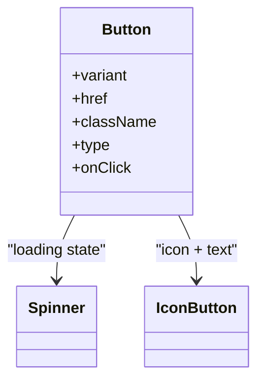

**Diagram sources**
- [src/components/atoms/Button.tsx](file://src/components/atoms/Button.tsx#L4-L19)
- [src/components/atoms/Spinner.tsx](file://src/components/atoms/Spinner.tsx#L1-L5)
- [src/components/atoms/IconButton.tsx](file://src/components/atoms/IconButton.tsx#L1-L18)

**Section sources**
- [src/components/atoms/Button.tsx](file://src/components/atoms/Button.tsx#L22-L27)
- [src/components/organisms/Navbar.tsx](file://src/components/organisms/Navbar.tsx#L97-L99)

### Input Field Configurations
- Labeling and accessibility:
  - Always pair label with input via htmlFor.
  - Use placeholder sparingly; rely on label for meaning.
- Validation and states:
  - required and readOnly mapped to native attributes.
  - Focus and hover states handled via Tailwind utilities.
- Composition:
  - Wrap in forms; combine with Button for submit actions.

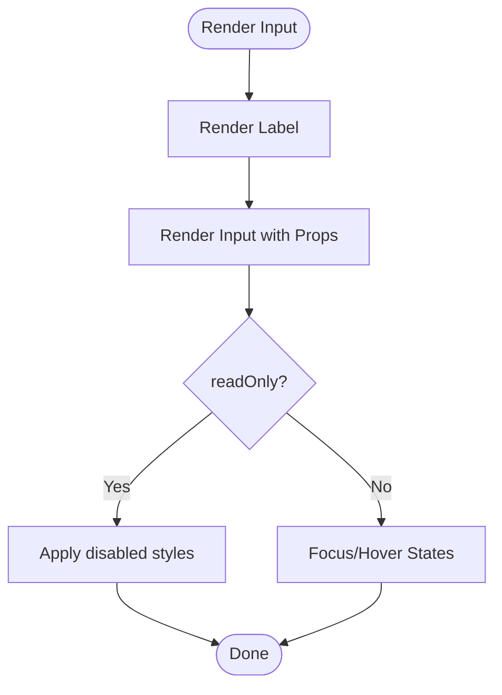

**Diagram sources**
- [src/components/atoms/Input.tsx](file://src/components/atoms/Input.tsx#L15-L32)

**Section sources**
- [src/components/atoms/Input.tsx](file://src/components/atoms/Input.tsx#L15-L32)

### Avatar Display Options
- Sizing:
  - sm/md/lg/xl with responsive expansion at md breakpoint.
- Effects:
  - Gradient glow on hover via pseudo-element.
- Composition:
  - Pair with Badge for status indicators.
  - Use in ModelCard and Navbar user menus.

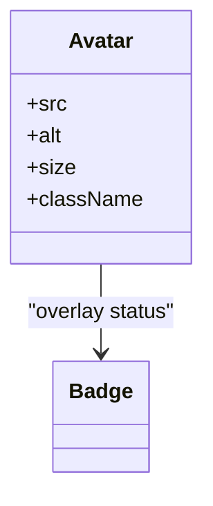

**Diagram sources**
- [src/components/atoms/Avatar.tsx](file://src/components/atoms/Avatar.tsx#L3-L8)
- [src/components/atoms/Badge.tsx](file://src/components/atoms/Badge.tsx#L3-L6)
- [src/components/molecules/ModelCard.tsx](file://src/components/molecules/ModelCard.tsx#L44-L50)

**Section sources**
- [src/components/atoms/Avatar.tsx](file://src/components/atoms/Avatar.tsx#L10-L16)
- [src/components/molecules/ModelCard.tsx](file://src/components/molecules/ModelCard.tsx#L44-L50)

### Badge Indicators
- Variants:
  - Live: animated pulse with bold color.
  - Primary: small circular indicator.
  - Default: subtle badge.
  - Success: green-themed for positive states.
  - Warning: yellow-themed for caution states.
  - Danger: red-themed for error states.
  - Secondary: gray-themed for neutral states.
- Composition:
  - Use in thumbnails, cards, and navigation.
  - Enhanced state representation for better user experience.

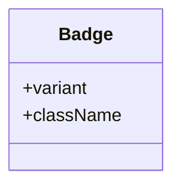

**Diagram sources**
- [src/components/atoms/Badge.tsx](file://src/components/atoms/Badge.tsx#L3-L6)

**Section sources**
- [src/components/atoms/Badge.tsx](file://src/components/atoms/Badge.tsx#L8-L17)
- [src/components/molecules/ModelCard.tsx](file://src/components/molecules/ModelCard.tsx#L44-L50)

### IconButton Implementations
- Purpose:
  - Quick actions with minimal footprint.
- Composition:
  - Use with Tooltip or label for clarity.
  - Combine with Button for primary actions.

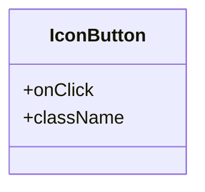

**Diagram sources**
- [src/components/atoms/IconButton.tsx](file://src/components/atoms/IconButton.tsx#L3-L6)

**Section sources**
- [src/components/atoms/IconButton.tsx](file://src/components/atoms/IconButton.tsx#L8-L16)

### Spinner Loading States
- Purpose:
  - Visual feedback during asynchronous operations.
- Composition:
  - Place inside Button during submission.
  - Show in place of content while fetching.

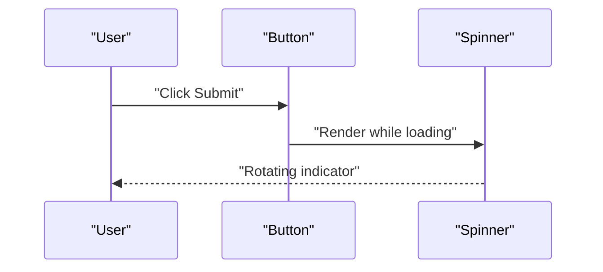

**Diagram sources**
- [src/components/atoms/Spinner.tsx](file://src/components/atoms/Spinner.tsx#L3-L4)
- [src/components/atoms/Button.tsx](file://src/components/atoms/Button.tsx#L37-L41)

**Section sources**
- [src/components/atoms/Spinner.tsx](file://src/components/atoms/Spinner.tsx#L1-L5)
- [src/components/organisms/Navbar.tsx](file://src/components/organisms/Navbar.tsx#L97-L99)

### SupportDropdown Interactions
- Data-driven:
  - Renders active support contacts fetched from the database.
- Interaction:
  - Toggle visibility and rotate trigger icon.
  - Close when clicking outside the container.
- Composition:
  - Global component placed on every page.

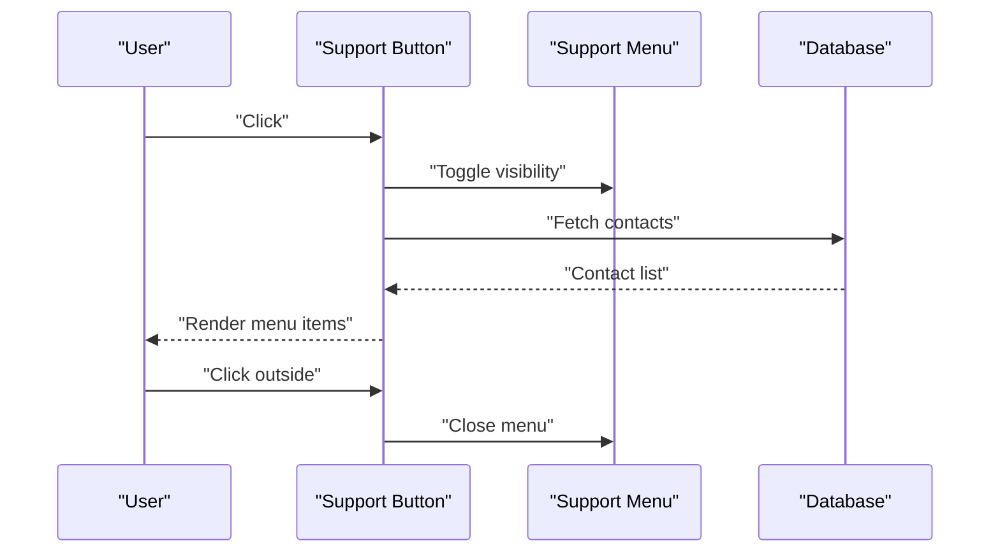

**Diagram sources**
- [src/components/atoms/SupportDropdown.tsx](file://src/components/atoms/SupportDropdown.tsx#L63-L74)
- [src/db/schema.ts](file://src/db/schema.ts#L105-L111)
- [src/db/index.ts](file://src/db/index.ts#L5-L7)

**Section sources**
- [src/components/atoms/SupportDropdown.tsx](file://src/components/atoms/SupportDropdown.tsx#L6-L7)
- [src/db/schema.ts](file://src/db/schema.ts#L105-L111)
- [src/db/index.ts](file://src/db/index.ts#L5-L7)

### SearchIcon Integration
- Purpose:
  - Provide consistent search iconography across the application.
- Integration:
  - Embedded within ClientSearchForm as a visual indicator.
  - Lightweight SVG component for optimal performance.
- Composition:
  - Used as a decorative element within form inputs.
  - Can be integrated into other components requiring search icons.

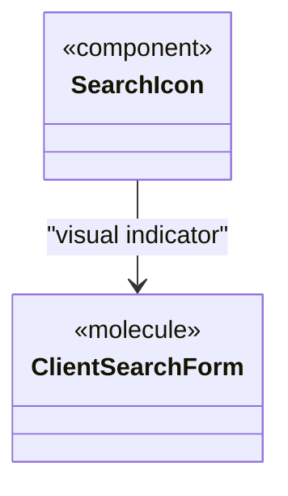

**Diagram sources**
- [src/components/atoms/SearchIcon.tsx](file://src/components/atoms/SearchIcon.tsx#L1-L9)
- [src/components/molecules/ClientSearchForm.tsx](file://src/components/molecules/ClientSearchForm.tsx#L1-L24)

**Section sources**
- [src/components/atoms/SearchIcon.tsx](file://src/components/atoms/SearchIcon.tsx#L1-L9)
- [src/components/molecules/ClientSearchForm.tsx](file://src/components/molecules/ClientSearchForm.tsx#L1-L24)

## Dependency Analysis
- Styling foundation:
  - Tailwind CSS v4 with custom theme extending colors, fonts, gradients, shadows, and animations.
- Database integration:
  - SupportDropdown uses Drizzle ORM to query support contacts.
- Component coupling:
  - Atoms are loosely coupled; they expose props and Tailwind classes for composition.
  - Molecules and organisms import and compose atoms.
- Iconography system:
  - SearchIcon provides standardized iconography for search functionality.
  - Enhanced Badge variants support comprehensive state representation.

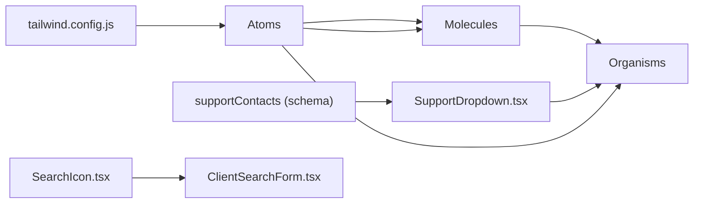

**Diagram sources**
- [tailwind.config.js](file://tailwind.config.js#L4-L39)
- [src/components/atoms/SupportDropdown.tsx](file://src/components/atoms/SupportDropdown.tsx#L2-L4)
- [src/db/schema.ts](file://src/db/schema.ts#L105-L111)
- [src/components/molecules/ModelCard.tsx](file://src/components/molecules/ModelCard.tsx#L1-L69)
- [src/components/organisms/Navbar.tsx](file://src/components/organisms/Navbar.tsx#L1-L117)
- [src/components/atoms/SearchIcon.tsx](file://src/components/atoms/SearchIcon.tsx#L1-L9)
- [src/components/molecules/ClientSearchForm.tsx](file://src/components/molecules/ClientSearchForm.tsx#L1-L24)

**Section sources**
- [tailwind.config.js](file://tailwind.config.js#L4-L39)
- [src/components/atoms/SupportDropdown.tsx](file://src/components/atoms/SupportDropdown.tsx#L2-L4)
- [src/db/schema.ts](file://src/db/schema.ts#L105-L111)
- [src/components/atoms/SearchIcon.tsx](file://src/components/atoms/SearchIcon.tsx#L1-L9)
- [src/components/molecules/ClientSearchForm.tsx](file://src/components/molecules/ClientSearchForm.tsx#L1-L24)

## Performance Considerations
- Prefer stateless atoms for minimal re-renders.
- Use CSS animations (e.g., Spinner, Badge pulse) for smooth transitions.
- Lazy-load images in molecules (e.g., ModelCard) to reduce initial payload.
- Keep className concatenation concise; avoid heavy dynamic class computations.
- Use Tailwind utilities for consistent, cacheable styles.
- SVG icons like SearchIcon provide optimal performance for scalable graphics.
- Enhanced Badge variants use efficient CSS classes for state representation.

## Troubleshooting Guide
- Button not responding:
  - Verify type and onClick; ensure inline JS is properly escaped.
- Input not focusing:
  - Confirm label htmlFor matches input id; test focus styles in dev tools.
- Avatar not displaying:
  - Check src URL and alt text; confirm image loads without CORS errors.
- Badge not visible:
  - Ensure variant is set appropriately; verify Tailwind utilities applied.
- IconButton missing label:
  - Add aria-label for accessibility compliance.
- Spinner not animating:
  - Confirm CSS animation classes are present; inspect computed styles.
- SupportDropdown not opening:
  - Check client-side script and click-outside logic; verify DOM IDs match.
- SearchIcon not rendering:
  - Verify SVG markup is correct; check for proper import statements.
- New Badge variants not applying:
  - Ensure variant prop matches one of the available options (live, primary, default, success, warning, danger, secondary).

**Section sources**
- [src/components/atoms/Button.tsx](file://src/components/atoms/Button.tsx#L37-L41)
- [src/components/atoms/Input.tsx](file://src/components/atoms/Input.tsx#L18-L20)
- [src/components/atoms/Avatar.tsx](file://src/components/atoms/Avatar.tsx#L23-L25)
- [src/components/atoms/Badge.tsx](file://src/components/atoms/Badge.tsx#L15-L19)
- [src/components/atoms/IconButton.tsx](file://src/components/atoms/IconButton.tsx#L10-L15)
- [src/components/atoms/Spinner.tsx](file://src/components/atoms/Spinner.tsx#L3-L4)
- [src/components/atoms/SupportDropdown.tsx](file://src/components/atoms/SupportDropdown.tsx#L54-L61)
- [src/components/atoms/SearchIcon.tsx](file://src/components/atoms/SearchIcon.tsx#L3-L8)
- [src/components/atoms/Badge.tsx](file://src/components/atoms/Badge.tsx#L8-L17)

## Conclusion
CreatorFlix's atomic design system provides a robust, scalable foundation for UI development. Atoms encapsulate consistent behavior and styling, enabling predictable composition into molecules and organisms. The recent enhancements include comprehensive iconography support with the new SearchIcon component and expanded state representation through enhanced Badge variants. By adhering to accessibility guidelines, leveraging responsive design tokens, and optimizing rendering performance, teams can maintain a cohesive and efficient design system across the platform.