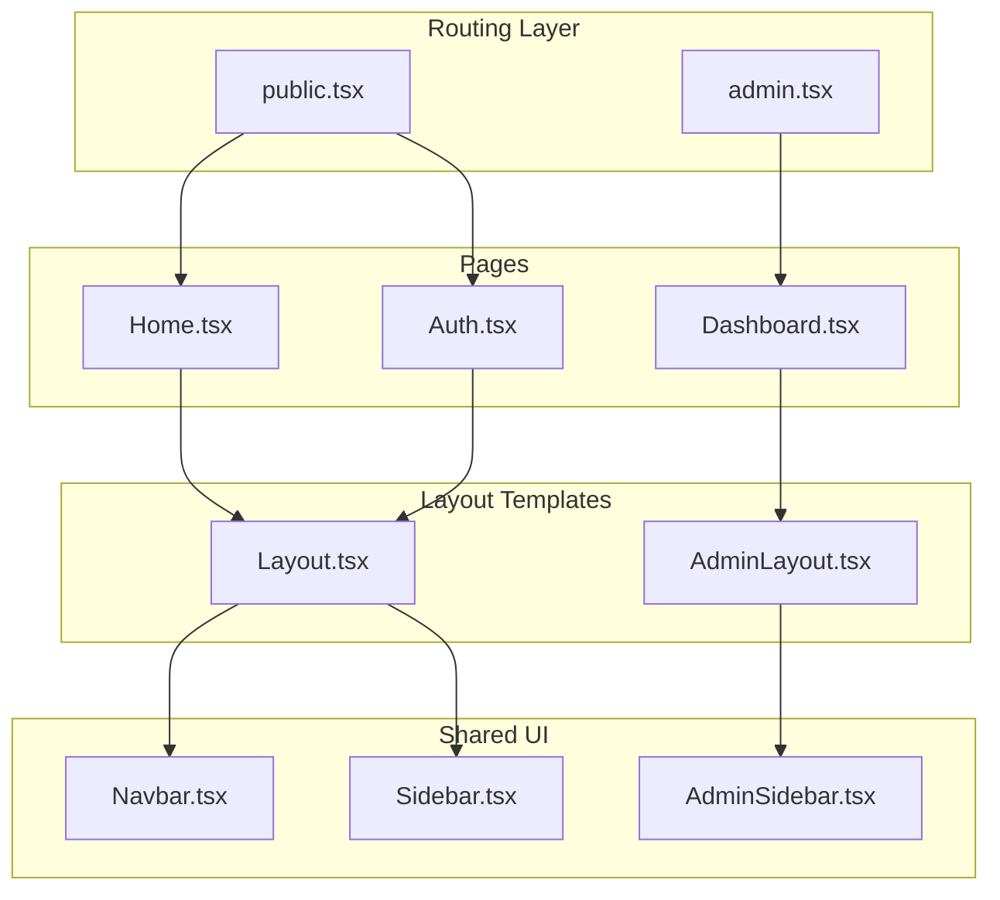
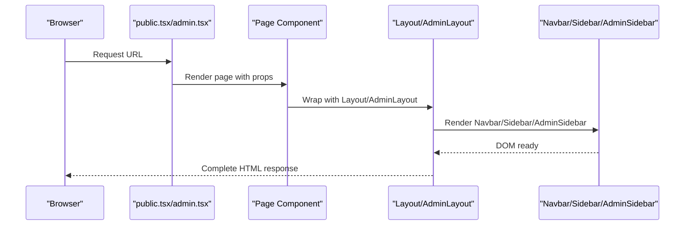
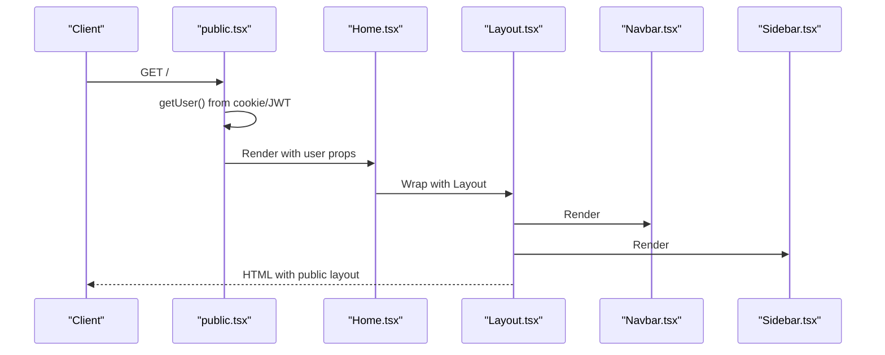
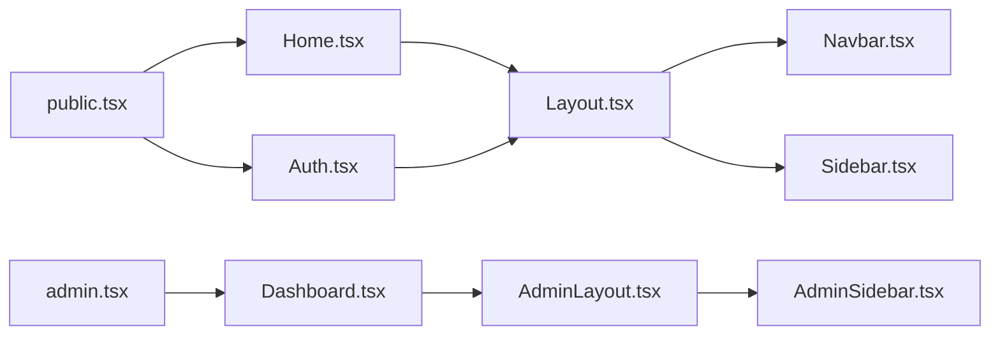

# Layout Templates

<cite>
**Referenced Files in This Document**
- [Layout.tsx](file://src/components/templates/Layout.tsx)
- [AdminLayout.tsx](file://src/components/templates/AdminLayout.tsx)
- [Navbar.tsx](file://src/components/organisms/Navbar.tsx)
- [Sidebar.tsx](file://src/components/organisms/Sidebar.tsx)
- [AdminSidebar.tsx](file://src/components/organisms/AdminSidebar.tsx)
- [public.tsx](file://src/routes/public.tsx)
- [admin.tsx](file://src/routes/admin.tsx)
- [Home.tsx](file://src/pages/Home.tsx)
- [Auth.tsx](file://src/pages/Auth.tsx)
- [Dashboard.tsx](file://src/pages/admin/Dashboard.tsx)
- [tailwind.config.js](file://tailwind.config.js)
- [input.css](file://src/input.css)
- [index.tsx](file://src/index.tsx)
</cite>

## Table of Contents
1. [Introduction](#introduction)
2. [Project Structure](#project-structure)
3. [Core Components](#core-components)
4. [Architecture Overview](#architecture-overview)
5. [Detailed Component Analysis](#detailed-component-analysis)
6. [Dependency Analysis](#dependency-analysis)
7. [Performance Considerations](#performance-considerations)
8. [Troubleshooting Guide](#troubleshooting-guide)
9. [Conclusion](#conclusion)
10. [Appendices](#appendices)

## Introduction
This document explains CreatorFlix’s layout template system that provides structural frameworks for different page types. It focuses on:
- The main Layout component for public pages
- The AdminLayout component for administrative interfaces
- Template structure, header/footer placement, sidebar integration, and responsive breakpoints
- How layouts wrap page components, handle routing, and manage global state
- Customization options, theme application, and mobile-responsive design patterns
- SEO considerations, accessibility compliance, and performance optimization

## Project Structure
The layout system is implemented as reusable JSX templates that wrap page components. Public pages use the main Layout, while admin pages use AdminLayout. Both layouts integrate shared navigation and sidebar components.

**Diagram sources**
- [public.tsx](file://src/routes/public.tsx#L54-L64)
- [admin.tsx](file://src/routes/admin.tsx#L18-L18)
- [Layout.tsx](file://src/components/templates/Layout.tsx#L17-L55)
- [AdminLayout.tsx](file://src/components/templates/AdminLayout.tsx#L9-L63)
- [Navbar.tsx](file://src/components/organisms/Navbar.tsx#L14-L117)
- [Sidebar.tsx](file://src/components/organisms/Sidebar.tsx#L4-L134)
- [AdminSidebar.tsx](file://src/components/organisms/AdminSidebar.tsx#L3-L98)
- [Home.tsx](file://src/pages/Home.tsx#L22-L96)
- [Auth.tsx](file://src/pages/Auth.tsx#L10-L115)
- [Dashboard.tsx](file://src/pages/admin/Dashboard.tsx#L5-L84)

**Section sources**
- [index.tsx](file://src/index.tsx#L1-L21)
- [public.tsx](file://src/routes/public.tsx#L1-L170)
- [admin.tsx](file://src/routes/admin.tsx#L1-L158)

## Core Components
- Layout (public): Provides a unified header with Navbar and Sidebar, a main content area, and a footer. It injects global styles and scripts, and supports optional user context.
- AdminLayout (admin): Provides a fixed admin sidebar, a header with branding and status indicators, and a main content area with decorative background elements.

Key responsibilities:
- Layout: wraps page content, manages viewport and SEO metadata, integrates Navbar and Sidebar, and renders a footer.
- AdminLayout: wraps admin content, manages admin-specific header and sidebar, and applies admin theme.

**Section sources**
- [Layout.tsx](file://src/components/templates/Layout.tsx#L7-L15)
- [AdminLayout.tsx](file://src/components/templates/AdminLayout.tsx#L4-L7)

## Architecture Overview
The layout system follows a layered approach:
- Routing layer defines public and admin routes and resolves user context.
- Page components render content and wrap it with the appropriate layout.
- Layouts embed shared components (Navbar, Sidebar, AdminSidebar) and define structural regions.

**Diagram sources**
- [public.tsx](file://src/routes/public.tsx#L54-L64)
- [admin.tsx](file://src/routes/admin.tsx#L18-L18)
- [Home.tsx](file://src/pages/Home.tsx#L22-L96)
- [Auth.tsx](file://src/pages/Auth.tsx#L10-L115)
- [Dashboard.tsx](file://src/pages/admin/Dashboard.tsx#L5-L84)
- [Layout.tsx](file://src/components/templates/Layout.tsx#L17-L55)
- [AdminLayout.tsx](file://src/components/templates/AdminLayout.tsx#L9-L63)

## Detailed Component Analysis

### Layout (Public Pages)
Purpose:
- Provide a consistent structure for public-facing pages.
- Integrate Navbar and Sidebar, push main content, and include a footer.
- Inject global styles and scripts, set viewport and SEO metadata.

Structure highlights:
- Head: charset, viewport, title, stylesheet, fonts, HTMX.
- Body: background theme, AgeVerificationModal, Navbar, Sidebar, main content region, footer, SupportDropdown.
- Responsive behavior: Sidebar transforms to a fixed overlay on mobile; main content pushes to accommodate desktop sidebar.

Responsive breakpoints and patterns:
- Mobile-first design with Tailwind utilities.
- Sidebar visibility toggled via JavaScript functions embedded in the layout.
- Footer positioned below content with consistent spacing.

SEO considerations:
- Title tag is configurable via props.
- Meta viewport ensures responsive rendering.
- Fonts loaded via external CDN.

Accessibility considerations:
- Focusable elements and keyboard-friendly navigation in Navbar and Sidebar.
- Semantic structure with nav and footer elements.

Global state handling:
- Accepts user prop for Navbar and conditional UI (VIP badge, account actions).
- Integrates AgeVerificationModal and SupportDropdown for user interactions.

Customization options:
- Title prop allows per-page SEO-friendly titles.
- Optional user prop enables personalized navigation and promotions.

**Section sources**
- [Layout.tsx](file://src/components/templates/Layout.tsx#L17-L55)
- [Navbar.tsx](file://src/components/organisms/Navbar.tsx#L14-L117)
- [Sidebar.tsx](file://src/components/organisms/Sidebar.tsx#L4-L134)

### AdminLayout (Administrative Interfaces)
Purpose:
- Provide a dedicated admin shell with fixed sidebar, header, and content area.
- Apply admin-specific theming and branding.

Structure highlights:
- Head: charset, viewport, title, stylesheet, fonts, HTMX.
- Body: AdminSidebar, main content area with decorative background gradients, header with branding and status indicators, and child content.

Responsive behavior:
- AdminSidebar is fixed at 240px width; main content area starts at that offset.
- Header remains sticky at the top with elevated z-index.

Theme application:
- Dark theme with purple accents and neon glow effects.
- Decorative radial gradients and blur effects for depth.

Customization options:
- Title prop sets the admin panel title.
- activePath prop drives sidebar active state highlighting.

**Section sources**
- [AdminLayout.tsx](file://src/components/templates/AdminLayout.tsx#L9-L63)
- [AdminSidebar.tsx](file://src/components/organisms/AdminSidebar.tsx#L3-L98)

### Navbar (Public)
Responsibilities:
- Fixed top navigation bar with logo, search, and user actions.
- Mobile hamburger menu triggers sidebar toggle.
- Conditional rendering based on user state (logged in/out, VIP status, admin role).

Integration with Layout:
- Included inside Layout’s body.
- Uses inline scripts for dropdown and sidebar toggle.

**Section sources**
- [Navbar.tsx](file://src/components/organisms/Navbar.tsx#L14-L117)
- [Layout.tsx](file://src/components/templates/Layout.tsx#L37-L37)

### Sidebar (Public)
Responsibilities:
- Collapsible navigation drawer with brand area, main navigation items, category links, and ad spot.
- Mobile overlay and toggle behavior controlled by injected script.
- Scrollbar styling via CSS utility class.

Integration with Layout:
- Included inside Layout’s body.
- Main content area receives left padding on medium screens and up.

**Section sources**
- [Sidebar.tsx](file://src/components/organisms/Sidebar.tsx#L4-L134)
- [Layout.tsx](file://src/components/templates/Layout.tsx#L39-L42)

### AdminSidebar (Admin)
Responsibilities:
- Fixed left navigation with grouped sections (Overview, Content, Monetization, System).
- Active state highlighting based on current path.
- Admin user card with online indicator.

Integration with AdminLayout:
- Included inside AdminLayout’s body.
- Main content area offset by sidebar width.

**Section sources**
- [AdminSidebar.tsx](file://src/components/organisms/AdminSidebar.tsx#L3-L98)
- [AdminLayout.tsx](file://src/components/templates/AdminLayout.tsx#L22-L25)

### Page Wrapping and Routing
How layouts wrap page components:
- Home page wraps content with Layout and passes user context.
- Auth page wraps content with Layout and sets dynamic title.
- Admin dashboard wraps content with AdminLayout and sets title and active path.

Routing integration:
- public.tsx mounts public routes and injects user context from cookies/JWT.
- admin.tsx mounts admin routes and serves admin pages.

**Diagram sources**
- [public.tsx](file://src/routes/public.tsx#L54-L64)
- [Home.tsx](file://src/pages/Home.tsx#L22-L96)
- [Layout.tsx](file://src/components/templates/Layout.tsx#L17-L55)
- [Navbar.tsx](file://src/components/organisms/Navbar.tsx#L14-L117)
- [Sidebar.tsx](file://src/components/organisms/Sidebar.tsx#L4-L134)

**Section sources**
- [Home.tsx](file://src/pages/Home.tsx#L22-L96)
- [Auth.tsx](file://src/pages/Auth.tsx#L10-L115)
- [Dashboard.tsx](file://src/pages/admin/Dashboard.tsx#L5-L84)
- [public.tsx](file://src/routes/public.tsx#L20-L51)
- [admin.tsx](file://src/routes/admin.tsx#L1-L158)

## Dependency Analysis
Layouts depend on shared components and route-resolved user data. The dependency graph shows how pages, layouts, and shared components interrelate.

**Diagram sources**
- [public.tsx](file://src/routes/public.tsx#L1-L170)
- [admin.tsx](file://src/routes/admin.tsx#L1-L158)
- [Home.tsx](file://src/pages/Home.tsx#L22-L96)
- [Auth.tsx](file://src/pages/Auth.tsx#L10-L115)
- [Dashboard.tsx](file://src/pages/admin/Dashboard.tsx#L5-L84)
- [Layout.tsx](file://src/components/templates/Layout.tsx#L17-L55)
- [AdminLayout.tsx](file://src/components/templates/AdminLayout.tsx#L9-L63)
- [Navbar.tsx](file://src/components/organisms/Navbar.tsx#L14-L117)
- [Sidebar.tsx](file://src/components/organisms/Sidebar.tsx#L4-L134)
- [AdminSidebar.tsx](file://src/components/organisms/AdminSidebar.tsx#L3-L98)

**Section sources**
- [index.tsx](file://src/index.tsx#L1-L21)

## Performance Considerations
- Minimize layout repaints: Layouts use fixed positioning for header and sidebar to reduce layout shifts.
- Efficient scrolling: Custom scrollbar styles and overflow handling in sidebar.
- Static assets: Stylesheet and fonts are preloaded via layout head.
- Conditional rendering: VIP badge and admin panel link only appear when user context is present.
- CSS build pipeline: Tailwind CSS compiles styles into a single static asset.

Recommendations:
- Keep layout markup minimal to reduce DOM size.
- Defer heavy initialization to page-level scripts.
- Use lazy loading for images within page content.

**Section sources**
- [Layout.tsx](file://src/components/templates/Layout.tsx#L19-L32)
- [AdminLayout.tsx](file://src/components/templates/AdminLayout.tsx#L11-L18)
- [input.css](file://src/input.css#L27-L47)

## Troubleshooting Guide
Common issues and resolutions:
- Sidebar not opening on mobile:
  - Verify the injected toggle script is present in the layout and that the overlay and sidebar elements exist.
  - Confirm Tailwind utilities for translate and visibility are applied.
- Navbar dropdown not closing:
  - Ensure the click-outside handler targets the correct element IDs and that the script runs after DOM load.
- Admin sidebar active state not updating:
  - Confirm activePath prop is passed correctly from the page to AdminLayout.
- Missing fonts or styles:
  - Check that stylesheet link and font links are included in the layout head.
- Responsive layout glitches:
  - Review Tailwind breakpoint classes used in layout and shared components.

**Section sources**
- [Sidebar.tsx](file://src/components/organisms/Sidebar.tsx#L116-L130)
- [Navbar.tsx](file://src/components/organisms/Navbar.tsx#L105-L114)
- [AdminLayout.tsx](file://src/components/templates/AdminLayout.tsx#L9-L63)
- [Layout.tsx](file://src/components/templates/Layout.tsx#L19-L32)

## Conclusion
CreatorFlix’s layout templates provide a cohesive, theme-consistent structure for both public and administrative experiences. The Layout component offers a robust foundation for public pages with integrated navigation and responsive sidebar behavior, while AdminLayout delivers a focused admin environment with a fixed sidebar and header. Together with shared components and route-driven user context, they enable scalable, accessible, and performant page construction.

## Appendices

### Responsive Breakpoints and Theme Reference
- Breakpoints: Tailwind’s default breakpoints apply (mobile-first). Layouts use md and lg variants for sidebar and grid layouts.
- Theme tokens: Colors, fonts, shadows, and animations are defined centrally and consumed by layouts and shared components.

**Section sources**
- [tailwind.config.js](file://tailwind.config.js#L4-L36)
- [input.css](file://src/input.css#L3-L17)
- [Layout.tsx](file://src/components/templates/Layout.tsx#L42-L42)
- [AdminLayout.tsx](file://src/components/templates/AdminLayout.tsx#L25-L25)