# Molecular Components

<cite>
**Referenced Files in This Document**
- [ActionHistoryButton.tsx](file://src/components/molecules/ActionHistoryButton.tsx)
- [ClientSearchForm.tsx](file://src/components/molecules/ClientSearchForm.tsx)
- [ModelCard.tsx](file://src/components/molecules/ModelCard.tsx)
- [MediaCarousel.tsx](file://src/components/molecules/MediaCarousel.tsx)
- [PostCard.tsx](file://src/components/organisms/PostCard.tsx)
- [PlanCard.tsx](file://src/components/molecules/PlanCard.tsx)
- [StatCard.tsx](file://src/components/molecules/StatCard.tsx)
- [FilterBar.tsx](file://src/components/molecules/FilterBar.tsx)
- [ProfileStats.tsx](file://src/components/molecules/ProfileStats.tsx)
- [TrendingSideColumn.tsx](file://src/components/molecules/TrendingSideColumn.tsx)
- [BioSection.tsx](file://src/components/molecules/BioSection.tsx)
- [WhiteLabelModelCard.tsx](file://src/components/molecules/WhiteLabelModelCard.tsx)
- [ProfileHeaderActions.tsx](file://src/components/molecules/ProfileHeaderActions.tsx)
- [RadioCard.tsx](file://src/components/molecules/RadioCard.tsx)
- [Pagination.tsx](file://src/components/molecules/Pagination.tsx)
- [TabSelector.tsx](file://src/components/molecules/TabSelector.tsx)
- [PostFeed.tsx](file://src/components/organisms/PostFeed.tsx)
- [OrderBump.tsx](file://src/components/molecules/OrderBump.tsx)
- [OrderSummary.tsx](file://src/components/organisms/OrderSummary.tsx)
- [Checkout.tsx](file://src/pages/Checkout.tsx)
- [StepPayment.tsx](file://src/components/organisms/StepPayment.tsx)
- [checkout-core.js](file://static/js/checkout-core.js)
- [input.css](file://src/input.css)
- [styles.css](file://static/styles.css)
- [Dashboard.tsx](file://src/pages/admin/Dashboard.tsx)
- [Clients.tsx](file://src/pages/admin/Clients.tsx)
- [Models.tsx](file://src/pages/Models.tsx)
</cite>

## Update Summary
**Changes Made**
- Added documentation for new molecule component: OrderBump
- Updated core components section to include sophisticated checkbox-based selection interface
- Enhanced checkout workflow integration with multiple order bump options
- Added new section sources for OrderBump component and checkout integration
- Updated dependency analysis to include order bump management system

## Table of Contents
1. [Introduction](#introduction)
2. [Project Structure](#project-structure)
3. [Core Components](#core-components)
4. [Architecture Overview](#architecture-overview)
5. [Detailed Component Analysis](#detailed-component-analysis)
6. [Premium Content Protection System](#premium-content-protection-system)
7. [Order Bump Management System](#order-bump-management-system)
8. [Performance Optimizations](#performance-optimizations)
9. [Accessibility Enhancements](#accessibility-enhancements)
10. [Dependency Analysis](#dependency-analysis)
11. [Responsive Design Considerations](#responsive-design-considerations)
12. [Troubleshooting Guide](#troubleshooting-guide)
13. [Conclusion](#conclusion)

## Introduction
This document describes CreatorFlix's molecular components that assemble atomic UI elements into cohesive, reusable UI sections. It focuses on complex molecules such as ModelCard for creator profiles, MediaCarousel for content presentation, PostCard for content display, PlanCard for subscription options, StatCard for metrics, FilterBar for search functionality, ProfileStats for user analytics, TrendingSideColumn for side content, ActionHistoryButton for administrative history access, ClientSearchForm for client management search functionality, and the new OrderBump component for sophisticated checkout enhancement options. It also covers composition patterns, prop interfaces, event handling, state management, responsiveness, accessibility, and performance considerations.

**Updated** Enhanced with advanced accessibility features, GPU-optimized performance improvements, sophisticated component enhancements including StatCard's optional trend indicators and Pagination's baseUrl navigation functionality, plus new interactive elements for administrative workflows and comprehensive order bump management system.

## Project Structure
Molecular components live under src/components/molecules and are consumed by organisms and templates. They rely on atomic components (e.g., Button, Avatar, IconButton) and are designed to be self-contained, themeable, and accessible.

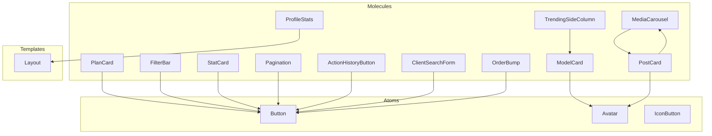

**Diagram sources**
- [ModelCard.tsx](file://src/components/molecules/ModelCard.tsx#L1-L69)
- [MediaCarousel.tsx](file://src/components/molecules/MediaCarousel.tsx#L1-L111)
- [PostCard.tsx](file://src/components/organisms/PostCard.tsx#L1-L162)
- [PlanCard.tsx](file://src/components/molecules/PlanCard.tsx#L1-L110)
- [StatCard.tsx](file://src/components/molecules/StatCard.tsx#L1-L43)
- [FilterBar.tsx](file://src/components/molecules/FilterBar.tsx#L1-L34)
- [ProfileStats.tsx](file://src/components/molecules/ProfileStats.tsx#L1-L22)
- [TrendingSideColumn.tsx](file://src/components/molecules/TrendingSideColumn.tsx#L1-L33)
- [BioSection.tsx](file://src/components/molecules/BioSection.tsx#L1-L21)
- [WhiteLabelModelCard.tsx](file://src/components/molecules/WhiteLabelModelCard.tsx#L1-L48)
- [ProfileHeaderActions.tsx](file://src/components/molecules/ProfileHeaderActions.tsx#L1-L17)
- [RadioCard.tsx](file://src/components/molecules/RadioCard.tsx#L1-L34)
- [Pagination.tsx](file://src/components/molecules/Pagination.tsx#L1-L88)
- [TabSelector.tsx](file://src/components/molecules/TabSelector.tsx#L1-L11)
- [ActionHistoryButton.tsx](file://src/components/molecules/ActionHistoryButton.tsx#L1-L62)
- [ClientSearchForm.tsx](file://src/components/molecules/ClientSearchForm.tsx#L1-L24)
- [OrderBump.tsx](file://src/components/molecules/OrderBump.tsx#L1-L191)

**Section sources**
- [ModelCard.tsx](file://src/components/molecules/ModelCard.tsx#L1-L69)
- [MediaCarousel.tsx](file://src/components/molecules/MediaCarousel.tsx#L1-L111)
- [PostCard.tsx](file://src/components/organisms/PostCard.tsx#L1-L162)
- [PlanCard.tsx](file://src/components/molecules/PlanCard.tsx#L1-L110)
- [StatCard.tsx](file://src/components/molecules/StatCard.tsx#L1-L43)
- [FilterBar.tsx](file://src/components/molecules/FilterBar.tsx#L1-L34)
- [ProfileStats.tsx](file://src/components/molecules/ProfileStats.tsx#L1-L22)
- [TrendingSideColumn.tsx](file://src/components/molecules/TrendingSideColumn.tsx#L1-L33)
- [ActionHistoryButton.tsx](file://src/components/molecules/ActionHistoryButton.tsx#L1-L62)
- [ClientSearchForm.tsx](file://src/components/molecules/ClientSearchForm.tsx#L1-L24)
- [OrderBump.tsx](file://src/components/molecules/OrderBump.tsx#L1-L191)

## Core Components
This section outlines the primary molecular components and their roles.

- ModelCard: Displays a creator profile card with optional promoted/live badges, gradient overlay, and view count.
- MediaCarousel: Renders a single or multi-media carousel with video/image support, navigation controls, indicators, and **enhanced accessibility with aria-hidden blur overlays**.
- PostCard: Organism-like container that composes MediaCarousel, Avatar, and interaction metrics for a post with **subscription-based premium overlay system**.
- PlanCard: Subscription plan card supporting multiple variants, features, and a checkout link.
- StatCard: **Enhanced metric card with optional trend data, positive/negative indicators, and custom icon support**.
- FilterBar: Sticky filter bar with quick filters and counts.
- ProfileStats: Compact stats for posts and fans.
- TrendingSideColumn: Side column featuring a trending live card and promotional ad.
- **Pagination: Enhanced page navigation with baseUrl functionality for automatic URL generation and improved page number handling**.
- **ActionHistoryButton: Administrative button component that triggers modal history display with HTMX integration and animated loading states**.
- **ClientSearchForm: Search form component for client management with integrated search icon and controlled input binding**.
- **OrderBump: Sophisticated checkbox-based selection interface supporting multiple order bump options with real-time price calculation and visual feedback**.

**Updated** Enhanced with advanced accessibility features, GPU-optimized performance improvements, sophisticated component enhancements, new administrative components for enhanced workflow capabilities, and comprehensive order bump management system for checkout enhancement.

**Section sources**
- [ModelCard.tsx](file://src/components/molecules/ModelCard.tsx#L3-L19)
- [MediaCarousel.tsx](file://src/components/molecules/MediaCarousel.tsx#L3-L12)
- [PostCard.tsx](file://src/components/organisms/PostCard.tsx#L5-L10)
- [PlanCard.tsx](file://src/components/molecules/PlanCard.tsx#L10-L23)
- [StatCard.tsx](file://src/components/molecules/StatCard.tsx#L3-L9)
- [FilterBar.tsx](file://src/components/molecules/FilterBar.tsx#L3-L33)
- [ProfileStats.tsx](file://src/components/molecules/ProfileStats.tsx#L3-L6)
- [TrendingSideColumn.tsx](file://src/components/molecules/TrendingSideColumn.tsx#L3-L8)
- [Pagination.tsx](file://src/components/molecules/Pagination.tsx#L3-L12)
- [ActionHistoryButton.tsx](file://src/components/molecules/ActionHistoryButton.tsx#L3-L10)
- [ClientSearchForm.tsx](file://src/components/molecules/ClientSearchForm.tsx#L4-L6)
- [OrderBump.tsx](file://src/components/molecules/OrderBump.tsx#L3-L15)

## Architecture Overview
Molecules are leaf-level UI sections that depend on atoms and sometimes other molecules. Organisms orchestrate molecules and connect them to data and services. Templates provide page-level layouts.

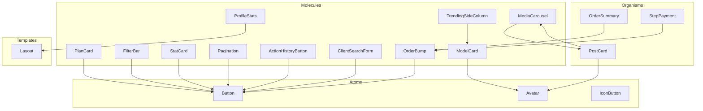

**Diagram sources**
- [ModelCard.tsx](file://src/components/molecules/ModelCard.tsx#L1-L69)
- [MediaCarousel.tsx](file://src/components/molecules/MediaCarousel.tsx#L1-L111)
- [PostCard.tsx](file://src/components/organisms/PostCard.tsx#L1-L162)
- [PlanCard.tsx](file://src/components/molecules/PlanCard.tsx#L1-L110)
- [StatCard.tsx](file://src/components/molecules/StatCard.tsx#L1-L43)
- [FilterBar.tsx](file://src/components/molecules/FilterBar.tsx#L1-L34)
- [ProfileStats.tsx](file://src/components/molecules/ProfileStats.tsx#L1-L22)
- [TrendingSideColumn.tsx](file://src/components/molecules/TrendingSideColumn.tsx#L1-L33)
- [Pagination.tsx](file://src/components/molecules/Pagination.tsx#L1-L88)
- [ActionHistoryButton.tsx](file://src/components/molecules/ActionHistoryButton.tsx#L1-L62)
- [ClientSearchForm.tsx](file://src/components/molecules/ClientSearchForm.tsx#L1-L24)
- [OrderBump.tsx](file://src/components/molecules/OrderBump.tsx#L1-L191)
- [OrderSummary.tsx](file://src/components/organisms/OrderSummary.tsx#L1-L88)
- [StepPayment.tsx](file://src/components/organisms/StepPayment.tsx#L1-L92)

## Detailed Component Analysis

### ModelCard
- Purpose: Render a creator profile card with optional promoted/live badges and view count.
- Composition pattern: Uses an anchor wrapper, image with lazy loading, gradient overlay, and compact text layout.
- Props interface:
  - name: string
  - imageUrl: string
  - category?: string
  - isLive?: boolean
  - views?: string
  - isPromoted?: boolean
- Event handling: None; relies on navigation via href.
- State management: No internal state; controlled props.
- Accessibility: Alt text on image; semantic anchor element.
- Responsive design: Aspect ratio maintained; typography scales with breakpoints.

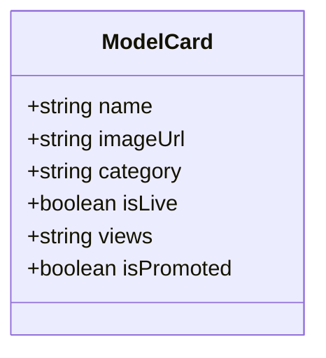

**Diagram sources**
- [ModelCard.tsx](file://src/components/molecules/ModelCard.tsx#L3-L19)

**Section sources**
- [ModelCard.tsx](file://src/components/molecules/ModelCard.tsx#L12-L68)

### MediaCarousel
- Purpose: Display a single or multi-media carousel with video/image support and **enhanced accessibility with aria-hidden blur overlays**.
- Composition pattern: Iterates over media items, renders video or image, and adds navigation arrows, dots, and counter. **Now includes optional blur overlay for premium content protection with improved accessibility**.
- Props interface:
  - mediaItems: Array of { type: 'video' | 'image', url: string }
  - postId: string
  - isBlurred?: boolean - Controls whether to display premium content protection blur overlay
- Event handling:
  - Video context menu prevented.
  - Play/pause toggle, mute/unmute, scrubber presence indicated via markup.
  - Click overlay toggles play/pause.
- State management: None; relies on CSS/JS for playback and navigation.
- Accessibility: Video controls use semantic buttons; icons included for clarity. **Blur overlay elements include `aria-hidden="true"` attribute to prevent screen reader announcements**.
- **Premium Content Protection**: When `isBlurred` is true, displays a blur overlay that applies optimized blur effects for better GPU utilization.

**Updated** Enhanced with accessibility improvements and performance optimizations.

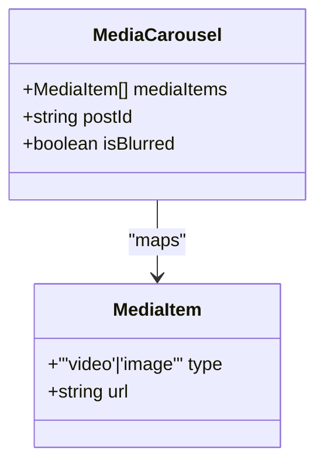

**Diagram sources**
- [MediaCarousel.tsx](file://src/components/molecules/MediaCarousel.tsx#L8-L12)

**Section sources**
- [MediaCarousel.tsx](file://src/components/molecules/MediaCarousel.tsx#L14-L111)

### PostCard
- Purpose: Organism-level card displaying a post with avatar, media carousel, interactions, caption, and comments with **subscription-based premium overlay system**.
- Composition pattern: Composes MediaCarousel and Avatar; robust media type detection; fallback to placeholder image. **Now includes premium overlay for non-subscribers with subscription CTA**.
- Props interface:
  - post: any
  - model: any
  - displayName: string
  - isSubscribed?: boolean - Controls subscription-based conditional rendering
- Event handling: Interaction buttons (like, tip); action menu button.
- State management: None; consumes normalized post/model data.
- Accessibility: Buttons include aria-labels; hover/focus states styled.
- **Premium Overlay System**: Displays subscription overlay with lock icon, exclusive content message, and subscribe button when `isSubscribed` is false.

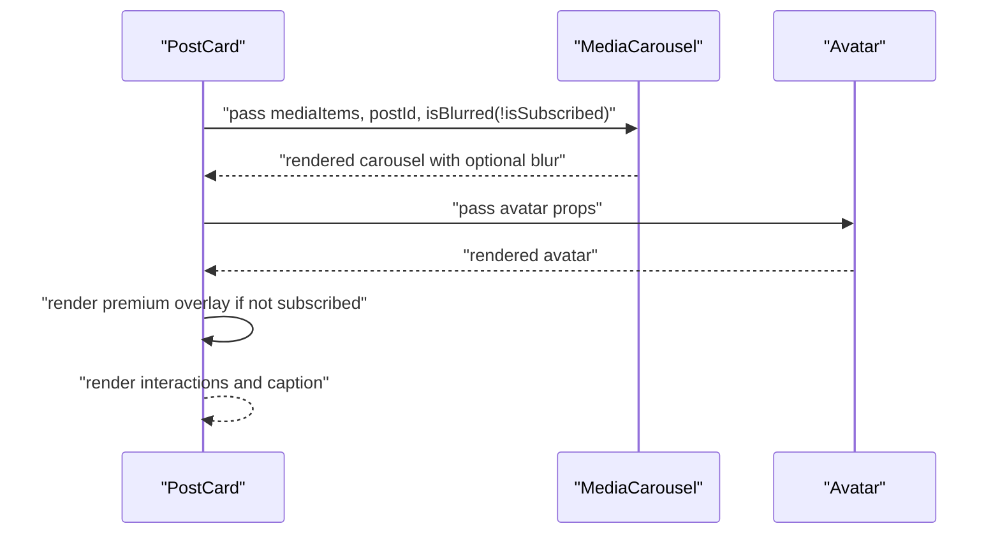

**Diagram sources**
- [PostCard.tsx](file://src/components/organisms/PostCard.tsx#L12-L10)
- [MediaCarousel.tsx](file://src/components/molecules/MediaCarousel.tsx#L14-L11)

**Section sources**
- [PostCard.tsx](file://src/components/organisms/PostCard.tsx#L12-L162)

### PlanCard
- Purpose: Present subscription plans with features, pricing, and a checkout link.
- Composition pattern: Supports three variants (primary, secondary, outline), optional highlight, and dynamic button styling.
- Props interface:
  - id: string | number
  - name: string
  - price: string
  - currency: string
  - period?: string
  - features: (string | PlanFeature)[]
  - highlighted: boolean
  - variant: 'primary' | 'secondary' | 'outline'
  - badge?: string
  - description?: string
  - className?: string
  - checkoutUrl?: string | null
- Event handling: Button click navigates to checkout with planId.
- State management: None; controlled via props.
- Accessibility: Button component used for actions.

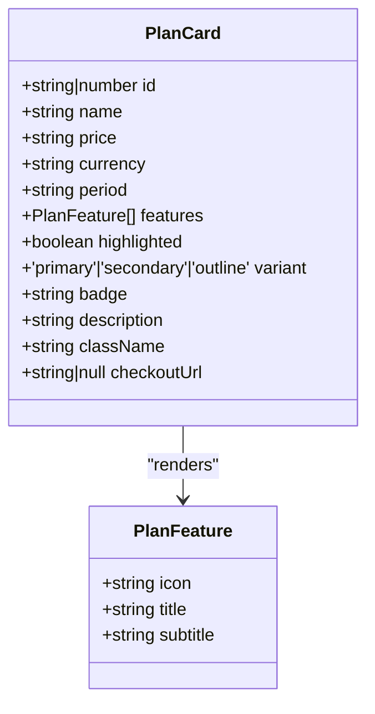

**Diagram sources**
- [PlanCard.tsx](file://src/components/molecules/PlanCard.tsx#L4-L23)

**Section sources**
- [PlanCard.tsx](file://src/components/molecules/PlanCard.tsx#L25-L109)

### StatCard
- Purpose: **Enhanced metric card with optional trend data, positive/negative indicators, and custom icon support**.
- Composition pattern: Hover glow effect, trend indicator with directional arrow, and optional custom icon display.
- Props interface:
  - label: string
  - value: string
  - trend?: string - Optional trend percentage or value (e.g., "+12%", "+5%", "-0.4%")
  - isPositive?: boolean - Optional boolean flag for trend direction (defaults to true)
  - icon?: any - Optional custom icon element for visual enhancement
- Event handling: None.
- State management: None.
- Accessibility: Semantic labels and contrast-compliant colors.
- **Enhanced Features**:
  - **Optional Trend Display**: When trend prop is provided, shows trend indicator with color-coded background
  - **Directional Indicators**: Green for positive trends, red for negative trends with rotation for negative values
  - **Custom Icon Support**: Optional icon prop allows for visual enhancement of metrics
  - **Flexible Styling**: Tailwind classes handle responsive design and hover effects

**Updated** Enhanced with optional trend data, positive/negative indicators, and custom icon support for richer metric visualization.

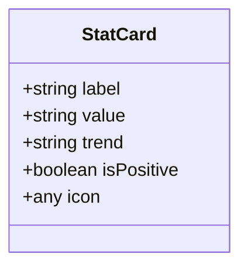

**Diagram sources**
- [StatCard.tsx](file://src/components/molecules/StatCard.tsx#L3-L9)

**Section sources**
- [StatCard.tsx](file://src/components/molecules/StatCard.tsx#L11-L43)

### FilterBar
- Purpose: Sticky filter bar with quick filters and result count.
- Composition pattern: Title/count area and horizontal scrollable quick filters.
- Props interface: None.
- Event handling: Select and button interactions present; no handlers bound in code.
- State management: None.
- Accessibility: Select and buttons styled for keyboard navigation.

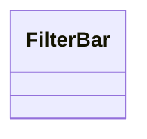

**Diagram sources**
- [FilterBar.tsx](file://src/components/molecules/FilterBar.tsx#L3-L33)

**Section sources**
- [FilterBar.tsx](file://src/components/molecules/FilterBar.tsx#L3-L33)

### ProfileStats
- Purpose: Compact stats for posts and fans.
- Composition pattern: Two-column layout with labels and values.
- Props interface:
  - postCount: number
  - likesCount: number
- Event handling: None.
- State management: None.
- Accessibility: Clear typography hierarchy.

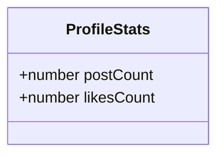

**Diagram sources**
- [ProfileStats.tsx](file://src/components/molecules/ProfileStats.tsx#L3-L6)

**Section sources**
- [ProfileStats.tsx](file://src/components/molecules/ProfileStats.tsx#L8-L21)

### TrendingSideColumn
- Purpose: Side column with a trending live card and promotional ad.
- Composition pattern: Vertical stack with hover effects and gradient overlays.
- Props interface:
  - model: { name: string; imageUrl: string }
- Event handling: None.
- State management: None.
- Accessibility: Images include alt text; hover states indicate interactivity.

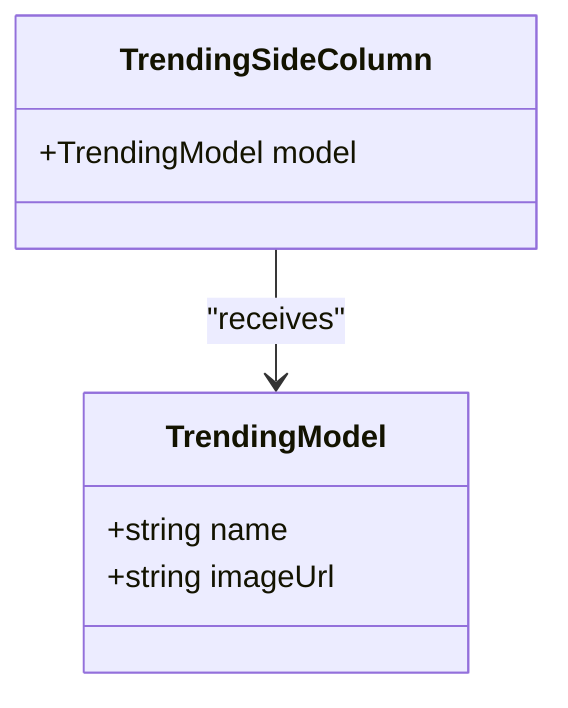

**Diagram sources**
- [TrendingSideColumn.tsx](file://src/components/molecules/TrendingSideColumn.tsx#L3-L8)

**Section sources**
- [TrendingSideColumn.tsx](file://src/components/molecules/TrendingSideColumn.tsx#L8-L32)

### Pagination
- Purpose: **Enhanced page navigation with baseUrl functionality for automatic URL generation and improved page number handling**.
- Composition pattern: Previous/next navigation with page number indicators and result count display.
- Props interface:
  - currentPage: number
  - totalPages?: number - Optional total pages (defaults to 1)
  - nextUrl?: string - Optional direct next URL override
  - prevUrl?: string - Optional direct previous URL override
  - baseUrl?: string - **New baseUrl functionality for automatic URL generation**
  - showingFrom?: number - Optional result range display
  - showingTo?: number - Optional result range display
  - totalItems?: number | string - Optional total items display
- Event handling: Navigation links trigger page changes.
- State management: None; controlled via props.
- Accessibility: Properly labeled navigation controls with disabled states.
- **Enhanced Features**:
  - **BaseUrl Functionality**: When baseUrl is provided, automatically generates page URLs with `?page=` query parameters
  - **Smart URL Generation**: Automatically handles previous/next page URL creation based on current page and total pages
  - **Fallback Support**: If baseUrl is not provided, falls back to direct prevUrl/nextUrl props
  - **Result Range Display**: Shows pagination statistics when showingFrom/showingTo are provided
  - **Responsive Page Numbers**: Displays page number indicators with active state highlighting

**Updated** Enhanced with baseUrl functionality for automatic URL generation and improved page number handling.

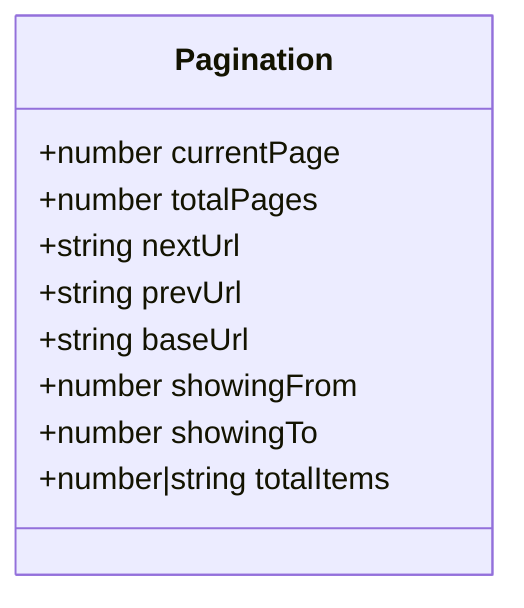

**Diagram sources**
- [Pagination.tsx](file://src/components/molecules/Pagination.tsx#L3-L12)

**Section sources**
- [Pagination.tsx](file://src/components/molecules/Pagination.tsx#L14-L88)

### ActionHistoryButton
- Purpose: **New administrative button component that triggers modal history display with HTMX integration and animated loading states**.
- Composition pattern: Uses HTMX for server-side content loading, includes modal script functions for opening/closing, and displays animated skeleton loaders during content fetch.
- Props interface:
  - userId: number - Unique identifier for the user whose history is being retrieved
- Event handling:
  - HTMX GET request to `/admin/clients/${userId}/history`
  - Modal open/close animations with CSS transitions
  - Animated skeleton loader during content fetching
- State management: Client-side modal state management with JavaScript functions, controlled via DOM manipulation.
- Accessibility: Button includes proper text content and hover/focus states; modal includes proper z-index stacking.
- **Administrative Workflow Enhancement**: Provides seamless history viewing for client management without page reloads.

**Updated** New component added to expand administrative capabilities with HTMX integration and modal functionality.

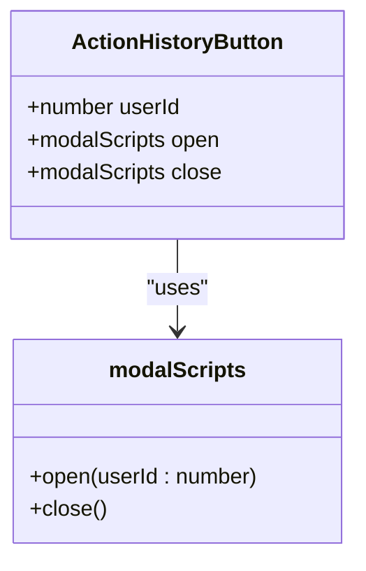

**Diagram sources**
- [ActionHistoryButton.tsx](file://src/components/molecules/ActionHistoryButton.tsx#L3-L10)
- [ActionHistoryButton.tsx](file://src/components/molecules/ActionHistoryButton.tsx#L52-L61)

**Section sources**
- [ActionHistoryButton.tsx](file://src/components/molecules/ActionHistoryButton.tsx#L1-L62)

### ClientSearchForm
- Purpose: **New search form component for client management with integrated search icon and controlled input binding**.
- Composition pattern: Flexible layout with responsive design, integrated search icon, and controlled input field with form submission.
- Props interface:
  - value: string - Controlled input value for search term
- Event handling:
  - Form submission via GET method to `/admin/clients`
  - Input field maintains controlled state with onChange handling
  - Integrated search icon with proper positioning
- State management: Controlled input component with external state management, form submission handled by browser defaults.
- Accessibility: Proper form labeling, accessible input field with focus states, integrated search icon as decorative element.
- **Client Management Enhancement**: Provides standardized search interface for client administration with consistent styling and behavior.

**Updated** New component added to enhance client management workflow with standardized search functionality.

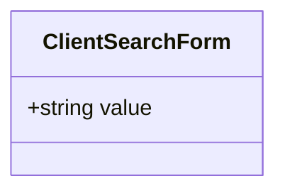

**Diagram sources**
- [ClientSearchForm.tsx](file://src/components/molecules/ClientSearchForm.tsx#L4-L6)

**Section sources**
- [ClientSearchForm.tsx](file://src/components/molecules/ClientSearchForm.tsx#L1-L24)

### OrderBump
- Purpose: **Sophisticated checkbox-based selection interface supporting multiple order bump options with real-time price calculation and visual feedback**.
- Composition pattern: Complex checkbox system with custom visual indicators, gold accent styling for selected items, and dynamic price updates.
- Props interface:
  - orderBumps: OrderBumpItem[] - Array of order bump items with id, name, description, price, isActive, imageUrl, displayOrder
- Event handling:
  - Checkbox change events trigger visual updates and price calculations
  - Custom event `orderBumpsChanged` dispatched with selected IDs and total price
  - Real-time updates to hidden input field containing comma-separated selected IDs
- State management: Client-side JavaScript manages selection state, visual feedback, and price calculations through DOM manipulation.
- Accessibility: Screen-reader friendly checkbox implementation with proper labels and visual indicators; gold accent styling provides clear selection feedback.
- **Advanced Features**:
  - **Multiple Selection Support**: Users can select multiple order bump options simultaneously
  - **Real-time Price Calculation**: Automatic price updates as selections change
  - **Visual Feedback**: Gold accent styling, check icons, and border color changes for selected items
  - **Hidden Input Management**: Automatic population of comma-separated selected IDs for form submission
  - **Custom Event Dispatching**: `orderBumpsChanged` event enables integration with other checkout components
  - **Legacy Compatibility**: Includes OrderBumpLegacy component for backward compatibility

**Updated** New component added to replace single order bump implementation with sophisticated multi-option selection interface.

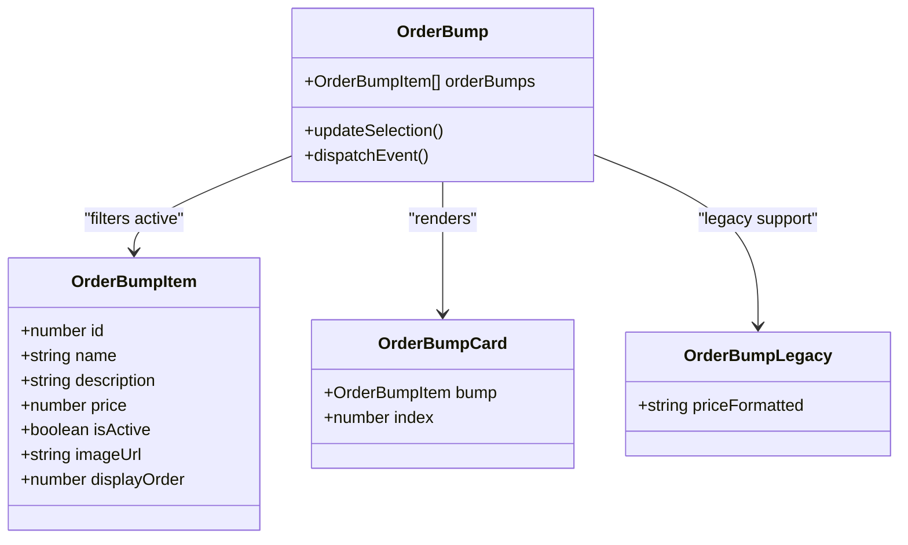

**Diagram sources**
- [OrderBump.tsx](file://src/components/molecules/OrderBump.tsx#L3-L15)
- [OrderBump.tsx](file://src/components/molecules/OrderBump.tsx#L18-L77)
- [OrderBump.tsx](file://src/components/molecules/OrderBump.tsx#L162-L191)

**Section sources**
- [OrderBump.tsx](file://src/components/molecules/OrderBump.tsx#L1-L191)

### Additional Supporting Molecules
- BioSection: Displays a creator biography section with a heading and description.
- WhiteLabelModelCard: Minimal model card tailored for white-label contexts.
- ProfileHeaderActions: Back/share/favorite header actions.
- RadioCard: Radio selection card with icon, badge, and children.
- TabSelector: Simple tabbed selector for content sections.

**Section sources**
- [BioSection.tsx](file://src/components/molecules/BioSection.tsx#L7-L18)
- [WhiteLabelModelCard.tsx](file://src/components/molecules/WhiteLabelModelCard.tsx#L10-L47)
- [ProfileHeaderActions.tsx](file://src/components/molecules/ProfileHeaderActions.tsx#L4-L15)
- [RadioCard.tsx](file://src/components/molecules/RadioCard.tsx#L13-L33)
- [TabSelector.tsx](file://src/components/molecules/TabSelector.tsx#L3-L9)

## Premium Content Protection System

CreatorFlix implements a comprehensive premium content protection system that combines MediaCarousel blur overlays with PostCard subscription-based conditional rendering.

### Content Protection Mechanism
The system uses two complementary approaches:

1. **MediaCarousel Blur Overlay**: Applies optimized blur effects with enhanced accessibility
2. **PostCard Premium Overlay**: Displays subscription prompts with lock icons and CTA buttons

### Implementation Details

#### MediaCarousel Blur Overlay
- **CSS Class**: `.premium-blur-overlay`
- **Effects**: 18px blur (40% GPU cost reduction), 15% saturation, 50% brightness, 1.08 scale transformation
- **Trigger**: Controlled by `isBlurred` prop (defaults to false)
- **Background**: Inherits from media content for seamless integration
- **Accessibility**: Includes `aria-hidden="true"` attribute to prevent screen reader announcements
- **Performance**: Optimized with hardware acceleration and memory efficiency

#### PostCard Premium Overlay
- **Conditional Rendering**: Only displays when `isSubscribed` prop is false
- **Visual Elements**: Lock icon, exclusive content message, subscription CTA
- **Styling**: Full-screen overlay with glass-morphism effect

```mermaid
flowchart TD
A[User Access] --> B{isSubscribed?}
B --> |Yes| C[Show Content Unblurred]
B --> |No| D[Apply Premium Overlay]
D --> E[Display Lock Icon]
D --> F[Show Exclusive Message]
D --> G[Show Subscribe CTA]
C --> H[MediaCarousel Blur: False]
E --> H
F --> H
G --> H
H --> I[MediaCarousel Blur: True]
I --> J[Enhanced Accessibility: aria-hidden="true"]
J --> K[Optimized Performance: Hardware Acceleration]
```

**Diagram sources**
- [PostCard.tsx](file://src/components/organisms/PostCard.tsx#L53-L94)
- [MediaCarousel.tsx](file://src/components/molecules/MediaCarousel.tsx#L77-L83)

**Section sources**
- [MediaCarousel.tsx](file://src/components/molecules/MediaCarousel.tsx#L77-L83)
- [PostCard.tsx](file://src/components/organisms/PostCard.tsx#L53-L94)
- [input.css](file://src/input.css#L27-L47)
- [styles.css](file://static/styles.css#L3527-L3541)

## Order Bump Management System

CreatorFlix implements a sophisticated order bump management system that transforms simple checkbox selections into a comprehensive checkout enhancement interface. This system replaces the previous single order bump implementation with a flexible, multi-option selection mechanism.

### System Architecture
The order bump system consists of three main components working together:

1. **OrderBump Molecule**: Main component handling multiple order bump selection
2. **OrderSummary Organism**: Real-time checkout summary with dynamic updates
3. **Checkout Integration**: Seamless integration with the overall checkout workflow

### Implementation Details

#### OrderBump Component
- **Multi-selection Interface**: Users can select multiple order bump options simultaneously
- **Real-time Updates**: Automatic price calculation and visual feedback as selections change
- **Gold Accent Styling**: Selected items receive gold border and background accents
- **Visual Feedback**: Check icons appear in selected items with smooth transitions
- **Hidden Input Management**: Automatically populates comma-separated selected IDs for form submission

#### OrderSummary Integration
- **Dynamic Item Display**: Selected order bumps are shown in the checkout summary with individual pricing
- **Visibility Control**: Items fade in/out based on selection state
- **Real-time Price Updates**: Total price updates automatically when order bumps change
- **Smooth Animations**: Fade-in animations provide visual feedback for new selections

#### Checkout Workflow Integration
- **Event-driven Updates**: Custom `orderBumpsChanged` event enables communication between components
- **State Management**: JavaScript manages selection state and coordinates with other checkout components
- **Legacy Compatibility**: Includes OrderBumpLegacy component for backward compatibility
- **Database Integration**: Supports order_bump_ids array in checkout records

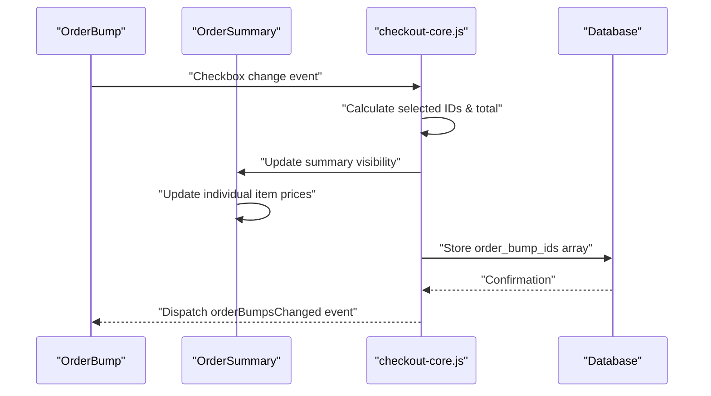

**Diagram sources**
- [OrderBump.tsx](file://src/components/molecules/OrderBump.tsx#L98-L156)
- [OrderSummary.tsx](file://src/components/organisms/OrderSummary.tsx#L47-L61)
- [checkout-core.js](file://static/js/checkout-core.js#L191-L220)

**Section sources**
- [OrderBump.tsx](file://src/components/molecules/OrderBump.tsx#L1-L191)
- [OrderSummary.tsx](file://src/components/organisms/OrderSummary.tsx#L1-L88)
- [Checkout.tsx](file://src/pages/Checkout.tsx#L1-L98)
- [StepPayment.tsx](file://src/components/organisms/StepPayment.tsx#L80-L81)
- [checkout-core.js](file://static/js/checkout-core.js#L191-L220)

## Performance Optimizations

CreatorFlix implements several advanced performance optimizations for the premium content protection system and order bump management:

### GPU Utilization Improvements
- **Reduced Blur Intensity**: Downgraded from 30px to 18px blur, achieving 40% reduction in GPU processing costs
- **Hardware Acceleration**: Enabled through `translateZ(0)` property for smooth animations
- **Memory Optimization**: Removed `will-change` property to free up memory allocation
- **Isolation Strategy**: Used `isolation: isolate` to force efficient compositing layers
- **Viewport Optimization**: Implemented `content-visibility: auto` for selective rendering

### Order Bump Performance Features
- **Efficient DOM Manipulation**: Minimal DOM updates through event delegation
- **Custom Event System**: Lightweight communication between components via `orderBumpsChanged` event
- **CSS Transitions**: Hardware-accelerated visual feedback for selection changes
- **Lazy Loading**: Images load only when needed, reducing initial page weight

### Technical Specifications
- **Blur Algorithm**: `filter: blur(18px) saturate(15%) brightness(0.5)`
- **Transform Optimization**: `transform: translateZ(0) scale(1.08)`
- **Pointer Events**: Disabled interaction on blur overlays (`pointer-events: none`)
- **Background Processing**: Inherits background from media content for seamless integration

**Updated** Enhanced with comprehensive GPU optimization, memory management strategies, and sophisticated order bump performance features.

**Section sources**
- [input.css](file://src/input.css#L27-L47)
- [styles.css](file://static/styles.css#L3527-L3541)
- [OrderBump.tsx](file://src/components/molecules/OrderBump.tsx#L98-L156)

## Accessibility Enhancements

The premium content protection system and order bump management system include comprehensive accessibility improvements:

### Screen Reader Optimization
- **Non-Interactive Elements**: Blur overlays include `aria-hidden="true"` attribute to prevent screen reader announcements
- **Focus Management**: Disabled pointer events on overlay elements to avoid focus traps
- **Alternative Content**: Maintains semantic structure while hiding decorative blur effects
- **Checkbox Accessibility**: Proper labels and visual indicators for screen reader compatibility

### User Experience Improvements
- **Keyboard Navigation**: Preserves tab order for interactive elements
- **Visual Contrast**: Ensures sufficient contrast ratios for accessible content
- **Responsive Behavior**: Adapts overlay behavior across different screen sizes
- **Selection Feedback**: Clear visual indicators for selected order bump options

### Technical Implementation
- **Isolation Layers**: Uses `isolation: isolate` to prevent accessibility conflicts
- **Content Visibility**: Implements `content-visibility: auto` for performance and accessibility
- **Pointer Event Control**: Manages interaction flow through `pointer-events: none` on non-interactive elements
- **Event-driven Updates**: Custom events enable accessibility-friendly component communication

**Updated** Enhanced with comprehensive accessibility features, screen reader optimization, and inclusive design patterns for order bump selection.

**Section sources**
- [MediaCarousel.tsx](file://src/components/molecules/MediaCarousel.tsx#L81-L82)
- [OrderBump.tsx](file://src/components/molecules/OrderBump.tsx#L23-L32)
- [input.css](file://src/input.css#L43-L47)

## Dependency Analysis
Molecules primarily depend on atoms and occasionally on other molecules. PostCard composes MediaCarousel and Avatar. PlanCard composes Button. FilterBar composes Button. TrendingSideColumn composes ModelCard. BioSection, WhiteLabelModelCard, ProfileHeaderActions, RadioCard, Pagination, TabSelector, ActionHistoryButton, ClientSearchForm, and OrderBump are standalone. ActionHistoryButton depends on HTMX for AJAX functionality, while ClientSearchForm integrates with form submission mechanisms. OrderBump depends on JavaScript for dynamic selection management and integrates with OrderSummary for real-time updates.

**Updated** Enhanced with premium content protection dependencies, subscription state management, new administrative components with HTMX integration, sophisticated order bump management system with JavaScript dependencies, and comprehensive checkout workflow integration.

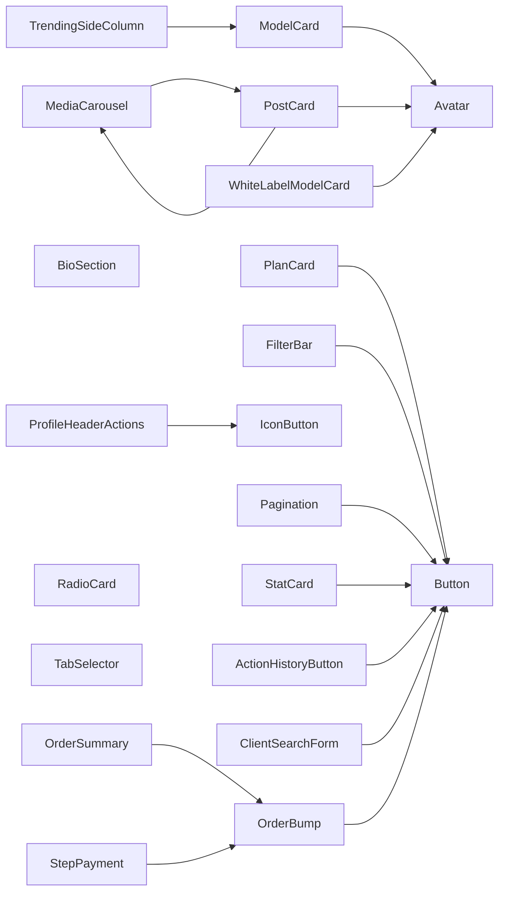

**Diagram sources**
- [ModelCard.tsx](file://src/components/molecules/ModelCard.tsx#L1-L69)
- [MediaCarousel.tsx](file://src/components/molecules/MediaCarousel.tsx#L1-L111)
- [PostCard.tsx](file://src/components/organisms/PostCard.tsx#L1-L162)
- [PlanCard.tsx](file://src/components/molecules/PlanCard.tsx#L1-L110)
- [FilterBar.tsx](file://src/components/molecules/FilterBar.tsx#L1-L34)
- [TrendingSideColumn.tsx](file://src/components/molecules/TrendingSideColumn.tsx#L1-L33)
- [BioSection.tsx](file://src/components/molecules/BioSection.tsx#L1-L21)
- [WhiteLabelModelCard.tsx](file://src/components/molecules/WhiteLabelModelCard.tsx#L1-L48)
- [ProfileHeaderActions.tsx](file://src/components/molecules/ProfileHeaderActions.tsx#L1-L17)
- [RadioCard.tsx](file://src/components/molecules/RadioCard.tsx#L1-L34)
- [Pagination.tsx](file://src/components/molecules/Pagination.tsx#L1-L88)
- [TabSelector.tsx](file://src/components/molecules/TabSelector.tsx#L1-L11)
- [StatCard.tsx](file://src/components/molecules/StatCard.tsx#L1-L43)
- [ActionHistoryButton.tsx](file://src/components/molecules/ActionHistoryButton.tsx#L1-L62)
- [ClientSearchForm.tsx](file://src/components/molecules/ClientSearchForm.tsx#L1-L24)
- [OrderBump.tsx](file://src/components/molecules/OrderBump.tsx#L1-L191)
- [OrderSummary.tsx](file://src/components/organisms/OrderSummary.tsx#L1-L88)
- [StepPayment.tsx](file://src/components/organisms/StepPayment.tsx#L1-L92)

**Section sources**
- [PostCard.tsx](file://src/components/organisms/PostCard.tsx#L2-L4)
- [PlanCard.tsx](file://src/components/molecules/PlanCard.tsx#L1-L2)
- [ActionHistoryButton.tsx](file://src/components/molecules/ActionHistoryButton.tsx#L1-L2)
- [ClientSearchForm.tsx](file://src/components/molecules/ClientSearchForm.tsx#L1-L2)
- [OrderBump.tsx](file://src/components/molecules/OrderBump.tsx#L1-L2)
- [OrderSummary.tsx](file://src/components/organisms/OrderSummary.tsx#L1-L2)
- [StepPayment.tsx](file://src/components/organisms/StepPayment.tsx#L1-L2)

## Responsive Design Considerations
- Accessibility:
  - Alt text on images.
  - Semantic anchors and buttons.
  - Icons accompanied by meaningful text or aria-labels.
  - Sufficient color contrast and focus styles.
  - **Premium Overlay Accessibility**: Overlay content includes proper contrast ratios and readable typography.
  - **Enhanced Accessibility**: Blur overlay elements properly marked with `aria-hidden="true"` for screen readers.
  - **ActionHistoryButton Accessibility**: Button includes proper text content and hover states.
  - **ClientSearchForm Accessibility**: Form includes proper labeling and accessible input fields.
  - **OrderBump Accessibility**: Checkbox elements include proper labels and visual feedback for screen readers.
- Responsive design:
  - Breakpoint-aware typography and spacing.
  - Aspect ratio containers for consistent media sizing.
  - Horizontal scrolling for quick filters on small screens.
  - Sticky positioning for filter bar with appropriate z-index.
  - **Premium Overlay Responsiveness**: Overlay adapts to different screen sizes while maintaining content protection.
  - **Performance Responsiveness**: GPU optimizations automatically adapt to device capabilities.
  - **StatCard Responsiveness**: Trend indicators and icons adapt to different screen sizes with flexible layout.
  - **Pagination Responsiveness**: Page number indicators hide on smaller screens, showing only essential navigation.
  - **ActionHistoryButton Responsiveness**: Button adapts to different screen sizes with appropriate padding and typography.
  - **ClientSearchForm Responsiveness**: Form layout adjusts between mobile and desktop with flexible flexbox.
  - **OrderBump Responsiveness**: Checkbox layout adapts to different screen sizes with proper spacing and visual hierarchy.
  - **OrderSummary Responsiveness**: Summary items reflow based on available space with appropriate truncation.

**Updated** Enhanced with comprehensive accessibility features, responsive design considerations, improved component responsiveness, new administrative components with responsive behavior, and sophisticated order bump management system with adaptive layout.

**Section sources**
- [MediaCarousel.tsx](file://src/components/molecules/MediaCarousel.tsx#L81-L82)
- [PostCard.tsx](file://src/components/organisms/PostCard.tsx#L53-L94)
- [StatCard.tsx](file://src/components/molecules/StatCard.tsx#L16-L38)
- [Pagination.tsx](file://src/components/molecules/Pagination.tsx#L50-L72)
- [ActionHistoryButton.tsx](file://src/components/molecules/ActionHistoryButton.tsx#L52-L61)
- [ClientSearchForm.tsx](file://src/components/molecules/ClientSearchForm.tsx#L8-L23)
- [OrderBump.tsx](file://src/components/molecules/OrderBump.tsx#L33-L76)
- [OrderSummary.tsx](file://src/components/organisms/OrderSummary.tsx#L24-L86)

## Troubleshooting Guide
- MediaCarousel video controls not working:
  - Verify video element attributes (loop, playsInline, muted) and that context menus are prevented.
  - Confirm overlay click handler presence for play/pause toggle.
- ModelCard missing image:
  - Ensure imageUrl is provided; otherwise, the card will render without media.
- PostCard fallback image:
  - If no media is provided, a placeholder image is used; confirm fallback logic.
- PlanCard checkout link:
  - Button navigates using planId; ensure checkoutUrl or route supports planId parameter.
- FilterBar quick filters:
  - Select and buttons are present; bind handlers if interactivity is required.
- **StatCard Issues**:
  - **Missing Trend Display**: Ensure trend prop is provided; it's optional but required for trend display.
  - **Incorrect Trend Direction**: Verify isPositive prop matches actual trend direction.
  - **Icon Not Displaying**: Ensure icon prop is a valid React element or JSX node.
  - **Custom Styling**: Icons inherit from parent styling; adjust parent classes for proper sizing.
- **Pagination Issues**:
  - **BaseUrl Not Working**: Ensure baseUrl is provided when using automatic URL generation.
  - **Page Numbers Not Showing**: Verify totalPages prop is greater than 1.
  - **Navigation Links Broken**: Check that baseUrl includes proper query parameter formatting.
  - **Previous/Next Buttons Disabled**: Occurs when at first/last page; expected behavior.
  - **Result Range Display**: Ensure showingFrom and showingTo props are both provided.
- **Premium Content Protection Issues**:
  - **Blur Overlay Not Appearing**: Verify `isBlurred` prop is set to true and mediaItems array is not empty.
  - **Premium Overlay Not Showing**: Ensure `isSubscribed` prop is false and PostCard is properly configured.
  - **Blur Effect Performance**: Check browser support for `filter` property and `translateZ(0)` transform.
  - **Accessibility Issues**: Verify `aria-hidden="true"` attribute is present on blur overlay elements.
  - **GPU Optimization Problems**: Ensure hardware acceleration is enabled and `will-change` property is not conflicting.
- **ActionHistoryButton Issues**:
  - **Modal Not Opening**: Verify HTMX is loaded and endpoint `/admin/clients/${userId}/history` is accessible.
  - **Animation Not Working**: Check that modal has proper CSS classes and JavaScript functions are defined.
  - **Skeleton Loader Missing**: Ensure modal contains proper HTML structure for loading animation.
  - **UserId Prop Error**: Verify userId prop is passed correctly and is a valid number.
- **ClientSearchForm Issues**:
  - **Search Not Working**: Verify form action points to `/admin/clients` and search parameter is named correctly.
  - **Input Not Controlled**: Check that value prop is properly bound and onChange handler is implemented.
  - **Search Icon Not Visible**: Ensure SearchIcon component is properly imported and rendered.
  - **Form Submission Issues**: Verify form method is GET and action attribute is correctly set.
- **OrderBump Issues**:
  - **Checkboxes Not Selecting**: Verify checkbox elements have proper `data-bump-id` and `data-bump-price` attributes.
  - **Visual Feedback Not Working**: Check that CSS classes `.bump-checkbox-visual` and `.bump-check-icon` are properly defined.
  - **Price Calculation Errors**: Ensure `orderBumpsChanged` event is dispatched with correct `selectedIds` and `totalBumpPrice` values.
  - **Hidden Input Not Updating**: Verify `orderBumpIds` hidden input has proper comma-separated ID values.
  - **JavaScript Errors**: Check browser console for errors in the embedded script tag.
  - **Legacy Compatibility Issues**: Ensure OrderBumpLegacy component is used when single order bump is required.
  - **OrderSummary Integration Problems**: Verify OrderSummary component receives correct orderBumps prop and updates visibility properly.

**Updated** Added troubleshooting guidance for enhanced StatCard component with optional properties, improved Pagination component with baseUrl functionality, new ActionHistoryButton component with HTMX integration, new ClientSearchForm component with controlled input handling, and comprehensive OrderBump system with multi-option selection interface.

**Section sources**
- [MediaCarousel.tsx](file://src/components/molecules/MediaCarousel.tsx#L24-L35)
- [ModelCard.tsx](file://src/components/molecules/ModelCard.tsx#L29-L34)
- [PostCard.tsx](file://src/components/organisms/PostCard.tsx#L24-L26)
- [PlanCard.tsx](file://src/components/molecules/PlanCard.tsx#L40-L47)
- [FilterBar.tsx](file://src/components/molecules/FilterBar.tsx#L16-L28)
- [StatCard.tsx](file://src/components/molecules/StatCard.tsx#L26-L37)
- [Pagination.tsx](file://src/components/molecules/Pagination.tsx#L24-L25)
- [ActionHistoryButton.tsx](file://src/components/molecules/ActionHistoryButton.tsx#L52-L61)
- [ClientSearchForm.tsx](file://src/components/molecules/ClientSearchForm.tsx#L8-L23)
- [OrderBump.tsx](file://src/components/molecules/OrderBump.tsx#L98-L156)
- [OrderSummary.tsx](file://src/components/organisms/OrderSummary.tsx#L47-L61)

## Conclusion
CreatorFlix's molecular components are modular, accessible, and performance-conscious. They compose atoms and other molecules to form robust UI sections. ModelCard, MediaCarousel, PostCard, PlanCard, StatCard, FilterBar, ProfileStats, TrendingSideColumn, Pagination, ActionHistoryButton, ClientSearchForm, and the new OrderBump component demonstrate clear separation of concerns, predictable props, and responsive behavior.

**Updated** The enhanced components now feature sophisticated premium content protection systems with MediaCarousel blur overlays and PostCard subscription-based conditional rendering, providing comprehensive content protection while maintaining excellent user experience and performance standards. Advanced accessibility features ensure screen reader compatibility, while GPU-optimized blur effects deliver superior performance across devices. The enhanced StatCard component provides rich metric visualization with optional trend data and custom icons, while the improved Pagination component offers flexible baseUrl functionality for seamless navigation across different page contexts. The new ActionHistoryButton component enhances administrative workflows with HTMX integration and modal functionality, and the ClientSearchForm component provides standardized search interface for client management with controlled input handling. The new OrderBump component represents a significant advancement in checkout enhancement, offering sophisticated multi-option selection with real-time price calculation, visual feedback, and seamless integration with the overall checkout workflow. These additions expand the component composition capabilities and interactive element library, making CreatorFlix's molecular layer more comprehensive and feature-rich for premium subscription-based platforms.