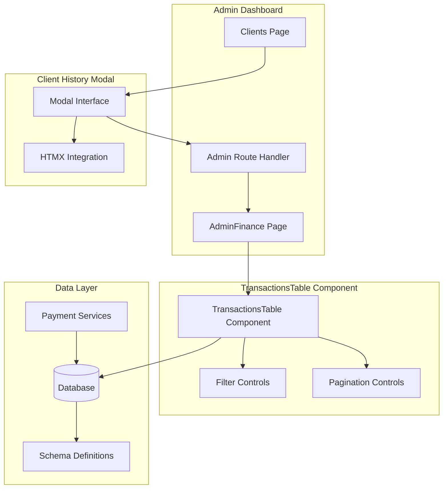
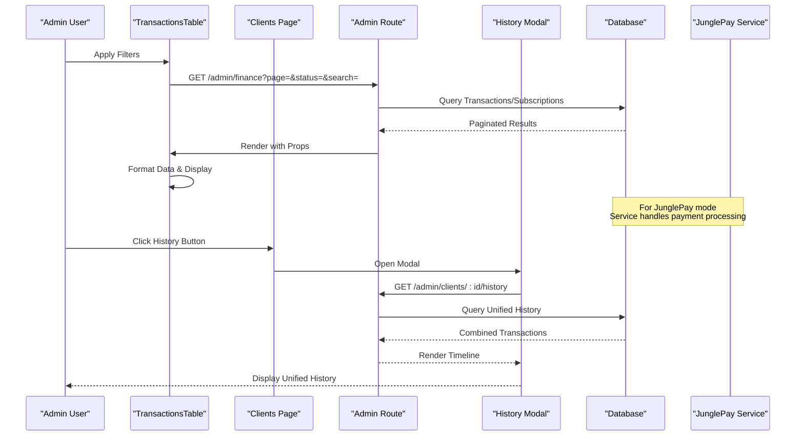
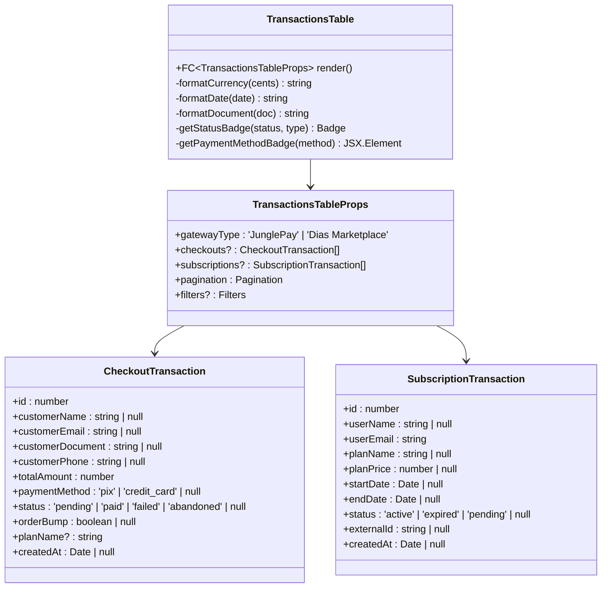
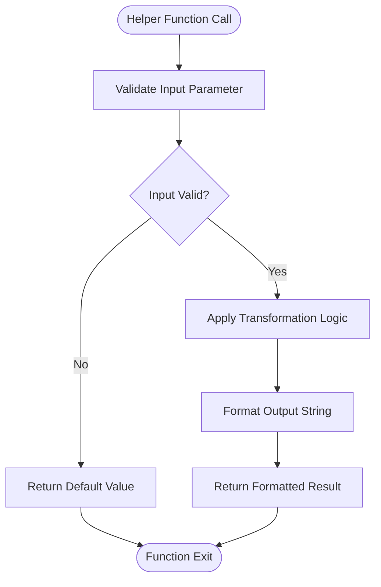
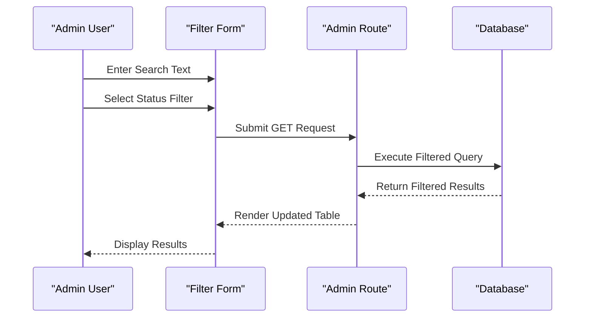
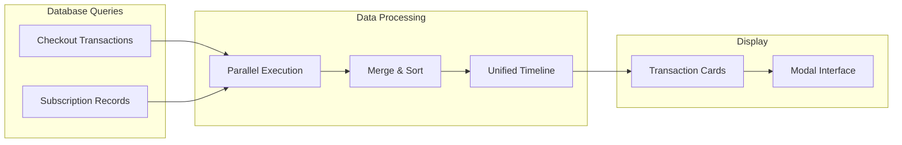
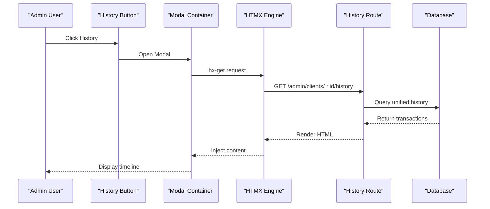

# TransactionsTable Component

<cite>
**Referenced Files in This Document**
- [TransactionsTable.tsx](file://src/components/organisms/TransactionsTable.tsx)
- [Finance.tsx](file://src/pages/admin/Finance.tsx)
- [admin.tsx](file://src/routes/admin.tsx)
- [Clients.tsx](file://src/pages/admin/Clients.tsx)
- [schema.ts](file://src/db/schema.ts)
- [index.ts](file://src/db/index.ts)
- [junglepay.ts](file://src/services/junglepay.ts)
</cite>

## Update Summary
**Changes Made**
- Added new section on Unified Transaction History Feature
- Updated Integration Points section to include client history modal
- Enhanced Architecture and Data Flow diagrams to show new client history route
- Added new section on Modal-Based Transaction Display
- Updated component overview to reflect expanded functionality

## Table of Contents
1. [Introduction](#introduction)
2. [Component Overview](#component-overview)
3. [Architecture and Data Flow](#architecture-and-data-flow)
4. [Component Structure](#component-structure)
5. [Type Definitions](#type-definitions)
6. [Helper Functions](#helper-functions)
7. [Rendering Logic](#rendering-logic)
8. [Filtering and Pagination](#filtering-and-pagination)
9. [Unified Transaction History Feature](#unified-transaction-history-feature)
10. [Modal-Based Transaction Display](#modal-based-transaction-display)
11. [Integration Points](#integration-points)
12. [Styling and Theming](#styling-and-theming)
13. [Performance Considerations](#performance-considerations)
14. [Troubleshooting Guide](#troubleshooting-guide)
15. [Conclusion](#conclusion)

## Introduction

The TransactionsTable component is a comprehensive financial reporting component designed for the admin dashboard of a subscription-based platform. It provides administrators with a unified interface to view and manage both payment transactions (via JunglePay) and subscription records (via Dias Marketplace). The component supports real-time filtering, pagination, and dual gateway visualization, making it a central hub for financial oversight.

**Updated**: The component now integrates with a new unified transaction history feature that displays both checkout transactions and subscription records in a chronological timeline format, accessible through modal interfaces from the Clients management page.

This component integrates seamlessly with the backend payment infrastructure, displaying transaction data in an intuitive table format with status indicators, payment methods, and customer information. It serves as a critical tool for monitoring revenue streams and managing customer subscriptions across multiple payment providers.

## Component Overview

The TransactionsTable component is built using Hono JSX and follows React functional component patterns. It operates as a stateless component that receives all necessary data through props, making it highly reusable and predictable. The component supports two distinct data modes:

- **JunglePay Mode**: Displays individual payment transactions with customer details, payment methods, and order bump information
- **Dias Marketplace Mode**: Shows subscription records with user information, plan details, and billing cycles

**Diagram sources**
- [TransactionsTable.tsx](file://src/components/organisms/TransactionsTable.tsx#L124-L318)
- [Finance.tsx](file://src/pages/admin/Finance.tsx#L31-L150)
- [admin.tsx](file://src/routes/admin.tsx#L50-L186)
- [Clients.tsx](file://src/pages/admin/Clients.tsx#L114-L131)

## Architecture and Data Flow

The component participates in a well-structured data flow that spans multiple layers of the application architecture:

**Diagram sources**
- [admin.tsx](file://src/routes/admin.tsx#L50-L186)
- [TransactionsTable.tsx](file://src/components/organisms/TransactionsTable.tsx#L152-L190)
- [junglepay.ts](file://src/services/junglepay.ts#L145-L305)
- [Clients.tsx](file://src/pages/admin/Clients.tsx#L114-L131)

The data flow demonstrates how the component receives pre-formatted data from the backend route handler, which performs complex database queries with filtering and pagination logic. The new client history feature adds a unified timeline display that combines both checkout transactions and subscription records for a comprehensive view of customer financial activity.

## Component Structure

The TransactionsTable component follows a modular structure with clear separation of concerns:

### Main Component Export
The component exports a functional component with comprehensive prop typing, ensuring type safety across the application.

### Type System
The component defines two primary data interfaces:
- **CheckoutTransaction**: For individual payment transactions
- **SubscriptionTransaction**: For recurring subscription billing

### Helper Functions
The component includes specialized helper functions for data formatting and display:

**Diagram sources**
- [TransactionsTable.tsx](file://src/components/organisms/TransactionsTable.tsx#L6-L46)

**Section sources**
- [TransactionsTable.tsx](file://src/components/organisms/TransactionsTable.tsx#L1-L319)

## Type Definitions

The component employs a robust type system to ensure data integrity and developer experience:

### CheckoutTransaction Interface
Designed for individual payment processing scenarios, this interface captures comprehensive customer and transaction information:

- **Customer Information**: Name, email, document, and phone number
- **Financial Data**: Total amount in cents, payment method, and order bump flag
- **Temporal Data**: Creation timestamp and status tracking
- **Plan Integration**: Associated plan name for context

### SubscriptionTransaction Interface
Tailored for recurring billing scenarios, this interface focuses on subscription lifecycle management:

- **User Context**: User name and email for identification
- **Billing Information**: Plan name, price, and billing period
- **Lifecycle Tracking**: Start/end dates and external payment gateway identifiers
- **Status Management**: Active/expired/pending subscription states

### Pagination Interface
Standardized pagination support enables efficient data loading and navigation:

- **Current Page**: Current page index for display
- **Total Pages**: Maximum page count for navigation controls
- **Total Records**: Complete dataset size for informational display

**Section sources**
- [TransactionsTable.tsx](file://src/components/organisms/TransactionsTable.tsx#L6-L46)

## Helper Functions

The component includes several specialized helper functions that handle data formatting and presentation logic:

### Currency Formatting
The `formatCurrency` function converts cent-based amounts to localized Brazilian Real currency display, handling null values gracefully and providing consistent formatting across the interface.

### Date Formatting
The `formatDate` function transforms database timestamps into readable Brazilian date/time formats, supporting both Date objects and string representations with comprehensive localization.

### Document Formatting
The `formatDocument` function handles CPF (Brazilian tax ID) formatting, automatically detecting and formatting numeric documents while preserving already-formatted values.

### Status Badge Generation
The `getStatusBadge` function provides dynamic status indicators with appropriate color coding and localized labels, supporting both checkout and subscription contexts with consistent variant mapping.

### Payment Method Visualization
The `getPaymentMethodBadge` function creates visually distinctive badges for payment methods, incorporating SVG icons and color-coded text to enhance user comprehension of payment types.

**Diagram sources**
- [TransactionsTable.tsx](file://src/components/organisms/TransactionsTable.tsx#L50-L120)

**Section sources**
- [TransactionsTable.tsx](file://src/components/organisms/TransactionsTable.tsx#L48-L120)

## Rendering Logic

The component implements sophisticated rendering logic that adapts to different data contexts and gateway types:

### Conditional Rendering
The component uses gateway-type detection to dynamically adjust column layouts, header text, and data presentation, ensuring optimal user experience across different payment providers.

### Responsive Design
The table layout adapts to various screen sizes using responsive design principles, with mobile-first considerations and adaptive column visibility for smaller screens.

### Empty State Handling
The component provides comprehensive empty state management, displaying appropriate messaging and visual indicators when no data is available for the selected filters or gateway type.

### Interactive Elements
The component includes interactive elements such as filter forms, pagination controls, and status badges that provide immediate feedback and maintain consistent styling with the broader application theme.

**Section sources**
- [TransactionsTable.tsx](file://src/components/organisms/TransactionsTable.tsx#L124-L318)

## Filtering and Pagination

The component integrates with the backend routing system to provide comprehensive filtering and pagination capabilities:

### Filter Implementation
The filter system supports both status-based and text-based filtering, with automatic form submission handling and persistent filter state across navigation.

### Pagination Controls
The pagination system provides intuitive navigation with previous/next buttons, page numbering, and responsive design that adapts to different screen sizes.

### Backend Integration
Filter and pagination parameters are seamlessly integrated with backend database queries, ensuring efficient data loading and optimal performance for large datasets.

**Diagram sources**
- [TransactionsTable.tsx](file://src/components/organisms/TransactionsTable.tsx#L152-L190)
- [admin.tsx](file://src/routes/admin.tsx#L50-L186)

**Section sources**
- [TransactionsTable.tsx](file://src/components/organisms/TransactionsTable.tsx#L152-L190)
- [admin.tsx](file://src/routes/admin.tsx#L50-L186)

## Unified Transaction History Feature

**New Section**: The system now includes a comprehensive unified transaction history feature that provides a chronological timeline of all customer financial activities.

### Feature Overview
The unified transaction history combines both checkout transactions and subscription records into a single timeline, allowing administrators to view a complete picture of customer payment behavior. This feature is particularly useful for fraud detection, customer service, and financial analysis.

### Data Integration
The feature retrieves data from both payment gateways simultaneously using parallel database queries:

**Diagram sources**
- [admin.tsx](file://src/routes/admin.tsx#L324-L352)

### Timeline Display
The unified timeline presents transactions in reverse chronological order with clear categorization:

- **Checkout Transactions**: Labeled as "Checkout (JunglePay)" with payment method and status
- **Subscription Records**: Labeled as "Subscription (Dias)" with plan information
- **Status Indicators**: Color-coded badges for quick status recognition
- **Amount Formatting**: Localized Brazilian Real currency display

**Section sources**
- [admin.tsx](file://src/routes/admin.tsx#L315-L404)

## Modal-Based Transaction Display

**New Section**: The client history feature utilizes a modal interface powered by HTMX for seamless user experience and efficient data loading.

### Modal Architecture
The modal system provides an immersive experience for viewing customer transaction histories:

- **Dynamic Loading**: HTMX handles asynchronous content loading
- **Loading States**: Visual indicators during data fetching
- **Responsive Design**: Full-screen modal on mobile devices
- **Accessibility**: Proper focus management and keyboard navigation

### HTMX Integration
The modal uses HTMX attributes for seamless integration:

- **hx-get**: Initiates GET requests to the history endpoint
- **hx-target**: Specifies the target element for content injection
- **hx-indicator**: Provides loading feedback during requests
- **Event Handlers**: Custom JavaScript for modal control

### Modal Components
The modal interface includes:

- **Header**: Title and close button with branding
- **Body**: Scrollable content area with loader placeholder
- **Footer**: Action buttons and modal dismissal controls
- **Backdrop**: Semi-transparent overlay with blur effect

**Diagram sources**
- [Clients.tsx](file://src/pages/admin/Clients.tsx#L114-L131)
- [admin.tsx](file://src/routes/admin.tsx#L315-L404)

**Section sources**
- [Clients.tsx](file://src/pages/admin/Clients.tsx#L114-L131)
- [Clients.tsx](file://src/pages/admin/Clients.tsx#L156-L226)

## Integration Points

The TransactionsTable component integrates with multiple system components to provide comprehensive functionality:

### Database Integration
Direct integration with the PostgreSQL database through Drizzle ORM, supporting complex joins, filtering, and pagination for both checkout and subscription data.

### Payment Gateway Integration
Seamless integration with JunglePay for internal checkout processing and Dias Marketplace for external subscription management, providing unified display capabilities.

### Admin Interface Integration
Full integration with the AdminFinance page, receiving pre-processed data and maintaining consistent styling with the broader admin dashboard.

### Service Layer Integration
Collaboration with the JunglePay service layer for payment processing, including webhook handling and transaction status updates.

### Client History Integration
Integration with the Clients management page through modal interfaces, enabling contextual transaction viewing for individual customers.

**Updated**: The component now integrates with the new unified transaction history feature, which provides a comprehensive view of customer financial activity through modal interfaces.

**Section sources**
- [TransactionsTable.tsx](file://src/components/organisms/TransactionsTable.tsx#L1-L3)
- [schema.ts](file://src/db/schema.ts#L114-L128)
- [junglepay.ts](file://src/services/junglepay.ts#L90-L140)
- [Clients.tsx](file://src/pages/admin/Clients.tsx#L114-L131)

## Styling and Theming

The component follows a consistent design system that integrates with the broader application theme:

### Dark Theme Implementation
The component uses a dark theme palette with surface backgrounds, subtle borders, and carefully chosen text colors that provide excellent contrast and readability.

### Responsive Typography
Typography scales appropriately across different screen sizes, with larger headings for desktop views and optimized spacing for mobile devices.

### Interactive States
Hover effects, focus states, and transition animations provide clear feedback for user interactions while maintaining accessibility standards.

### Consistent Spacing
Consistent padding, margins, and spacing create visual harmony with other components in the admin dashboard.

### Modal Styling
The modal interface features a sophisticated design with backdrop blur effects, neon accents, and smooth animations for enhanced user experience.

## Performance Considerations

The component is designed with performance optimization in mind:

### Efficient Rendering
The component uses efficient rendering patterns with minimal re-renders and optimized DOM manipulation through Hono JSX.

### Data Formatting Efficiency
Helper functions are designed for performance, with caching and memoization where appropriate to minimize computational overhead.

### Memory Management
The component avoids memory leaks through proper cleanup and lifecycle management, particularly important for long-running admin sessions.

### Database Query Optimization
The backend route handlers implement efficient database queries with proper indexing and query optimization for large datasets.

### Modal Performance
The modal system uses lazy loading and efficient content injection to minimize initial page load impact while providing instant access to transaction history.

**Updated**: The unified transaction history feature includes parallel database queries and efficient sorting algorithms to handle large transaction volumes without impacting user experience.

## Troubleshooting Guide

Common issues and their solutions:

### Data Display Issues
- **Problem**: Incorrect currency formatting or date display
- **Solution**: Verify data types passed to helper functions and ensure proper null checking

### Filter Not Working
- **Problem**: Filters not applying or pagination not updating
- **Solution**: Check form submission handling and ensure proper parameter passing to backend routes

### Gateway Type Mismatch
- **Problem**: Wrong column headers or data display for selected gateway
- **Solution**: Verify gateway type prop and ensure proper conditional rendering logic

### Performance Issues
- **Problem**: Slow rendering with large datasets
- **Solution**: Implement virtual scrolling or adjust pagination limits

### Modal Issues
- **Problem**: Modal not loading or displaying incorrectly
- **Solution**: Verify HTMX configuration and ensure proper event handlers are attached

### Unified History Problems
- **Problem**: Missing transactions in unified timeline
- **Solution**: Check database permissions and verify both checkout and subscription queries are executing successfully

**Updated**: Added troubleshooting guidance for the new unified transaction history feature and modal integration.

**Section sources**
- [TransactionsTable.tsx](file://src/components/organisms/TransactionsTable.tsx#L50-L120)
- [admin.tsx](file://src/routes/admin.tsx#L50-L186)
- [Clients.tsx](file://src/pages/admin/Clients.tsx#L114-L131)

## Conclusion

The TransactionsTable component represents a sophisticated solution for financial data visualization in the admin dashboard. Its modular architecture, comprehensive type system, and seamless integration with the backend infrastructure make it a cornerstone component for financial oversight and management. The addition of the unified transaction history feature enhances its capabilities by providing comprehensive customer financial insights through modal interfaces.

The component's responsive design, efficient data handling, and extensive customization options position it as a valuable asset for administrators managing complex payment workflows across multiple gateway providers. Through its careful balance of functionality and usability, the component maintains high standards for both developer experience and user experience, serving as an exemplary implementation of modern React component design principles within the Hono framework ecosystem.

**Updated**: The component now serves as both a standalone financial reporting tool and a key component in the unified customer transaction history system, making it essential for comprehensive financial management and customer service operations.