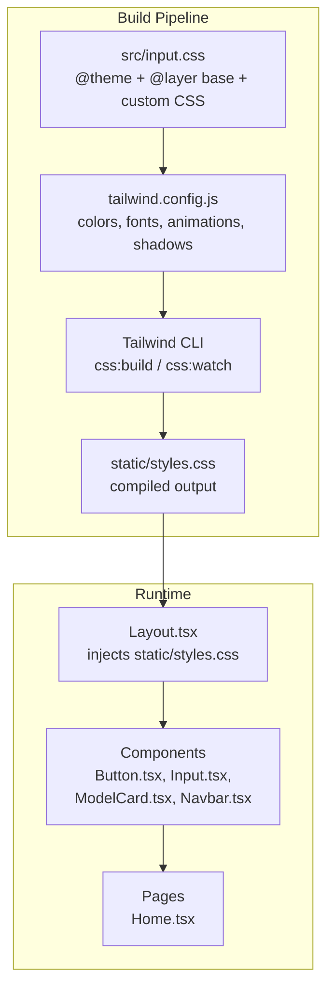
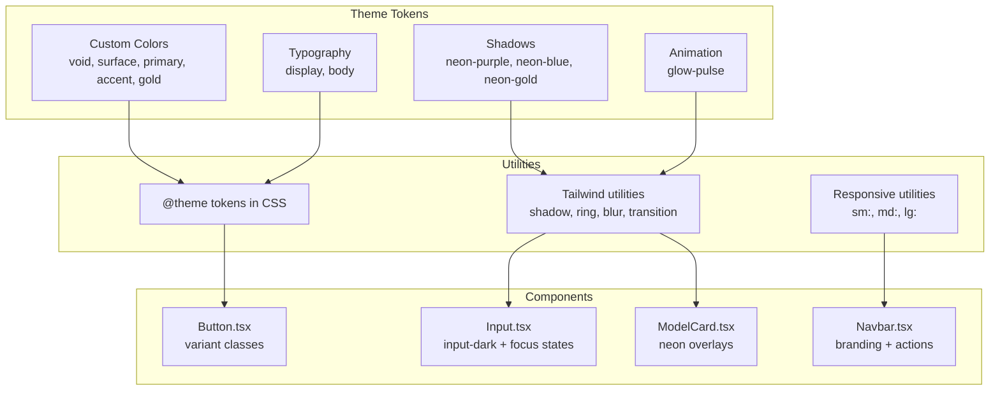
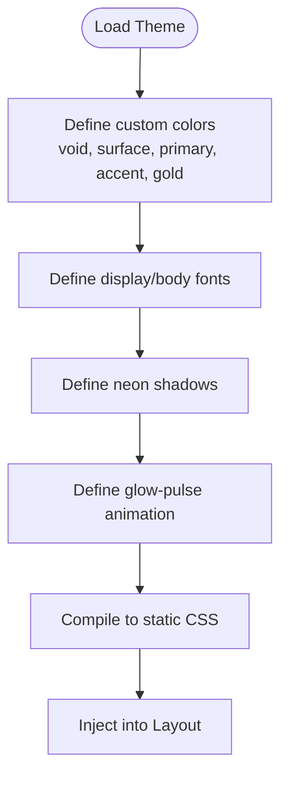
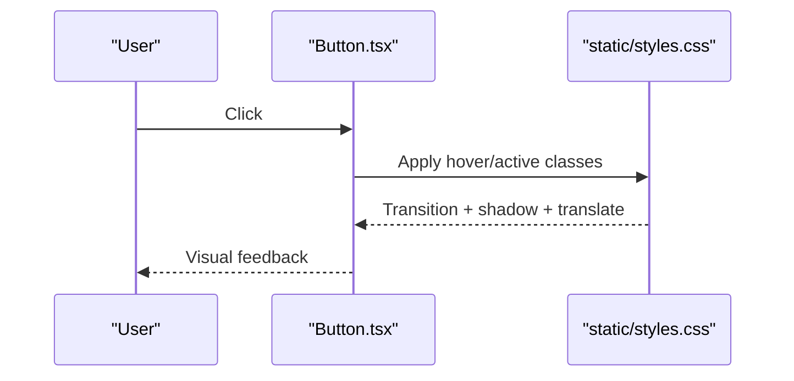
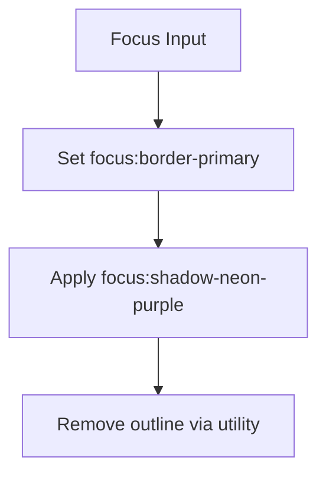
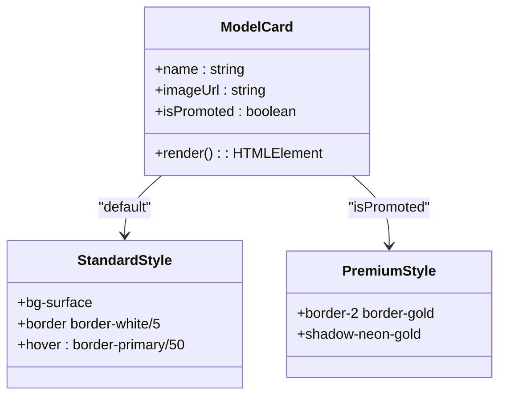
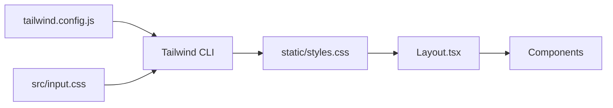

# Styling and Theming

<cite>
**Referenced Files in This Document**
- [tailwind.config.js](file://tailwind.config.js)
- [input.css](file://src/input.css)
- [styles.css](file://static/styles.css)
- [package.json](file://package.json)
- [Layout.tsx](file://src/components/templates/Layout.tsx)
- [Button.tsx](file://src/components/atoms/Button.tsx)
- [Input.tsx](file://src/components/atoms/Input.tsx)
- [ModelCard.tsx](file://src/components/molecules/ModelCard.tsx)
- [WhiteLabelModelCard.tsx](file://src/components/molecules/WhiteLabelModelCard.tsx)
- [Navbar.tsx](file://src/components/organisms/Navbar.tsx)
- [Home.tsx](file://src/pages/Home.tsx)
</cite>

## Table of Contents
1. [Introduction](#introduction)
2. [Project Structure](#project-structure)
3. [Core Components](#core-components)
4. [Architecture Overview](#architecture-overview)
5. [Detailed Component Analysis](#detailed-component-analysis)
6. [Dependency Analysis](#dependency-analysis)
7. [Performance Considerations](#performance-considerations)
8. [Troubleshooting Guide](#troubleshooting-guide)
9. [Conclusion](#conclusion)

## Introduction
This document explains CreatorFlix’s styling and theming architecture. It covers the Tailwind CSS configuration, the custom color palette, typography system, utility class usage patterns, neon aesthetic implementation, responsive design, component-specific styling approaches, and guidelines for extending the design system. It also documents CSS-in-JS patterns, theme switching mechanisms, accessibility-focused styling practices, and performance optimization strategies.

## Project Structure
CreatorFlix uses a hybrid styling pipeline:
- Tailwind CSS v4 powers the design system and generates a comprehensive static stylesheet.
- A custom PostCSS/Tailwind pipeline compiles a single static CSS file consumed by the app.
- JSX components apply Tailwind utility classes directly for consistent, atomic styling.
- A small amount of custom CSS augments Tailwind utilities for specific effects (e.g., glass cards, neon shadows).

**Diagram sources**
- [input.css](file://src/input.css#L1-L268)
- [tailwind.config.js](file://tailwind.config.js#L1-L39)
- [package.json](file://package.json#L3-L7)
- [styles.css](file://static/styles.css#L1-L112)
- [Layout.tsx](file://src/components/templates/Layout.tsx#L24-L34)

**Section sources**
- [package.json](file://package.json#L3-L7)
- [input.css](file://src/input.css#L1-L268)
- [styles.css](file://static/styles.css#L1-L112)
- [Layout.tsx](file://src/components/templates/Layout.tsx#L24-L34)

## Core Components
- Tailwind configuration defines:
  - Custom color palette (void, surface, primary, accent, gold variants)
  - Typography families (display and body)
  - Background images (e.g., hero gradient)
  - Box shadows (neon purple, blue, gold)
  - Animation/keyframes (glow-pulse)
- Custom CSS adds:
  - Theme tokens mapped to Tailwind variables
  - Base styles and global resets
  - Utility-like helpers (glass, premium cards, scrollbars)
  - Component-specific overrides (e.g., video player, loader, radio cards)

Key usage patterns:
- Components compose Tailwind utilities directly (e.g., Button, Input, ModelCard).
- Neon effects leverage shadow utilities and animation utilities.
- Responsive behavior is achieved via Tailwind’s responsive prefixes and container utilities.

**Section sources**
- [tailwind.config.js](file://tailwind.config.js#L4-L39)
- [input.css](file://src/input.css#L3-L25)
- [styles.css](file://static/styles.css#L106-L112)

## Architecture Overview
The styling architecture blends Tailwind’s atomic utility classes with custom CSS and JSX-driven composition. The build pipeline compiles a single stylesheet that all pages import. Components encapsulate styling logic, while the theme configuration centralizes design tokens.

**Diagram sources**
- [tailwind.config.js](file://tailwind.config.js#L6-L35)
- [input.css](file://src/input.css#L3-L17)
- [Button.tsx](file://src/components/atoms/Button.tsx#L20-L31)
- [Input.tsx](file://src/components/atoms/Input.tsx#L15-L31)
- [ModelCard.tsx](file://src/components/molecules/ModelCard.tsx#L22-L66)
- [Navbar.tsx](file://src/components/organisms/Navbar.tsx#L16-L103)

## Detailed Component Analysis

### Tailwind Configuration and Theme Tokens
- Colors: Centralized in both Tailwind config and CSS theme for runtime CSS and JS compatibility.
- Fonts: Display and body families configured for headings and body text.
- Shadows: Neon-specific shadows for primary/accent/gold themes.
- Animations: glow-pulse animation for subtle interactive glows.
- Background images: Hero gradient for prominent visuals.

**Diagram sources**
- [tailwind.config.js](file://tailwind.config.js#L6-L35)
- [input.css](file://src/input.css#L3-L17)
- [styles.css](file://static/styles.css#L106-L112)

**Section sources**
- [tailwind.config.js](file://tailwind.config.js#L4-L39)
- [input.css](file://src/input.css#L3-L17)
- [styles.css](file://static/styles.css#L106-L112)

### Button Component Styling
- Variant system: primary, secondary, outline, ghost.
- Uses display font, uppercase, tracking, transitions, rounded corners.
- Hover states elevate and add subtle neon glow via shadow utilities.
- Focus states ensure keyboard accessibility.

**Diagram sources**
- [Button.tsx](file://src/components/atoms/Button.tsx#L20-L31)
- [styles.css](file://static/styles.css#L2445-L2493)

**Section sources**
- [Button.tsx](file://src/components/atoms/Button.tsx#L20-L31)

### Input Component Styling
- Dark-themed input with focus states.
- Focus border and glow use primary color and neon shadow.
- Disabled/dashed styling for read-only states.

**Diagram sources**
- [Input.tsx](file://src/components/atoms/Input.tsx#L21-L30)
- [styles.css](file://static/styles.css#L2325-L2333)

**Section sources**
- [Input.tsx](file://src/components/atoms/Input.tsx#L15-L31)

### ModelCard Styling (Premium and Standard)
- Standard cards: surface background, subtle borders, hover elevation and primary border.
- Premium (gold) variant: solid gold border and glow, promoted badge.
- Gradient overlays and backdrop blur for readability and depth.

**Diagram sources**
- [ModelCard.tsx](file://src/components/molecules/ModelCard.tsx#L22-L66)

**Section sources**
- [ModelCard.tsx](file://src/components/molecules/ModelCard.tsx#L12-L69)

### WhiteLabelModelCard Styling
- Minimal dark card with gradient overlay and backdrop blur for text legibility.
- Hover scaling and border transitions for interactivity.

**Section sources**
- [WhiteLabelModelCard.tsx](file://src/components/molecules/WhiteLabelModelCard.tsx#L10-L48)

### Navbar Styling
- Fixed top bar with dark background and subtle border.
- Branding uses gradient from primary to purple-900.
- Search input uses focus states with primary border and ring.
- Dropdown menus use surface backgrounds and borders for contrast.

**Section sources**
- [Navbar.tsx](file://src/components/organisms/Navbar.tsx#L14-L117)

### Layout and Global Styles
- Layout injects the compiled stylesheet and sets global base styles.
- Body uses void background, display font, and selection colors.
- Custom scrollbar styles are injected for consistent UX.

**Section sources**
- [Layout.tsx](file://src/components/templates/Layout.tsx#L17-L55)

### Home Page Composition
- Grid layouts and responsive columns for model feeds.
- Uses display fonts and spacing utilities for typography and rhythm.

**Section sources**
- [Home.tsx](file://src/pages/Home.tsx#L22-L97)

## Dependency Analysis
- Build-time dependency: Tailwind CLI compiles src/input.css into static/styles.css using tailwind.config.js.
- Runtime dependency: Layout.tsx imports static/styles.css globally.
- Component dependency: All components rely on Tailwind utilities and theme tokens.

**Diagram sources**
- [package.json](file://package.json#L5-L6)
- [input.css](file://src/input.css#L1-L1)
- [styles.css](file://static/styles.css#L1-L3)
- [Layout.tsx](file://src/components/templates/Layout.tsx#L24-L24)

**Section sources**
- [package.json](file://package.json#L5-L6)
- [input.css](file://src/input.css#L1-L1)
- [styles.css](file://static/styles.css#L1-L3)
- [Layout.tsx](file://src/components/templates/Layout.tsx#L24-L24)

## Performance Considerations
- Single stylesheet: Building one large CSS file reduces HTTP requests and improves caching.
- Atomic utilities: Tailwind’s atomic approach minimizes duplication and keeps styles maintainable.
- Minimizing custom CSS: Keep custom CSS scoped and avoid excessive overrides.
- Bundle size: Prefer Tailwind utilities over inline styles to leverage tree-shaking and reduce runtime CSS-in-JS overhead.
- Animations: Use hardware-accelerated properties (transform, opacity) for smooth transitions.

[No sources needed since this section provides general guidance]

## Troubleshooting Guide
- Neon glow not appearing:
  - Verify shadow utilities and animation utilities are present in the compiled CSS.
  - Confirm the element applies the appropriate shadow and hover classes.
- Focus states missing:
  - Ensure focus utilities are applied and the compiled CSS includes focus variants.
- Scrollbar inconsistencies:
  - Check custom scrollbar classes and browser-specific pseudo-elements.
- Build issues:
  - Run the Tailwind build/watch scripts and confirm the compiled CSS exists.

**Section sources**
- [styles.css](file://static/styles.css#L2325-L2333)
- [Button.tsx](file://src/components/atoms/Button.tsx#L20-L31)
- [input.css](file://src/input.css#L27-L47)
- [package.json](file://package.json#L5-L6)

## Conclusion
CreatorFlix’s styling system centers on a robust Tailwind configuration and a single compiled stylesheet, enabling a consistent neon aesthetic, responsive design, and scalable component styling. By leveraging theme tokens, utility-first composition, and minimal custom CSS, the system balances flexibility and performance. Extending the design system should remain within the established tokens and utilities to preserve visual consistency and maintainability.