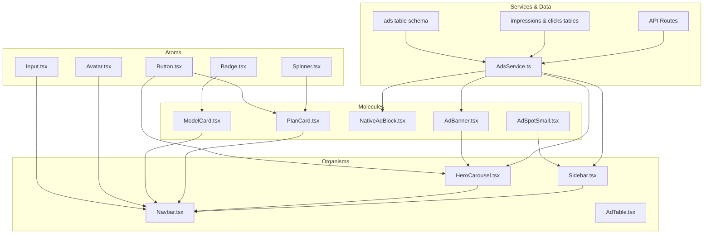
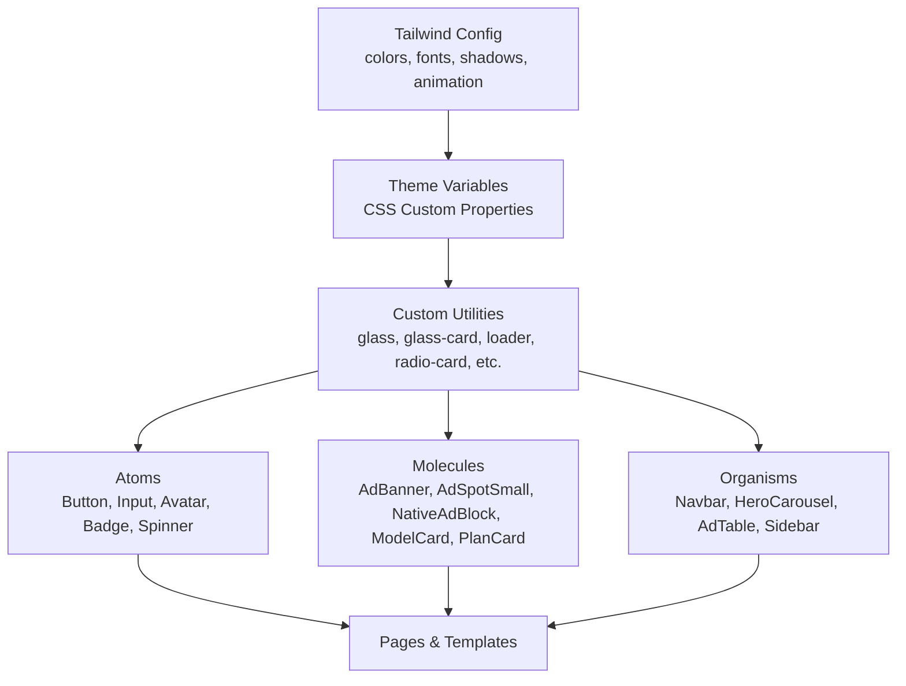
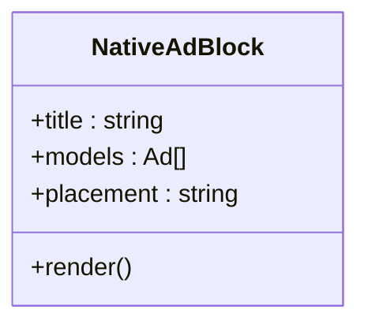
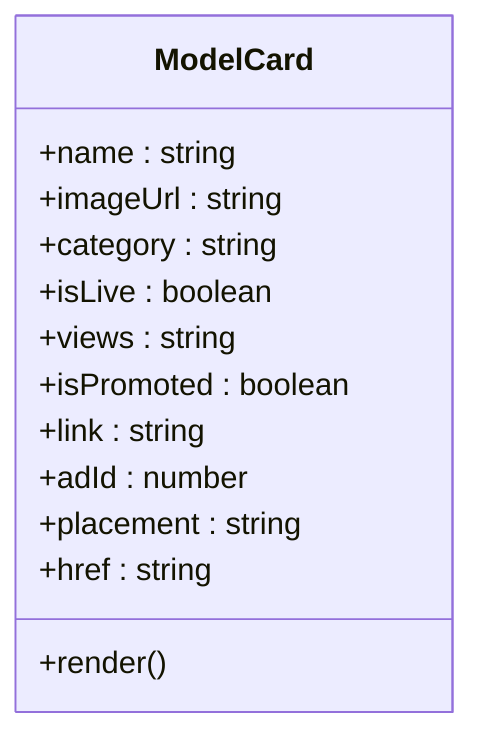
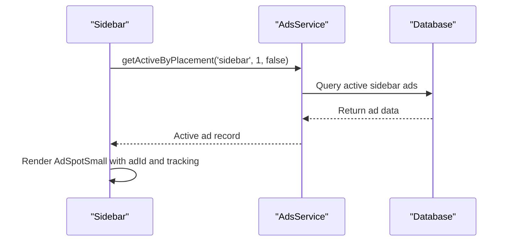
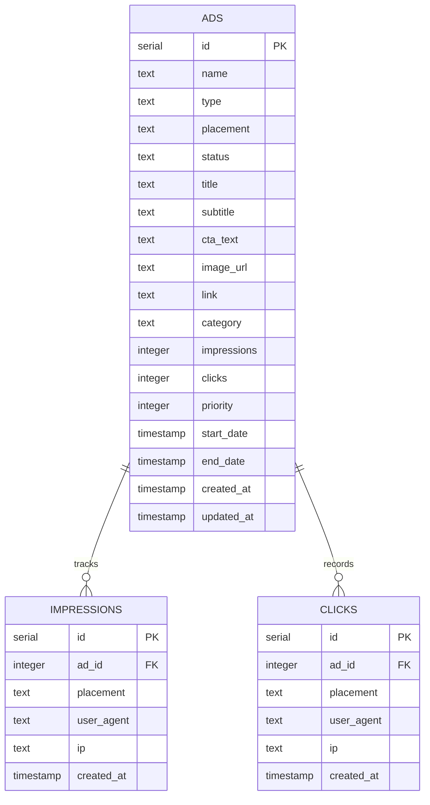
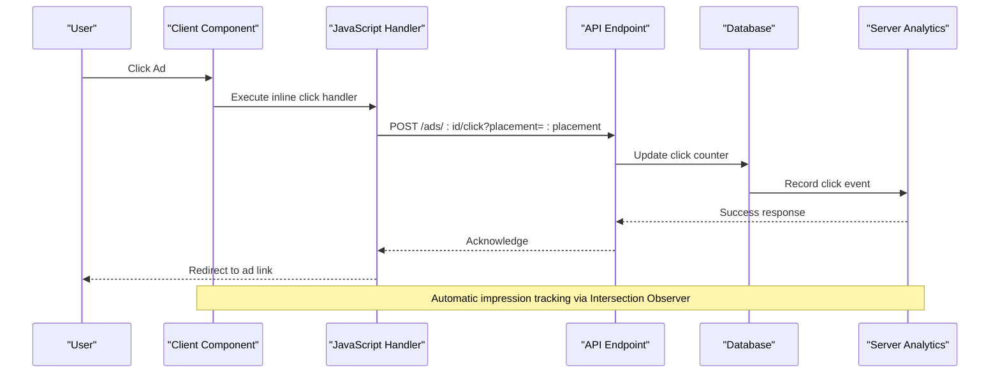
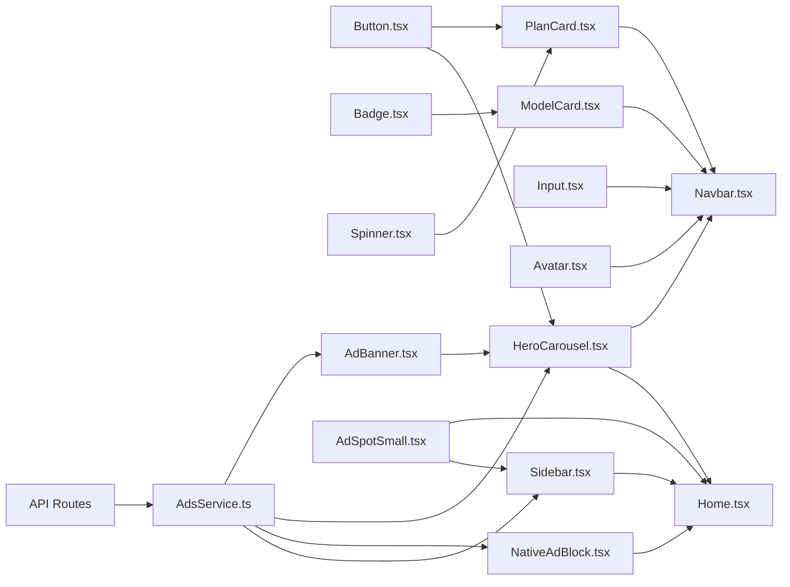

# UI Component System

<cite>
**Referenced Files in This Document**
- [README.md](file://README.md)
- [package.json](file://package.json)
- [tailwind.config.js](file://tailwind.config.js)
- [src/input.css](file://src/input.css)
- [src/index.tsx](file://src/index.tsx)
- [src/components/atoms/Button.tsx](file://src/components/atoms/Button.tsx)
- [src/components/atoms/Input.tsx](file://src/components/atoms/Input.tsx)
- [src/components/atoms/Avatar.tsx](file://src/components/atoms/Avatar.tsx)
- [src/components/atoms/Badge.tsx](file://src/components/atoms/Badge.tsx)
- [src/components/atoms/Spinner.tsx](file://src/components/atoms/Spinner.tsx)
- [src/components/molecules/AdBanner.tsx](file://src/components/molecules/AdBanner.tsx)
- [src/components/molecules/AdSpotSmall.tsx](file://src/components/molecules/AdSpotSmall.tsx)
- [src/components/molecules/NativeAdBlock.tsx](file://src/components/molecules/NativeAdBlock.tsx)
- [src/components/molecules/ModelCard.tsx](file://src/components/molecules/ModelCard.tsx)
- [src/components/molecules/PlanCard.tsx](file://src/components/molecules/PlanCard.tsx)
- [src/components/organisms/AdTable.tsx](file://src/components/organisms/AdTable.tsx)
- [src/components/organisms/Navbar.tsx](file://src/components/organisms/Navbar.tsx)
- [src/components/organisms/HeroCarousel.tsx](file://src/components/organisms/HeroCarousel.tsx)
- [src/components/organisms/Sidebar.tsx](file://src/components/organisms/Sidebar.tsx)
- [src/services/ads.ts](file://src/services/ads.ts)
- [src/db/schema.ts](file://src/db/schema.ts)
- [src/routes/api.tsx](file://src/routes/api.tsx)
- [src/pages/Home.tsx](file://src/pages/Home.tsx)
- [src/pages/admin/Ads.tsx](file://src/pages/admin/Ads.tsx)
- [src/pages/admin/AdsCreate.tsx](file://src/pages/admin/AdsCreate.tsx)
- [drizzle/0011_ads_tracking.sql](file://drizzle/0011_ads_tracking.sql)
</cite>

## Update Summary
**Changes Made**
- Enhanced AdSpotSmall component with automatic advertising tracking integration including adId props and JavaScript click handlers
- Integrated automatic ad impression tracking in HeroCarousel with Intersection Observer API
- Added automatic ad tracking in Sidebar component with real-time ad data fetching and tracking
- Implemented comprehensive ad tracking system with database-backed analytics and API endpoints
- Enhanced HeroCarousel with automatic ad click tracking and model slug extraction
- Added placement parameter support for all ad tracking endpoints
- Updated ModelCard component with automatic impression tracking using IntersectionObserver
- Enhanced AdBanner component with comprehensive tracking including placement context

## Table of Contents
1. [Introduction](#introduction)
2. [Project Structure](#project-structure)
3. [Core Components](#core-components)
4. [Architecture Overview](#architecture-overview)
5. [Detailed Component Analysis](#detailed-component-analysis)
6. [Ad Management System](#ad-management-system)
7. [Advertising Tracking Integration](#advertising-tracking-integration)
8. [Dependency Analysis](#dependency-analysis)
9. [Performance Considerations](#performance-considerations)
10. [Troubleshooting Guide](#troubleshooting-guide)
11. [Conclusion](#conclusion)
12. [Appendices](#appendices)

## Introduction
CreatorFlix implements a UI system grounded in Atomic Design principles, organizing reusable interface elements from atoms to organisms. The frontend stack leverages Hono runtime with JSX rendering, Tailwind CSS v4 for styling, and a custom CSS pipeline. The theming system centers around a dark, premium aesthetic with neon accents (purple, blue, gold), consistent typography, and glass-like card effects. This document explains the component hierarchy, composition patterns, styling architecture, props, events, customization, responsiveness, accessibility, animations, theming, reusability, performance, and integration patterns.

**Section sources**
- [README.md](file://README.md#L1-L49)
- [package.json](file://package.json#L1-L23)

## Project Structure
The UI component system is organized into atomic layers with enhanced advertising capabilities:
- Atoms: Fundamental building blocks (buttons, inputs, avatars, badges, spinners).
- Molecules: Composed groups (ad banners, model cards, plan cards, native ad blocks, ad spots).
- Organisms: Complex sections (navbar, hero carousel, ad tables, sidebar).
- Templates: Page layouts.
- Pages: Route-mounted compositions with integrated ad management and tracking.



**Diagram sources**
- [src/components/atoms/Button.tsx](file://src/components/atoms/Button.tsx#L1-L42)
- [src/components/atoms/Input.tsx](file://src/components/atoms/Input.tsx#L1-L33)
- [src/components/atoms/Avatar.tsx](file://src/components/atoms/Avatar.tsx#L1-L28)
- [src/components/atoms/Badge.tsx](file://src/components/atoms/Badge.tsx#L1-L21)
- [src/components/atoms/Spinner.tsx](file://src/components/atoms/Spinner.tsx#L1-L5)
- [src/components/molecules/AdBanner.tsx](file://src/components/molecules/AdBanner.tsx#L1-L54)
- [src/components/molecules/AdSpotSmall.tsx](file://src/components/molecules/AdSpotSmall.tsx#L1-L55)
- [src/components/molecules/NativeAdBlock.tsx](file://src/components/molecules/NativeAdBlock.tsx#L1-L29)
- [src/components/molecules/ModelCard.tsx](file://src/components/molecules/ModelCard.tsx#L1-L94)
- [src/components/molecules/PlanCard.tsx](file://src/components/molecules/PlanCard.tsx#L1-L110)
- [src/components/organisms/Navbar.tsx](file://src/components/organisms/Navbar.tsx#L1-L117)
- [src/components/organisms/HeroCarousel.tsx](file://src/components/organisms/HeroCarousel.tsx#L1-L72)
- [src/components/organisms/AdTable.tsx](file://src/components/organisms/AdTable.tsx#L1-L119)
- [src/components/organisms/Sidebar.tsx](file://src/components/organisms/Sidebar.tsx#L1-L143)
- [src/services/ads.ts](file://src/services/ads.ts#L1-L380)
- [src/db/schema.ts](file://src/db/schema.ts#L194-L253)
- [src/routes/api.tsx](file://src/routes/api.tsx#L900-L973)

**Section sources**
- [README.md](file://README.md#L43-L49)

## Core Components
This section documents the foundational atoms and their roles in the system, including enhanced advertising components.

- Button
  - Purpose: Action trigger with variants and optional link behavior.
  - Props:
    - variant: primary | secondary | outline | ghost
    - href: external URL for anchor rendering
    - className: additional classes
    - type: button | submit | reset
    - onClick: HTMX-compatible string handler
  - Behavior: Renders anchor or button; applies variant-specific styles and transitions; supports focus and disabled states.
  - Accessibility: Uses semantic button or anchor; relies on Tailwind focus styles.
  - Customization: Extend variants via theme tokens; combine with className for overrides.
  - Example usage: See [Button usage in PlanCard](file://src/components/molecules/PlanCard.tsx#L39-L47) and [Button usage in HeroCarousel](file://src/components/organisms/HeroCarousel.tsx#L35-L38).

- Input
  - Purpose: Text input with label and dark theme styling.
  - Props:
    - id, name, label, placeholder, type, value, required, readOnly, className
  - Behavior: Renders labeled input with dark-themed borders and focus glow; disables interactions when read-only.
  - Accessibility: Proper label association via htmlFor; supports required and readonly attributes.
  - Customization: Apply className to adjust layout; use input-dark for consistent styling.
  - Example usage: See [Input usage in Navbar search](file://src/components/organisms/Navbar.tsx#L35-L46).

- Avatar
  - Purpose: User profile image with hover glow effect.
  - Props:
    - src, alt, size: sm | md | lg | xl, className
  - Behavior: Responsive sizing; hover-triggered gradient glow; rounded-full crop.
  - Accessibility: Standard img alt; ensure meaningful alt text.
  - Customization: Adjust size tokens; add className for layout.
  - Example usage: See [Avatar usage in Navbar user menu](file://src/components/organisms/Navbar.tsx#L58-L93).

- Badge
  - Purpose: Status or highlight indicator.
  - Props:
    - variant: live | primary | default, className
  - Behavior: Applies variant-specific colors, shadows, and animations (pulse).
  - Accessibility: Non-decorative; ensure sufficient contrast.
  - Customization: Combine with className for layout adjustments.
  - Example usage: See [Live badge in ModelCard](file://src/components/molecules/ModelCard.tsx#L44-L50).

- Spinner
  - Purpose: Loading indicator.
  - Props: None.
  - Behavior: Rotating loader with neon purple accent.
  - Accessibility: Not focusable; use aria-live for screen reader announcements when wrapping content.
  - Example usage: See [Spinner usage in PlanCard](file://src/components/molecules/PlanCard.tsx#L104-L109).

**Section sources**
- [src/components/atoms/Button.tsx](file://src/components/atoms/Button.tsx#L1-L42)
- [src/components/atoms/Input.tsx](file://src/components/atoms/Input.tsx#L1-L33)
- [src/components/atoms/Avatar.tsx](file://src/components/atoms/Avatar.tsx#L1-L28)
- [src/components/atoms/Badge.tsx](file://src/components/atoms/Badge.tsx#L1-L21)
- [src/components/atoms/Spinner.tsx](file://src/components/atoms/Spinner.tsx#L1-L5)

## Architecture Overview
The styling architecture combines Tailwind CSS v4 with a custom CSS pipeline and theme tokens. The Tailwind config defines brand colors, fonts, gradients, shadows, and animations. The CSS entry file exposes CSS variables and custom utilities for glass, cards, and checkout transitions. Components consume these tokens and utilities to maintain visual consistency.



**Diagram sources**
- [tailwind.config.js](file://tailwind.config.js#L1-L39)
- [src/input.css](file://src/input.css#L1-L268)

**Section sources**
- [tailwind.config.js](file://tailwind.config.js#L1-L39)
- [src/input.css](file://src/input.css#L1-L268)

## Detailed Component Analysis

### Button Component
- Composition pattern: Stateless functional component; variant-driven rendering; optional link fallback.
- Props:
  - variant: primary | secondary | outline | ghost
  - href: renders anchor when present
  - className: additional classes
  - type: button | submit | reset
  - onClick: HTMX-compatible string handler
- Events: onclick handler passed to button; href triggers navigation.
- States: hover lift (-translate-y-0.5), glow shadows, disabled opacity and cursor.
- Theming: Uses primary, surface, and neon shadow tokens; variant map controls colors.
- Accessibility: Focus-visible outline via Tailwind; ensure labels for buttons.


**Diagram sources**
- [src/components/atoms/Button.tsx](file://src/components/atoms/Button.tsx#L4-L10)

**Section sources**
- [src/components/atoms/Button.tsx](file://src/components/atoms/Button.tsx#L1-L42)

### Input Component
- Composition pattern: Label + input wrapper with dark theme.
- Props:
  - id, name, label, placeholder, type, value, required, readOnly, className
- Events: Native input events; integrate with forms.
- States: Focus glow, disabled opacity and dashed border.
- Theming: input-dark utility; focus:border-primary and focus:shadow-neon-purple.
- Accessibility: htmlFor matches input id; required and readonly supported.


**Diagram sources**
- [src/components/atoms/Input.tsx](file://src/components/atoms/Input.tsx#L3-L13)

**Section sources**
- [src/components/atoms/Input.tsx](file://src/components/atoms/Input.tsx#L1-L33)

### Avatar Component
- Composition pattern: Container with glow overlay and image crop.
- Props:
  - src, alt, size: sm | md | lg | xl, className
- States: Hover glow via group-hover; responsive sizing.
- Theming: Gradient glow from primary/accent; ring and rounded-full.
- Accessibility: alt text for images; ensure meaningful alternatives.


**Diagram sources**
- [src/components/atoms/Avatar.tsx](file://src/components/atoms/Avatar.tsx#L3-L8)

**Section sources**
- [src/components/atoms/Avatar.tsx](file://src/components/atoms/Avatar.tsx#L1-L28)

### Badge Component
- Composition pattern: Variant-based container with optional animation.
- Props:
  - variant: live | primary | default, className
- States: Pulse animation for live; colored borders and shadows.
- Theming: Variant map for colors and shadows; tracking-tighter and uppercase.


**Diagram sources**
- [src/components/atoms/Badge.tsx](file://src/components/atoms/Badge.tsx#L3-L6)

**Section sources**
- [src/components/atoms/Badge.tsx](file://src/components/atoms/Badge.tsx#L1-L21)

### Spinner Component
- Composition pattern: Minimal loader with CSS animation.
- Props: None.
- States: Continuous rotation; used within other components.


**Diagram sources**
- [src/components/atoms/Spinner.tsx](file://src/components/atoms/Spinner.tsx#L1-L5)

**Section sources**
- [src/components/atoms/Spinner.tsx](file://src/components/atoms/Spinner.tsx#L1-L5)

### AdBanner Component
- Composition pattern: Enhanced advertising banner with click tracking and improved styling.
- Props:
  - imageUrl?: string | null
  - title: string
  - subtitle: string
  - ctaText: string
  - link: string
  - adId?: number (for click tracking)
  - placement?: string (for tracking context)
- States: Hover effects with opacity transitions; gradient overlays; responsive design.
- Theming: Gold branding (#FFD700) for sponsored content; dark background with neon accents.
- Accessibility: Proper anchor semantics; ensure descriptive alt text for images.
- **Updated**: Now includes automatic click tracking via fetch request to `/api/ads/${adId}/click` endpoint with placement parameter support, and automatic impression tracking using IntersectionObserver API with 0.1 threshold.

```mermaid
classDiagram
class AdBanner {
+imageUrl : string|null
+title : string
+subtitle : string
+ctaText : string
+link : string
+adId : number
+placement : string
+handleClick() fetch('/api/ads/ : id/click?placement= : placement', {method : 'POST'})
+render()
}
```

**Diagram sources**
- [src/components/molecules/AdBanner.tsx](file://src/components/molecules/AdBanner.tsx#L3-L10)

**Section sources**
- [src/components/molecules/AdBanner.tsx](file://src/components/molecules/AdBanner.tsx#L1-L54)

### AdSpotSmall Component
- Composition pattern: Compact advertising spot with card-style presentation and automatic tracking.
- Props:
  - imageUrl?: string (defaults to placeholder image)
  - title: string
  - buttonText: string
  - link: string
  - adId?: number (for tracking)
  - placement?: string (for tracking context)
- States: Hover scaling effect; gradient overlay; responsive aspect ratio; automatic impression tracking.
- Theming: Dark background (#0a0a0a) with gold accent (#FFD700); subtle borders.
- Accessibility: Anchor semantics for interactive elements; ensure image alt text.
- **Updated**: Now includes automatic impression tracking using Intersection Observer API with 0.1 threshold and click tracking via inline JavaScript handlers.

```mermaid
classDiagram
class AdSpotSmall {
+imageUrl : string
+title : string
+buttonText : string
+link : string
+adId : number
+placement : string
+handleClick() fetch('/api/ads/ : id/click?placement= : placement', {method : 'POST'})
+render()
}
```

**Diagram sources**
- [src/components/molecules/AdSpotSmall.tsx](file://src/components/molecules/AdSpotSmall.tsx#L3-L10)

**Section sources**
- [src/components/molecules/AdSpotSmall.tsx](file://src/components/molecules/AdSpotSmall.tsx#L1-L55)

### NativeAdBlock Component
- Composition pattern: Editorial sponsorship block with multiple model cards.
- Props:
  - title: string
  - models: Ad[] (list of models with ad properties)
  - placement?: string (for tracking context)
- States: Grid layout with responsive columns; promoted model cards with gold borders.
- Theming: Gradient background (#1a1a1a to #0a0aa) with gold accents; border glow effect.
- Integration: Uses ModelCard components with isPromoted flag enabled.



**Diagram sources**
- [src/components/molecules/NativeAdBlock.tsx](file://src/components/molecules/NativeAdBlock.tsx#L4-L7)

**Section sources**
- [src/components/molecules/NativeAdBlock.tsx](file://src/components/molecules/NativeAdBlock.tsx#L1-L29)

### ModelCard Component
- Composition pattern: Enhanced model card with external link support for advertisements.
- Props:
  - name: string
  - imageUrl: string
  - category?: string (defaults to 'Model')
  - isLive?: boolean (defaults to false)
  - views?: string (defaults to '1.2k')
  - isPromoted?: boolean (Type A: "Post" Ad)
  - link?: string (optional external link for ads)
  - adId?: number (for tracking)
  - placement?: string (for tracking context)
- States: Hover scaling on image; promoted border and glow; live badge pulse.
- Theming: Surface backgrounds, gradient overlays, neon shadows for promoted state.
- Accessibility: Semantic anchor; ensure alt text on images.
- **Updated**: Now supports external links via optional link prop; defaults to internal model profile route; includes adId for tracking integration and automatic impression tracking using IntersectionObserver API.



**Diagram sources**
- [src/components/molecules/ModelCard.tsx](file://src/components/molecules/ModelCard.tsx#L3-L13)

**Section sources**
- [src/components/molecules/ModelCard.tsx](file://src/components/molecules/ModelCard.tsx#L1-L94)

### PlanCard Component
- Composition pattern: Uses Button atom; variant-driven layout; highlighted premium presentation.
- Props:
  - id, name, price, currency, period, features[], highlighted, variant, badge, description, className, checkoutUrl
- States: Highlighted scaling and gradient; hover transitions; checkout button variant.
- Theming: Gold gradient for highlighted; neon gold shadows; outlined variant with blur and grayscale.
- Accessibility: Buttons are focusable; ensure readable feature lists.


**Diagram sources**
- [src/components/molecules/PlanCard.tsx](file://src/components/molecules/PlanCard.tsx#L10-L23)

**Section sources**
- [src/components/molecules/PlanCard.tsx](file://src/components/molecules/PlanCard.tsx#L1-L110)

### Navbar Component
- Composition pattern: Mixed atoms and molecules; conditional user menu; VIP promotion bar.
- Props:
  - isAdmin: boolean, user: { name, email, role, subscriptionStatus }
- States: Dropdown visibility toggled via onclick; click-outside to close; hover states on actions.
- Theming: Dark background, neon accents, and gold VIP badge.
- Accessibility: Proper button semantics; dropdown keyboard navigation recommended.


**Diagram sources**
- [src/components/organisms/Navbar.tsx](file://src/components/organisms/Navbar.tsx#L58-L114)

**Section sources**
- [src/components/organisms/Navbar.tsx](file://src/components/organisms/Navbar.tsx#L1-L117)

### HeroCarousel Component
- Composition pattern: Enhanced slide container with ad integration and improved styling.
- Props:
  - slides?: Ad[] (enhanced with ad properties including adId and placement)
- States: Opacity transitions; active indicator highlighting; hover fade for controls.
- Theming: Gradient overlays, rounded corners, backdrop blur for controls.
- Integration: Enhanced with ad data including image URLs, titles, categories, links, and ad tracking.
- **Updated**: Now includes automatic ad click tracking via inline JavaScript handlers and model slug extraction for internal navigation. Each slide includes automatic impression tracking using IntersectionObserver API.


**Diagram sources**
- [src/components/organisms/HeroCarousel.tsx](file://src/components/organisms/HeroCarousel.tsx#L46-L60)

**Section sources**
- [src/components/organisms/HeroCarousel.tsx](file://src/components/organisms/HeroCarousel.tsx#L1-L72)

### AdTable Component
- Composition pattern: Administrative table for ad campaign management with analytics.
- Props:
  - ads: Ad[] (with metrics and status)
- States: Hover effects on rows; status badges with color coding; CTR calculation.
- Theming: Dark background with gold accents for active campaigns; gradient headers.
- Analytics: Real-time CTR (Click-Through Rate) calculation; status management controls.


**Diagram sources**
- [src/components/organisms/AdTable.tsx](file://src/components/organisms/AdTable.tsx#L13-L15)

**Section sources**
- [src/components/organisms/AdTable.tsx](file://src/components/organisms/AdTable.tsx#L1-L119)

### Sidebar Component
- Composition pattern: Dynamic sidebar with automatic ad integration and tracking.
- Props: None (async component that fetches ad data)
- States: Collapsible sidebar with overlay; automatic ad spot rendering; responsive design.
- Theming: Dark background with gold accents; smooth transitions and backdrop blur.
- Integration: Automatically fetches active sidebar ads from database and renders AdSpotSmall with tracking.
- **Updated**: Now includes automatic ad tracking integration with real-time impression and click tracking using IntersectionObserver API and placement context.



**Diagram sources**
- [src/components/organisms/Sidebar.tsx](file://src/components/organisms/Sidebar.tsx#L5-L121)

**Section sources**
- [src/components/organisms/Sidebar.tsx](file://src/components/organisms/Sidebar.tsx#L1-L143)

## Ad Management System
CreatorFlix now features a comprehensive advertising management system with database-backed campaigns, real-time analytics, and automated placement targeting.

### Database Schema
The ads table supports multiple ad types with comprehensive tracking capabilities:



**Diagram sources**
- [src/db/schema.ts](file://src/db/schema.ts#L196-L253)
- [drizzle/0011_ads_tracking.sql](file://drizzle/0011_ads_tracking.sql#L1-L21)

### Service Layer
The AdsService provides comprehensive ad management functionality:

- **Ad Types**: Five distinct ad formats with specific placement restrictions
- **Placement Validation**: Automatic validation ensuring ads appear in appropriate locations
- **Priority System**: Numerical priority determines ad display order
- **Date Filtering**: Campaign scheduling with start/end dates
- **Analytics Tracking**: Automatic impression and click counting with transactional integrity
- **Real-time Statistics**: CTR calculations and status management controls
- **Automatic Tracking**: Built-in impression tracking for sidebar ads with optional manual tracking

### API Endpoints
RESTful endpoints for ad management and tracking:

- `POST /ads/:id/click` - Track individual ad clicks with placement context
- `POST /ads/:id/impression` - Track ad impressions with placement context
- `POST /ads/:id/event` - Generic event tracker supporting both impressions and clicks

**Section sources**
- [src/services/ads.ts](file://src/services/ads.ts#L1-L380)
- [src/db/schema.ts](file://src/db/schema.ts#L194-L253)
- [src/routes/api.tsx](file://src/routes/api.tsx#L900-L973)

### Frontend Integration
Ad components seamlessly integrate with the ad management system:

- **Home Page Integration**: Multiple ad placements with automatic data fetching and tracking
- **Admin Interface**: Comprehensive ad creation, editing, and analytics dashboard
- **Real-time Preview**: Live ad preview during creation with placement validation
- **External Link Support**: Model cards can handle external advertisement links
- **Automatic Tracking**: Sidebar ads automatically track impressions and clicks

**Section sources**
- [src/pages/Home.tsx](file://src/pages/Home.tsx#L1-L253)
- [src/pages/admin/Ads.tsx](file://src/pages/admin/Ads.tsx#L1-L131)
- [src/pages/admin/AdsCreate.tsx](file://src/pages/admin/AdsCreate.tsx#L1-L569)

## Advertising Tracking Integration
CreatorFlix now implements comprehensive automatic advertising tracking across key components with seamless user interaction tracking.

### Tracking Architecture
The tracking system uses a multi-layered approach combining client-side JavaScript with server-side analytics:



**Diagram sources**
- [src/components/molecules/AdSpotSmall.tsx](file://src/components/molecules/AdSpotSmall.tsx#L37-L51)
- [src/components/organisms/HeroCarousel.tsx](file://src/components/organisms/HeroCarousel.tsx#L39-L39)
- [src/routes/api.tsx](file://src/routes/api.tsx#L900-L940)

### AdSpotSmall Tracking Implementation
The AdSpotSmall component now includes sophisticated automatic tracking:

- **Click Tracking**: Inline JavaScript handler executes `fetch('/api/ads/${adId}/click')` on user interaction
- **Impression Tracking**: Intersection Observer monitors when ad becomes visible (threshold: 0.1)
- **Placement Context**: Automatic placement parameter passing for accurate analytics
- **Non-blocking**: JavaScript runs asynchronously without affecting user experience

### HeroCarousel Tracking Enhancement
The HeroCarousel component now supports seamless ad tracking:

- **Inline Click Handlers**: Automatic click tracking for each slide's call-to-action button
- **Model Slug Extraction**: Intelligent parsing of internal model links for proper navigation
- **Ad Context Preservation**: Maintains adId and placement information throughout carousel interactions
- **Seamless Integration**: No user experience disruption with automatic tracking

### Sidebar Tracking Automation
The Sidebar component provides automatic ad tracking:

- **Real-time Data Fetching**: Async component fetches active sidebar ads from database
- **Automatic Rendering**: Renders AdSpotSmall with tracking capabilities
- **Context-aware Placement**: Passes 'sidebar' placement context for accurate analytics
- **Performance Optimization**: Efficient ad data caching and validation

### ModelCard Tracking Enhancement
The ModelCard component now includes comprehensive tracking:

- **External Link Support**: Optional link prop for external advertisement links
- **Automatic Impression Tracking**: IntersectionObserver monitors visibility with 0.1 threshold
- **Placement Context**: Supports placement parameter for accurate analytics
- **Slug Generation**: Automatic model slug extraction for internal navigation

### AdBanner Tracking Implementation
The AdBanner component provides complete tracking coverage:

- **Click Tracking**: Inline JavaScript handler with placement parameter support
- **Automatic Impression Tracking**: IntersectionObserver with 0.1 threshold monitoring
- **Placement Context**: Comprehensive placement parameter support for all tracking endpoints
- **Non-blocking Scripts**: Inline scripts execute without affecting page load performance

### Tracking Endpoint Architecture
The API layer provides robust tracking endpoints:

- **Click Tracking**: Validates ad ID, extracts user context (IP, User-Agent), and records click event
- **Impression Tracking**: Records when ads become visible to users with placement context
- **Generic Event Handler**: Unified endpoint supporting both impression and click tracking
- **Error Handling**: Comprehensive error handling with detailed logging for debugging

**Section sources**
- [src/components/molecules/AdSpotSmall.tsx](file://src/components/molecules/AdSpotSmall.tsx#L20-L51)
- [src/components/organisms/HeroCarousel.tsx](file://src/components/organisms/HeroCarousel.tsx#L39-L39)
- [src/components/organisms/Sidebar.tsx](file://src/components/organisms/Sidebar.tsx#L7-L7)
- [src/components/molecules/ModelCard.tsx](file://src/components/molecules/ModelCard.tsx#L29-L90)
- [src/components/molecules/AdBanner.tsx](file://src/components/molecules/AdBanner.tsx#L15-L50)
- [src/routes/api.tsx](file://src/routes/api.tsx#L900-L973)
- [src/services/ads.ts](file://src/services/ads.ts#L246-L290)

## Dependency Analysis
The component system exhibits low coupling and high cohesion with enhanced advertising capabilities:
- Atoms are self-contained and reusable across molecules and organisms.
- Molecules compose atoms and expose higher-level APIs, including ad components.
- Organisms orchestrate multiple molecules and handle global interactions.
- Styling dependencies flow from Tailwind config and CSS utilities.
- **New**: Ad components depend on AdsService for data fetching and tracking.
- **New**: All major components now integrate with the advertising tracking system.



**Diagram sources**
- [src/components/atoms/Button.tsx](file://src/components/atoms/Button.tsx#L1-L42)
- [src/components/atoms/Input.tsx](file://src/components/atoms/Input.tsx#L1-L33)
- [src/components/atoms/Avatar.tsx](file://src/components/atoms/Avatar.tsx#L1-L28)
- [src/components/atoms/Badge.tsx](file://src/components/atoms/Badge.tsx#L1-L21)
- [src/components/atoms/Spinner.tsx](file://src/components/atoms/Spinner.tsx#L1-L5)
- [src/components/molecules/AdBanner.tsx](file://src/components/molecules/AdBanner.tsx#L1-L54)
- [src/components/molecules/AdSpotSmall.tsx](file://src/components/molecules/AdSpotSmall.tsx#L1-L55)
- [src/components/molecules/NativeAdBlock.tsx](file://src/components/molecules/NativeAdBlock.tsx#L1-L29)
- [src/components/molecules/ModelCard.tsx](file://src/components/molecules/ModelCard.tsx#L1-L94)
- [src/components/molecules/PlanCard.tsx](file://src/components/molecules/PlanCard.tsx#L1-L110)
- [src/components/organisms/Navbar.tsx](file://src/components/organisms/Navbar.tsx#L1-L117)
- [src/components/organisms/HeroCarousel.tsx](file://src/components/organisms/HeroCarousel.tsx#L1-L72)
- [src/components/organisms/Sidebar.tsx](file://src/components/organisms/Sidebar.tsx#L1-L143)
- [src/services/ads.ts](file://src/services/ads.ts#L1-L380)
- [src/routes/api.tsx](file://src/routes/api.tsx#L900-L973)

**Section sources**
- [src/components/atoms/Button.tsx](file://src/components/atoms/Button.tsx#L1-L42)
- [src/components/molecules/AdBanner.tsx](file://src/components/molecules/AdBanner.tsx#L14-L14)
- [src/components/molecules/ModelCard.tsx](file://src/components/molecules/ModelCard.tsx#L23-L23)
- [src/components/organisms/HeroCarousel.tsx](file://src/components/organisms/HeroCarousel.tsx#L88-L98)

## Performance Considerations
- Lazy loading: Images in ModelCard use lazy loading to reduce initial payload.
- CSS delivery: Tailwind CSS build pipeline generates optimized styles; keep unused utilities minimal.
- Animations: Use GPU-friendly transforms (translate, opacity) and limit heavy shadows on many elements.
- Event handlers: Prefer delegated events where possible; avoid excessive inline onclick strings.
- Script loading: Carousel script is deferred; ensure it does not block critical rendering.
- Theming: Centralized tokens minimize cascade churn; avoid deep nesting in selectors.
- **New**: Ad tracking uses non-blocking promises to prevent performance impact on user interactions.
- **New**: Ad data is cached and validated client-side to reduce API calls.
- **New**: Intersection Observer API provides efficient scroll-based tracking without continuous polling.
- **New**: Automatic tracking is optimized to minimize DOM manipulation overhead.
- **New**: Placement context is passed efficiently through query parameters without blocking operations.

## Troubleshooting Guide
- Styling inconsistencies:
  - Verify Tailwind content paths include component directories.
  - Confirm CSS variables match Tailwind theme tokens.
- Interactive states:
  - Group hover effects require parent group classes.
  - Dropdown visibility toggles rely on proper element IDs and onclick bindings.
- Accessibility:
  - Ensure labels associate with inputs; provide alt text for images.
  - Add ARIA attributes for dynamic content (e.g., aria-live for loaders).
- Cross-browser compatibility:
  - Test CSS custom properties and backdrop-filter; provide fallbacks where needed.
  - Validate SVG icons and button semantics across browsers.
- **New**: Ad tracking issues:
  - Verify API endpoints are accessible and CORS settings are configured.
  - Check ad IDs are valid and campaigns are active.
  - Ensure click tracking requests are not being blocked by browser extensions.
  - Validate Intersection Observer support in target browsers.
  - Confirm placement parameters are properly encoded in tracking URLs.
- **New**: Ad placement validation:
  - Confirm ad type matches allowed placements for the specific location.
  - Verify priority settings and date ranges for campaign scheduling.
- **New**: Tracking endpoint errors:
  - Check server logs for detailed error messages.
  - Verify database connectivity and table permissions.
  - Ensure proper HTTP headers (User-Agent, IP forwarding) are being captured.
  - Validate that placement parameters are correctly parsed on the server side.

**Section sources**
- [tailwind.config.js](file://tailwind.config.js#L1-L39)
- [src/input.css](file://src/input.css#L1-L268)
- [src/components/organisms/Navbar.tsx](file://src/components/organisms/Navbar.tsx#L58-L114)
- [src/services/ads.ts](file://src/services/ads.ts#L246-L290)
- [src/routes/api.tsx](file://src/routes/api.tsx#L900-L973)

## Conclusion
CreatorFlix's Atomic Design system delivers a scalable, theme-consistent UI framework with enhanced advertising capabilities. Atoms encapsulate fundamental behaviors; molecules compose them into functional units including sophisticated ad components; organisms orchestrate complex sections with integrated ad management and automatic tracking. The new advertising system provides comprehensive campaign management, real-time analytics, and seamless integration across the platform with automatic impression and click tracking. Tailwind CSS v4 and custom utilities provide a robust styling architecture with strong theming and animation support. By adhering to the documented composition patterns, props, and accessibility guidelines, teams can extend the system efficiently while maintaining performance and cross-browser compatibility.

## Appendices

### Responsive Design Principles
- Mobile-first breakpoints: Use responsive utilities (e.g., md:, lg:) to adapt layouts.
- Typography: display and body fonts scale appropriately across devices.
- Spacing: Consistent padding and margins using rem/em units.
- Media: Aspect ratios preserved for cards and carousels.
- **New**: Ad components automatically adapt to different screen sizes and orientations.
- **New**: Tracking scripts are optimized for mobile performance with reduced overhead.
- **New**: IntersectionObserver thresholds are set to 0.1 for optimal mobile performance.

**Section sources**
- [src/components/molecules/AdBanner.tsx](file://src/components/molecules/AdBanner.tsx#L18-L18)
- [src/components/molecules/AdSpotSmall.tsx](file://src/components/molecules/AdSpotSmall.tsx#L19-L19)
- [src/components/organisms/HeroCarousel.tsx](file://src/components/organisms/HeroCarousel.tsx#L15-L15)

### Accessibility Compliance
- Semantic HTML: Buttons, anchors, and inputs used appropriately.
- Focus management: Tailwind focus styles applied; ensure keyboard navigation.
- ARIA: Add aria-live for dynamic content; ensure sufficient color contrast.
- Images: Alt attributes provided; decorative images excluded.
- **New**: Ad components include proper anchor semantics and descriptive text for screen readers.
- **New**: Tracking scripts are designed to be accessible and not interfere with assistive technologies.
- **New**: IntersectionObserver API provides accessible scroll-based tracking for ad visibility.

**Section sources**
- [src/components/organisms/Navbar.tsx](file://src/components/organisms/Navbar.tsx#L58-L114)
- [src/components/molecules/AdBanner.tsx](file://src/components/molecules/AdBanner.tsx#L17-L17)
- [src/components/molecules/ModelCard.tsx](file://src/components/molecules/ModelCard.tsx#L34-L34)

### Cross-Browser Compatibility
- CSS custom properties: Fallbacks recommended for older browsers.
- Backdrop filters: Provide reduced effect or disable where unsupported.
- SVG icons: Ensure inline SVGs render consistently across browsers.
- **New**: Ad tracking uses modern fetch API with graceful degradation for older browsers.
- **New**: Intersection Observer API support varies by browser; fallback mechanisms included.
- **New**: JavaScript click handlers are compatible with all modern browsers.
- **New**: Placement parameter encoding is handled consistently across different browser environments.

**Section sources**
- [src/input.css](file://src/input.css#L49-L79)
- [tailwind.config.js](file://tailwind.config.js#L22-L26)
- [src/components/molecules/AdSpotSmall.tsx](file://src/components/molecules/AdSpotSmall.tsx#L37-L51)

### Theming and Tokens
- Brand palette: void, surface, primary (neon purple), accent (neon blue), gold tones (#FFD700).
- Fonts: display and body families configured.
- Shadows and animations: Neon glow utilities and keyframe animations.
- Utilities: Glass, card, loader, radio-card, and checkout transitions.
- **New**: Ad-specific theming with gold branding for sponsored content.
- **New**: Tracking elements use consistent theming with the overall design system.
- **New**: Placement context is maintained consistently across all tracking implementations.

**Section sources**
- [tailwind.config.js](file://tailwind.config.js#L4-L36)
- [src/input.css](file://src/input.css#L3-L17)
- [src/input.css](file://src/input.css#L49-L80)
- [src/input.css](file://src/input.css#L221-L232)
- [src/components/molecules/AdBanner.tsx](file://src/components/molecules/AdBanner.tsx#L24-L24)

### Component Reusability and Composition Patterns
- Atoms: Single responsibility; pure props; easy to reuse.
- Molecules: Encapsulate small feature sets; accept atoms as children; support ad integration.
- Organisms: Orchestrate multiple molecules; manage stateful interactions; handle ad data processing.
- Templates and Pages: Assemble organisms and molecules into complete screens with ad placement logic.
- **New**: Ad components are designed for maximum reusability across different placement contexts.
- **New**: Tracking integration is standardized across all ad components for consistent analytics.
- **New**: Placement context is automatically propagated through component composition.

**Section sources**
- [src/components/molecules/AdBanner.tsx](file://src/components/molecules/AdBanner.tsx#L13-L13)
- [src/components/molecules/NativeAdBlock.tsx](file://src/components/molecules/NativeAdBlock.tsx#L10-L10)
- [src/components/organisms/AdTable.tsx](file://src/components/organisms/AdTable.tsx#L17-L17)

### Integration Patterns
- Routing: Hono routes mount page components with ad data injection.
- Static assets: Serve via Hono; carousel script loaded from static.
- Styling: Tailwind CLI builds CSS; watch mode for development.
- **New**: Ad management integrates with database layer for persistent campaign storage.
- **New**: Real-time analytics through API endpoints with automatic impression tracking.
- **New**: Automatic tracking reduces manual implementation overhead across components.
- **New**: Placement context is automatically maintained throughout the tracking chain.
- **New**: IntersectionObserver API provides efficient scroll-based tracking without manual event handling.

**Section sources**
- [src/index.tsx](file://src/index.tsx#L1-L21)
- [package.json](file://package.json#L3-L7)
- [src/components/organisms/HeroCarousel.tsx](file://src/components/organisms/HeroCarousel.tsx#L66-L66)
- [src/services/ads.ts](file://src/services/ads.ts#L307-L331)
- [src/routes/api.tsx](file://src/routes/api.tsx#L900-L973)